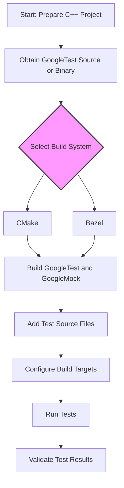

# Setup and Configuration

## Overview

This guide helps you install and integrate GoogleTest and GoogleMock seamlessly into your C++ project. You'll learn how to choose and configure your build system—either CMake or Bazel—set up basic test targets, and validate that your setup is ready for writing and running tests. By following these steps, you can ensure a robust testing environment that supports both unit testing and mocking.

---

## Prerequisites

Before you begin setup, ensure you have:

- A C++17 compliant compiler installed.
- Either CMake (version 3.14 or later) or Bazel installed for building your project.
- Access to GoogleTest and GoogleMock source code or prebuilt binaries.
- A basic understanding of your project's build system.

---

## Expected Outcome

After completing this guide, you will:

- Have GoogleTest and GoogleMock correctly installed and linked in your project.
- Have configured your build system to compile and link tests.
- Be able to run tests using the built-in test runner or your custom entry point.
- Have validated your environment and confirmed test execution succeeds.

---

## Time Estimate

Approximately 15-30 minutes, depending on familiarity with your build tools and project structure.

---

## Difficulty Level

Intermediate – familiarity with C++ project builds and basic testing concepts is recommended.

---

## Step-by-Step Instructions

### 1. Obtain GoogleTest and GoogleMock

GoogleTest and GoogleMock are distributed together. You can clone the repository or download a release tarball:

```bash
git clone https://github.com/google/googletest.git -b main
```

### 2. Choose Your Build Integration Method

GoogleTest supports multiple build systems. This guide covers the two most common:

- **CMake** — widely used and recommended for new and existing projects.
- **Bazel** — for projects already using Bazel as the build tool.


### 3. Installing with CMake

#### a. Standalone Build of GoogleTest/GoogleMock

If you want to build GoogleTest/GoogleMock separately:

```bash
cd googletest
mkdir build
cd build
cmake ..
make
sudo make install # Optional: install to system directories
```

This builds both GoogleTest and GoogleMock by default.

To build only GoogleTest (without GoogleMock), run:

```bash
cmake .. -DBUILD_GMOCK=OFF
```

##### Tips:

- On Windows, Visual Studio project files will be generated automatically.
- On Mac OS X, an Xcode project is created.

#### b. Incorporate GoogleTest/GoogleMock into Your Existing CMake Project

You can either use the installed libraries or include the source in your project.

**Using installed libraries:**

```cmake
find_package(GTest CONFIG REQUIRED)
add_executable(your_test test.cpp)
target_link_libraries(your_test GTest::gtest GTest::gmock_main)
```

**Using source directly:**

Add the GoogleTest source as a subdirectory and link your test targets:

```cmake
add_subdirectory(path/to/googletest)
add_executable(your_test test.cpp)
target_link_libraries(your_test gtest_main gmock)
```

##### Best Practices:

- Prefer `gtest_main` and `gmock_main` targets, which provide a `main()` function for your tests, so you don’t have to write your own.
- If you need custom test runners, link against `gtest` and `gmock` but provide your own `main()`.

### 4. Installing with Bazel

If your project uses Bazel, declare dependencies on GoogleTest and GoogleMock in your `WORKSPACE` and `BUILD` files. GoogleTest is officially supported with Bazel and includes build targets for your tests.

Refer to the [Bazel integration documentation](https://github.com/google/googletest/tree/main/googletest#bazel) for detailed setup instructions.

---

### 5. Writing a Basic Test Target

Create a simple test source file, for example, `example_test.cpp`:

```c++
#include <gtest/gtest.h>

TEST(ExampleTest, BasicAssertion) {
  EXPECT_EQ(1, 1);
}
```

In CMake, define the test target and link GoogleTest and GoogleMock:

```cmake
add_executable(example_test example_test.cpp)
target_link_libraries(example_test gtest_main gmock)
add_test(NAME example_test COMMAND example_test)
```

---

### 6. Running and Validating Tests

Once the build completes, run the test executable manually or via your build system's test command:

```bash
./example_test
```

Expected output:

```
Running main() from gmock_main.cc
[==========] Running 1 test from 1 test suite.
[----------] Global test environment set-up.
[----------] 1 test from ExampleTest
[ RUN      ] ExampleTest.BasicAssertion
[       OK ] ExampleTest.BasicAssertion (0 ms)
[----------] 1 test from ExampleTest (0 ms total)

[----------] Global test environment tear-down
[==========] 1 test from 1 test suite ran. (0 ms total)
[  PASSED  ] 1 test.
```

If the test fails or does not run, verify the linking and inclusion settings.

---

### 7. Optional: Customizing the Test `main()`

If you need a custom `main()` function, link against `gtest` and `gmock` instead of `gtest_main` and `gmock_main` and write your own entry point:

```c++
#include <gmock/gmock.h>

int main(int argc, char** argv) {
  testing::InitGoogleMock(&argc, argv);
  return RUN_ALL_TESTS();
}
```

This is useful if you want to initialize resources or parse command-line flags before running tests.

---

## Practical Tips & Best Practices

- Always link your test executable against `gtest_main` and `gmock_main` unless customization is needed.
- Use the recommended C++17 standard in your build system to avoid compatibility issues.
- Confirm GoogleMock is initialized by using `testing::InitGoogleMock()` instead of `InitGoogleTest()`.
- Separate test code from production code with clear directory structures (e.g., `src/` vs. `tests/`).
- Use CMake’s testing capabilities (`add_test`) to integrate with CI pipelines.

---

## Common Pitfalls & Troubleshooting

- **Linker errors:** Ensure you link against the correct GoogleTest and GoogleMock libraries.
- **Missing `main()`:** If your tests fail to link due to missing `main()`, link against `gtest_main`/`gmock_main` or provide your own.
- **Compiler incompatible:** Check that your compiler supports C++17. Older compilers cause build failures.
- **Thread issues:** On some platforms, enable pthread support explicitly using `-DGTEST_HAS_PTHREAD=1` and link with pthread.

See the [Troubleshooting Common Setup Issues](https://github.com/google/googletest/tree/main/docs/getting-started/configuration-troubleshooting/common-issues-troubleshooting.md) guide for detailed help.

---

## Wrapping Up

With GoogleTest and GoogleMock installed and configured, your project is now prepared to start writing, running, and expanding your test suites.

For further learning, explore the following:

- [Writing Your First Test](../../guides/getting-started/writing-your-first-test)
- [Basic Mocking with GoogleMock](../../guides/getting-started/basic-mocking)
- [Using Assertions Effectively](../../guides/essential-workflows/using-assertions)


---

## References and Resources

- GoogleTest GitHub Repository: https://github.com/google/googletest
- GoogleTest Primer: https://google.github.io/googletest/primer.html
- [GoogleMock Cheat Sheet](../../docs/gmock_cheat_sheet.md)
- [GoogleTest Configuration Basics](../../getting-started/configuration-troubleshooting/configuration-basics)

---

## Diagram: Test Setup Flow


