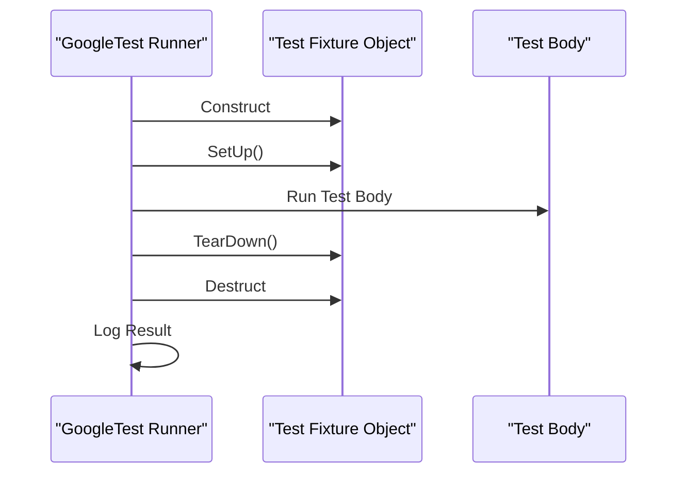

# Understanding the Test Lifecycle

## Workflow Overview

### Task Description
This guide helps you understand how GoogleTest manages the full lifecycle of C++ test cases—from discovery through execution to reporting. It explains how tests are grouped, how test fixtures work to provide setup and teardown capabilities, and how test outputs are generated and structured. This knowledge is essential to structure your test suites effectively and maximize reliability and maintainability.

### Prerequisites
- Familiarity with basic C++ programming and compilation.
- GoogleTest installed and integrated in your build environment.
- Basic understanding of defining tests using `TEST()` and `TEST_F()` macros.

### Expected Outcome
After following this guide, you will be able to:
- Understand how GoogleTest discovers tests automatically.
- Structure your tests using test suites and fixtures.
- Use setup and teardown methods to manage test preconditions and cleanup.
- Interpret test run results and understand test output reporting.
- Organize tests for better maintainability and execution flow.

### Time Estimate
About 15-20 minutes to read and digest the concepts with practical examples.

### Difficulty Level
Intermediate – assumes basic GoogleTest usage and C++ knowledge.

---

## The Test Lifecycle in GoogleTest

GoogleTest automates the management of your C++ test cases through several key phases:

1. **Test Discovery:** GoogleTest scans your compiled test suite binary to identify all defined tests, grouped logically into test suites.
2. **Test Setup:** For tests using fixtures, GoogleTest creates a fresh fixture instance, runs `SetUp()`, preparing the environment.
3. **Test Execution:** The test body runs.
4. **Test Teardown:** GoogleTest invokes `TearDown()` followed by fixture cleanup.
5. **Result Recording:** Test results, including failures and successes, are recorded and reported individually and aggregated.

This cycle repeats for each test case defined.

### Test Grouping and Naming
- Tests are grouped into **test suites** by the first argument to `TEST()` or by fixture class name in `TEST_F()`. This grouping helps organize logically related tests.
- Each test within the suite has a unique name, composing the full identification `TestSuite.TestName`.

### Test Fixtures
A **test fixture** is a class derived from `testing::Test` that allows sharing setup and teardown code between tests. It supports:
- Initializing common data members or resources before each test with `SetUp()`.
- Cleaning up with `TearDown()` after each test.
- Defining member functions and helper utilities accessible within tests.

GoogleTest constructs a new fixture object for each test invocation, ensuring test independence.

<Tip>
Use fixtures to reduce code duplication and centralize test environment setup.
</Tip>

---

## Step-by-Step: Writing Tests With the Lifecycle in Mind

<Steps>
<Step title="Step 1: Write Simple Tests">
Write your first tests using the `TEST(TestSuiteName, TestName)` macro. Each test is independent and no fixture is involved.

```cpp
TEST(MathUtils, FactorialOfZero) {
  EXPECT_EQ(Factorial(0), 1);
}
```

After compilation, GoogleTest auto-discovers this test during execution.

</Step>

<Step title="Step 2: Introduce Test Fixtures for Shared Setup">
Define a fixture class inheriting from `testing::Test` for tests needing common state or setup.

```cpp
class QueueTest : public testing::Test {
 protected:
  void SetUp() override {
    q_.Enqueue(1);
  }

  void TearDown() override {
    // Cleanup if necessary
  }

  Queue<int> q_;
};
```

Use `TEST_F(QueueTest, TestName)` to write tests using this fixture.

```cpp
TEST_F(QueueTest, IsNotEmptyAfterEnqueue) {
  EXPECT_NE(q_.Dequeue(), nullptr);
}
```

This test gets a fresh fixture object, the `SetUp()` method runs, and then the test executes.

</Step>

<Step title="Step 3: Understand Setup/Teardown Order">
GoogleTest creates a fixture, then:
- Calls the constructor
- Calls `SetUp()`
- Runs the test body
- Calls `TearDown()`
- Calls the destructor

This process repeats independently for each test ensuring isolation.


</Step>

<Step title="Step 4: Run Tests and Interpret Output">
Run your test binary to see the output.

```shell
./my_test_binary
```

Expected test output contains:
- Passed/failed test counts
- Names of failing tests and failure locations
- Summary at end with total tests run, time taken

Failures include expected vs actual values and source code locations.

</Step>

<Step title="Step 5: Group Tests Logically and Use Naming Conventions">
Use descriptive test suite and test names reflecting the code structure.

Encapsulate related tests in fixtures when needed.
This helps when running subsets, debugging, and maintaining large test suites.

</Step>
</Steps>

---

## Practical Examples

### Simple Test Without Fixture

```cpp
TEST(StringTest, EmptyStringIsEmpty) {
  std::string s;
  EXPECT_TRUE(s.empty());
}
```

### Using a Test Fixture

```cpp
class DatabaseTest : public testing::Test {
 protected:
  void SetUp() override {
    db_.Connect();
  }

  void TearDown() override {
    db_.Disconnect();
  }

  Database db_;
};

TEST_F(DatabaseTest, InsertRecord) {
  EXPECT_TRUE(db_.Insert("key", "value"));
}
```


### Sequential Test Lifecycle Illustration



---

## Troubleshooting & Tips

### Common Issues

- **Missing `SetUp()` or `TearDown()` override:** Ensure correct capitalization (`SetUp()`, not `Setup()`), or GoogleTest will not call them.

- **Shared state between tests:** Remember each test uses a new fixture object. Use member variables appropriately.

- **Tests depend on global or static state:** Such dependencies can break test independence.

- **Test output unclear:** Use verbose modes or check logs to isolate failures.

### Best Practices

- Always use test fixtures when multiple tests share common setup or teardown.
- Keep tests independent and isolated.
- Name tests clearly for intent clarity.
- Use assertions wisely—prefer `EXPECT_` over `ASSERT_` where continuation is beneficial.

### Performance Considerations

- If setup is expensive, but stable across tests, consider global setup using `SetUpTestSuite()` and `TearDownTestSuite()` (static methods on fixture class).

- Avoid expensive operations inside each test unless required.

### Alternative Approaches

- For tests that require similar setup but different parameter sets, look into parameterized tests (covered in advanced guides).

---

## Next Steps & Related Content

### What’s Next

- Explore [Writing Your First Tests](../getting-started/configuration-validation/writing-first-test) to get hands-on with test writing.
- Learn about [Test Fixtures](docs/primer.md#test-fixtures) for more detailed usage explanations.
- Understand detailed [Assertions](reference/core-apis/assertions) to expand your test verification capabilities.

### Related Guides

- [Setting Up Your Project](guides/getting-started/setup-project) — Integrating GoogleTest in your build system.
- [Writing Your First Tests](guides/getting-started/writing-basic-tests) — Basics of test writing.
- [Mocking with GoogleMock](guides/mocking-and-test-doubles/mock-basics) — For testing with mocks.

### Resources

- GoogleTest Primer: https://google.github.io/googletest/primer.html
- GoogleTest API Reference: /api-reference/core-apis/assertions
- GoogleMock Cookbook: https://google.github.io/googletest/gmock_cook_book.html

---

## Additional Notes

GoogleTest’s lifecycle management makes writing robust, maintainable tests straightforward and efficient, minimizing user efforts for setup and teardown across tests. Embracing test fixtures and understanding the lifecycle elevates your ability to keep tests clean, isolated, and descriptive.

<Check>
Remember, each test gets a fresh fixture instance; any changes in one do not affect others.
</Check>