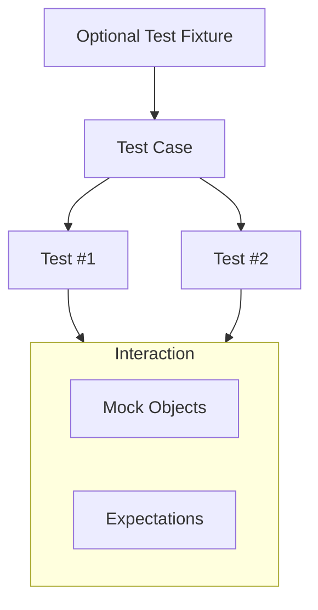

# Structuring Effective Tests

## Workflow Overview

### Task Description
This guide breaks down the key components and recommended patterns for structuring effective tests using GoogleTest. It covers how to organize test cases, utilize test fixtures, and apply best practices to enhance readability, maintainability, and scalability.

### Prerequisites
- A working GoogleTest and GoogleMock installation.
- Basic understanding of writing simple tests (see [Writing and Running Your First Test](../../getting-started/quickstart-validation/hello-test)).
- Familiarity with C++ unit testing concepts.

### Expected Outcome
By the end of this guide, you will confidently structure test cases and fixtures that are clean, scalable, and that clearly communicate their intent. Your tests will be easier to maintain and integrate well with more advanced GoogleTest features.

### Time Estimate
About 20-30 minutes to read and implement after basic GoogleTest setup.

### Difficulty Level
Beginner to Intermediate.

---

## Understanding GoogleTest Test Structure

GoogleTest organizes tests primarily through **test cases** (groups of tests) and **individual test functions**. Alongside these, **test fixtures** provide a powerful way to share common objects and setup/teardown logic.

### Test Cases and Tests
- **Test Case**: A logical grouping of related tests, represented by the first argument to `TEST` or `TEST_F`.
- **Test**: An individual unit test inside a test case, represented by the second argument.

### Example: Simple Test Case
```cpp
TEST(MathTest, Addition) {
  EXPECT_EQ(2 + 2, 4);
}
```
This defines the `Addition` test inside the `MathTest` test case.

### Best Practices
- Group tests logically by feature or functionality.
- Give descriptive names to test cases and tests to clearly indicate purpose.

---

## Test Fixtures: Sharing Setup and Teardown

### What is a Test Fixture?
A test fixture provides a way to reuse the same setup and teardown code across multiple tests, allowing the creation of shared objects.

### Defining a Test Fixture
Derive a class from `testing::Test`.
Override `SetUp()` and `TearDown()` as needed.

### Example:
```cpp
class DatabaseTest : public testing::Test {
protected:
  void SetUp() override {
    // Code here will be called immediately before each test.
    db.Connect();
  }

  void TearDown() override {
    // Code here will be called immediately after each test.
    db.Disconnect();
  }

  Database db;  // Shared object for all tests in this fixture.
};

TEST_F(DatabaseTest, InsertTest) {
  EXPECT_TRUE(db.Insert("test_record"));
}

TEST_F(DatabaseTest, DeleteTest) {
  EXPECT_TRUE(db.Delete("test_record"));
}
```

### Key Points
- Use `TEST_F` to associate tests with the fixture.
- Use fixtures when multiple tests share setup or teardown to avoid duplication.

---

## Organizing Tests for Readability and Maintainability

### Naming Conventions
- Test case names should reflect a component, class, or feature (e.g., `VectorTest`).
- Test names should describe the behavior or scenario being tested (e.g., `PushBackIncreasesSize`).
- Use consistent casing and separators to improve scanning.

### Grouping Strategies
- Group related tests together to reflect requirements or functionality areas.
- Avoid oversized test cases that cover unrelated scenarios.

### Minimize Dependencies
- Tests should be independent to run in any order.
- Avoid global state pollution.

### Progressive Disclosure
- Start testing fundamental behaviors before moving on to edge cases.

---

## Leveraging Test Fixtures for Complex Setups

### Benefits
- Encapsulate complex object initialization and teardown.
- Provide clean separation between test logic and setup code.
- Facilitate sharing objects among tests without duplication.

### Tips
- Keep setup code minimal and focused on relevant state.
- Use helper methods inside fixtures to perform common operations.
- Avoid putting assertions inside `SetUp()` or `TearDown()`.

### Example: Setup with Fixture
```cpp
class LoggerTest : public testing::Test {
protected:
  void SetUp() override {
    logger.OpenLog("test.log");
  }
  void TearDown() override {
    logger.CloseLog();
  }

  Logger logger;
};

TEST_F(LoggerTest, LogWritesEntry) {
  logger.Write("Hello");
  EXPECT_TRUE(logger.Contains("Hello"));
}
```

---

## Structuring Expectations and Mocks

When using GoogleMock, structuring your tests with mocks follows similar principles:

- Define mock classes with clear, minimal interfaces.
- Use `EXPECT_CALL` to specify expected interactions with the mock.
- Use `ON_CALL` to set default behavior when interaction is not of interest.
- Prefer `NiceMock` or `StrictMock` wrappers to control leniency:

### Mock Strictness
- `NiceMock`: Suppresses warnings for uninteresting calls.
- `NaggyMock`: Warns on uninteresting calls (default behavior).
- `StrictMock`: Treats uninteresting calls as errors.

### Example Use of StrictMock
```cpp
StrictMock<MockDatabase> mock_db;
EXPECT_CALL(mock_db, Connect()).Times(1);
```

### Common Pitfalls
- Forgetting to use `NiceMock` when warnings are cluttering output.
- Overly strict mocks causing brittle tests.
- Interleaving setting expectations and calling mock methods can lead to undefined behavior.

---

## Common Patterns and Recommendations

### One-Test-Per-Behavior
Each test should verify exactly one behavior or condition. This improves clarity and failure diagnosis.

### Setup as Code
Use test fixtures for all setup code. Avoid putting initialization inside test bodies unless it is specific to that test.

### Naming Tests
Name tests to clearly reflect the aspect being validated for easy identification.

### Test Independence
Make sure tests do not depend on each other or shared mutable global state.

### Sequence and Order
Use `InSequence` and other ordering constructs when interaction order matters.

### Avoid Excessive Expectations
Only specify the interactions that are crucial to the test, keeping tests loosely coupled and less brittle.

---

## Troubleshooting

### Tests Not Running
- Ensure `TEST` or `TEST_F` macros are used correctly.
- Confirm tests are linked and included in the test executable.

### Unexpected Failures
- Check that expectations were set before exercising code.
- Use `--gmock_verbose=info` flag for detailed mock call traces.

### Mock Method Not Called As Expected
- Review argument matchers.
- Verify call counts and ordering constraints.

### Warnings About Uninteresting Calls
- Switch to `NiceMock` to suppress warnings if appropriate.
- Review whether all expected calls are properly declared.

---

## Next Steps & Related Content

- Explore [Using Assertions for Powerful Testing](../using-assertions) to learn about GoogleTest assertions.
- See [Mocking Techniques](../../guides/mocking-techniques/intro-to-mocking) for detailed mock usage.
- Check [Test Fixtures and Lifecycle](../../api-reference/core-apis/test-fixtures-and-lifecycle) for in-depth fixture behavior.
- Review [Quickstart Workflow](../quickstart-workflow) to get full end-to-end test writing practice.

---

## Summary
Structuring tests effectively in GoogleTest means logical grouping into test cases, employing test fixtures for shared setup, and being intentional with mock design and expectations. Disciplined naming, independence, and minimal yet sufficient expectations lead to robust, maintainable test suites.

---

## References & Further Reading
- [GoogleTest Primer](../../primer)
- [GoogleMock Cookbook](../../gmock_cook_book.md)
- [Mocking Reference](../../reference/mocking.md)
- [Understanding Uninteresting vs Unexpected Calls](../../gmock_cook_book.md#NiceStrictNaggy)
- [Test Fixtures and Lifecycle](../../api-reference/core-apis/test-fixtures-and-lifecycle)


---

## Visual Diagram: Test Structure Overview



<Tip>
Always structure your tests starting from a well-defined test case grouping, leverage test fixtures to reuse setup, and apply mock interactions explicitly and sparingly.
</Tip>

<Note>
Uninteresting vs unexpected calls are important distinctions. Use NiceMock or StrictMock to control your mock's behavior accordingly.
</Note>

<Warning>
Avoid mixing test setup and execution phases. Set expectations before exercising the mock.
</Warning>

<Check>
Verify tests run independently and naming clearly communicates intent.
</Check>

## Example Code Snippet: Basic Fixture Usage

```cpp
class CalculatorTest : public testing::Test {
protected:
  void SetUp() override {
    calculator.Reset();
  }

  Calculator calculator;
};

TEST_F(CalculatorTest, AddsNumbers) {
  EXPECT_EQ(calculator.Add(1, 2), 3);
}

TEST_F(CalculatorTest, SubtractsNumbers) {
  EXPECT_EQ(calculator.Subtract(5, 3), 2);
}
```

This example demonstrates reusing the same `calculator` instance with a clean state for every test.

---

## Example Code Snippet: Using Mock Strictness

```cpp
class MockDatabase {
public:
  MOCK_METHOD(void, Connect, (), ());
  MOCK_METHOD(bool, Query, (const std::string&), ());
};

TEST(DatabaseTest, StrictMockExample) {
  StrictMock<MockDatabase> mock_db;

  EXPECT_CALL(mock_db, Connect());

  // mock_db.Query("select *") will cause a failure if called unexpectedly.
  mock_db.Connect();
}
```
StrictMock will cause your test to fail if any uninteresting calls occur, leading to stricter test behavior.

---

## Tips for Better Test Structure

- Use descriptive and consistent test names.
- Keep each test focused on one scenario or behavior.
- Use `RetiresOnSaturation()` for sequential expectations that should disable after use.
- Organize mocks and expectations to minimize noise and improve clarity.

---

## Troubleshooting Checklist

- Ensure expectations are declared before exercising mocks.
- If warnings about uninteresting calls appear, evaluate whether `NiceMock` or explicit catch-all expectations are needed.
- Use `--gmock_verbose=info` to trace mock invocations.
- Verify destructors are virtual for classes being mocked.

---

## Summary
Mastering effective test structure in GoogleTest unlocks readable, scalable, and robust suites that stand the test of time and refactoring, ultimately making your C++ projects more reliable and easier to maintain.
