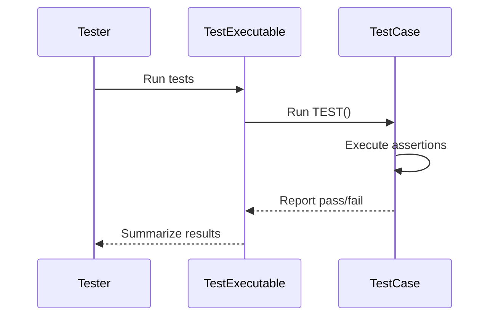

# Writing and Structuring Basic Tests

## Workflow Overview

This guide is crafted to help C++ developers understand how to write and organize test cases using GoogleTest’s fundamental `TEST()` macro and its core concepts. We will look into basic test structure, test naming conventions, test flow, and grouping strategies to produce clear, maintainable, and effective test suites.

### Prerequisites
- GoogleTest must be correctly installed and configured in your project.
- Basic familiarity with C++ syntax and compilation.
- Compilation environment set up to build and run test executables.

### Expected Outcome
By following this guide, you will be able to write well-structured individual tests, organize them logically into test suites, and run them efficiently. You will understand the purpose and usage of `TEST()`, how assertions fit into tests, and best practices on naming and grouping.

### Time Estimate
About 15-30 minutes to grasp the basics and write your first structured tests.

### Difficulty Level
Beginner

---

## Understanding GoogleTest Basic Tests

GoogleTest provides the `TEST()` macro as the simplest way to define a test. Each test represents a single logical scenario or behavior to verify.

### Basic Syntax

```cpp
TEST(TestSuiteName, TestName) {
  // Test body - assertions go here
  EXPECT_EQ(1 + 1, 2);
  ...
}
```

- **TestSuiteName** groups tests logically.
- **TestName** identifies an individual test within the suite.

### What `TEST()` Does
- Defines a test function executed automatically by the test runner.
- Is discovered by GoogleTest’s automatic test discovery.
- Runs independently from other tests.

### Test Execution Flow
1. GoogleTest initializes the test environment.
2. Each `TEST()` function is executed.
3. Assertions in the test body verify conditions.
4. The runner reports success or failure.

<Tip>
Think of a `TEST()` as a story verifying a single behavior: it sets up the conditions, executes code under test, and checks results.
</Tip>

---

## Step-by-Step Instructions

### 1. Define Your Test Cases

- Choose meaningful **TestSuiteName** to collect related tests logically.
- Name your **TestName** clearly to describe what scenario it covers.

Example:

```cpp
TEST(MathUtility, Addition_Simple) {
  EXPECT_EQ(1 + 1, 2);
}

TEST(MathUtility, Subtraction_PositiveResult) {
  EXPECT_EQ(5 - 3, 2);
}
```

Expected result: Each test runs independently and passes if assertions hold.

### 2. Use Assertions to Check Conditions

GoogleTest provides a variety of assertions. The most common are:

- `EXPECT_EQ(val1, val2)`: Checks equality, records failure but continues.
- `ASSERT_TRUE(condition)`: Fails test and aborts if false.

Example:

```cpp
TEST(StringTest, IsEmptyInitially) {
  std::string s;
  EXPECT_TRUE(s.empty());
  ASSERT_EQ(s.size(), 0);
}
```

Verify that when run, failures provide detailed diagnostics.

### 3. Group Tests into Test Suites

Tests are grouped by the **TestSuiteName** which should correspond to the class, module, or feature under test. Organizing tests:

- Improves readability.
- Facilitates running specific suites.

Example:

```cpp
// MathUtility tests
TEST(MathUtility, Multiply_Zero) { ... }
TEST(MathUtility, Multiply_Positive) { ... }

// StringUtility tests
TEST(StringUtility, Trim_LeftSpaces) { ... }
TEST(StringUtility, Trim_RightSpaces) { ... }
```

### 4. Keep Tests Focused and Atomic

- One test, one primary assertion or behavior.
- Avoid multiple unrelated checks in the same test.

Example Anti-Pattern:

```cpp
// Avoid multiple failures lumped in a single test
TEST(MyTestSuite, MultipleChecks) {
  EXPECT_EQ(Foo(), 1);
  EXPECT_EQ(Bar(), 2);
  EXPECT_EQ(Baz(), 3);
}
```

Better:

```cpp
TEST(MyTestSuite, FooReturnsOne) { EXPECT_EQ(Foo(), 1); }
TEST(MyTestSuite, BarReturnsTwo) { EXPECT_EQ(Bar(), 2); }
TEST(MyTestSuite, BazReturnsThree) { EXPECT_EQ(Baz(), 3); }
```

### 5. Naming Best Practices

- Use PascalCase or underscores for readability.
- Name test suites after the entity under test.
- Name tests to describe behavior or scenario.

Example:

```cpp
TEST(NetworkClient, Connect_SucceedsWithValidAddress) { ... }
TEST(NetworkClient, Connect_FailsWithInvalidAddress) { ... }
```

### 6. Running Tests

- Compile your test executable linking with GoogleTest.
- Run the executable; all tests are discovered and run.
- Observe console output for passing/failing tests.

### Verification

- Each test prints PASS or FAIL.
- Failure messages include file, line number, and reason.

---

## Organizing Tests with Fixtures (Advanced)

Once comfortable with `TEST()`, you can use `TEST_F()` with test fixtures to share setup/teardown code and data among multiple tests that need it.

Here's a brief example:

```cpp
class MyTestFixture : public ::testing::Test {
 protected:
  void SetUp() override {
    // Common setup
  }
  void TearDown() override {
    // Cleanup
  }
  int common_data_ = 42;
};

TEST_F(MyTestFixture, TestOne) {
  EXPECT_EQ(common_data_, 42);
}

TEST_F(MyTestFixture, TestTwo) {
  EXPECT_NE(common_data_, 0);
}
```

Use fixtures when many tests share the same environment.

---

## Common Pitfalls & Tips

- **Do not mix test logic and setup** inside a test body; setup common logic in test fixtures.
- **Avoid test dependencies**; each test must be able to run independently.
- **Remember `EXPECT_` vs `ASSERT_`**: Use ASSERT_ to abort on fatal failures early where continuing makes no sense.
- **Name your tests clearly** for easy diagnosis.

<Tip>
If you get unexpected test failures, run with verbose output or debug to identify failing assertions.
</Tip>

---

## Next Steps & Related Content

- **GoogleTest Primer** — Start here if unfamiliar with test basics.
- **Assertions and Fundamental Test Patterns** — Deep dive on assertion best practices.
- **Mocking for Dummies** — Learn how to extend tests with GoogleMock.
- **Writing and Running Your First Test** — Guided onboarding to test your environment.
- **Test Fixtures & Suites** — For reusing setup and more complex tests.

Explore the following links for more:
- [GoogleTest Primer](primer.md)
- [Assertions Guide](assertions-guide.md)
- [gMock for Dummies](gmock_for_dummies.md)

For full reference, see [GoogleTest User's Guide](index.md).

---

## Summary Diagram: Basic Test Flow



This diagram illustrates the lifecycle from invoking tests to final reporting.

---

## Example: Minimal Test File

```cpp
#include <gtest/gtest.h>

// A simple test verifying addition
TEST(MathTests, Addition_Simple) {
    EXPECT_EQ(2 + 2, 4);
}

int main(int argc, char **argv) {
  ::testing::InitGoogleTest(&argc, argv);
  return RUN_ALL_TESTS();
}
```

Compile and run this to see the basic GoogleTest usage.

---

# Troubleshooting

**Issue:** Test not discovered or run.
- Verify your test executable links against GoogleTest libraries.
- Make sure you use the `TEST()` macro, not plain functions.
- Ensure `RUN_ALL_TESTS()` is called in `main()`.

**Issue:** Unclear test failure message.
- Run tests with `--gtest_verbose=info` or add more descriptive assertion messages.

**Issue:** Tests fail intermittently.
- Verify tests are independent and do not share or mutate global state.

<Tip>
For detailed troubleshooting, see [Troubleshooting & FAQ](getting-started/first-steps/troubleshooting.md).
</Tip>
