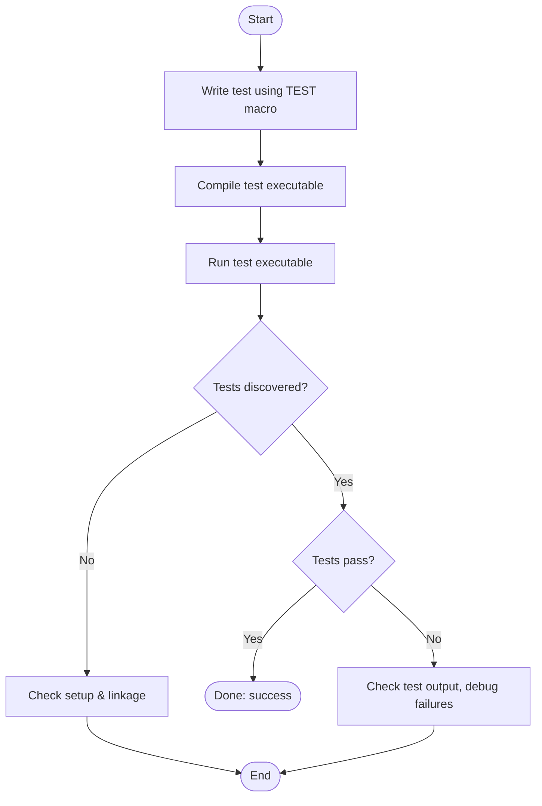

# Writing Your First Test

A hands-on walkthrough of creating your first unit test using GoogleTest and GoogleMock. This guide introduces the basic structure of a test, how test discovery works, and how to use assertions effectively with real code examples to quickly validate your code's correctness.

---

## 1. What You Will Learn

- How to write a basic test using the `TEST` macro.
- How test discovery works automatically.
- How to define and use mock classes with `MOCK_METHOD`.
- How to set expectations on mock methods with `EXPECT_CALL`.
- How to use assertions to verify test outcomes.

## 2. Prerequisites

- GoogleTest and GoogleMock libraries installed and properly set up in your build environment.
- Basic knowledge of C++ syntax.
- Familiarity with your project’s codebase that you want to test.

If you're not yet set up, see [Installation and Setup](../../guides/getting-started/setup-installation) and [Configuring & Integrating GoogleTest](../../getting-started/first-run-usage/configuration-integration).

## 3. Expected Outcome

By completing this guide, you will have successfully written and run your first unit test and mock, verifying a simple piece of logic and understanding the core test structure in GoogleTest and GoogleMock.

## 4. Time Estimate

About 15-30 minutes, including writing the test code and running it.

## 5. Difficulty Level

Beginner.

---

# Step-by-Step Instructions

Follow this sequence to write, understand, and run your first test.

### Step 1: Define a Simple Test Case

Create a test file (e.g., `my_first_test.cc`), and include GoogleTest headers.

```cpp
#include <gtest/gtest.h>

// Define a simple test.
TEST(ExampleTest, SimpleCheck) {
  int value = 42;
  EXPECT_EQ(value, 42);  // Assertion
}
```

- The `TEST` macro creates a test named `ExampleTest.SimpleCheck`.
- `EXPECT_EQ` asserts that the two values are equal.

### Step 2: Build and Run Your Test

Compile the file linking with GoogleTest and GoogleMock libraries.
Run the test binary, and observe output with passing tests.

```shell
./my_first_test
```
Expected output:
```
[ RUN      ] ExampleTest.SimpleCheck
[       OK ] ExampleTest.SimpleCheck
[  PASSED  ] 1 test.
```

---

### Step 3: Define a Mock Class

Mock a simple interface by inheriting from it and using `MOCK_METHOD` macros.

Given an interface:

```cpp
class Foo {
 public:
  virtual ~Foo() = default;
  virtual int GetSize() const = 0;
  virtual bool Process(int n) = 0;
};
```

Define a mock:

```cpp
#include <gmock/gmock.h>

class MockFoo : public Foo {
 public:
  MOCK_METHOD(int, GetSize, (), (const, override));
  MOCK_METHOD(bool, Process, (int n), (override));
};
```

Note:
- Return type
- Method name
- Argument list syntax
- Use `(const, override)` for const override methods

### Step 4: Set Expectations and Default Behaviors

Use `EXPECT_CALL` to specify how `MockFoo` methods are expected to be called.

```cpp
#include <gtest/gtest.h>
using ::testing::Return;

TEST(MockFooTest, ProcessWorks) {
  MockFoo mock;

  // Set default action for GetSize()
  ON_CALL(mock, GetSize()).WillByDefault(Return(10));

  // Expect Process(5) to be called once and return true.
  EXPECT_CALL(mock, Process(5)).WillOnce(Return(true));

  EXPECT_EQ(mock.GetSize(), 10);          // Will use ON_CALL
  EXPECT_TRUE(mock.Process(5));           // Must match EXPECT_CALL
}
```

### Step 5: Run the Mocked Test

Build and run to verify the expectations.

If `Process(5)` is not called, the test will fail.

```shell
[ RUN      ] MockFooTest.ProcessWorks
[       OK ] MockFooTest.ProcessWorks
[  PASSED  ] 1 test.
```

---

# Understanding Test Discovery

GoogleTest automatically discovers tests defined with `TEST` or `TEST_F` macros by scanning the binary for registered test cases. You don’t need to manually register or run tests.

### How to Run Selected Tests

- You can run specific tests by name using the `--gtest_filter` flag:

```shell
./my_test_binary --gtest_filter=MockFooTest.ProcessWorks
```

---

# Assertions Overview

GoogleTest provides assertions for validating test conditions; `EXPECT` macros continue after failure, while `ASSERT` macros abort the test at failure.

For your first test, `EXPECT_EQ(expected, actual)` is the recommended starting point.

Other useful assertions:

- `EXPECT_TRUE(condition)` / `EXPECT_FALSE(condition)`
- `EXPECT_NE(val1, val2)` (not equal)
- `EXPECT_LT(val1, val2)` (less than)
- `EXPECT_THROW(statement, exception_type)`

For a full list, see [Assertions Reference](../../api_reference/core_test_apis/assertions_reference).

---

# Practical Tips & Best Practices

- Set expectations **before** exercising code.
- Use `_` matcher as a wildcard to ignore irrelevant arguments.
- Use `ON_CALL` to define default behaviors without expectations.
- Use `NiceMock` or `StrictMock` to tailor treatment of uninteresting calls.
- Prefer explicit cardinalities with `.Times()` when you need to verify call counts.

---

# Common Pitfalls and Troubleshooting

<AccordionGroup title="Common Issues While Writing Your First Test">
<Accordion title="Test Not Discovered or Run">
Check that your test binary is linked with GoogleTest and that you use the `TEST` or `TEST_F` macros. Ensure your build system compiles the test source.
</Accordion>
<Accordion title="Tests Fail Due to Unsatisfied Expectations">
Verify that your code calls all expected mock methods with the correct arguments and number of times. Use `--gmock_verbose=info` to trace mock calls.
</Accordion>
<Accordion title="Uninteresting Mock Call Warning">
If you see warnings about uninteresting calls, consider using `EXPECT_CALL(...).Times(AnyNumber())` for those methods or use `NiceMock`.
</Accordion>
</AccordionGroup>

---

# Next Steps & Further Learning

- Explore [Writing Your First Test & Mock](../../getting-started/first-run-usage/writing-first-test) for a comprehensive example.
- Learn about [Organizing and Discovering Tests](../../guides/core-testing-patterns/organizing-tests) to manage larger projects.
- Advance to [Creating and Using Mocks](../../guides/mocking-and-advanced-techniques/creating-and-using-mocks) to master mocking techniques.
- Use [Assertions Best Practices](../../guides/core-testing-patterns/assertions-best-practices) to write effective checks.

---

# Sample Minimal Test File

```cpp
#include <gmock/gmock.h>
#include <gtest/gtest.h>

class Foo {
 public:
  virtual ~Foo() = default;
  virtual int GetValue() const = 0;
};

class MockFoo : public Foo {
 public:
  MOCK_METHOD(int, GetValue, (), (const, override));
};

TEST(FooTest, ReturnsExpectedValue) {
  MockFoo mock_foo;
  ON_CALL(mock_foo, GetValue()).WillByDefault(testing::Return(42));
  EXPECT_CALL(mock_foo, GetValue()).Times(1);

  int val = mock_foo.GetValue();
  EXPECT_EQ(val, 42);
}
```

Compile and run:

```shell
$ g++ -std=c++17 my_test.cc -lgtest -lgmock -pthread -o my_test
$ ./my_test
```

---

# Summary

This guide equipped you with the foundational knowledge to write your first unit test and mock using GoogleTest and GoogleMock. You learned the basic test and mock structure, how to set expectations, use assertions, and troubleshoot common issues.

---

# References

- [GoogleTest Primer](../../getting-started/first-run-usage/writing-first-test)
- [GoogleMock Cheat Sheet](../../docs/gmock_cheat_sheet.md)
- [GoogleMock Cookbook](../../docs/gmock_cook_book.md)
- [Mocking Reference](../../docs/reference/mocking.md)
- [GoogleTest Assertions Reference](../../api_reference/core_test_apis/assertions_reference)

For more examples and detailed usage, explore these linked resources.

---

# Tips

<Tip>
Always place `EXPECT_CALL` before invoking the actual function to avoid undefined behavior.
</Tip>
<Tip>
Use `EXPECT_CALL(mock, Method(_)).Times(AnyNumber())` to allow calls without producing warnings.
</Tip>
<Note>
If your mock method returns a non-default-constructible object, you must specify an action returning a valid object to avoid runtime errors.
</Note>

---

# Diagram: Simple Test Flow



This flow helps visualize the basic journey from writing your first test to verifying its success.
