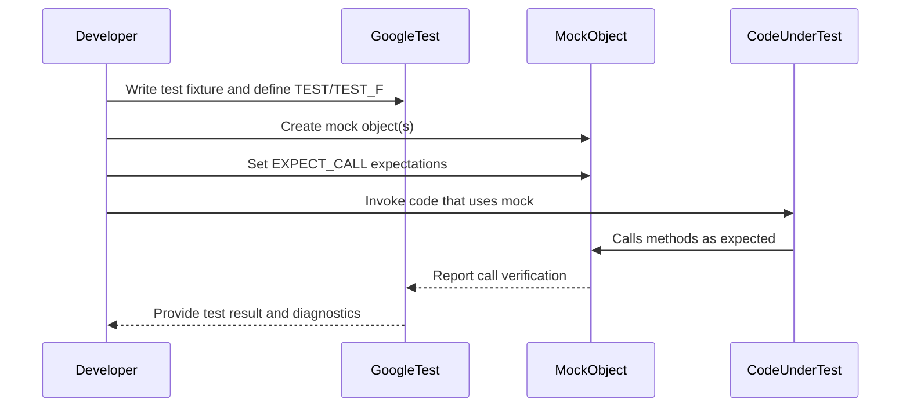

# Writing Your First Test

## Workflow Overview

### What This Guide Covers
This guide walks you through the essential steps to write your first effective automated test using GoogleTest and GoogleMock. You will learn how to:

- Define test cases and suites
- Create and use mock classes
- Set expectations and specify mock behaviors
- Run your tests and interpret results

### Prerequisites
- A working GoogleTest and GoogleMock installation
- Basic C++ knowledge
- Familiarity with your project's build system and source files

### Expected Outcome
By following this guide, you will have successfully written a test that:
- Uses GoogleTest's `TEST()` or `TEST_F()` macros
- Properly initializes mock objects
- Sets expectations using gMock's `EXPECT_CALL`
- Runs reliably with automated verification of behavior

### Time Estimate
About 10–20 minutes, depending on your environment setup

### Difficulty Level
Beginner to Intermediate

---

## Step-by-Step Instructions

### 1. Include the Required Headers
Make sure your test file includes the GoogleTest and GoogleMock headers.

```cpp
#include <gtest/gtest.h>
#include <gmock/gmock.h>
```

These bring in the necessary macros and declarations.

<Check>
Always include `gtest/gtest.h` before other headers to ensure the test framework is initialized correctly.
</Check>

### 2. Define Your Mock Class
If your test relies on an interface or class whose behavior you want to control, create a mock class derived from it. Use Google's `MOCK_METHOD` macro for each virtual or interface method.

Example with a simple `Turtle` interface:

```cpp
class Turtle {
 public:
  virtual ~Turtle() {}
  virtual void PenUp() = 0;
  virtual void PenDown() = 0;
  virtual void Forward(int distance) = 0;
  virtual void Turn(int degrees) = 0;
};

class MockTurtle : public Turtle {
 public:
  MOCK_METHOD(void, PenUp, (), (override));
  MOCK_METHOD(void, PenDown, (), (override));
  MOCK_METHOD(void, Forward, (int distance), (override));
  MOCK_METHOD(void, Turn, (int degrees), (override));
};
```

<Tip>
Use `override` in `MOCK_METHOD` declarations to ensure you are overriding existing virtual functions.
</Tip>

### 3. Write Your Test Case
Use the `TEST()` macro to write a simple test or `TEST_F()` for tests sharing common fixtures or mocks.

```cpp
using ::testing::AtLeast;

TEST(PainterTest, CanDrawCircle) {
  MockTurtle turtle;

  // Set expectations
  EXPECT_CALL(turtle, PenDown()).Times(AtLeast(1));
  EXPECT_CALL(turtle, Forward(100)).Times(AtLeast(1));

  // Object that uses Turtle
  Painter painter(&turtle);

  EXPECT_TRUE(painter.DrawCircle(0, 0, 10));
}
```

### 4. Set Expectations with `EXPECT_CALL`
Specify the expected calls to the mock object, including how often they are called and with which arguments.

- Use `_` as a wildcard matcher for arguments you don't want to specify.
- You can specify exact values or use advanced matchers (e.g., `Ge(5)` for "greater or equal to 5").

```cpp
EXPECT_CALL(turtle, GoTo(50, _));  // Expects x=50, y anything
```

<Note>
Setting expectations must occur *before* exercising the code.
</Note>

### 5. Run Your Tests
Build and run your test executable. You can run all tests using `RUN_ALL_TESTS()` inside your `main()`:

```cpp
int main(int argc, char** argv) {
  ::testing::InitGoogleTest(&argc, argv);
  return RUN_ALL_TESTS();
}
```

### 6. Interpret Results
- Passing tests indicate your mock expectations were met.
- Failing tests will print diagnostic messages detailing which expectations failed or were violated.

<Tip>
Use IDE or editor integration (such as Emacs’ `google-compile`) to quickly jump to failure locations.
</Tip>

## Practical Examples

### Minimal Mock and Test

```cpp
#include <gtest/gtest.h>
#include <gmock/gmock.h>

class Foo {
 public:
  virtual ~Foo() {}
  virtual int Add(int a, int b) = 0;
};

class MockFoo : public Foo {
 public:
  MOCK_METHOD(int, Add, (int a, int b), (override));
};

TEST(FooTest, AddWorks) {
  MockFoo mock;

  EXPECT_CALL(mock, Add(5, 3))
      .WillOnce(::testing::Return(8));

  EXPECT_EQ(mock.Add(5, 3), 8);
}
```

### Using Wildcard and Matchers

```cpp
EXPECT_CALL(mock, Add(::testing::_, 3))  // any first arg, second arg == 3
    .WillOnce(::testing::Return(10));
```

### Multiple Return Values

```cpp
EXPECT_CALL(mock, GetValue())
    .WillOnce(::testing::Return(100))
    .WillOnce(::testing::Return(200))
    .WillRepeatedly(::testing::Return(300));
```

This means the first call returns 100, second returns 200, and all others return 300.

---

## Troubleshooting & Tips

### Common Issues

- **No mock method defined:** Make sure `MOCK_METHOD` macro is present and spelled correctly.
- **Test fails unexpectedly:** Verify your `EXPECT_CALL` parameters and usage.
- **Matcher ambiguities:** Use explicit matchers or resolve overloads via helper functions.

### Best Practices

- Use `NiceMock` if you want to suppress warnings for uninteresting calls.
- Use `StrictMock` only when you want to fail tests on unexpected calls.
- Reuse matchers and actions by assigning them to variables.
- Retire expectations with `.RetiresOnSaturation()` in sequences to avoid sticky expectations causing false positives.

### Performance

- Move mock class constructors and destructors to `.cc` files to speed up compilation.

## Next Steps & Related Content

- After mastering basic testing and mocking, explore [Configuring Actions & Expectations](https://google.github.io/googletest/guides/mocking-and-advanced-techniques/actions-and-expectations.html) to control mock behavior in detail.
- Learn about [Matchers for Argument Validation](https://google.github.io/googletest/reference/matching.html) to create advanced argument constraints.
- Understand [Call Cardinalities and Strictness Controls](https://google.github.io/googletest/guides/mocking-framework#cardinalities-strictness) to customize expected call counts and behavior.

---

## Summary
This guide empowers you to create and run your first automated C++ tests using GoogleTest and GoogleMock. You now understand how to define mocks, set expectations, write test cases, and interpret test results, forming a foundation for developing robust, maintainable tests.

For more in-depth coverage and detailed recipes, consider reviewing the [gMock Cookbook](https://google.github.io/googletest/gmock_cook_book.html) and [GoogleTest Primer](https://google.github.io/googletest/primer.html).

---

## Visual Overview of the Test Workflow



This flow illustrates the interaction from writing a test to seeing its feedback.

---