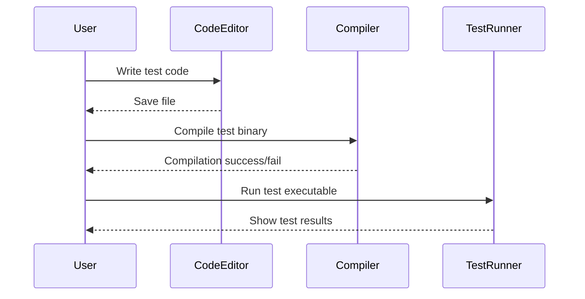

# Your First Test: Writing and Running

## Workflow Overview

### Task Description
This guide takes you through writing, compiling, and running your very first unit test using GoogleTest. It introduces basic test macros, the test runner, and shows how you get immediate feedback on your code–designed specifically for users new to C++ unit testing.

### Prerequisites
- A C++17-compliant compiler installed and configured.
- GoogleTest library installed and linked to your project. Refer to [Installing with CMake](/getting-started/setup-prerequisites-installation/installation-cmake) or [Installing with Bazel](/getting-started/setup-prerequisites-installation/installation-bazel).
- Basic familiarity with C++ syntax.
- A working build environment (IDE or command line).

### Expected Outcome
By following this guide, you will:
- Write a simple test case using GoogleTest macros.
- Compile and link the test into an executable.
- Run the test executable and interpret its output.
- Understand how to read GoogleTest result reports.

### Time Estimate
Approximately 15-20 minutes.

### Difficulty Level
Beginner

---

## Step-by-Step Instructions

### Step 1: Create a Test File
Create a C++ source file, for example `my_first_test.cc`, where you will write your test.

### Step 2: Include GoogleTest Header
At the top of your file, include the GoogleTest header to use its testing macros and utilities:

```cpp
#include <gtest/gtest.h>
```

### Step 3: Write Your First Test Case
Define a test using the `TEST` macro, which takes two parameters: the test suite name and the test name. Inside the test body, use assertions to validate behavior.

Here is a minimal example:

```cpp
TEST(SampleTest, Addition) {
  // Verify that 2 + 2 equals 4.
  EXPECT_EQ(2 + 2, 4);
}
```

- `EXPECT_EQ` checks if two values are equal.
- If the assertion fails, the test framework will report the failure immediately.


### Step 4: Compile Your Test Program
Compile your test file linking against the GoogleTest library.

A typical `g++` command line might look like this:

```bash
g++ -std=c++17 -isystem /path/to/googletest/include -pthread my_first_test.cc /path/to/libgtest.a -o my_first_test
```

If you use CMake, configure your `CMakeLists.txt` accordingly; see [Installing with CMake](/getting-started/setup-prerequisites-installation/installation-cmake) for detailed instructions.

### Step 5: Run the Test Executable
Run your test executable from the command line:

```bash
./my_first_test
```

You should see output similar to:

```
[==========] Running 1 test from 1 test suite.
[----------] Global test environment set-up.
[----------] 1 test from SampleTest
[ RUN      ] SampleTest.Addition
[       OK ] SampleTest.Addition (0 ms)
[----------] 1 test from SampleTest (0 ms total)

[==========] 1 test from 1 test suite ran. (0 ms total)
[  PASSED  ] 1 test.
```

This confirms your test passed successfully.

### Step 6: Interpret the Results
- `[ RUN      ]` indicates a test started.
- `[       OK ]` indicates a successful test.
- `[  FAILED  ]` would indicate a failure.
- Detailed failure messages appear with file and line number if an assertion fails.

### Step 7: Experiment with Failing Tests
Try changing the expected value to cause a failure, e.g.,

```cpp
EXPECT_EQ(2 + 2, 5);
```
Run again to see the failure report, which helps you understand test feedback.

### Step 8: Expand Your Tests
Add more tests under different suites or names to broaden coverage.

---

## Examples & Code Samples

### Complete Example
```cpp
#include <gtest/gtest.h>

// Test suite: MathTests
// Test case: Addition
TEST(MathTests, Addition) {
  EXPECT_EQ(2 + 2, 4);
}

// Test case: Subtraction
TEST(MathTests, Subtraction) {
  EXPECT_EQ(10 - 5, 5);
}

int main(int argc, char** argv) {
  ::testing::InitGoogleTest(&argc, argv);
  return RUN_ALL_TESTS();
}
```

### Compiling (with g++)
```bash
g++ -std=c++17 -isystem /usr/include/gtest -pthread my_test.cc -lgtest -lgtest_main -o my_test
```

### Running
```bash
./my_test
```

### Expected Output
```
[==========] Running 2 tests from 1 test suite.
[----------] Global test environment set-up.
[----------] 2 tests from MathTests
[ RUN      ] MathTests.Addition
[       OK ] MathTests.Addition (0 ms)
[ RUN      ] MathTests.Subtraction
[       OK ] MathTests.Subtraction (0 ms)
[----------] 2 tests from MathTests (0 ms total)

[==========] 2 tests from 1 test suite ran. (0 ms total)
[  PASSED  ] 2 tests.
```

---

## Troubleshooting & Tips

### Common Issues
- **Compilation errors:** Verify include paths and linkage to GoogleTest libraries.
- **Linker errors:** Ensure you link against `gtest` and `gtest_main` or provide your own main function.
- **Tests do not run:** Confirm `main()` calls `RUN_ALL_TESTS()`.
- **No output:** Check that your test functions use `TEST()` macro and assertions like `EXPECT_EQ`.
- **Tests always pass unexpectedly:** Confirm you have assertions inside the test and that your test suite and test names are valid identifiers.

### Best Practices
- Always initialize GoogleTest via `::testing::InitGoogleTest(&argc, argv);` in `main`.
- Use meaningful test suite and test names.
- Keep tests atomic and focused.
- Write tests before or alongside production code for Test-Driven Development.
- Use assertions like `EXPECT_EQ()`, `EXPECT_TRUE()`, and `ASSERT_*` to validate behavior.

### Performance Considerations
- For large test suites, consider grouping related tests.
- Use parallel test execution if supported by your build system.

### Tips for Effective Onboarding
- Explore the [GoogleTest Primer](https://github.com/google/googletest/blob/main/docs/primer.md) after completing your first test.
- Familiarize yourself with [GoogleMock for Dummies](docs/gmock_for_dummies.md) to learn about mocking dependencies.

---

## Next Steps & Related Content

### What's Next
- Learn how to write more expressive tests with assertions: see [Writing Powerful Assertions](/guides/core_workflows/writing-assertions).
- Organize tests effectively: see [Structuring and Organizing Test Suites](/guides/core_workflows/structuring-tests).
- If your tests need mocking dependencies, start with [Mocking Dependencies with GoogleMock](/guides/core_workflows/mocking-basics).

### Related Guides
- [Initial Configuration](/getting-started/configuration-validation/initial-configuration) — set up your project properly.
- [Setting Up GoogleTest in Your Project](/guides/getting_started/setting-up-environment) — include libraries and headers.
- [Troubleshooting Common Setup Issues](/getting-started/configuration-validation/troubleshooting-common-issues).

### Resources
- Official GoogleTest GitHub: [https://github.com/google/googletest](https://github.com/google/googletest)
- [GoogleTest User Guide](https://google.github.io/googletest/)
- [GoogleMock Reference](docs/reference/mocking.md)

---

<Info>
Remember, writing your first test is the crucial step to unlock reliable automated testing in your C++ projects. Once you see your test pass, you’ve laid the foundation for a dependable, maintainable codebase.
</Info>

---

### Diagram: Simple Test Workflow


---

