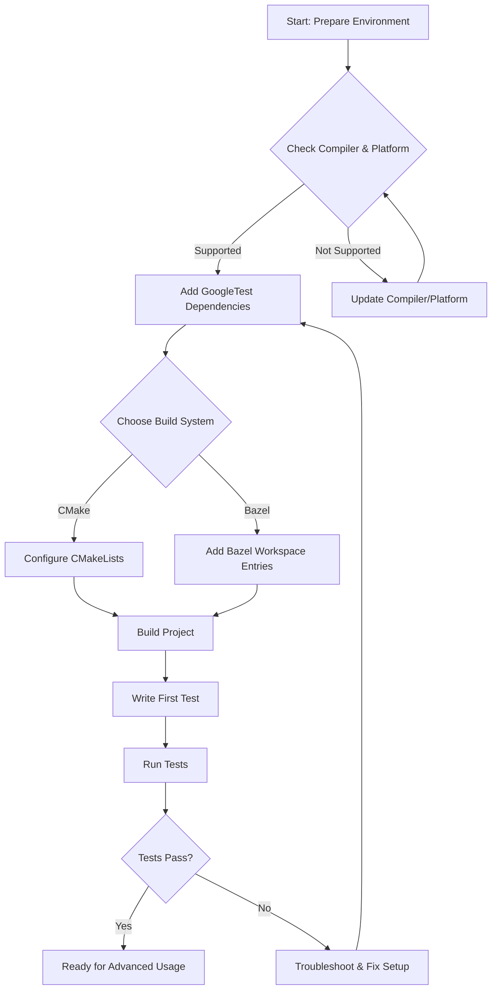

# Setting Up GoogleTest in Your Project

A clear walkthrough of integrating GoogleTest into your development workflow. This guide covers environment setup, bringing in dependencies with CMake or Bazel, basic configuration, and validation steps to ensure a successful installation.

---

## 1. Overview

### What This Guide Helps You Accomplish
This guide walks you through the essential steps to integrate GoogleTest into your C++ project. You will learn how to prepare your development environment, add GoogleTest dependencies using either CMake or Bazel, perform initial configuration, and validate your setup by running basic tests.

### Prerequisites

- A C++ development environment with support for C++17 or higher.
- Basic familiarity with CMake or Bazel build systems (depending on your project).
- Network access to clone repositories or fetch dependencies.

### Expected Outcome

By following this guide, you will have GoogleTest properly integrated and configured in your project, ready for writing and running unit tests.

### Time Estimate

Allow approximately 15-30 minutes depending on environment setup and familiarity with build tools.

### Difficulty Level

Beginner to Intermediate. This guide assumes basic knowledge of C++ development and build systems.

---

## 2. Preparing Your Development Environment

Before integrating GoogleTest, ensure your environment matches the minimum requirements:

- Your compiler must support at least C++17 standard.
- Supported platforms include major OSes like Windows, Linux, and macOS.

### Steps

1. **Check Compiler Support for C++17**

   - For GCC, version 7 or above is recommended.
   - For Clang, version 5 or above.
   - For MSVC, Visual Studio 2017 or later.

2. **Verify Platform Support**

   Confirm your operating system is supported; most modern OSes are.

3. **Validate Your Build Tools**

   Ensure you have CMake (version 3.14 or newer) installed if using CMake.

4. **Install Bazel** *(if using)*

   Follow official Bazel installation instructions for your platform.

<Tip>
If uncertain about compiler versions or environment details, run `--version` commands (`gcc --version`, `clang --version`, etc.) and consult with your platform documentation.
</Tip>

---

## 3. Adding GoogleTest Dependencies

You can bring GoogleTest into your project using two primary build systems: CMake or Bazel. Choose the method that matches your setup.

### 3.1 Using CMake

GoogleTest provides official CMake support and can be added either as an external project or subdirectory.

#### Method A: Using FetchContent (Recommended for new CMake projects)

1. In your `CMakeLists.txt`, add:

```cmake
include(FetchContent)
FetchContent_Declare(
  googletest
  URL https://github.com/google/googletest/archive/refs/heads/main.zip
)
set(gtest_force_shared_crt ON CACHE BOOL "" FORCE)  # For Windows runtime compatibility
FetchContent_MakeAvailable(googletest)

add_executable(your_test_executable test_file.cpp)
target_link_libraries(your_test_executable
  gtest_main
)
add_test(NAME your_test COMMAND your_test_executable)
```

2. Configure and build your project as usual, e.g.,

```bash
mkdir build
cd build
cmake ..
cmake --build .
ctest
```

#### Method B: Adding GoogleTest as Subdirectory

1. Clone googletest repository into your project:

```bash
git clone https://github.com/google/googletest.git third_party/googletest
```

2. In your `CMakeLists.txt`:

```cmake
add_subdirectory(third_party/googletest)

add_executable(your_test_executable test_file.cpp)
target_link_libraries(your_test_executable gtest_main)
add_test(NAME your_test COMMAND your_test_executable)
```

#### Notes:

- When building GoogleTest with CMake standalone, GoogleMock support is included by default.
- To build only GoogleTest (no GoogleMock), use:

```bash
cmake .. -DBUILD_GMOCK=OFF
```

- On Windows, set `gtest_force_shared_crt` to `ON` to avoid runtime library conflicts.

### 3.2 Using Bazel

1. Add `googletest` dependency to your `WORKSPACE` file. Use the official Googletest Bazel rules or a repository rule to fetch the source.

2. In your Bazel `BUILD` file for tests, depend on `@com_google_googletest//:gtest` or `:gmock` as needed.

3. Write your test targets accordingly.

<Tip>
Refer to the official Bazel documentation specific to GoogleTest for exact workspace rules and best practices.
</Tip>

---

## 4. Initial Configuration

After dependencies are in place, complete these configuration steps:

### 4.1 Include Required Headers

In your test files, include GoogleTest headers:

```cpp
#include <gtest/gtest.h>
```

For mocking capabilities, include GoogleMock:

```cpp
#include <gmock/gmock.h>
```

### 4.2 Initialize GoogleTest or GoogleMock

In your main test executable, initialize the GoogleTest/GoogleMock framework to handle command-line flags and setup.

For GoogleTest only:

```cpp
int main(int argc, char** argv) {
  ::testing::InitGoogleTest(&argc, argv);
  return RUN_ALL_TESTS();
}
```

For GoogleMock (which includes GoogleTest):

```cpp
int main(int argc, char** argv) {
  ::testing::InitGoogleMock(&argc, argv);
  return RUN_ALL_TESTS();
}
```

*TROUBLESHOOTING:* If you use embedded platforms or special environments that lack `argc` and `argv`, GoogleMock provides an overload to initialize with no parameters.

### 4.3 Compiler and Linker Flags

- Make sure to link in the required libraries (`gtest`, `gtest_main`, `gmock`, `gmock_main`) depending on your usage.
- On some platforms, you may need to link additional threading libraries.

---

## 5. Validation: Writing and Running Your First Test

With setup done, verify your environment is working with a simple test.

### Example Test

Create a file `example_test.cpp`:

```cpp
#include <gtest/gtest.h>

TEST(SampleTest, Addition) {
  EXPECT_EQ(1 + 1, 2);
}
```

### Building and Running

Build your test executable using your project build procedure. Then run:

```bash
./your_test_executable
```

You should see test discovery and results similar to:

```shell
[==========] Running 1 test from 1 test suite.
[----------] Global test environment set-up.
[----------] 1 test from SampleTest
[ RUN      ] SampleTest.Addition
[       OK ] SampleTest.Addition (0 ms)
[----------] 1 test from SampleTest (0 ms total)

[==========] 1 test from 1 test suite ran. (0 ms total)
[  PASSED  ] 1 test.
```

<Tip>
If the test fails or fails to compile, check include paths, linked libraries, C++ standard version, and build tool setup.
</Tip>

---

## 6. Troubleshooting Common Issues

Refer to the [Troubleshooting Common Setup Issues](../getting-started/configuration-validation/troubleshooting-common-issues) page for detailed explanations of frequent problems during setup.

Some common pitfalls include:

- Missing or incorrect include directories.
- Linking errors due to missing GoogleTest-related libraries.
- Mismatched runtime libraries on Windows.
- Compiler not set to use C++17 or higher.

---

## 7. Best Practices

- Always set your compiler standard explicitly to C++17 or newer.
- Use `InitGoogleMock()` if you are using GoogleMock features; it also initializes GoogleTest.
- Prefer FetchContent or subdirectory inclusion for CMake projects to avoid version mismatches.
- Use official GitHub releases or tags to pin GoogleTest versions to avoid surprises.

---

## 8. Next Steps

Once GoogleTest is successfully set up:

- Write your first comprehensive tests by exploring the [Writing and Running Your First Test](../getting-started/configuration-validation/write-and-run-first-test) guide.
- Explore [Mocking Basics](../guides/core_workflows/mocking-basics) to add mock objects with GoogleMock.
- Learn about [Powerful Assertions](../guides/core_workflows/writing-assertions) to check test conditions effectively.

---

## References and Resources

- Official GoogleTest repository: https://github.com/google/googletest
- [GoogleMock for Dummies](https://google.github.io/googletest/gmock_for_dummies.html)
- [gMock Cookbook](https://google.github.io/googletest/gmock_cook_book.html)
- [GoogleTest Architecture Overview](../overview/architecture-and-concepts/system-architecture)
- [Initial Configuration](../getting-started/configuration-validation/initial-configuration)

---

### Diagram: Basic Workflow of Setting Up GoogleTest



---