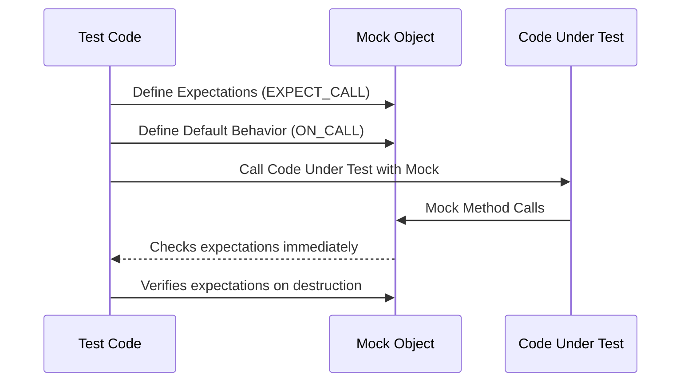

# Mocking Dependencies with GoogleMock

Hands-on instructions for introducing GoogleMock to fake dependencies in your tests. Learn how to use `MOCK_METHOD`, set expectations, define mock behaviors, and use `NiceMock`/`StrictMock` to manage warnings and errors on uninteresting calls.

---

## 1. What You Will Achieve

This guide helps you confidently introduce GoogleMock into your C++ test projects to simulate dependencies. You will learn how to:

- Define mock classes using `MOCK_METHOD`
- Set precise expectations for method calls
- Specify default mock behaviors
- Manage call order and invocation counts
- Handle uninteresting calls with `NiceMock` and `StrictMock`

## 2. Prerequisites

Before starting, ensure you have:

- GoogleMock installed and included in your project
- Basic familiarity with C++ virtual functions and interfaces
- A simple interface whose dependencies you want to mock

For installation and setup details, see the [GoogleMock README](https://github.com/google/googletest/tree/main/googlemock#readme) and integration guides.

---

## 3. Defining Mock Classes with `MOCK_METHOD`

Mock classes simulate real interfaces for testing purposes. Follow these steps:

### Step 1: Identify the Interface to Mock

Choose the dependency interface you want to mock. For instance, a simplified `Turtle` interface for a graphics program:

```cpp
class Turtle {
 public:
  virtual ~Turtle() {}
  virtual void PenUp() = 0;
  virtual void PenDown() = 0;
  virtual void Forward(int distance) = 0;
  virtual void Turn(int degrees) = 0;
  virtual void GoTo(int x, int y) = 0;
  virtual int GetX() const = 0;
  virtual int GetY() const = 0;
};
```

### Step 2: Create a Mock Class Derived from the Interface

Define the mock class by inheriting from the interface. Use the `MOCK_METHOD` macro to generate mock methods. Place these declarations in the `public:` section.

```cpp
#include <gmock/gmock.h>

class MockTurtle : public Turtle {
 public:
  MOCK_METHOD(void, PenUp, (), (override));
  MOCK_METHOD(void, PenDown, (), (override));
  MOCK_METHOD(void, Forward, (int distance), (override));
  MOCK_METHOD(void, Turn, (int degrees), (override));
  MOCK_METHOD(void, GoTo, (int x, int y), (override));
  MOCK_METHOD(int, GetX, (), (const, override));
  MOCK_METHOD(int, GetY, (), (const, override));
};
```

#### Important Notes on `MOCK_METHOD`:
- The first argument is the return type.
- The second is the method name.
- The third is the parameter list enclosed in parentheses.
- The optional fourth argument specifies qualifiers like `const` and `override`.
- Handle unprotected commas in types by wrapping the entire type in parentheses or using type aliases.

---

## 4. Setting Expectations with `EXPECT_CALL`

After defining your mock class, set expectations to specify how you expect mock methods to be called during tests.

### Step 1: Create an Instance of Your Mock

```cpp
MockTurtle turtle;
```

### Step 2: Set Expectations

Specify which methods you expect to be called, how many times, and with what arguments.

```cpp
#include <gmock/gmock.h>
using ::testing::AtLeast;

EXPECT_CALL(turtle, PenDown())
    .Times(AtLeast(1));
```

This expects `PenDown()` to be called at least once.

### Step 3: Exercise the Target Code

Pass your mock to the code under test and run it.

```cpp
Painter painter(&turtle);
EXPECT_TRUE(painter.DrawCircle(0, 0, 10));
```

### Step 4: Verify Expectations are Met Automatically

GoogleMock verifies that your expectations are satisfied upon mock destruction. If not, your test will fail with informative errors.

### Key Modifier Clauses You Should Know

| Clause              | Purpose                                                       |
|---------------------|---------------------------------------------------------------|
| `.Times(n)`         | Specifies exact or approximate call count                      |
| `.WillOnce(action)` | Defines behavior/action for the next matching call             |
| `.WillRepeatedly(action)` | Defines behavior for subsequent calls after `.WillOnce`s finish|
| `.InSequence(seq)`  | Enforces call order within the given sequence                   |
| `.RetiresOnSaturation()` | Deactivates expectation once it has been fully met            |

---

## 5. Defining Default Behavior with `ON_CALL`

Use `ON_CALL` to set default behavior for mock methods when no expectation is explicitly set or when unexpected arguments occur.

```cpp
ON_CALL(turtle, GetX())
    .WillByDefault(Return(100));
```

Default behaviors are overridden by matching `EXPECT_CALL` actions.

---

## 6. Managing Call Behavior of Uninteresting Methods

By default, calling mocked methods without expectations triggers warnings. GoogleMock provides three wrappers to adjust this behavior:

| Wrapper           | Behavior on Uninteresting Calls                                     |
|-------------------|---------------------------------------------------------------------|
| `NaggyMock<T>`    | Default; warns on uninteresting calls                               |
| `NiceMock<T>`     | Suppresses warnings on uninteresting calls                         |
| `StrictMock<T>`   | Treats uninteresting calls as errors (test failures)              |

Example - suppress warnings on uninteresting calls:

```cpp
using ::testing::NiceMock;
NiceMock<MockTurtle> turtle;
EXPECT_CALL(turtle, PenDown());
```

Use `StrictMock` when you want your test to fail if any mock method is called without an explicit expectation.

---

## 7. Best Practices and Common Pitfalls

- **Set expectations before exercising the mock:** `EXPECT_CALL` must appear *before* method calls to the mock.
- **Matchers:** Use `_` to ignore arguments when their value is irrelevant.
- **Ordering:** Use `InSequence` or `After` to enforce call order only when necessary.
- **Avoid over-specification:** Specify only necessary arguments and call counts to keep tests maintainable.
- **Wrapping complex types:** Use type aliases or parentheses when mocking methods with arguments or return types that contain commas.
- **Use `RetiresOnSaturation()` with multiple expectations:** Avoid upper-bound violations by retiring expectations when saturated.
- **Default behavior vs expectations:** Use `ON_CALL` for default method behavior, and `EXPECT_CALL` for verifying call presence and parameters.

---

## 8. Complete Example

```cpp
#include <gmock/gmock.h>
#include <gtest/gtest.h>

using ::testing::AtLeast;
using ::testing::NiceMock;
using ::testing::Return;

class Turtle {
 public:
  virtual ~Turtle() {}
  virtual void PenUp() = 0;
  virtual void PenDown() = 0;
  virtual void Forward(int distance) = 0;
  virtual void Turn(int degrees) = 0;
  virtual void GoTo(int x, int y) = 0;
  virtual int GetX() const = 0;
  virtual int GetY() const = 0;
};

class MockTurtle : public Turtle {
 public:
  MOCK_METHOD(void, PenUp, (), (override));
  MOCK_METHOD(void, PenDown, (), (override));
  MOCK_METHOD(void, Forward, (int distance), (override));
  MOCK_METHOD(void, Turn, (int degrees), (override));
  MOCK_METHOD(void, GoTo, (int x, int y), (override));
  MOCK_METHOD(int, GetX, (), (const, override));
  MOCK_METHOD(int, GetY, (), (const, override));
};

class Painter {
 public:
  explicit Painter(Turtle* turtle) : turtle_(turtle) {}

  // Draws a circle at (x, y) with given radius
  bool DrawCircle(int x, int y, int radius) {
    turtle_->PenDown();
    turtle_->GoTo(x + radius, y);
    // ... omitted complex drawing logic
    turtle_->PenUp();
    return true;  // Simple success indicator
  }

 private:
  Turtle* turtle_;  // Dependency
};

TEST(PainterTest, DrawsCircleCallsPenDownAtLeastOnce) {
  NiceMock<MockTurtle> turtle;  // Suppress uninteresting call warnings

  EXPECT_CALL(turtle, PenDown())
      .Times(AtLeast(1));

  Painter painter(&turtle);

  EXPECT_TRUE(painter.DrawCircle(0, 0, 10));
}
```

---

## 9. Troubleshooting

- **Test fails with "Actual function call count doesn't match this expectation":** Verify you called `EXPECT_CALL` before using the mock.
- **Warnings about uninteresting calls:** Use `NiceMock` to suppress, or add a permissive `EXPECT_CALL` for those methods.
- **Upper-bound violation errors:** Use `.RetiresOnSaturation()` or adjust `.Times()` cardinalities.
- **Mock method doesn't seem to be mocked:** Ensure the mocked methods are virtual and the mock method has `(override)` qualifier.
- **Mock method signature with commas won't compile:** Wrap type containing commas in parentheses or use `using` alias.

If you suspect a problem with your mock setup, run tests with `--gmock_verbose=info` to get detailed call traces.

---

## 10. Next Steps and Related Content

- **Explore Mocking Reference:** Dive deeper into the API details of `MOCK_METHOD`, `EXPECT_CALL`, `ON_CALL`, and related utilities.
- **Learn from the gMock for Dummies:** Beginner-friendly guide explaining mocking concepts and terminology.
- **Advanced Usage:** Check out the [gMock Cookbook](https://google.github.io/googletest/gmock_cook_book.html) for advanced patterns.
- **Integration guides:** Learn how to integrate GoogleMock with C++ projects and build systems.
- **Mocking Strategies:** Understand Nice, Naggy, and Strict mocks for controlling uninteresting call behaviors.

---

## Summary Diagram: Mocking Workflow



---

_Last updated: main branch_

---