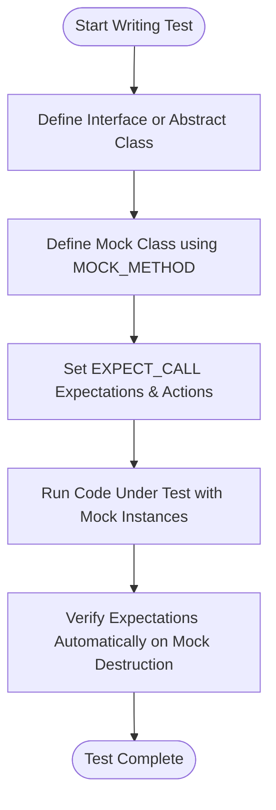

# Introduction and Primer

## 1. Getting Started with GoogleTest and GoogleMock

GoogleTest is Google's C++ testing framework designed to help you write reliable and maintainable unit tests. GoogleMock (gMock) extends GoogleTest by enabling powerful mocking capabilities to simulate and verify the interaction of your code with its dependencies.

This guide will walk you through the initial setup, writing your first tests with and without mocks, and understanding the fundamental concepts behind GoogleTest and GoogleMock.

---

### Prerequisites

- A working C++ development environment with support for C++17 or later.
- GoogleTest and GoogleMock installed or built as part of your project.
- Basic knowledge of C++ syntax and concepts such as classes and inheritance.

---

### Expected Outcome

By the end of this guide, you will be able to:

- Write simple GoogleTest unit tests.
- Understand the difference between state-based and interaction-based testing.
- Create and use mock classes with GoogleMock.
- Write expectations, specify behaviors, and verify interactions with mocks.

---

### Time Estimate

**30-45 minutes**

---

### Difficulty Level

**Beginner to Intermediate**

---

## 2. Writing Your First Test with GoogleTest

### Basic Test Structure

GoogleTest uses the `TEST` macro to define tests. Each test has two parameters: the test case name and the test name inside it.

```cpp
#include <gtest/gtest.h>

TEST(MathTest, AdditionWorks) {
  EXPECT_EQ(2 + 2, 4);
}
```

- `EXPECT_EQ` is an assertion macro that checks if the two values are equal.
- You can use other assertions, like `EXPECT_TRUE`, `ASSERT_NE`, etc.

### Running Tests

- Compile your test executable linking against GoogleTest libraries.
- Run the executable. GoogleTest will discover and run all tests and report test results.

---

## 3. Introducing GoogleMock: Why and When to Use It

Traditional tests assert the *state* of your system after execution — known as state-based testing.

Often, it's crucial to verify the *interaction* between your code and its collaborators, such as whether a method was called correctly or how many times it was invoked. GoogleMock enables such interaction-based testing with mocks.

### When to use GoogleMock

- Your component depends on complex or slow resources (e.g., database, network).
- You want to simulate error conditions that are hard to produce naturally.
- You want to verify that specific methods are called with correct parameters.
- You wish to isolate your unit tests from their dependencies.

---

## 4. Creating Your First Mock Class

GoogleMock lets you write mock classes which simulate interfaces or abstract classes.

### Defining a Mock Class

1. Identify an interface or base class your code depends on, e.g., an abstract class `Turtle`:

```cpp
class Turtle {
 public:
  virtual ~Turtle() {}
  virtual void PenUp() = 0;
  virtual void PenDown() = 0;
  virtual void Forward(int distance) = 0;
  virtual int GetX() const = 0;
};
```

2. Create a derived mock class `MockTurtle` using the `MOCK_METHOD` macro for each virtual method:

```cpp
#include <gmock/gmock.h>

class MockTurtle : public Turtle {
 public:
  MOCK_METHOD(void, PenUp, (), (override));
  MOCK_METHOD(void, PenDown, (), (override));
  MOCK_METHOD(void, Forward, (int distance), (override));
  MOCK_METHOD(int, GetX, (), (const, override));
};
```

- `MOCK_METHOD` takes parameters: return type, method name, argument types in parentheses, and qualifiers like `const` and `override`.
- Place `MOCK_METHOD` declarations in the `public` section.

### Important Notes

- The destructor of the interface class must be virtual to avoid memory leaks.
- Only virtual methods can be mocked.

--

## 5. Using Mock Objects in Your Tests

### Typical Workflow

1. **Import Google's testing namespace** for ease:

   ```cpp
   using ::testing::;
   ```

2. **Create mock objects:**

   ```cpp
   MockTurtle turtle;
   ```

3. **Specify expectations:** Define how mock methods are expected to be called.

   ```cpp
   EXPECT_CALL(turtle, PenDown()).Times(AtLeast(1));
   ```

4. **Exercise your code:** Pass the mock to your code under test.

5. **Verify automatically:** GoogleMock checks expectations during mock destruction and reports any violations.

---

### Example: Testing Drawing a Circle

```cpp
#include <gmock/gmock.h>
#include <gtest/gtest.h>

using ::testing::AtLeast;

TEST(PainterTest, CanDrawSomething) {
  MockTurtle turtle;
  EXPECT_CALL(turtle, PenDown())
      .Times(AtLeast(1));

  Painter painter(&turtle);
  EXPECT_TRUE(painter.DrawCircle(0, 0, 10));
}
```

- This test asserts that `PenDown()` is called at least once when drawing a circle.
- If `PenDown()` is not called, the test fails immediately, showing detailed diagnostics.

---

## 6. Setting Expectations on Mock Methods

### Using `EXPECT_CALL` Macro

This macro declares what you expect your mock to receive in terms of method calls.

Basic syntax:

```cpp
EXPECT_CALL(mock_object, MethodName(arguments))
    .Times(cardinality)
    .WillOnce(action)
    .WillRepeatedly(action);
```

- `mock_object` is the mock instance.
- `MethodName` is the mock method to expect.
- `arguments` can include matchers, e.g., `_` means "match anything".

### Cardinalities

- `Times(n)` expects exactly `n` calls.
- `AtLeast(n)` expects at least `n` calls.
- `AnyNumber()` allows any number.
- Omitting `Times()` infers `Times(1)` or based on defined actions.

### Actions

- `WillOnce(Return(value))` specifies return values or behavior for the first calls.
- `WillRepeatedly(Return(value))` applies to all subsequent calls after `WillOnce()`s.

---

### Example: Return Values with `EXPECT_CALL`

```cpp
EXPECT_CALL(turtle, GetX())
    .Times(5)
    .WillOnce(Return(100))
    .WillOnce(Return(150))
    .WillRepeatedly(Return(200));
```

Here `GetX()` will return 100 the first call, 150 the second, and 200 thereafter until the 5th call.

---

## 7. Additional Concepts

### Matchers for Arguments

- Use matchers like `_` (wildcard), `Eq(val)` (equal to), or `Ge(val)` (greater or equal).

```cpp
EXPECT_CALL(turtle, Forward(Ge(100)));
```

This matches calls where `Forward` is called with an argument greater or equal to 100.

### Ordering Calls

By default, calls can happen in any order. To enforce order use:

```cpp
{
  InSequence seq;
  EXPECT_CALL(turtle, PenDown());
  EXPECT_CALL(turtle, Forward(100));
  EXPECT_CALL(turtle, PenUp());
}
```

All calls in the block must occur in the specified sequence.

### Uninteresting Calls

If a method is called but has no expectation, a warning is emitted (by default).
Suppress warnings by using `NiceMock` or explicitly `EXPECT_CALL(...).Times(AnyNumber())`.

```cpp
NiceMock<MockTurtle> nice_turtle;
```

---

## 8. Troubleshooting Common Issues

### Unexpected Calls

When a mock method is called with arguments not matching any expectation, gMock reports an error immediately.

### Uninteresting Calls

Warnings appear when mock methods without expectations are called. Suppress with `NiceMock` or by adding default expectations.

### Virtual Destructors

Always ensure interfaces have virtual destructors; otherwise, deleting mock objects via base pointers causes undefined behavior.

### Set Expectations Before Calling

Always set `EXPECT_CALL` expectations before exercising the code that calls the mocks. Failure to do so results in undefined behavior.

### Heap Checker

If mock objects are allocated on the heap and not deleted, final verification may not happen. Use GoogleTest's heap checker or manage object lifetime carefully.

---

## 9. Next Steps & Further Learning

- Read the [GoogleTest Primer](primer.md) for detailed test-writing guidance.
- Explore the [gMock Cookbook](gmock_cook_book.md) for advanced mocking techniques.
- Consult the [Mocking Reference](reference/mocking.md) for comprehensive API details.
- Learn about matchers to write expressive expectations at [Matchers Reference](reference/matchers.md).

Start integrating mocking in your tests to increase reliability, reduce dependencies, and enable interaction verification.

---

# Quick Reference

| Concept         | Description                      | Example                           |
|-----------------|--------------------------------|----------------------------------|
| MOCK_METHOD     | Declares a mock method          | `MOCK_METHOD(void, Foo, (), (override));` |
| EXPECT_CALL     | Sets an expectation on a call  | `EXPECT_CALL(mock, Foo()).Times(1);`        |
| Matchers        | Specify argument patterns      | `_` (any), `Eq(5)`, `Ge(10)`       |
| Actions         | Specify method behavior        | `.WillOnce(Return(42))`           |
| Cardinalities   | Control call counts            | `.Times(AtLeast(1))`              |
| NiceMock        | Suppress warnings on uninteresting calls | `NiceMock<MockClass> mock;`    |
| InSequence      | Enforce order of calls         | `{ InSequence s; ... }`            |

---

# Sample Complete Test Example

```cpp
#include <gmock/gmock.h>
#include <gtest/gtest.h>

using ::testing::_;
using ::testing::Return;
using ::testing::AtLeast;
using ::testing::InSequence;

class Turtle {
 public:
  virtual ~Turtle() {}
  virtual void PenUp() = 0;
  virtual void PenDown() = 0;
  virtual void Forward(int distance) = 0;
  virtual int GetX() const = 0;
};

class MockTurtle : public Turtle {
 public:
  MOCK_METHOD(void, PenUp, (), (override));
  MOCK_METHOD(void, PenDown, (), (override));
  MOCK_METHOD(void, Forward, (int distance), (override));
  MOCK_METHOD(int, GetX, (), (const, override));
};

class Painter {
 public:
  explicit Painter(Turtle* t) : turtle_(t) {}

  bool DrawLine() {
    turtle_->PenDown();
    turtle_->Forward(100);
    turtle_->PenUp();
    return true;
  }

 private:
  Turtle* turtle_;
};

TEST(PainterTest, DrawLineCallsExpectedMethodsInOrder) {
  MockTurtle mock_turtle;
  {
    InSequence seq;
    EXPECT_CALL(mock_turtle, PenDown()).Times(1);
    EXPECT_CALL(mock_turtle, Forward(100)).Times(1);
    EXPECT_CALL(mock_turtle, PenUp()).Times(1);
  }

  Painter painter(&mock_turtle);
  EXPECT_TRUE(painter.DrawLine());
}
```

---

# Visual Overview of Mock Testing Workflow



---

This primer guides you in understanding the core journey from writing your first test to effectively applying mock objects to verify interactions. Explore more guides and references to deepen your skills.
