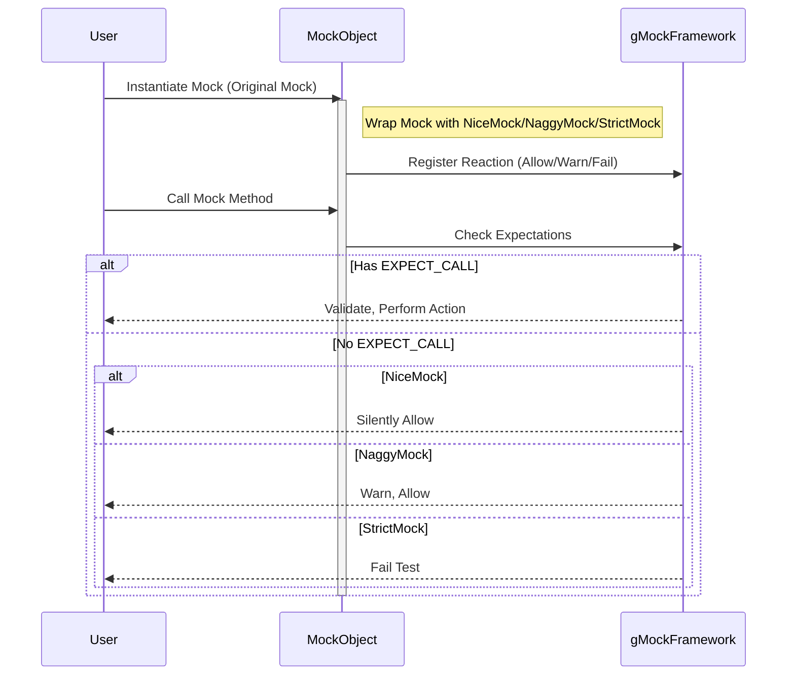

# Strict, Nice, and Naggy Mocks

This page explains the three primary mock behavior modifiers provided by GoogleMock—**NiceMock**, **NaggyMock**, and **StrictMock**. It details when and why to choose each type to enhance your testing experience by controlling how uninteresting mock method calls are treated.

---

## Overview of Mock Behavior Modifiers

When using mock objects in tests, uninteresting calls occur when methods on mocks are called without corresponding explicit expectations (`EXPECT_CALL`). GoogleMock offers three policy classes to configure how such calls are handled for better test clarity and enforcement:

| Mock Type    | Behavior on Uninteresting Calls            | Test Impact                                 | Typical Use Case                        |
|--------------|--------------------------------------------|---------------------------------------------|---------------------------------------|
| **NiceMock** | Silences warnings; allows calls silently   | Tests ignore unexpected calls on mocks     | Most tests; reduce noise and improve productivity |
| **NaggyMock**| Prints warnings for unexpected calls       | Default behavior; warns but does not fail  | Use during test writing and debugging |
| **StrictMock** | Treats uninteresting calls as failures    | Tests fail if unexpected calls occur       | High enforcement; when all interactions must be specified |

---

## What Are Strict, Nice, and Naggy Mocks?

- **StrictMock**: A subclass wrapper that causes all calls to mock methods without an explicit `EXPECT_CALL` to result in test failures. Use it to catch any unexpected interactions strictly, ensuring your tests verify every mock method invocation.

- **NiceMock**: A subclass wrapper that suppresses warnings for uninteresting calls. This mock type lets your tests ignore unexpected calls without print noise or errors. It simplifies test maintenance when you don't need to verify every method call.

- **NaggyMock**: A subclass wrapper that prints warnings on uninteresting calls but allows tests to proceed. This is the current default behavior for mocks, useful to catch potential missing expectations during test development without breaking tests.

---

## When to Use Each Mock Modifier

Choose the mock type based on how strictly you want to control interactions with your mock objects:

- Use **NiceMock** when you want to focus on the main expected calls and tolerate other calls silently. Ideal for larger tests or when mocks have many methods that are indirectly called.

- Use **NaggyMock** as a middle ground during development and debugging. It alerts you to unexpected calls without breaking test execution.

- Use **StrictMock** for high-assurance testing where every interaction must be precisely specified. This tightens the feedback loop, catches unintended behaviors early, and prevents silent test holes.

**Best Practice Tip**: Start with NiceMock for fast iteration, switch to NaggyMock when verifying new tests, and adopt StrictMock only when you need full interaction enforcement to prevent regressions.

---

## How to Apply Strict, Nice, and Naggy Mocks

### Basic Usage
Assuming you have a mock class, e.g., `MockFoo`, you can wrap it to enforce a behavior modifier:

```cpp
#include <gmock/gmock.h>
using ::testing::NiceMock;
using ::testing::NaggyMock;
using ::testing::StrictMock;

// Create a nice mock (silences uninteresting call warnings):
NiceMock<MockFoo> nice_foo;

// Create a naggy mock (default, prints warnings on uninteresting calls):
NaggyMock<MockFoo> naggy_foo;

// Create a strict mock (fails on uninteresting calls):
StrictMock<MockFoo> strict_foo;
```

These wrapped mocks can be used anywhere `MockFoo` is accepted.

### Forwarding Constructors
If your mock class has constructors accepting parameters, pass them through when constructing the wrapped mocks:

```cpp
// If MockFoo has a constructor MockFoo(int, const string&):
NiceMock<MockFoo> nice_foo(5, "hello");
StrictMock<MockFoo> strict_foo(10, "world");
```

### Effect on Destructor
These modifiers rely on interactions with the mocked object being tracked properly. For them to work reliably, ensure the mocked classes have a **virtual destructor**.

---

## Behavior and Limitations

- These modifiers only affect **uninteresting calls** — that is, calls to mock methods without any matching `EXPECT_CALL` specification.
- They *do not* affect unexpected calls that have expectations but are invoked with wrong arguments.
- Only mock methods **defined directly** in the mock class using `MOCK_METHOD` macros are affected consistently.
- Nested usage like `NiceMock<StrictMock<MockFoo>>` is **not supported**.

---

## Practical Example

Suppose you have a mock class `MockDatabase`:

```cpp
class MockDatabase {
 public:
  MOCK_METHOD(bool, Connect, (), ());
  MOCK_METHOD(int, GetUserCount, (), ());
  MOCK_METHOD(void, Disconnect, (), ());
};
```

### NaggyMock (Default):

```cpp
NaggyMock<MockDatabase> db;
EXPECT_CALL(db, Connect()).Times(1);

// Calling GetUserCount() without expectation prints a warning but passes.
bool connected = db.Connect();
int users = db.GetUserCount();  // Warning: uninteresting call
```

### NiceMock:

```cpp
NiceMock<MockDatabase> db;
EXPECT_CALL(db, Connect()).Times(1);

// Calling GetUserCount() silently allowed.
bool connected = db.Connect();
int users = db.GetUserCount();  // No warning printed
```

### StrictMock:

```cpp
StrictMock<MockDatabase> db;
EXPECT_CALL(db, Connect()).Times(1);

bool connected = db.Connect();

db.GetUserCount();  // Test fails immediately; no EXPECT_CALL matches.
```

---

## Common Pitfalls & Best Practices

- Avoid overusing **StrictMock** in large tests where many uninteresting calls can occur; it can cause brittle tests.
- Prefer **NiceMock** during initial development to reduce noise; switch to **StrictMock** when verifying all interactions is important.
- Remember that **NaggyMock** is the current default behavior of mocks.
- If you want to suppress warnings for specific methods, consider adding catch-all expectations instead of making the whole mock strict or nice.
- Ensure all mock classes have a **virtual destructor** to prevent incorrect behavior with these wrappers.
- If mocks are inherited or composed, confirm that `MOCK_METHOD` macros are in the target mock class to ensure modifiers work as expected.

---

## Troubleshooting

### Unexpected Warning or Failures on Uninteresting Calls
- Verify you are using the intended mock wrapper: `NiceMock`, `NaggyMock`, or `StrictMock`.
- Check if the mock methods were defined directly with `MOCK_METHOD` in the mock class.
- Confirm that all expected calls are set with `EXPECT_CALL` before the mock methods are invoked.

### Unwanted Silence on Uninteresting Calls
- If unexpected uninteresting calls are ignored silently, ensure you are **not** using `NiceMock` unintentionally.
- Switch to `NaggyMock` or default mock to get warnings.

### Crashes due to Missing Virtual Destructor
- Ensure your mock class’s base interface has a virtual destructor to avoid memory corruption and verification issues.

---

## Summary
- **StrictMock**: Use to fail tests on any unexpected method calls.
- **NiceMock**: Use to suppress warnings about unexpected calls.
- **NaggyMock**: Default; warns but allows unexpected calls.
- These wrappers help you control the strictness of your mock-based tests, balancing enforcement and usability.

---

## See Also
- [gMock Cookbook: The Nice, the Strict, and the Naggy](https://github.com/google/googletest/blob/main/docs/gmock_cook_book.md#NiceStrictNaggy)
- [Mocking Reference – NiceMock, NaggyMock, StrictMock](https://github.com/google/googletest/blob/main/docs/reference/mocking.md#NiceMock)
- [Creating and Using Mock Classes](https://github.com/google/googletest/blob/main/guides/gmock-mocking-patterns/creating-mocks.md)
- [Understanding Uninteresting vs Unexpected Calls](https://github.com/google/googletest/blob/main/docs/gmock_cook_book.md#uninteresting-vs-unexpected)

---

<Accordion title="Related API Details from gmock-nice-strict.h">
This file defines the implementation of the `NiceMock`, `NaggyMock`, and `StrictMock` template classes as wrappers over your mock classes, controlling the reaction to uninteresting calls by registering with the gMock framework upon construction.

- `NiceMock<T>` calls `Mock::AllowUninterestingCalls` on construction to silence warnings.
- `NaggyMock<T>` calls `Mock::WarnUninterestingCalls` to enable warnings.
- `StrictMock<T>` calls `Mock::FailUninterestingCalls` to treat uninteresting calls as errors.

See the implementation for details on inheritance and constructor forwarding.
</Accordion>

<Accordion title="Common Usage Snippet">
```cpp
using ::testing::NiceMock;
using ::testing::StrictMock;
using ::testing::NaggyMock;

class MockFoo {
 public:
  MOCK_METHOD(void, DoSomething, (), ());
  MOCK_METHOD(int, GetValue, (), ());
};

// The default mock object (naggy behavior)
NaggyMock<MockFoo> foo;

// Suppress uninteresting call warnings
NiceMock<MockFoo> nice_foo;

// Fail on uninteresting calls
StrictMock<MockFoo> strict_foo;

TEST(MyTest, Example) {
  EXPECT_CALL(foo, DoSomething());
  foo.DoSomething();            // Passes
  foo.GetValue();              // Warning (naggy)

  EXPECT_CALL(nice_foo, DoSomething());
  nice_foo.DoSomething();      // Passes
  nice_foo.GetValue();         // No warning

  EXPECT_CALL(strict_foo, DoSomething());
  strict_foo.DoSomething();    // Passes
  strict_foo.GetValue();       // Test fails
}
```
</Accordion>

---

## Mermaid Diagram: Mock Behavior Modifier Workflow


