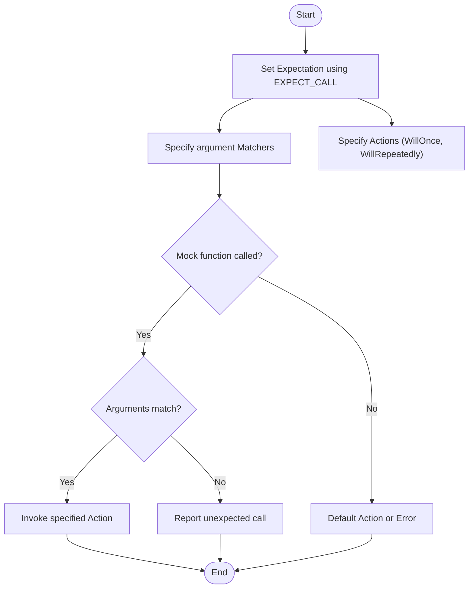

# Using Matchers and Actions

This guide helps you understand how to verify calls made to mock objects using matchers, and how to specify detailed behaviors with actions in GoogleMock. By mastering matchers and actions, you can write expressive, maintainable, and precise tests for your C++ code.

---

## 1. Understanding Matchers: Precisely Specifying Argument Expectations

### What This Section Covers
- The purpose and usage of matchers in mock expectations.
- Built-in matchers and how to combine them.
- Custom matchers using the MATCHER family of macros.
- Matching complex objects and advanced use cases.

### 1.1 What Are Matchers?
Matchers are predicates used to specify conditions on the arguments passed to mock functions. They answer the question: "Does this argument satisfy the criteria I care about?"

- You use matchers in `EXPECT_CALL(mock, Method(matcher1, matcher2, ...))`.
- `_` is the wildcard matcher that matches any value.
- Equality matchers like `Eq(value)` check for exact matches.

**Example:** Matching arguments exactly or with conditions:

```cpp
EXPECT_CALL(mock_foo, DoThis(5));             // Matches argument equal to 5.
EXPECT_CALL(mock_foo, DoThis(Ge(10)));         // Matches argument >= 10.
EXPECT_CALL(mock_foo, DoThat(_, NotNull()));    // First argument anything, second not null.
```

### 1.2 Combining Matchers for Complex Conditions
Matchers can be combined logically to create expressive criteria:

- `AllOf(m1, m2, ...)` requires all matchers to be true.
- `AnyOf(m1, m2, ...)` requires any matcher to be true.
- `Not(m)` negates matcher `m`.

**Example:** Argument must be positive and not equal to 10.

```cpp
EXPECT_CALL(mock, Foo(AllOf(Gt(0), Ne(10))));
```

### 1.3 Matching Multiple Arguments as a Single Tuple
You can apply a matcher on *all* arguments together using `.With()` and multi-argument matchers like `Lt()` for tuples:

```cpp
EXPECT_CALL(mock, SetPosition(_, _))
    .With(Lt());  // Expects first arg < second arg
```

You can also use `Args<N1, N2, ...>(matcher)` to apply matchers to selected argument subsets.

### 1.4 Custom Matchers
If built-in matchers are insufficient, define your own using `MATCHER` macros.

**Basic custom matcher example:**

```cpp
MATCHER(IsEven, "") {
  return (arg % 2) == 0;
}
```
Use it:

```cpp
EXPECT_CALL(mock, Bar(IsEven()));
```

Custom matchers can describe why a match failed to aid debugging by streaming to `result_listener`:

```cpp
MATCHER(IsEven, "") {
  if ((arg % 2) == 0) return true;
  *result_listener << "which has remainder " << (arg % 2);
  return false;
}
```

### 1.5 Matching Members and Properties
Matchers like `Field(&Class::member, matcher)` and `Property(&Class::method, matcher)` allow matching on object fields or getter method return values.

```cpp
EXPECT_CALL(mock, Foo(Field(&Bar::value, Ge(5))));
EXPECT_CALL(mock, Foo(Property(&Bar::GetName, StartsWith("John"))));
```

### 1.6 Matching Pointer Arguments
Use `Pointee(matcher)` to match the value pointed to by a pointer argument. It automatically fails on null pointers:

```cpp
EXPECT_CALL(mock, Foo(Pointee(Ge(10))));
```

You can nest `Pointee()` for pointers-to-pointers.

---

## 2. Using Actions: Defining Mock Function Behavior

### What This Section Covers
- Setting return values or behaviors of mock methods using actions.
- Built-in actions and how to combine or customize them.
- Using functions, functors, or lambdas as actions.
- Side effects and output argument manipulations.

### 2.1 What Are Actions?
Actions define *what a mock method does* when it is invoked.

- If not specified, a default action runs (return 0, false, `void`, or default-constructed value).
- Use `WillOnce(action)` or `WillRepeatedly(action)` to specify behaviors.

### 2.2 Common Built-in Actions
- `Return(value)`: Returns a copy of the value.
- `ReturnRef(variable)`: Returns a reference to an existing variable.
- `ReturnPointee(pointer)`: Returns the value pointed to by a pointer, evaluated at call time.
- `ReturnNull()`: Returns a null pointer.
- `DoDefault()`: Runs the default behavior (cannot be used inside composite actions).

### 2.3 Side Effect Actions
You can modify mock method arguments or perform side-effects:

- `SetArgPointee<N>(value)`: Sets the value pointed by the N-th argument.
- `SetArrayArgument<N>(first, last)`: Copies an array into the pointer passed as the N-th argument.
- `Assign(&variable, value)`: Assigns a value to a variable.
- `Throw(exception)`: Throws an exception.

### 2.4 Combining Actions
You can perform multiple actions using `DoAll()` which runs all actions and returns the result of the last:

```cpp
EXPECT_CALL(mock, Foo(_))
  .WillOnce(DoAll(SetArgPointee<0>(5), Return(true)));
```

### 2.5 Using Callables as Actions
You can use any callable (function, functor, lambda) as an action with `Invoke()`:

```cpp
EXPECT_CALL(mock, Foo(_, _))
    .WillOnce(Invoke(&MyFunction));
```

Also available:

- `InvokeWithoutArgs(f)`: invokes a callable with no arguments.
- `Invoke(object_pointer, &Class::Method)`: invokes a method on an object.
- `InvokeArgument<N>(args...)`: invokes the N-th argument (which must be callable) with specified arguments.

### 2.6 Ignoring Action Results
Sometimes you want to ignore the return value of an action to satisfy a mock method with `void` return type:

```cpp
EXPECT_CALL(mock, Foo())
    .WillOnce(IgnoreResult(Invoke(&SomeFunction)));
```

### 2.7 Selecting Arguments for Actions
When your action only needs a subset of mock function's arguments, use:

- `WithArg<N>(action)`: pass the N-th argument only.
- `WithArgs<N1, N2, ...>(action)`: pass a selected subset as arguments.
- `WithoutArgs(action)`: run an action without any arguments.

### 2.8 Using Actions with Move-only Types
You can mock methods returning or accepting move-only types (e.g., `std::unique_ptr`) naturally by specifying lambdas or callables as actions.

**Example:**

```cpp
EXPECT_CALL(mock_buzzer, MakeBuzz(_))
    .WillRepeatedly([](StringPiece text) {
        return std::make_unique<Buzz>(AccessLevel::kInternal);
    });
```

---

## 3. Practical Examples

### Setting Up a Matcher for an Even Number

```cpp
MATCHER(IsEven, "") {
  return (arg % 2) == 0;
}

EXPECT_CALL(mock, Bar(IsEven()));
```

### Returning Different Values on Consecutive Calls

```cpp
EXPECT_CALL(mock, GetValue())
    .WillOnce(Return(10))
    .WillOnce(Return(20))
    .WillRepeatedly(Return(30));
```

### Using `Invoke` with a Functor

```cpp
int Add(int x, int y) { return x + y; }
EXPECT_CALL(mock, Sum(_, _))
    .WillOnce(Invoke(Add));
```

### Using Side Effects and Return Together

```cpp
EXPECT_CALL(mock, UpdateValue(_))
    .WillOnce(DoAll(SetArgPointee<0>(42), Return(true)));
```

### Invoking a Callable Passed as an Argument

```cpp
EXPECT_CALL(mock, DoThis(_, _))
    .WillOnce(InvokeArgument<1>(5));  // Calls the 2nd argument with 5.
```

---

## 4. Troubleshooting and Best Practices

<AccordionGroup title="Common Issues and Tips">
<Accordion title="Uninteresting vs Unexpected Calls">
Uninteresting calls have no `EXPECT_CALL` and yield warnings by default, while unexpected calls match no expectation and cause errors. Use `NiceMock` to suppress warnings on uninteresting calls or use catch-all `EXPECT_CALL`s with `Times(AnyNumber())`.
</Accordion>
<Accordion title="Ordering of Expectations Matters">
GoogleMock searches expectations in reverse order; put more specific expectations after more general ones.
</Accordion>
<Accordion title="Using RetiresOnSaturation">
By default, expectations are sticky and remain active even when saturated. Use `.RetiresOnSaturation()` to make an expectation inactive after its expected number of calls.
</Accordion>
<Accordion title="Action and Matcher Side Effects">
Matchers must be pure functions without side-effects. Actions may contain side effects but evaluate parameters only once.
</Accordion>
<Accordion title="Working with Overloaded Methods">
Use `Const(mock)` to disambiguate const overloads, or specify argument types explicitly with `Matcher<T>`.
</Accordion>
</AccordionGroup>

---

## 5. Next Steps and Related Documentation

- Explore [Creating and Using Mock Classes](./creating-mocks) to understand how to define mocks.
- Learn about [Strict, Nice, and Naggy Mocks](./controlling-mock-behavior) for controlling mock object strictness.
- Dive into [Matchers and Custom Matchers](../reference/matchers.md) for an exhaustive list of matchers.
- See [Actions Reference](../reference/actions.md) for details on all built-in actions.
- Consult [gMock Cookbook](../gmock_cook_book.md) for practical recipes and advanced techniques.

---

## References

- [GoogleMock Cheat Sheet](../gmock_cheat_sheet.md) — Quick syntax reference for mocks, expectations, and matchers.
- [Mocking Reference](../reference/mocking.md) — Detailed documentation on mock macros and expectation syntax.
- [Legacy gMock FAQ](../gmock_faq.md) — Frequently asked questions with troubleshooting advice.

---

## Summary Diagram: How Expectations and Actions Work Together



This visualizes the flow when a mock function call occurs: the call is checked against expectations, argument matchers are evaluated, and the corresponding action is executed or a default behavior/error is raised.
