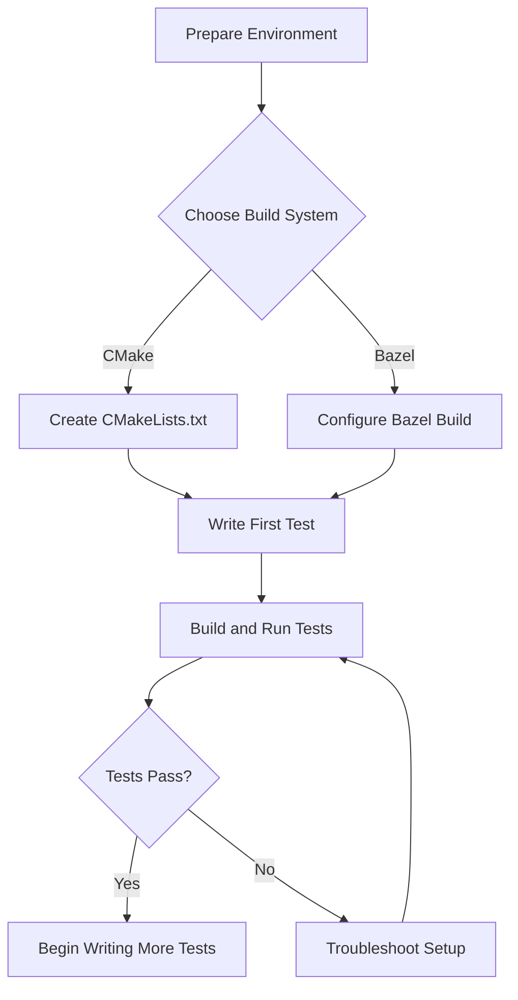

# Getting Started with GoogleTest

## Introduction

This guide walks you through setting up GoogleTest in your C++ project from scratch. You will learn how to install dependencies, integrate GoogleTest with your build system using either Bazel or CMake, write a first simple test, and understand the basic test lifecycle to confidently start testing your code.

Whether new to unit testing or transitioning to GoogleTest, following these steps ensures a smooth and productive experience.

---

## 1. Preparation and Prerequisites

### What You Need Before Starting

- A compatible C++17 compiler (supports C++17 standard).
- A supported operating system like Linux, Windows, or macOS.
- One of the recommended build systems: Bazel or CMake.
- Basic familiarity with building C++ projects.

<Note>
Make sure you have these prerequisites properly installed and configured, including environment variables if needed. See the [System Requirements](../getting-started/setup-prerequisites/system-requirements.md) and [Prerequisites & Dependencies](../getting-started/setup-prerequisites/prerequisites.md) for detailed setup guidance.
</Note>

---

## 2. Installing GoogleTest

### Using CMake

GoogleTest provides versatile CMake support with options to download and integrate it directly.

#### Quick Project Setup with CMake

1. Create a new project directory and enter it:

   ```bash
   mkdir my_project && cd my_project
   ```

2. Create a `CMakeLists.txt` file with the following minimal configuration:

   ```cmake
   cmake_minimum_required(VERSION 3.14)
   project(my_project)

   set(CMAKE_CXX_STANDARD 17)
   set(CMAKE_CXX_STANDARD_REQUIRED ON)

   include(FetchContent)
   FetchContent_Declare(
     googletest
     URL https://github.com/google/googletest/archive/03597a01ee50ed33e9dfd640b249b4be3799d395.zip
   )
   set(gtest_force_shared_crt ON CACHE BOOL "" FORCE) # Windows compatibility
   FetchContent_MakeAvailable(googletest)

   enable_testing()

   add_executable(hello_test hello_test.cc)
   target_link_libraries(hello_test GTest::gtest_main)
   include(GoogleTest)
   gtest_discover_tests(hello_test)
   ```

3. Create your first test source file `hello_test.cc`:

   ```cpp
   #include <gtest/gtest.h>

   TEST(HelloTest, BasicAssertions) {
     EXPECT_STRNE("hello", "world");  // Strings are not equal
     EXPECT_EQ(7 * 6, 42);               // Mathematical equality
   }
   ```

4. Build and run your test:

   ```bash
   cmake -S . -B build
   cmake --build build
   cd build && ctest
   ```

Successful output confirms GoogleTest is properly integrated.

<Check>
A passing test is seen as:

```
1/1 Test #1: HelloTest.BasicAssertions ........   Passed    0.00 sec

100% tests passed, 0 tests failed out of 1
```
</Check>

---

### Using Bazel

GoogleTest also supports Bazel for users who prefer this build system.

Refer to the [Installing with Bazel](../getting-started/installation-config/installing-bazel.md) guide for detailed Bazel-specific integration steps.

---

## 3. Understanding the Test Lifecycle

Once set up, writing and running tests in GoogleTest follows a clear lifecycle:

- **Writing Tests:** Use the `TEST()` macro to write simple test cases grouped by test suites.
- **SetUp and TearDown:** For shared data, test fixtures let you prepare and clean up resources before and after each test with `SetUp()` and `TearDown()`.
- **Running Tests:** Call `RUN_ALL_TESTS()` in your main function to execute all registered tests.
- **Results:** GoogleTest reports detailed pass/fail results, including line numbers for failures.

<Note>
Most users can link with `gtest_main` to avoid writing their own `main()` function.
See the [GoogleTest Primer](../getting-started/first-run-validation/write-first-test.md) for a deep dive into writing your first tests and test lifecycle nuances.
</Note>

---

## 4. Writing Your First Test

Here is a minimal example to verify your integration:

```cpp
#include <gtest/gtest.h>

TEST(MathTest, BasicOperations) {
  EXPECT_EQ(2 + 2, 4);
  EXPECT_TRUE(10 > 5);
}
```

Compile and run this test following your build system's process. Confirm it passes to validate your environment.

---

## 5. Running and Validating Tests

- Use your build system's test runner (e.g., `ctest` for CMake, `bazel test` for Bazel).
- Tests report individual results; a passing test returns 0 from `RUN_ALL_TESTS()`.
- Failures include helpful output with source filenames and line numbers for quick debugging.

<Info>
For more guidance on interpreting test output and running tests in different environments, see [Building and Running Tests](../getting-started/first-run-validation/run-and-validate.md).
</Info>

---

## 6. Troubleshooting Setup

Common issues include missing dependencies, incorrect compiler flags, or environment setup problems.

Steps to troubleshoot:

- Confirm compiler supports C++17.
- Verify build system configuration matches the tutorial.
- Check environment variables, paths, and installed tools.
- Look for error messages indicating missing headers or libraries.

<Warning>
If you encounter build errors or missing symbols, carefully check that GoogleTest sources are being included and linked correctly.
</Warning>

Refer to [Troubleshooting Setup Issues](../getting-started/first-run-validation/troubleshooting-setup.md) for detailed diagnostics and solutions.

---

## 7. Next Steps

- Start writing more detailed tests using fixtures and assertions by reading the [GoogleTest Primer](../getting-started/first-run-validation/write-first-test.md).
- Explore [Writing and Organizing Tests](../guides/gtest-core-guides/writing-tests.md) for best practices.
- Learn about [Assertions](../guides/gtest-core-guides/using-assertions.md) to validate complex behaviors.
- Integrate mocks with GoogleMock following [Mocking Guide](../guides/mocking-guide/mocking-basics.md) when your tests require mocked dependencies.

Expand your proficiency progressively to unlock GoogleTest’s rich capabilities.

---

## Summary

This page provided a step-by-step workflow for setting up GoogleTest, integrating it with your project build system, creating and running your first test, and understanding the test lifecycle to begin testing your code confidently.

---

## References and Links

- [System Requirements](../getting-started/setup-prerequisites/system-requirements.md)
- [Prerequisites & Dependencies](../getting-started/setup-prerequisites/prerequisites.md)
- [Installing with CMake](../getting-started/installation-config/installing-cmake.md)
- [Installing with Bazel](../getting-started/installation-config/installing-bazel.md)
- [Writing Your First Test](../getting-started/first-run-validation/write-first-test.md)
- [Running and Validating Tests](../getting-started/first-run-validation/run-and-validate.md)
- [Troubleshooting Setup Issues](../getting-started/first-run-validation/troubleshooting-setup.md)
- [GoogleTest Primer](../docs/primer.md)

---

## Visual Workflow Diagram



This workflow guides users from preparation to a working GoogleTest environment, enabling confident test writing.
