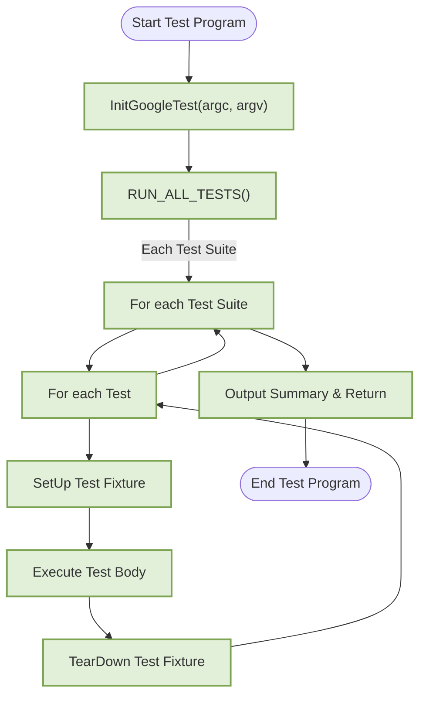

# Running and Interpreting Your Tests

Explore how to execute your GoogleTest tests from the command line, configure your test runs with filters and shuffling, control test order, and interpret the output. This guide also introduces the use of test runners to streamline your continuous integration workflows.

---

## 1. Overview of Running Tests

### What This Guide Helps You Accomplish
This guide empowers you to run your automated tests efficiently using GoogleTest's command-line interface. It explains how to launch tests, pinpoint subsets of tests to run, randomize execution order, and understand the detailed output you will see. Incorporating these techniques improves your development workflow and test reliability.

### Prerequisites
- Have GoogleTest installed and set up in your project environment.
- Write tests using `TEST()`, `TEST_F()`, or other macros with GoogleTest.
- Ensure your test binary is compiled and ready to execute.

### Expected Outcome
- Successfully run your tests from the command line.
- Use filters to select tests.
- Understand test output to diagnose failures.
- Apply options like test shuffling and repeat executions.
- Integrate tests into CI pipelines via test runners.

### Time to Complete
About 10-20 minutes to grasp commands and options.

### Difficulty Level
Beginner to intermediate—basic command line skills recommended.

---

## 2. Running Tests from the Command Line

GoogleTest test programs are executable binaries. Running these binaries initiates the test framework.

### Step 1: Basic Test Execution
- Open your terminal or command prompt.
- Run your compiled test executable directly:

```bash
./your_test_binary
```

**Expected Result:**
- The executable initializes GoogleTest (via `InitGoogleTest`) and runs all registered tests with `RUN_ALL_TESTS()`.
- You will see output detailing test progress and summary.

---

### Step 2: Using GoogleTest Command-Line Flags
GoogleTest supports multiple command-line flags to customize test execution. Some common flags include:

- `--gtest_filter=`: Run a subset of tests matching the glob pattern.
- `--gtest_repeat=`: Run all tests multiple times.
- `--gtest_shuffle`: Randomize the order tests are executed.
- `--gtest_random_seed=`: Specify the seed for shuffling tests.
- `--gtest_break_on_failure`: Break into the debugger on the first failure.

Example: Run only tests in the `FactorialTest` suite that have names starting with `Handles`:

```bash
./your_test_binary --gtest_filter=FactorialTest.Handles*
```

**Expected Result:**
- Only tests matching the filter run, reducing execution time when testing specific functionality.

---

### Step 3: Combine Flags for Advanced Runs
Example: Run all tests 5 times, shuffle their order, and save output to XML.

```bash
./your_test_binary --gtest_repeat=5 --gtest_shuffle --gtest_output=xml:results.xml
```

**Expected Result:**
- Test runs repeat 5 times with a new randomized order each time.
- Output saved to `results.xml` for further analysis or CI consumption.

---

## 3. Interpreting GoogleTest Output

GoogleTest provides detailed console output and summary results for understanding your test runs.

### Key Output Elements

- **Running main() from ...**
  Indicates initialization of the test program.

- **[ RUN      ] TestSuiteName.TestName**
  Marks the start of an individual test.

- **[       OK ] TestSuiteName.TestName (time ms)**
  Successful test completion.

- **[  FAILED  ] TestSuiteName.TestName (time ms)**
  Test failure indication.

- **Failure messages**
  When tests fail, you’ll see assertion failure details, including:
  - Source file and line.
  - Assertion expected vs. actual values.
  - Custom failure messages you provided.

- **Summary**
  Provides total tests run, passed, failed, disabled, and skipped.

### Example Output Snippet

```plaintext
Running main() from gtest_main.cc
[==========] Running 3 tests from 1 test suite.
[----------] Global test environment set-up.
[----------] 3 tests from FactorialTest
[ RUN      ] FactorialTest.HandlesZeroInput
[       OK ] FactorialTest.HandlesZeroInput (0 ms)
[ RUN      ] FactorialTest.HandlesPositiveInput
factorial_test.cc:25: Failure
Expected equality of these values:
  Factorial(3)
    Which is: 5
  6
[  FAILED  ] FactorialTest.HandlesPositiveInput (1 ms)
[ RUN      ] FactorialTest.HandlesNegativeInput
[       OK ] FactorialTest.HandlesNegativeInput (0 ms)
[----------] 3 tests from FactorialTest (1 ms total)
[----------] Global test environment tear-down
[==========] 3 tests from 1 test suite ran. (1 ms total)
[  PASSED  ] 2 tests.
[  FAILED  ] 1 test, listed below:
[  FAILED  ] FactorialTest.HandlesPositiveInput

 1 FAILED TEST
```

### Reading Failures
- The failure includes the file/line where the `EXPECT_EQ` or `ASSERT_EQ` failed.
- Values that did not match are shown for quick diagnosis.
- Tests continue by default - all failures reported at the end.

---

## 4. Controlling Test Runs

### Filtering Specific Tests
Use `--gtest_filter` to control exactly which tests run.

- **Syntax:** `--gtest_filter=<pattern>`
- `pattern` format: `PositivePatterns[-NegativePatterns]`
- Supports wildcards `*`, e.g., `FactorialTest.*` runs all tests in `FactorialTest`.

Examples:
```bash
./your_test_binary --gtest_filter=FactorialTest.HandlesZeroInput
./your_test_binary --gtest_filter=*Positive*
./your_test_binary --gtest_filter=* -FactorialTest.HandlesNegativeInput
```

### Shuffling Test Order
To randomize test execution and detect order-dependent failures:

```bash
./your_test_binary --gtest_shuffle
```

To reproduce a shuffled run, use the seed from output or specify your own:

```bash
./your_test_binary --gtest_shuffle --gtest_random_seed=12345
```

### Repeating Tests
Useful for detecting flaky tests:

```bash
./your_test_binary --gtest_repeat=10
```

Tests run 10 times, output details all executions.

### Running Disabled Tests
GoogleTest disables tests prefixed with `DISABLED_` by default. Run them explicitly:

```bash
./your_test_binary --gtest_also_run_disabled_tests
```

---

## 5. Using Test Runners and Continuous Integration

To incorporate tests into build pipelines or CI/CD systems, GoogleTest supports XML output and return codes.

### Automating Test Runs
- Use GoogleTest's exit code: `0` means all tests passed; `1` means failures.
- Check exit code programmatically to integrate with CI pass/fail criteria.

### Generating Machine-Readable Reports
- Output results as XML to integrate with CI systems:

```bash
./your_test_binary --gtest_output=xml:report.xml
```

- This report can be consumed by tools like Jenkins, TravisCI, GitHub Actions.

### Best Practices
- Combine `--gtest_output` with `--gtest_shuffle` and `--gtest_repeat` to catch flaky failures.
- Capture logs and outputs in CI jobs for post-run analysis.

---

## 6. Troubleshooting Common Issues

### Tests Not Running
- Make sure your test executable is correctly linked with GoogleTest.
- Confirm you haven’t accidentally filtered all tests with `--gtest_filter`.

### Tests Always Passing or Failing Unexpectedly
- Verify your assertions are correct with meaningful checks.
- Check if test fixtures are properly setting up and cleaning up.

### Output Is Too Verbose or Not Informative Enough
- Use `--gtest_brief` or control verbosity via GoogleMock flags if using mocks.

### Interpreting Spurious Failures
- Consider running with `--gtest_shuffle` and a fixed seed to detect order dependency.
- Use `--gtest_break_on_failure` with a debugger to diagnose failures immediately.

<Tip>
Remember to check the return value of your test runs: your program’s `main` should return `RUN_ALL_TESTS()` to signal pass/fail properly to any test runner or CI system.
</Tip>

---

## 7. Advanced Usage

### Writing a Custom Main Function
Usually, you do not need it, but if you customize test initialization:

```c++
int main(int argc, char **argv) {
  testing::InitGoogleTest(&argc, argv);
  return RUN_ALL_TESTS();
}
```

This initializes GoogleTest with command-line arguments and runs all tests.

### Platform-Specific Entry Points
Embedded platforms like Arduino override main with `setup()` and `loop()` functions.

### Understanding RUN_ALL_TESTS()
- Runs all registered tests.
- Returns zero on success, non-zero on failures.
- Should be called only once.

---

## 8. Additional Resources

- [GoogleTest Primer](https://github.com/google/googletest/blob/main/docs/primer.md) – Learn the basics of tests, assertions, and fixtures.
- [Assertions Guide](../guides/gtest-core-guides/using-assertions.md) – Deep dive into validating your code.
- [Running a Subset of Tests](https://github.com/google/googletest/blob/main/docs/advanced.md#running-a-subset-of-the-tests) – Filtering and selecting tests.
- [Integrating GoogleTest with CI](../guides/integration-and-best-practices/ci-and-test-runner-integration.md) – Automation strategies.

---

## Summary
This guide explained how to start test execution from your GoogleTest binaries, use filters and shuffling to control your test runs, interpret output effectively to troubleshoot failures, and integrate your tests into automated workflows. Mastering these practices will boost your confidence in test results and accelerate debugging.

---

## Quick Reference of Useful Command Line Flags

| Flag                              | Purpose                                        |
|----------------------------------|------------------------------------------------|
| `--gtest_filter=`                 | Run tests matching the glob pattern             |
| `--gtest_repeat=`                 | Repeat entire test suite N times                 |
| `--gtest_shuffle`                 | Randomize test execution order                   |
| `--gtest_random_seed=`            | Set seed for shuffling tests                      |
| `--gtest_break_on_failure`        | Break into debugger on first failure             |
| `--gtest_output=xml:<file>`       | Save test results to XML file                      |
| `--gtest_also_run_disabled_tests` | Run tests marked as disabled                      |

---

If you run into issues or want to deepen your understanding, refer to [Troubleshooting Setup Issues](../getting-started/first-run-validation/troubleshooting-setup.md) and the [GoogleTest Primer](../docs/primer.md).

---

## Code Example: Basic Test Runner Main()

```c++
#include <gtest/gtest.h>

int main(int argc, char **argv) {
  testing::InitGoogleTest(&argc, argv);  // Parses arguments and sets up.
  return RUN_ALL_TESTS();  // Executes all tests and returns result.
}
```

This minimal main function runs your tests with GoogleTest’s default runner and output.

---

## Troubleshooting Section

<AccordionGroup title="Troubleshooting Common Test Run Issues">
<Accordion title="Test binary does not execute or returns immediately">
Verify that your test program is linked with GoogleTest libraries (either `gtest` or `gtest_main`). If you use `gtest_main`, no main function is needed.
</Accordion>
<Accordion title="Tests never run or are skipped unexpectedly">
Check filters passed with `--gtest_filter` are correct. Ensure you do not accidentally exclude all tests.
</Accordion>
<Accordion title="Too much output or hard to read failures">
Use `--gtest_brief` to minimize output, or run with verbosity flags for gMock if mocks are used.
</Accordion>
<Accordion title="Tests run in a different order than expected">
Use `--gtest_shuffle` for random order; use `--gtest_random_seed` with a known seed to reproduce order-dependent failures.
</Accordion>
<Accordion title="Run failed but exit code is 0">
Confirm your `main()` function returns `RUN_ALL_TESTS()` result exactly.
</Accordion>
</AccordionGroup>

---

## Next Steps & Related Guides

- **Writing and Organizing Tests**: Improve your test design with suites and fixtures.
- **Using Assertions for Effective Validation**: Master assert macros to catch bugs early.
- **Integrating with CI & Test Runners**: Automate your test execution in build pipelines.
- **Working with Parameterized Tests**: Scale tests parametrically with `TEST_P` and `INSTANTIATE_TEST_SUITE_P`.

Explore these next to streamline development and get the most from GoogleTest.

---

# Source Code Reference

GoogleTest provides a pre-built main function in the `gtest_main` library to simplify running tests. For custom behavior, you can implement your own main function using `testing::InitGoogleTest()` and `RUN_ALL_TESTS()` as illustrated above.

Here is a reference snippet from the source file `googletest/src/gtest_main.cc` demonstrating the default main function implementation:

```c++
GTEST_API_ int main(int argc, char **argv) {
  printf("Running main() from gtest_main.cc\n");
  testing::InitGoogleTest(&argc, argv);
  return RUN_ALL_TESTS();
}
```

This confirms the standard pattern for launching your tests.

---

# Diagram: Test Execution Flow



This flowchart reflects the lifecycle of running tests and producing output, aligned with GoogleTest's execution model.
