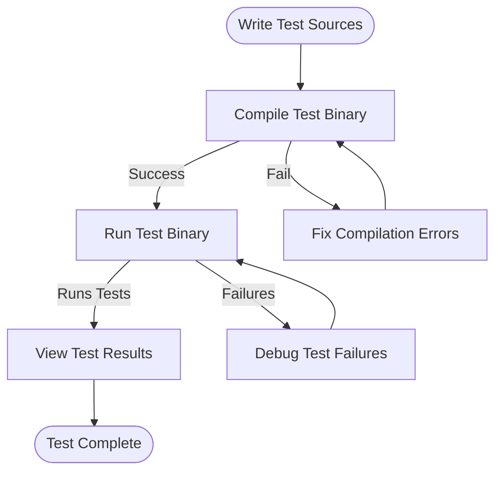

# Writing and Running Your First Test

## Overview

Welcome to your first practical step with GoogleTest! This guide walks you through creating your initial test case using GoogleTest macros, compiling your test binary, and running tests with common configuration options. You will learn how to author basic tests, organize them into test suites, compile your test executable, and interpret the results on execution.

By the end of this guide, you will confidently write and run your first GoogleTest tests, establishing a foundation for building reliable C++ testing workflows.

---

## Prerequisites

- A C++17 compatible compiler setup.
- GoogleTest source code cloned or installed.
- Basic familiarity with C++ syntax.
- Build system configured to include GoogleTest sources and headers or installed GoogleTest libraries.

Consider reviewing the [GoogleTest Primer](https://github.com/google/googletest/blob/main/docs/primer.md) if you're new to test writing.

---

## Expected Outcome

You will achieve:

- Creating test cases with `TEST()` and understanding test suites.
- Building your test binary incorporating GoogleTest.
- Running your test binary to execute tests and view results.
- Using key GoogleTest macros effectively.
- Interpreting test output including successes, failures, and filtered runs.

---

## Time Estimate

Approximately 15-30 minutes, depending on familiarity with C++ and build tools.

---

## Difficulty Level

Beginner-friendly, designed for first-time users ready to write and run tests.

---

## Step-by-Step Guide

<Steps>
<Step title="Create a Basic Test Case">
Write a test using the `TEST()` macro:

```cpp
#include <gtest/gtest.h>

// Define a simple factorial function for testing.
int Factorial(int n) {
  if (n <= 1) return 1;
  return n * Factorial(n - 1);
}

// Test suite named FactorialTest with test HandlesZeroInput.
TEST(FactorialTest, HandlesZeroInput) {
  EXPECT_EQ(Factorial(0), 1);
}

// Another test in the same suite.
TEST(FactorialTest, HandlesPositiveInput) {
  EXPECT_EQ(Factorial(1), 1);
  EXPECT_EQ(Factorial(3), 6);
  EXPECT_EQ(Factorial(5), 120);
}
```

**Expected result:** Successfully defining two tests in the `FactorialTest` suite.
</Step>

<Step title="Compile the Test Binary">

You must compile your test source file with GoogleTest sources and headers.

- Using CMake: Refer to [Integrating with Your Build System](https://github.com/google/googletest/blob/main/docs/integration-build-systems.md) for example CMakeLists.
- Manually with g++:

```bash
g++ -std=c++17 -isystem /path/to/googletest/include -pthread \
    factorial_test.cpp /path/to/libgtest.a -o factorial_test
```

- If you use `gtest_main`, you can link with `-lgtest_main` to get a built-in `main()`.

**Expected result:** An executable test binary (`factorial_test`) is produced.

</Step>

<Step title="Run Your Tests">

Run the test binary:

```bash
./factorial_test
```

The output should print a summary similar to:

```none
[==========] Running 2 tests from 1 test suite.
[----------] Global test environment set-up.
[----------] 2 tests from FactorialTest
[ RUN      ] FactorialTest.HandlesZeroInput
[       OK ] FactorialTest.HandlesZeroInput (0 ms)
[ RUN      ] FactorialTest.HandlesPositiveInput
[       OK ] FactorialTest.HandlesPositiveInput (0 ms)
[----------] 2 tests from FactorialTest (0 ms total)

[----------] Global test environment tear-down
[==========] 2 tests from 1 test suite ran. (0 ms total)
[  PASSED  ] 2 tests.
```

**Expected result:** Both tests run and succeed, with no failures reported.

</Step>

<Step title="Interpret Test Output">

- Lines starting with `[ RUN      ]` indicate a test starting.
- Lines starting with `[       OK ]` indicate success.
- Lines with `[  FAILED  ]` indicate failures.
- The summary shows total tests run and count of passed/failed.

Failures include file and line number details to aid debugging.

</Step>

<Step title="Using Assertion Macros">

- Use `EXPECT_*` macros for non-fatal checks that allow tests to continue.
- Use `ASSERT_*` macros for fatal checks that abort the current test on failure.

Example:

```cpp
TEST(MyTestSuite, Example) {
  int x = 5;
  EXPECT_EQ(x, 5);  // Non-fatal, test continues
  ASSERT_GT(x, 0);  // Fatal, aborts test if fails
}
```

Choose `EXPECT_*` for validation with multiple checks, `ASSERT_*` for required conditions.

</Step>

<Step title="Test Fixtures (Optional Next Step)">

When multiple tests share setup or common data, define a test fixture class derived from `testing::Test`:

```cpp
class QueueTest : public testing::Test {
protected:
  void SetUp() override {
    // Initialize shared test data.
  }

  void TearDown() override {
    // Clean up.
  }

  Queue<int> q_;
};

TEST_F(QueueTest, EnqueueTest) {
  q_.Enqueue(1);
  EXPECT_EQ(q_.size(), 1);
}
```

Use `TEST_F` with fixtures to benefit from setup/teardown and shared test context.

</Step>

</Steps>

---

## Best Practices

- Group logically related tests in the same test suite for clarity.
- Use meaningful and consistent naming for test suites and tests, avoiding underscores.
- Prefer `EXPECT_*` over `ASSERT_*` unless subsequent steps depend on the assertion succeeding.
- Keep each test focused on one behavior or scenario.
- Use fixtures to reduce duplication and manage state.
- Disable flaky or broken tests temporarily with the `DISABLED_` prefix.
- Run tests frequently to catch regressions early.

---

## Common Pitfalls

- Forgetting to call `testing::InitGoogleTest(&argc, argv);` in `main()`. Without it, flags and test registration won’t work correctly.
- Calling `RUN_ALL_TESTS()` more than once.
- Not linking against GoogleTest libraries or including headers properly.
- Using `ASSERT_*` in constructors or destructors (these may fail to abort test execution properly).
- Ignoring return value of `RUN_ALL_TESTS()`, which should be returned by `main()`.

---

## Troubleshooting

- **Test binary won't compile or link:** Verify include paths and libraries for GoogleTest are correctly set.
- **No tests run or “no tests found”:** Ensure tests have valid names without underscores, are linked in, and filters are not excluding all tests.
- **Tests fail unexpectedly:** Check assertions and test setups. Use `--gtest_list_tests` to verify which tests are registered.
- **Output too verbose or colored output not ideal:** Experiment with flags like `--gtest_color=auto|yes|no` or `--gtest_brief=1`.

---

## Running Tests with Flags

Run your test binary with these useful flags:

- `--gtest_list_tests`: Lists all discovered tests without running them.
- `--gtest_filter=TestSuiteName.TestName`: Run a specific test or subset.
- `--gtest_repeat=N`: Repeat tests N times to detect flakiness.
- `--gtest_break_on_failure`: Stops test execution immediately on failure; useful for debugging.
- `--gtest_also_run_disabled_tests`: Runs tests prefixed with `DISABLED_`.

Example:

```bash
./factorial_test --gtest_filter=FactorialTest.HandlesZeroInput
```

---

## Example: Complete Minimal Test Program

```cpp
#include <gtest/gtest.h>

int Square(int x) { return x * x; }

TEST(SquareTest, PositiveNos) {
  EXPECT_EQ(Square(1), 1);
  EXPECT_EQ(Square(2), 4);
  EXPECT_EQ(Square(3), 9);
}

TEST(SquareTest, ZeroAndNegative) {
  EXPECT_EQ(Square(0), 0);
  EXPECT_EQ(Square(-1), 1);
  EXPECT_EQ(Square(-2), 4);
}

int main(int argc, char **argv) {
  testing::InitGoogleTest(&argc, argv);
  return RUN_ALL_TESTS();
}
```

Compile and run this program to see GoogleTest in action.

---

## Next Steps & Related Content

- Explore [Essential Assertions and How to Use Them](../guides/gtest-core-workflows/using-assertions.md) to understand all assertion types.
- Learn about [Test Fixtures](https://github.com/google/googletest/blob/main/docs/primer.md#test-fixtures-using-the-same-data-configuration-for-multiple-tests) for effective test reuse.
- See the [GoogleTest Primer](https://github.com/google/googletest/blob/main/docs/primer.md) for a deeper foundational understanding.
- Follow up with guides on [Parameterized and Typed Tests](../guides/gtest-core-workflows/parameterized-testing.md) to scale testing across multiple inputs and types.
- Refer to the [Quick Setup Validation](../../getting-started/first-steps-validation/validate-setup.md) if your tests aren’t running as expected.

---

## References

- [GoogleTest Primer](https://github.com/google/googletest/blob/main/docs/primer.md)
- [GoogleTest Samples](https://github.com/google/googletest/blob/main/googletest/samples)
- [Installation and Integration Guide](../../getting-started/prerequisites-installation/integration-build-systems.md)
- [Test Macros and Fixtures Reference](../../api_reference/core_testing_framework/test_macros_and_fixtures.md)
- [Running and Filtering Tests](../../docs/advanced.md#running-test-programs-advanced-options)

---

### Diagram: Basic Test Workflow



This flow illustrates the user journey from writing test code to running and interpreting results, looping back on errors.

---

Enjoy your testing journey! Writing and running your first tests is the gateway to building robust and maintainable C++ software with GoogleTest.
