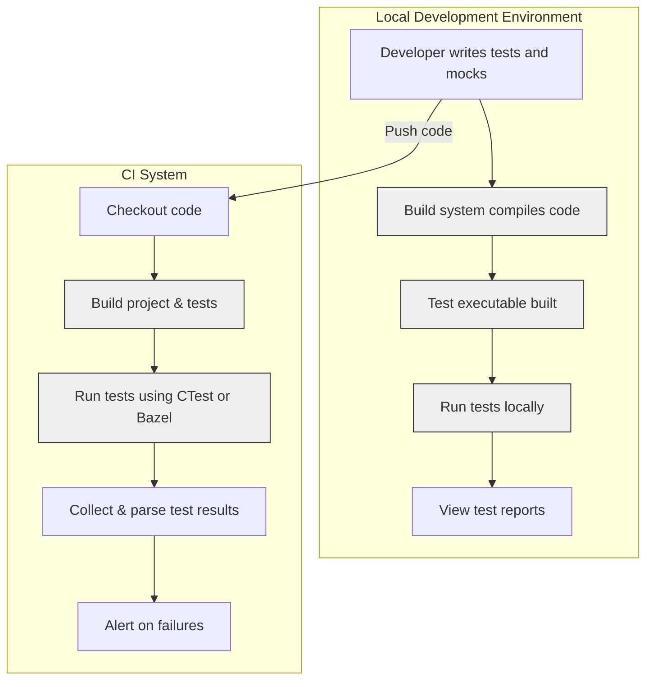

# Integrating with Build Systems and CI

## Overview

This guide explains how to incorporate GoogleTest and GoogleMock into your build environment and continuous integration (CI) workflows. Whether you use CMake or Bazel as your build system, you will learn how to properly link GoogleTest and GoogleMock, configure builds, and automate test execution to enable smooth and scalable development processes.

---

## Prerequisites

Before beginning integration:

- Your project should have a working C++ build environment compatible with your platform.
- GoogleTest and GoogleMock must be available in your development environment, either installed system-wide, pulled via a package manager, or as a submodule/third-party dependency in your project repository.
- Familiarity with your build system (CMake or Bazel) is helpful for customizing your build scripts.

---

## Integrating GoogleTest and GoogleMock with CMake

### 1. Find and Link GoogleTest Libraries

Use CMake's `find_package` or manually specify GoogleTest and GoogleMock locations.

**Example with `find_package`:**
```cmake
find_package(GTest REQUIRED)

add_executable(my_test_executable test_main.cpp my_tests.cpp)
target_link_libraries(my_test_executable GTest::gtest GTest::gmock GTest::pthread)
```

- Ensure you link both **gtest** and **gmock** libraries.
- On POSIX systems, also link pthreads explicitly if necessary.


### 2. Include GoogleTest Headers

Add the GoogleTest include directories to your test target:

```cmake
target_include_directories(my_test_executable PRIVATE ${GTEST_INCLUDE_DIRS})
```

Though modern CMake `find_package` usually handles this via imported targets.


### 3. Adding Test Cases and Enabling Testing

Enable CTest and register your test executable:

```cmake
enable_testing()
add_test(NAME MyTests COMMAND my_test_executable)
```

This configures CTest to run your tests.


### 4. Writing Tests and Linking Mocks

- Write tests using `TEST()`, `TEST_F()`, and mock objects defined using `MOCK_METHOD`.
- Make sure your mocks and tests are compiled and linked with your test executable.


### 5. Building and Running Tests with CMake

Build your tests:
```bash
cmake --build . --target my_test_executable
```

Run tests via CTest:
```bash
ctest --verbose
```

Or run the executables directly.


### Tips and Best Practices

- Use `gtest_main` or `gmock_main` libraries to avoid writing a custom `main()` function.
- Structure your tests and mocks in separate directories or libraries for clarity.
- Cache GoogleTest as a submodule or external project for reproducible builds.
- Manage dependencies so that GoogleMock (which depends on GoogleTest) is linked correctly.

---

## Integrating with Bazel

### 1. Use Official GoogleTest and GoogleMock Rules

GoogleTest and GoogleMock are included as dependencies in Bazel's ecosystem. Include them in your `WORKSPACE` and `BUILD` files.

**In WORKSPACE:**
Declare repository rules to import googletest and googlemock.

**In BUILD files:**
Define test targets linking against `@com_google_googletest//:gmock` and `@com_google_googletest//:gtest`.

Example:
```python
cc_test(
    name = "my_test",
    srcs = ["mytest.cc"],
    deps = [
        "@com_google_googletest//:gmock",
        "@com_google_googletest//:gtest",
    ],
)
```


### 2. Writing Tests in Bazel

- Your test sources should #include `<gtest/gtest.h>` and `<gmock/gmock.h>`.
- Define mocks, expectations and tests as you would in plain code.


### 3. Running Tests and Analyzing Output

To run tests:
```bash
bazel test //path/to:my_test
```

Bazel will build dependencies and execute tests, reporting pass/fail status and output.


### 4. Setting Test Flags

You can pass flags to tests for verbose logging or filtering, e.g.,
```bash
bazel test //path/to:my_test --test_arg=--gmock_verbose=info
```

---

## Continuous Integration (CI) Automation

### 1. Running Tests Automatically

Configure your CI (e.g., Jenkins, GitHub Actions, GitLab CI, or others) to:

- Build your project with the tests enabled
- Execute your GoogleTest test binaries or Bazel test targets
- Collect and analyze test output


### 2. Handling Test Outputs

- Use CTest's XML output (`ctest -T Test --output-junit`) for parsing in CI systems.
- Bazel generates test logs and XML summaries (`bazel test --test_output=all`) that CI can collect.
- Configure your CI to fail a build on test failures and notify appropriately.


### 3. Controlling Verbosity and Debugging

- Use GoogleMock's verbosity flag `--gmock_verbose=info|warning|error` to adjust logging level.
- Use `--gtest_filter` to run subsets of tests as needed for faster iteration in CI.


### 4. Best Practices for CI Integration

- Run tests in isolated environments to ensure consistency.
- Cache GoogleTest dependencies or prebuilt binaries to speed up builds.
- Regularly update and pin GoogleTest and GoogleMock versions used.
- Monitor flaky tests and treat them promptly to maintain CI reliability.

---

## Troubleshooting Build and Integration Issues

### Linking Errors

- Verify you link against both `gtest` and `gmock` libraries.
- Ensure your compiler and linker flags reflect include directories and dependencies.
- Check for mismatches in runtime libraries when compiling GoogleMock and your code.

### Missing Header or Symbols

- Confirm the GoogleTest/GoogleMock headers are found by your compiler.
- Check whether you are including `gmock.h` and `gtest.h` correctly.

### Test Not Running or Not Found

- Ensure tests are registered properly with CTest or Bazel.
- Make sure your `main()` function is linked or use `gtest_main`/`gmock_main` to generate one.


### Verbose Mock Call Tracing

- Use `--gmock_verbose=info` to trace mock function calls and understand failures.
- When unexpected behavior occurs, this flag reveals call matching and reasons for failures.


<Info>
Proper integration depends on careful setup of your build system and CI environment. The official GoogleTest and GoogleMock repositories contain example configurations and best practices worth reviewing.
</Info>

---

## Resources and Further Reading

- [GoogleTest Primer](https://github.com/google/googletest/blob/main/docs/primer.md) — foundational understanding of GoogleTest.
- [gMock Cookbook](https://github.com/google/googletest/blob/main/docs/gmock_cook_book.md) — advanced mock usage.
- [Mocking Reference](https://github.com/google/googletest/blob/main/docs/reference/mocking.md) — detailed API specs.
- [gMock Cheat Sheet](https://github.com/google/googletest/blob/main/docs/gmock_cheat_sheet.md) — quick references.
- [CMake Integration Guide](https://cmake.org/cmake/help/latest/module/GoogleTest.html) — official CMake module for GoogleTest.
- Bazel official documentation for testing.

For assistance with build or test issues, consult the [Troubleshooting Common Setup Issues](https://github.com/google/googletest/blob/main/docs/first-run-validation/troubleshooting-common-issues.md) guide.

---

## Summary Diagram: Typical Build and CI Integration Workflow



---

# Appendix

### Using GoogleMock and Build Flags

- GoogleMock functionality is enabled by including `gmock/gmock.h`.
- The `--gmock_verbose` command line flag controls mocking message verbosity.
- When compiling, link `libgmock` and `libgmock_main` (if you want a main function included).

### Reference: Link Libraries in CMake

```cmake
target_link_libraries(my_test PRIVATE gmock gmock_main pthread)
```

### Reference: Bazel Dependencies

```python
cc_test(
    name = "my_test",
    srcs = ["my_test.cc"],
    deps = ["@com_google_googletest//:gmock_main"],
)
```

This links both gmock and gtest with a main function.


---