# Integrating with Build Systems

Best practices for integrating GoogleTest and GoogleMock into popular build systems, such as Bazel and CMake, with troubleshooting for common integration challenges.

---

## Overview

This guide walks you through the practical steps and considerations for integrating GoogleTest and GoogleMock into your existing build environments. We focus explicitly on the two most commonly used build systems in the community — Bazel and CMake — highlighting best practices, integration strategies, and common pitfalls to help you achieve seamless testing workflows.

### Prerequisites

- You have a working C++ development environment.
- You have installed GoogleTest and GoogleMock source code or are using them via package managers.
- Basic familiarity with Bazel or CMake build system syntax and workflow.

### Expected Outcome

By the end of this guide, you will have successfully integrated GoogleTest and GoogleMock into your build system, enabled compiling and running unit tests, and gained troubleshooting strategies to resolve typical integration problems.

### Time Estimate

Integration typically takes between 15 to 45 minutes, depending on your experience with the build system and project complexity.

### Difficulty Level

Intermediate: Understanding of build systems recommended.

---

## 1. Integrating GoogleTest and GoogleMock with Bazel

Bazel offers robust support for C++ builds, and integrating GoogleTest/GoogleMock follows a clear pattern that aligns well with Bazel’s modular approach.

### Step 1: Add the googletest repository to your Bazel WORKSPACE

Include the following external repository definition to fetch GoogleTest and GoogleMock:

```python
http_archive(
    name = "com_google_googletest",
    urls = ["https://github.com/google/googletest/archive/release-1.14.0.zip"],
    strip_prefix = "googletest-release-1.14.0",  # Update version as needed
)
```

### Step 2: Declare googletest and googlemock dependencies in BUILD files

In your project's `BUILD` files, add dependencies where you specify test targets:

```python
cc_test(
    name = "my_test",
    srcs = ["my_test.cc"],
    deps = [
        "@com_google_googletest//googletest",
        "@com_google_googletest//googlemock",
        # Other dependencies
    ],
)
```

This configuration ensures your test code can find the GoogleTest and GoogleMock headers and libraries.

### Step 3: Run tests with Bazel

Run your tests via:

```
bazel test //path/to:my_test
```

This will build your tests with GoogleTest/GoogleMock linked and run them with automated test discovery.

### Best Practices for Bazel

- Use the official GoogleTest Bazel rules to avoid manual upkeep.
- Use `http_archive` with version pinning for reproducible builds.
- Organize your tests as `cc_test` targets for test discoverability.

### Troubleshooting Common Bazel Integration Challenges

- **Header not found errors:** Confirm the repository path and target labels are correct.
- **Linker errors on symbols:** Check you depend on both `googletest` and `googlemock` libraries.
- **Multiple versions conflict:** Verify that no other dependencies bring conflicting googletest versions.

<Note>
If you have custom Bazel toolchains or intricate dependency trees, carefully inspect build files to ensure consistent GoogleTest versions.
</Note>

---

## 2. Integrating GoogleTest and GoogleMock with CMake

Despite not being maintained internally by Google for CMake, GoogleTest's CMake scripts work well with standard C++ projects.

### Step 1: Locate or acquire GoogleTest and GoogleMock source

You can clone the repository or use `FetchContent` to include it during build configuration:

```cmake
include(FetchContent)
FetchContent_Declare(
  googletest
  GIT_REPOSITORY https://github.com/google/googletest.git
  GIT_TAG release-1.14.0  # Specify the desired version
)
FetchContent_MakeAvailable(googletest)
```

### Step 2: Add GoogleTest and GoogleMock as subdirectories

If you have the source locally, add:

```cmake
add_subdirectory(path/to/googletest)
add_subdirectory(path/to/googlemock)
```

This builds GoogleTest and GoogleMock libraries and makes the targets available.

### Step 3: Link your test targets against GoogleTest/GoogleMock

Link your executable or test targets to `gtest`, `gtest_main`, `gmock`, or `gmock_main`. Examples:

```cmake
target_link_libraries(my_test PRIVATE gtest gmock)
```

Or for convenience with a main function:

```cmake
target_link_libraries(my_test PRIVATE gtest_main gmock_main)
```

### Step 4: Enable test execution and discovery

Add the following to enable CTest support and discover tests defined by GoogleTest:

```cmake
enable_testing()
add_test(NAME my_test COMMAND my_test)
```

### Step 5: Build and run tests

Build with

```
cmake --build .
ctest
```

or run the test executable directly.

### CMake Build Options for GoogleMock

- `gmock_build_tests` (default OFF): Builds GoogleMock's internal tests.
- `BUILD_SHARED_LIBS` (default OFF): Choose between static or shared GoogleMock/GoogleTest libraries.

You can configure these via:

```
cmake .. -Dgmock_build_tests=ON -DBUILD_SHARED_LIBS=ON
```

### Common Integration Pitfalls with CMake

- Make sure CMake minimum version is >= 3.13 for compatibility.
- Use the `FetchContent` module to fetch GoogleTest releases reliably.
- Ensure `gmock` depends on and links correctly with `gtest`.
- Use imported targets (`gtest::gtest`, etc.) when available for more modern CMake style.

### Practical Example CMakeLists.txt Snippet

```cmake
cmake_minimum_required(VERSION 3.15)
project(MyProject CXX)

set(CMAKE_CXX_STANDARD 17)
set(CMAKE_CXX_STANDARD_REQUIRED ON)

include(FetchContent)
FetchContent_Declare(
  googletest
  GIT_REPOSITORY https://github.com/google/googletest.git
  GIT_TAG release-1.14.0
)
FetchContent_MakeAvailable(googletest)

add_executable(my_test my_test.cc)

target_link_libraries(my_test PRIVATE gtest_main gmock_main)

enable_testing()
add_test(NAME my_test COMMAND my_test)
```

---

## 3. Best Practices Across Build Systems

- Pin GoogleTest/GoogleMock versions explicitly to ensure build reproducibility.
- Prefer using build system-native ways to include GoogleTest/GoogleMock (bazel external repos, CMake FetchContent).
- Isolate test binaries and dependencies using dedicated build targets.
- Use `gmock_main`/`gtest_main` libraries for convenience to provide main() functionality.
- For complex projects, keep GoogleTest/GoogleMock integration code isolated in a dedicated directory or BUILD file.

<Warning>
Avoid mixing multiple GoogleTest versions or conflicting dependencies in your build tree.
</Warning>

---

## 4. Troubleshooting Common Integration Issues

| Issue                                      | Cause                                     | Solution                                                                            |
| ------------------------------------------| -----------------------------------------|-------------------------------------------------------------------------------------|
| **Header not found**                       | Wrong include paths or repository label  | Verify repository paths and target includes; ensure headers are included in targets |
| **Linker errors (undefined references)**  | Missing link dependency on gtest or gmock | Add gtest/gmock to target_link_libraries or deps in Bazel                          |
| **Tests do not run or discover tests**    | Missing `enable_testing()` or misconfigured test executable | Add `enable_testing()` (CMake), declare `cc_test` properly (Bazel)                 |
| **Conflicting libraries or multiple versions** | Multiple googletest/git external repos   | Pin a single version and migrate dependencies to use it consistently                |
| **Incompatible compiler versions**       | Older C++ compilers                        | Upgrade to C++17 compatible compilers; ensure minimum versions for Bazel/CMake      |

### Recommended Debugging Steps

1. Check build logs for header or symbol errors.
2. Review BUILD or CMakeLists.txt for missing dependencies.
3. Confirm versions of GoogleTest/GoogleMock are consistent.
4. Run tests with verbose logging enabled to catch misconfigurations.

<Info>
See related troubleshooting guides for setup issues at `/getting-started/troubleshooting-resources/troubleshooting-common-issues`.
</Info>

---

## 5. Next Steps & Additional Resources

- After integrating, proceed to writing and running your first tests: [Writing Your First Test](/guides/getting-started/writing-first-test).
- Explore mocking capabilities and advanced usage: [Introducing GoogleMock](/guides/getting-started/googlemock-intro), [Mocking Complex Scenarios](/guides/core-workflows/mocking-scenarios).
- For automation and CI, see [Test Automation and CI Tips](/guides/integration-advanced/test-automation).
- Consult the API reference for detailed use of mock definitions and expectations: [Mocking Reference](/docs/reference/mocking.md).

---

## Summary Diagram: Integration Workflow

```mermaid
flowchart TD

  subgraph Bazel Integration
    B1[Add googletest repository to WORKSPACE]
    B2[Declare googletest and googlemock deps in BUILD files]
    B3[Write cc_test targets for unit tests]
    B4[Run tests with bazel test]
  end

  subgraph CMake Integration
    C1[Fetch or clone googletest source]
    C2[Add_subdirectory googletest and googlemock]
    C3[Link test targets with gtest/gmock libraries]
    C4[Enable testing and add tests]
    C5[Build and run tests with cmake and ctest]
  end

  B1 --> B2 --> B3 --> B4
  C1 --> C2 --> C3 --> C4 --> C5

  style B1 fill:#D6EAF8,stroke:#3498DB,stroke-width:1px
  style C1 fill:#D5F5E3,stroke:#28B463,stroke-width:1px
```



---

# Appendices

### Example CMakeLists.txt Fragment for GoogleMock

```cmake
cmake_minimum_required(VERSION 3.13)
project(gmock_project CXX)

# Add GoogleMock and GoogleTest
add_subdirectory(googletest)
add_subdirectory(googlemock)

add_executable(my_mock_test my_mock_test.cc)
# Link against gmock_main to get main() provided
target_link_libraries(my_mock_test PRIVATE gmock_main)

enable_testing()
add_test(NAME my_mock_test COMMAND my_mock_test)
```

### Common Bazel BUILD Snippet for GoogleMock Tests

```python
cc_test(
    name = "foo_test",
    srcs = ["foo_test.cc"],
    deps = [
        "@com_google_googletest//googlemock",
        "@com_google_googletest//googletest",
        ...
    ],
)
```

<Check>
Running `bazel test` or `ctest` after integration verifies your test suite runs as expected.
</Check>

---

## Summary

This guide detailed how to integrate GoogleTest and GoogleMock into popular build systems Bazel and CMake. It provided stepwise actions, best practices, and troubleshooting to ensure users can compile, link, and run their tests smoothly within these environments.

For additional guidance, users are directed to related first-use guides, mocking tutorials, and API references.

---

# End of Guide
