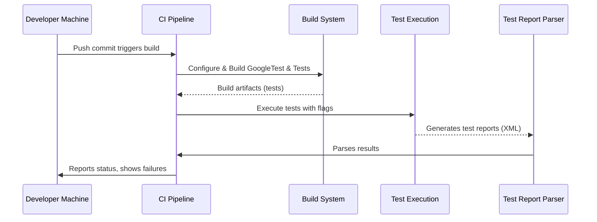

# Cross-Platform and CI Integration

## Overview

This guide equips developers to seamlessly run GoogleTest and GoogleMock tests across diverse platforms and Continuous Integration (CI) environments. It addresses platform-specific considerations, supported compilers, environment setups, and best practices to ensure robust and efficient test execution in automated pipelines.

By following this guide, users will understand how to adapt their test configuration and build setup to various operating systems and CI infrastructures, enabling reliable and reproducible testing both locally and in production CI pipelines.

---

## Prerequisites

- A C++17-compatible compiler installed and configured for your platform.
- GoogleTest and GoogleMock source code or installed libraries ready for integration.
- Basic knowledge of your project’s build system (e.g., CMake, Bazel).
- Access to your CI pipeline configuration or infrastructure to add test execution steps.

---

## Supported Platforms and Environments

GoogleTest supports a broad range of platforms according to [Google's Foundational C++ Support Policy](https://opensource.google/documentation/policies/cplusplus-support). Supported platforms include:

- **Linux** (multiple distributions, including Android)
- **Windows** (Desktop, MinGW)
- **Mac OS X** and **iOS**
- BSD variants (FreeBSD, NetBSD, OpenBSD)
- Other Unix-like platforms (AIX, Solaris, etc.)

### Key Platform Notes

- Some mobile and embedded platforms have reduced support, especially regarding features like stream redirection and death tests.
- GoogleTest automatically detects platform capabilities and configures conditional features such as pthreads usage, exceptions, and RTTI support accordingly.

---

## Supported Compilers

GoogleTest requires a compiler supporting **C++17**. Supported compilers include:

- Microsoft Visual Studio 2017 and newer (MSVC 19.11+)
- GCC 7.0 or newer
- Clang 3.4.1 or newer
- Intel LLVM Compiler

Make sure your compiler version meets the minimum standards. When using Visual Studio, configure appropriate runtime linkage as described in the build setup to avoid common errors.

---

## Building and Configuring for Cross-Platform and CI

### CMake Build Configuration

GoogleTest includes a sophisticated CMake build setup that applies platform-specific compiler and linker flags:

1. **Compiler flags** are adjusted based on platform and compiler to maximize compatibility, including handling Windows CRT linkage.
2. **Pthread detection** is automatic unless disabled; on MinGW, Windows native threading primitives are used.
3. Libraries like `gtest` and `gtest_main` are available as targets you can link against.

#### Example: Fetching and Using GoogleTest in Your CMake Project

```cmake
include(FetchContent)
FetchContent_Declare(
  googletest
  URL https://github.com/google/googletest/archive/refs/tags/release-1.17.0.zip
)
set(gtest_force_shared_crt ON CACHE BOOL "" FORCE)  # For MSVC dynamic CRT linkage
FetchContent_MakeAvailable(googletest)

add_executable(MyTests test/my_tests.cpp)
target_link_libraries(MyTests GTest::gtest_main)
add_test(NAME MyTests COMMAND MyTests)
```

This approach ensures consistent compiler/linker settings across platforms and avoids common incompatibility issues, critical for CI builds.

### Handling Runtime Linkage on Windows

By default, Visual Studio projects link against the dynamic C runtime (CRT), but GoogleTest defaults to static linkage. This mismatch can cause linker errors such as `LNK2038` errors for runtime library conflicts. 

- Use the CMake option `gtest_force_shared_crt` set to `ON` to instruct GoogleTest to link dynamically to match your project settings.

### Threading and Platform Considerations

- GoogleTest uses pthreads on POSIX platforms where available.
- On Windows (excluding MinGW), GoogleTest uses Windows threading primitives.
- On MinGW, pthreads are not supported, and GoogleTest disables pthread-specific flags.

This ensures thread safety where supported and avoids build/runtime failures on platforms without pthread support.

### Cross-Platform Flags and Behavior Detection

GoogleTest internally defines macros to configure itself per environment:

- `GTEST_HAS_PTHREAD` — whether pthreads are available.
- `GTEST_HAS_EXCEPTIONS` — whether exceptions are enabled.
- `GTEST_HAS_RTTI` — whether Run-Time Type Information (RTTI) is enabled.
- `GTEST_HAS_STREAM_REDIRECTION` — platform support for stream capturing.
- `GTEST_HAS_DEATH_TEST` — availability of death tests (process crashing tests).

These macros influence test capabilities and behavior and require no manual setup in typical cases.

---

## Running Tests in CI Pipelines

To integrate GoogleTest/GoogleMock tests into your CI workflow reliably:

1. **Ensure reproducible build environment:** Use Docker containers or controlled build machines to minimize platform discrepancies.
2. **Install dependencies consistently:** This includes C++ compilers, CMake (3.14+ recommended), and any platform-specific tools.
3. **Build GoogleTest consistently:** Prefer building as part of your main build or use pre-built binaries tuned for your platform.
4. **Invoke tests with appropriate flags:** Use `ctest` or direct test binary invocation.

#### Example Test Invocation in CI

```bash
./my_tests --gtest_output=xml:report.xml
```

This outputs an XML report compatible with many CI systems (e.g., Jenkins, GitLab CI, GitHub Actions).

5. **Collect and publish test reports:** Configure your CI to parse these XML reports for test results reporting and failure notifications.

---

## Best Practices for Smooth Cross-Platform Testing

- Use the latest stable GoogleTest release that matches your environment needs.
- Consistently target C++17 and confirm compiler support.
- Use CMake’s `FetchContent` or `add_subdirectory` for seamless source-level integration.
- On Windows, explicitly set dynamic vs static CRT linkage flags to avoid mismatches.
- Avoid making assumptions about platform-specific features; test and conditionally compile when necessary.
- Leverage GoogleTest’s built-in macros and flags to adapt behavior (e.g., disable death tests on unsupported platforms).

---

## Troubleshooting Common CI and Platform Issues

<AccordionGroup title="Common Issues and Resolutions">
<Accordion title="Linker Errors on Windows Related to CRT Mismatches">
When seeing errors like `LNK2038: mismatch detected for 'RuntimeLibrary'`, verify your build flags:

- Set the CMake option `gtest_force_shared_crt` to `ON` if your project uses dynamic CRT.
- Ensure all dependent libraries and GoogleTest are linked with consistent CRT settings.
- Rebuild GoogleTest after changing this flag.
</Accordion>

<Accordion title="Missing pthreads Errors on POSIX Platforms">
If you hit linker errors related to pthreads, ensure:

- Your platform supports pthreads.
- Your build system links with `-pthread` or equivalent.
- GoogleTest correctly detects pthread support (usually automatic).
- On MinGW, pthreads are not supported; GoogleTest disables them internally.
</Accordion>

<Accordion title="Tests Failing to Run or Report in CI">
- Confirm that test binaries are executable and runnable in the CI environment.
- Use `--gtest_list_tests` to confirm test discovery.
- Use `--gtest_output=xml:<file>` to generate a test report readable by CI systems.
- Check for environment variable overrides affecting tests.
</Accordion>
</AccordionGroup>

---

## Next Steps & Related Documentation

- Explore the [Quick Integration Guide](/guides/getting-started/quick-integration) for practical setup examples with CMake and Bazel.
- Review [System Requirements](/getting-started/prerequisites-installation/system-requirements) for detailed platform and compiler support.
- Consult [Troubleshooting Common Setup Issues](/getting-started/troubleshooting-help/common-issues) for in-depth fixes related to build and runtime problems.
- See [Ecosystem & Integrations](/overview/integration-ecosystem/ecosystem-integrations) to extend GoogleTest with IDEs, CI tools, and reporting platforms.

---

For detailed platform compiler handling, see the [internal CMake configuration macros](https://github.com/google/googletest/blob/main/googletest/cmake/internal_utils.cmake) that configure flags for MSVC, Clang, GCC, and others.

---

## Summary Diagram: Test Execution Flow in CI



This flow ensures tests are built and run consistently across platforms and reported back to developers reliably.

---

<Check>
By following this guide, you ensure that your GoogleTest and GoogleMock tests run efficiently and reliably throughout all supported platforms and your continuous integration pipelines.
</Check>
