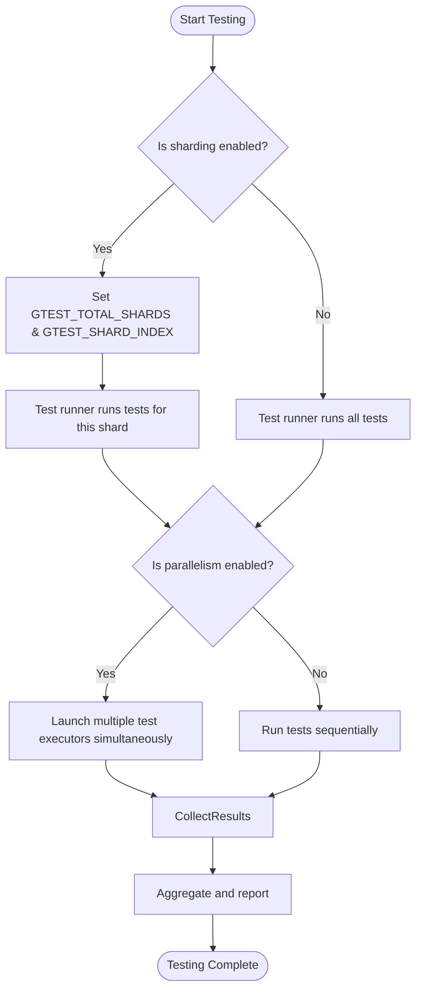

# Improving Test Performance at Scale

## Overview

This guide offers practical advice and patterns to help you make your GoogleTest test suites run faster and more efficiently, especially in large-scale projects. It covers strategies such as test sharding, parallel test execution, minimizing test process startup overhead, and diagnosing slow tests.

Speeding up tests not only reduces developer wait times but also improves CI throughput and developer productivity.

## Prerequisites

- Familiarity with basic GoogleTest usage and test creation.
- An existing suite of GoogleTest test cases that you want to optimize.
- Understanding of your build environment and CI infrastructure for test execution.

## Expected Outcomes

By following this guide, you will:

- Leverage test sharding to distribute tests across multiple machines.
- Run tests in parallel threads or processes for faster test execution.
- Reduce overhead in test startup time and resource usage.
- Identify and diagnose slow tests to prioritize optimization efforts.

## Difficulty Level

Intermediate to Advanced

---

## 1. Distributing Tests with Sharding

GoogleTest supports test sharding to distribute tests across multiple machines or processes, allowing parallel execution and reduced overall test wall-clock time.

### How Sharding Works

- The test runner divides the set of all tests into shards.
- Each shard runs the same test binary but executes only a subset of tests.
- Environment variables `GTEST_TOTAL_SHARDS` and `GTEST_SHARD_INDEX` control this behavior.

### Setting Up Sharding

1. Allocate the number of shards (machines/processes) to run your tests.
2. On each shard:
   - Set `GTEST_TOTAL_SHARDS` to the total number of shards.
   - Set `GTEST_SHARD_INDEX` to the index of the shard (0-based).
3. Run the test binary on each shard.
4. Collect results from all shards to obtain the complete test run results.

### Example

If you have 3 shards, set the environment variables as follows:

```bash
# On machine 0
export GTEST_TOTAL_SHARDS=3
export GTEST_SHARD_INDEX=0
./my_test

# On machine 1
export GTEST_TOTAL_SHARDS=3
export GTEST_SHARD_INDEX=1
./my_test

# On machine 2
export GTEST_TOTAL_SHARDS=3
export GTEST_SHARD_INDEX=2
./my_test
```

### Best Practices

- Ensure each shard has a roughly equal number of tests or total runtime to balance load.
- Use test filtering to include or exclude test subsets where appropriate.
- Verify that your test environment and dependencies are consistent across shards.

---

## 2. Parallel Test Execution

GoogleTest tests are independent by design, which makes running them in parallel straightforward.

### Methods for Parallelism

- **Multi-threading or Multi-processing in CI**: Launch multiple instances of your test binary concurrently.
- **Using gtest-parallel or Similar Tools**: These specialized tools can shard tests dynamically and run multiple test binaries in parallel.

### Considerations

- Tests must be independent and free of shared, mutable global state to avoid flakiness.
- Beware of resource contention such as file I/O, network, or databases.
- Use `DISABLED_` prefix to temporarily disable flaky or resource-sensitive tests.

### Example: Using gtest-parallel

Install and use gtest-parallel to automatically shard and parallelize tests locally or in CI:

```bash
pip install gtest-parallel

# Run tests in maximum parallelism
gtest-parallel ./my_test

# Run with a fixed number of jobs
gtest-parallel --jobs 4 ./my_test
```

---

## 3. Minimizing Test Process Startup Time

Starting many small test programs may incur significant overhead, especially on slower filesystems or containerized environments.

### Tips to Reduce Startup Overhead

- **Combine Many Small Tests into One Binary:** Group related tests in one executable to reduce process creation costs.
- **Reduce Test Binary Size:** Optimize compilation and linkage to create smaller binaries.
- **Reuse Test Fixture Setups:** Use `SetUpTestSuite()` and `TearDownTestSuite()` to share expensive fixture initialization across tests.
- **Use Global Test Environment Setup:** Implement `::testing::Environment` subclasses to do global setup once before all tests run.

### Example: Sharing Expensive Resources Per Test Suite

```cpp
class FooTest : public testing::Test {
protected:
  static ExpensiveResource* resource_;

  static void SetUpTestSuite() {
    resource_ = new ExpensiveResource();
  }

  static void TearDownTestSuite() {
    delete resource_;
    resource_ = nullptr;
  }
};

ExpensiveResource* FooTest::resource_ = nullptr;

TEST_F(FooTest, Test1) {
  EXPECT_TRUE(resource_->IsValid());
}
```

---

## 4. Diagnosing and Resolving Slow Tests

Identifying the tests that cause delays is an essential step toward performance improvement.

### Techniques

- **Use GoogleTest Timing Output:** GoogleTest reports individual test durations by default to stdout.
- **Generate XML or JSON Reports:** Use `--gtest_output=xml:output.xml` to obtain detailed results for analysis.
- **Profile Your Tests:** Use profiling tools to detect hotspots.

### Address Common Causes of Slowness

- Long Setup or Teardown: Move expensive setup into shared fixtures or global environments.
- I/O Bound Tests: Mock or stub file/network dependencies.
- Large Data Fixtures: Use lightweight or synthetic data.
- Non-deterministic Delays: Identify and fix flakiness causing repeated retries.

### Example: Generate XML Report

```bash
./my_test --gtest_output=xml:test_results.xml
```

Parse and analyze this report to find slow tests.

---

## 5. Best Practices

- Prefer **EXPECT_** assertions unless continuing test execution after failure is meaningless.
- Use `DISABLED_` prefix judiciously to isolate flaky or expensive tests.
- Adopt **test sharding** and CI parallelism together for maximum speedup.
- Monitor test durations regularly to catch regressions.
- Keep tests independent and side-effect free for safe parallel execution.

---

## Troubleshooting Common Issues

<AccordionGroup title="Common Performance Issues">  
<Accordion title="Tests Not Running on All Shards">  
Ensure environment variables `GTEST_TOTAL_SHARDS` and `GTEST_SHARD_INDEX` are set correctly on each shard. Verify that your test filtering or runtime code does not exclude tests unexpectedly.
</Accordion>  
<Accordion title="Flaky Tests in Parallel Execution">  
Check for shared global state or resource contention. Use synchronization primitives or redesign tests to be independent.
</Accordion>  
<Accordion title="Excessive Process Startup Overhead">  
Group tests to reduce process invocations. Investigate filesystem latency and container overhead.
</Accordion>  
<Accordion title="Tests Timing Out or Hanging">  
Isolate slow or flaky tests. Consider longer timeouts in CI or marking as `DISABLED_` pending fix.
</Accordion>  
</AccordionGroup>

---

## Next Steps & Related Documentation

- Explore [Integration with Build and CI Systems](../overview/integration-adoption/integration-workflow) for embedding test sharding and parallelism in CI.
- Use [Using Mocks](../guides/essential-workflows/using-mocks) and advanced setups to reduce test resource usage.
- Read the [GoogleTest Advanced Topics](../docs/advanced.md) to leverage `SetUpTestSuite()` and global environments.
- Use reporting output and [Test Discovery and Running Strategies](../guides/essential-workflows/test-discovery) to optimize test suites.

<Check>
Remember: Always validate that your tests remain reliable and deterministic after applying parallelization or sharding strategies.
</Check>

---

## Summary

This guide has empowered you to improve GoogleTest performance at scale by making tests run faster and more efficiently. By sharding tests, running in parallel, reducing startup overhead, and diagnosing slow tests, you ensure both developer and CI productivity.

---

# Diagram: Simplified Test Execution with Sharding and Parallelism



---

## Additional Resources

- [GoogleTest Primer](../docs/primer.md) to get started with basics
- [GoogleTest Advanced Topics](../docs/advanced.md) for fixture and environment setup
- [Integration with Build and CI Systems](../overview/integration-adoption/integration-workflow)
- [Using Mocks](../guides/essential-workflows/using-mocks) to isolate test dependencies

---

## Source

<Source url="https://github.com/google/googletest" branch="main" paths={[{"path": "docs/advanced.md", "range": "1-500"},{"path": "docs/reference/assertions.md", "range": "1-250"}]} />
