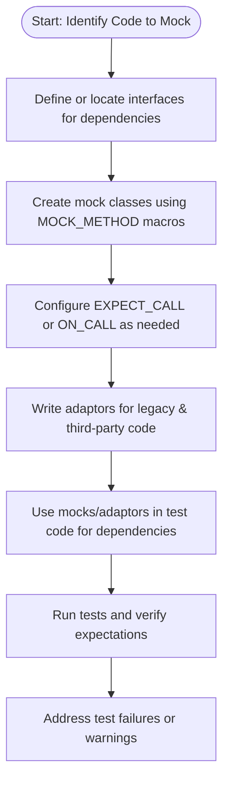

# Mocking in Real-world Integration Scenarios

This guide explores how to apply GoogleMock effectively in larger software systems, especially when integrating with legacy codebases, supporting cross-platform development, and working alongside third-party frameworks. It offers practical patterns and best practices to ensure mocks are maintainable, portable, and easy to evolve as your project grows.

---

## 1. Understanding the Challenge of Real-world Integration

In real-world projects, the landscape is often more complex than isolated unit tests. Common complexities include:

- Legacy code without interfaces for easy mocking
- Cross-platform considerations that affect mocking and test setup
- Third-party or external libraries and frameworks
- Partial usage of mocks alongside real implementations

This guide helps you navigate these issues by focusing on practical techniques for **mocking within integration scenarios**.

## 2. Patterns for Integrating Mocks in Legacy Code

Legacy code often lacks clear interfaces or abstractions necessary for straightforward mocking. To integrate mocks effectively:

### 2.1. Introduce Interfaces and Adaptors

- **Define new interfaces** reflecting your test needs instead of mocking concrete classes directly.
- Create adaptor classes that wrap legacy concrete implementations. These adaptors implement the interfaces and forward calls to legacy code.

```cpp
// Legacy class
class LegacyProcessor {
 public:
  int ProcessData(int data);
  // ... concrete methods
};

// New interface
class IDataProcessor {
 public:
  virtual ~IDataProcessor() = default;
  virtual int ProcessData(int data) = 0;
};

// Adaptor wrapping legacy
class LegacyProcessorAdaptor : public IDataProcessor {
 public:
  explicit LegacyProcessorAdaptor(LegacyProcessor* legacy) : legacy_(legacy) {}
  int ProcessData(int data) override {
    return legacy_->ProcessData(data);
  }
 private:
  LegacyProcessor* legacy_;
};

// Mock using interface
class MockDataProcessor : public IDataProcessor {
 public:
  MOCK_METHOD(int, ProcessData, (int data), (override));
};
```

This approach isolates mocks from fragile legacy code, enabling stable, maintainable tests.

### 2.2. Refactor Test Code Incrementally

- Start by writing mock classes for new or refactored interfaces.
- Gradually replace direct usage of legacy implementations in tests with mocks via adaptors.
- Avoid making legacy classes virtual just for mocking; prefer composition and adaptors.

### 2.3. Delegation to Real or Fake Objects

When you want the mock to behave like the real legacy class but still track interactions:

- Use the **delegation pattern** where mock methods call the real or a fake implementation for default behavior.

```cpp
class MockLegacyProcessor : public IDataProcessor {
 public:
  MOCK_METHOD(int, ProcessData, (int data), (override));

  MockLegacyProcessor() {
    ON_CALL(*this, ProcessData).WillByDefault(
        [this](int data) { return real_.ProcessData(data); });
  }

 private:
  LegacyProcessor real_;
};
```

This enables checking calls while preserving legacy behavior.

## 3. Supporting Cross-Platform Testing with Mocks

Legacy or cross-platform projects may require mocks to operate consistently across platforms.

### 3.1. Use Conditional Compilation for Platform-Specific Behavior

Control mock behaviors with macro guards or configuration:

```cpp
#if defined(WINDOWS)
  EXPECT_CALL(mock, DoSomething()).WillOnce(Return(true));
#else
  EXPECT_CALL(mock, DoSomething()).WillOnce(Return(false));
#endif
```

Keep platform-specific test logic separate to ease maintenance.

### 3.2. Abstract Platform Dependencies

Design interfaces to separate platform-specific code from common logic, so mocks can target platform-agnostic interfaces.

### 3.3. Employ `NiceMock` or `StrictMock` to Manage Noisy Tests

- Use `NiceMock<T>` to suppress warnings about uninteresting calls in platform-specific code.
- Use `StrictMock<T>` to enforce exact interactions when necessary.

## 4. Mocking with Third-Party and External Frameworks

When integrating GoogleMock into projects using third-party libraries or frameworks, consider these tips:

### 4.1. Wrap External Dependencies with Adaptors

Create interfaces and adaptor classes wrapping third-party APIs. Mock these interfaces rather than third-party classes directly.

### 4.2. Handling Non-virtual or Static Functions

- For static/free functions, use the [wrapper interface pattern](#MockingFreeFunctions) to isolate calls and enable mocking.
- Alternatively, inject dependencies via `std::function` and use `testing::MockFunction` to mock them.

### 4.3. Use `MockFunction` for Mockable Callbacks

```cpp
#include <gmock/gmock.h>
using ::testing::MockFunction;

// Create a mock for a callback type
MockFunction<void(int)> mock_callback;
EXPECT_CALL(mock_callback, Call(5));

// Pass as std::function
auto callback = mock_callback.AsStdFunction();
```

### 4.4. Managing Threading and Synchronization

Tests involving third-party libs with asynchronous or multi-threaded behavior may need:

- Synchronization primitives (e.g., condition variables) in conjunction with mocks.
- Use of notifications (from `absl::Notification` or similar) to wait for async operations.
- Careful sequencing of expectations using `InSequence` or `.After()` clauses.

## 5. Best Practices for Maintainable Integration Mocks

- **Mock interfaces, not implementations.** This reduces brittleness and improves test clarity.
- **Use `ExpectCall` sparingly.** Prefer `ON_CALL` for default behavior, add `EXPECT_CALL` only for behavior you intend to verify.
- **Leverage `NiceMock` or `StrictMock` wrappers** to adjust sensitivity to uninteresting calls.
- **Isolate platform-specific mock behaviors** with separate test utilities or conditional compilation.
- **Avoid mocking concrete legacy classes directly**; instead, use adaptors or fakes where possible.
- **Delegate to fakes or real objects** when you want minimal duplication of logic with visibility on calls.

## 6. Troubleshooting Common Pitfalls

### 6.1. Mock Methods Not Called as Expected

- Confirm the mock object is the one actually used. If legacy code creates its own instances, mocks won't intercept calls.
- Ensure expectations (`EXPECT_CALL`) are set before exercising code.

### 6.2. Excessive Warnings About Uninteresting Calls

- Convert your mocks to `NiceMock` to suppress warnings where expected calls are not explicitly made.
- For methods consistently called without interest in arguments or call counts, use catch-all `EXPECT_CALL(mock, Method(_)).Times(AnyNumber());`

### 6.3. Compilation Slowness with Large Mock Classes

- Move mock class constructors and destructors out of header files into implementation files.
- Use type aliases to reduce template complexity in `MOCK_METHOD` declarations.

### 6.4. Overloaded Methods Ambiguity

- Disambiguate overloads by fully specifying argument types.
- Use `using BaseClass::Method;` in mocks to bring base overloads into scope.

## 7. Summary of Integration Workflow



---

## 8. Additional Resources

For in-depth details and code examples, refer to:

- [gMock Cookbook](https://google.github.io/googletest/gmock_cook_book.html) - practical recipes
- [gMock for Dummies](https://google.github.io/googletest/gmock_for_dummies.html) - beginner guidance
- [Mocking Reference](https://google.github.io/googletest/reference/mocking.html) - full API description
- [Mock Strictness: Nice, Naggy, and Strict](https://google.github.io/googletest/gmock_cook_book.html#NiceStrictNaggy) - managing mock warnings/errors
- [Mocking Patterns & Advanced Use Cases Guide](https://google.github.io/googletest/gmock_cheat_sheet.html) - cheat sheet for common patterns

---

## 9. Conclusion

Mocking in real-world integration requires extra care to manage legacy constraints, platform diversity, and external dependencies. Leveraging interfaces, adaptors, delegation, and strictness controls enables you to build reliable, maintainable tests that scale with your system complexity.

Keep your tests expressive but resilient by mocking *interfaces*, minimizing impact on legacy code, and balancing verification with flexibility using GoogleMock's powerful but user-friendly capabilities.

---

<Note>
Remember to always set your expectations before invoking the functions in your tests. Use `NiceMock` to reduce test noise, and avoid mocking concrete legacy classes directly; wrap them instead.
</Note>

<Tip>
Delegating mock methods to real or fake implementations helps maintain behavior consistency and reduces duplication, improving test reliability.
</Tip>

#### Source
<Source url="https://github.com/google/googletest" branch="main" paths='[{"path": "docs/gmock_cook_book.md", "range": "1-938"},{"path": "docs/gmock_cheat_sheet.md", "range": "1-176"},{"path": "docs/gmock_for_dummies.md", "range": "1-265"},{"path": "docs/gmock_faq.md", "range": "1-280"}]'/>