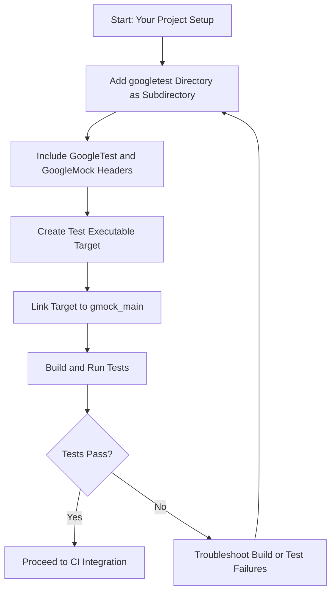

# Integrating GoogleTest with Your Build System

This guide provides clear, actionable instructions for integrating GoogleTest and GoogleMock into your CMake and Bazel projects. You'll learn how to set up dependencies, organize your project layouts effectively, and apply best practices to ensure smooth continuous integration.

---

## 1. Overview

**What this guide helps you accomplish:**

- Integrate GoogleTest and GoogleMock libraries seamlessly with CMake and Bazel build systems.
- Configure project files to compile and link your tests correctly.
- Structure your testing codebase for maintainability.
- Adopt recommended practices for continuous integration.

**Prerequisites:**

- Basic familiarity with C++ and your chosen build system (CMake or Bazel).
- Installed tools: a working C++ compiler, CMake (version 3.13 or newer), or Bazel.
- GoogleTest and GoogleMock source code or installed packages.

**Expected Outcome:**

- Your project compiles and runs tests using GoogleTest/GoogleMock.
- Tests integrate into your CI pipeline smoothly.
- You have a reusable setup that others on your team can follow.

**Estimated Time:** 20–40 minutes

**Difficulty Level:** Intermediate

---

## 2. Integrating GoogleTest/GoogleMock with CMake

GoogleTest provides community-supported CMake scripts to build and link the libraries into your C++ projects.

### 2.1 Add GoogleTest and GoogleMock to Your CMake Project

#### Steps:

1. **Acquire the Source**

   Clone Google's testing repository:

   ```bash
   git clone https://github.com/google/googletest.git -b main
   ```

2. **Organize the Source**

   Place the cloned `googletest` directory within your project's external dependencies or use it as a submodule.

3. **Modify Your `CMakeLists.txt`**

   Include GoogleTest and GoogleMock by adding:

   ```cmake
   # Minimum CMake version
   cmake_minimum_required(VERSION 3.13)

   # Add GoogleTest and GoogleMock as subdirectories
   add_subdirectory(googletest)

   # Include directories for GoogleTest and GoogleMock headers
   include_directories(
     ${gmock_SOURCE_DIR}/include
     ${gmock_SOURCE_DIR}
     ${gtest_SOURCE_DIR}/include
   )

   # Add your test executable
   add_executable(my_test test/my_test.cpp)

   # Link your test executable with gmock_main (includes main())
   target_link_libraries(my_test PRIVATE gmock_main)

   # Enable testing target
   enable_testing()

   # Register your test
   add_test(NAME my_test COMMAND my_test)
   ```

   **Note:** Linking against `gmock_main` links GoogleMock, GoogleTest, and provides a `main()` function.

4. **Configure Your Compiler Settings**

   GoogleMock recommends using stricter compiler warnings to help catch issues. The recommended GoogleMock CMakeLists uses helpers like `config_compiler_and_linker()` to set these.

5. **Build and Run Tests**

   Execute:

   ```bash
   mkdir build
   cd build
   cmake ..
   make
   ctest
   ```

   Confirm your tests run successfully.

### 2.2 Customize Build Options

- To disable building GoogleMock tests themselves, set:

  ```cmake
  option(gmock_build_tests "Build Google Mock's tests" OFF)
  ```

- Control shared vs static libraries with:

  ```cmake
  option(BUILD_SHARED_LIBS "Build as shared libraries" OFF)
  ```

### 2.3 GoogleTest & GoogleMock Package Config Files

GoogleTest installs package config files like `gtest_main.pc` and `gmock_main.pc` for use with `pkg-config` or for `find_package` support. When installed properly, these enable simpler dependency management:

```bash
pkg-config --cflags --libs gmock_main
```

Or in CMake:

```cmake
find_package(GTest REQUIRED)
add_executable(my_test test.cpp)
target_link_libraries(my_test PRIVATE GTest::gmock_main)
```

### 2.4 Recommended Project Layout

A practical, maintainable layout ensures clear separation of source and tests and smooth integration:

```
my_project/
├── CMakeLists.txt
├── src/
│   └── ...              # Application source code
├── tests/
│   ├── CMakeLists.txt   # Defines test targets
│   └── my_test.cpp      # Test files
└── external/
    └── googletest/      # GoogleTest and GoogleMock clone or submodule
```

### 2.5 Initialization in Test Source

Use `testing::InitGoogleMock()` in your test's `main()` to initialize GoogleMock and GoogleTest flags:

```cpp
#include "gmock/gmock.h"

int main(int argc, char** argv) {
  testing::InitGoogleMock(&argc, argv);
  return RUN_ALL_TESTS();
}
```

Alternatively, linking with `gmock_main` provides a default main, so you generally don't need to define your own.

---

## 3. Integrating GoogleTest/GoogleMock with Bazel

Bazel offers first-class support for GoogleTest and GoogleMock with built-in rules.

### 3.1 Setup Steps

1. **Declare gtest and gmock dependencies in WORKSPACE**

Add the official GoogleTest release or source archive as an external Bazel repository.

2. **Define Test Targets in BUILD Files**

Create test targets in your `BUILD` file:

```python
cc_test(
    name = "my_test",
    srcs = ["my_test.cpp"],
    deps = ["@com_google_googletest//:gmock_main"],
)
```

This automatically adds GoogleMock and GoogleTest.

3. **Writing Tests**

Ensure your test binary initializes GoogleMock similarly to CMake setups — but normally Bazel’s GoogleMock startup is already appropriately configured.

### 3.2 Best Practices

- Use `gmock_main` target in dependencies to get main function automatically.
- Group tests logically in BUILD files for easier maintenance.
- Use `bazel test //path/to:test_target` to execute tests.

---

## 4. Tips for Continuous Integration (CI)

- **Use Consistent Compiler Settings:** Ensure CI agents use the same compiler flags as local builds.
- **Build GoogleTest/GoogleMock Once:** Cache dependencies to reduce build times.
- **Run Tests with Verbose Output:** Enable GoogleMock verbose flags (e.g., `--gmock_verbose=info`) in your CI test runs to help debug failures.
- **Fail Fast on Test Failures:** Configure your CI to stop on the first failure to speed up feedback.

---

## 5. Troubleshooting Common Integration Issues

### Issue: Linker errors for multiple main() functions
- Avoid defining your own `main()` when linked with `gmock_main` or `gtest_main` as those provide one.
- If you need custom init logic, link only with `gmock` (without main) and write your own `main()` using `InitGoogleMock`.

### Issue: Tests not discovered or running
- Verify tests are linked against the right targets (`gmock_main` or `gtest_main`).
- Ensure `enable_testing()` in CMake to register tests properly.
- Confirm file naming and test registration conforms to GoogleTest conventions.

### Issue: Compiler compatibility
- GoogleTest requires a compiler with C++17 support.
- Check version compliance if unexpected errors occur.

---

## 6. Summary Diagram: Integrating with CMake



---

## 7. Additional Resources

- [GoogleTest CMake Build Guide](https://github.com/google/googletest/blob/main/googletest/README.md)
- [GoogleMock for Dummies](https://google.github.io/googletest/gmock_for_dummies.html)
- [GoogleTest and GoogleMock API Reference](https://google.github.io/googletest/reference/)
- [Build Integration Overview](https://github.com/google/googletest/tree/main/docs/overview/architecture_and_integration/integration_points.md)
- [Mocking Reference](https://google.github.io/googletest/reference/mocking.html)

---

With this guide, you are equipped to embed GoogleTest and GoogleMock into your CMake or Bazel projects efficiently, enabling robust C++ testing and faster development cycles.
