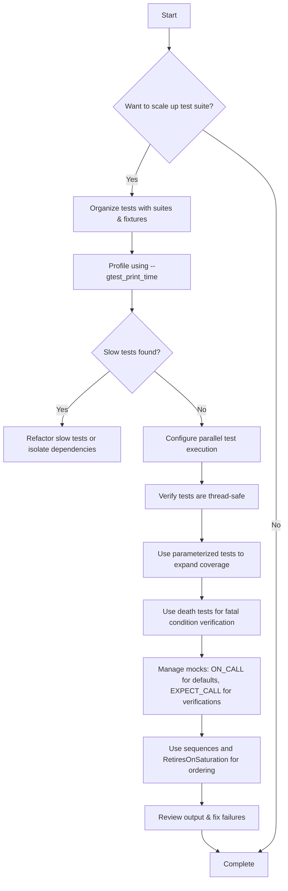

# Scaling, Performance, and Advanced Features

Best practices for scaling up your test suite, optimizing performance, running tests in parallel, and leveraging parameterized tests and death tests to fully exercise your codebase.

---

## 1. Overview

This guide empowers you to enhance your testing strategy using GoogleTest's advanced capabilities. You'll learn how to scale large test suites, optimize runtime performance, execute tests in parallel to reduce wall clock times, and use powerful test types like parameterized and death tests to verify edge cases effectively.

### Prerequisites
- Familiarity with basic GoogleTest and GoogleMock usage.
- A working test suite built using GoogleTest.
- Access to your project's build and test infrastructure for configuration.

### Expected Outcome
- Efficiently scaled and faster-running test suites.
- Improved test coverage with parameterized and death tests.
- Understanding of performance bottlenecks and mitigation techniques.

### Time Estimate
30 to 45 minutes to read and apply the techniques.

### Difficulty Level
Intermediate to Advanced.

---

## 2. Scaling and Performance Optimization

Scaling a test suite involves managing a growing number of tests without sacrificing execution speed or maintainability.

### 2.1 Best Practices for Large Test Suites

- **Organize Tests Into Suites and Fixtures:** Group related tests using test suites and fixtures to enable focused test runs and reduce setup overhead.

- **Use Test Filtering:** Run subsets of tests using `--gtest_filter` to those you actively develop or refactor. This reduces iteration cycles.

- **Keep Tests Small and Independent:** Tests should be self-contained to avoid cascading failures that slow down debugging.

### 2.2 Profiling Test Performance

- Use `--gtest_print_time` flag to report individual test durations.
- Identify slow tests and refactor or isolate expensive operations.

### 2.3 Controlling Verbosity

To balance output clarity and details, configure verbosity with `--gmock_verbose`:

- `info`: Verbose logs including expected and uninteresting calls.
- `warning`: Warnings and errors (default).
- `error`: Only errors.

Adjusting verbosity helps monitor tests without clutter.

<Check>
Harness `--gtest_print_time` and `--gmock_verbose` to identify performance hot-spots efficiently.
</Check>

---

## 3. Running Tests in Parallel

GoogleTest supports parallel execution of tests to leverage multicore processors and reduce test cycle times.

### 3.1 Setting up Parallel Test Execution

Common ways to run tests concurrently:

- Use build system or CI pipeline capabilities (e.g., Bazel, CMake with test runners).
- Employ test runners that inherently support parallelism.
- Invoke multiple instances of test binaries with partitioned filters (`--gtest_filter`).

### 3.2 GoogleTest Parallelization Support

While GoogleTest itself does not provide direct parallel execution, structuring your tests well enables maximal parallelism through external builders and runners.

### 3.3 Designing Tests to Support Parallel Runs

- Avoid shared global state or properly synchronize access.
- Design fixtures and environment setup to be thread-safe or isolated per test.
- Avoid heavy IO or external dependencies that can bottleneck parallel execution.

### 3.4 Example: Run tests in parallel using Bazel

```bash
bazel test --jobs=8 //my_project/tests:all
```

This runs up to 8 test jobs concurrently.

---

## 4. Parameterized Tests

Parameterized tests let you run the same test logic against multiple data inputs, improving coverage and reducing code duplication.

### 4.1 Using `TEST_P` and `INSTANTIATE_TEST_SUITE_P`

Define your parameterized test as follows:

```cpp
class MyParamTest : public ::testing::TestWithParam<int> {};

TEST_P(MyParamTest, HandlesMultipleInputs) {
  int number = GetParam();
  EXPECT_TRUE(number >= 0);
}

INSTANTIATE_TEST_SUITE_P(
    PositiveTests,
    MyParamTest,
    ::testing::Values(1, 2, 3, 42));
```


Each test case runs with a different value.

### 4.2 Benefits
- Avoid duplicates while using clearly named test instances.
- Automatically report failing inputs.

### 4.3 Best Practices
- Use descriptive test instance names to clarify parameter sets.
- Combine with typed tests for testing multiple types.

---

## 5. Death Tests

Death tests verify that your program behaves correctly when encountering fatal errors, such as invalid inputs or failed assertions.

### 5.1 Writing Death Tests

Use `ASSERT_DEATH` or `EXPECT_DEATH` to check that a statement causes program termination.

```cpp
TEST(FooDeathTest, FailsOnNullptr) {
  Foo f;
  ASSERT_DEATH(f.DoSomething(nullptr), "null pointer");
}
```

### 5.2 Running Death Tests Safely

- Death tests are run in a separate process.
- Avoid shared state in death tests.
- Use `--gtest_death_test_style=threadsafe` for thread-safe death tests.

### 5.3 Troubleshooting Common Pitfalls
- Ensure the death condition triggers exactly.
- Avoid dependencies in death tests that can cause flakiness.

---

## 6. Leveraging Advanced Features

### 6.1 Using Sequences to Order Expectations

Control the ordering of mock calls with `Sequence`:

```cpp
using ::testing::Sequence;
Sequence seq;
EXPECT_CALL(mock, Foo()).InSequence(seq);
EXPECT_CALL(mock, Bar()).InSequence(seq);
```

This enforces that `Foo()` occurs before `Bar()`.

### 6.2 Retiring Expectations

Use `.RetiresOnSaturation()` to retire an expectation when it has been fulfilled, allowing other expectations to take over.

### 6.3 Using `ON_CALL` for Default Behaviors

Define default method behaviors without enforcing call counts:

```cpp
ON_CALL(mock, Compute(_)).WillByDefault(Return(42));
```

This avoids over-constraining tests while providing realistic default responses.

### 6.4 Managing Mock Strictness

Use `NiceMock`, `NaggyMock`, or `StrictMock` wrappers to control handling of uninteresting calls:

- `NiceMock` suppresses uninteresting call warnings.
- `NaggyMock` warns on uninteresting calls (default).
- `StrictMock` treats uninteresting calls as failures.

Use these appropriately based on the strictness required.

---

## 7. Troubleshooting & Tips

### 7.1 Common Issues

- **Uninteresting Mock Function Calls:** Add `EXPECT_CALL(...).Times(AnyNumber())` or use `NiceMock` to silence warnings.
- **Too Many or Too Few Actions Specified:** Ensure `WillOnce()` and `WillRepeatedly()` match the expected call counts.
- **Mock Object Leaks:** Use `Mock::AllowLeak(mock_object)` if intentional; otherwise check object lifetimes.
- **Unexpected Calls:** Verify that all expected calls are set before exercise and match argument expectations.

### 7.2 Performance Considerations

- Profile test suite runtimes and isolate slow tests.
- Parallelize tests where possible.
- Avoid heavy shared global state or external dependencies.

### 7.3 Best Practices Summary

- Use `ON_CALL` for default behavior; reserve `EXPECT_CALL` for verifying interactions.
- Keep mock expectations explicit but not overly restrictive.
- Use sequences and `.After()` to clarify call ordering.
- Prefer parameterized tests to cover multiple inputs efficiently.

---

## 8. Next Steps & Related Content

- Explore [Mocking Best Practices and Patterns](../guides/mocking-and-advanced-patterns/mocking-best-practices) for test maintainability.
- Deep dive into [Custom Actions and Matchers](../guides/mocking-and-advanced-patterns/working-with-actions-matchers) to expand test expressiveness.
- Integrate scaling techniques with your [Build System](../guides/integration-and-advanced-usage/build-integration) and CI pipelines.
- Understand core [Mocking Concepts & Terminology](../overview/core_concepts_and_features/concepts_and_terminology).

---

## References

- [GoogleMock for Dummies](https://github.com/google/googletest/blob/main/docs/gmock_for_dummies.md)
- [GoogleMock Cheat Sheet](https://github.com/google/googletest/blob/main/docs/gmock_cheat_sheet.md)
- [Mocking Reference](../reference/mocking.md)
- [gMock Cookbook](https://github.com/google/googletest/blob/main/docs/gmock_cook_book.md)

---

## Summary Diagram



---
