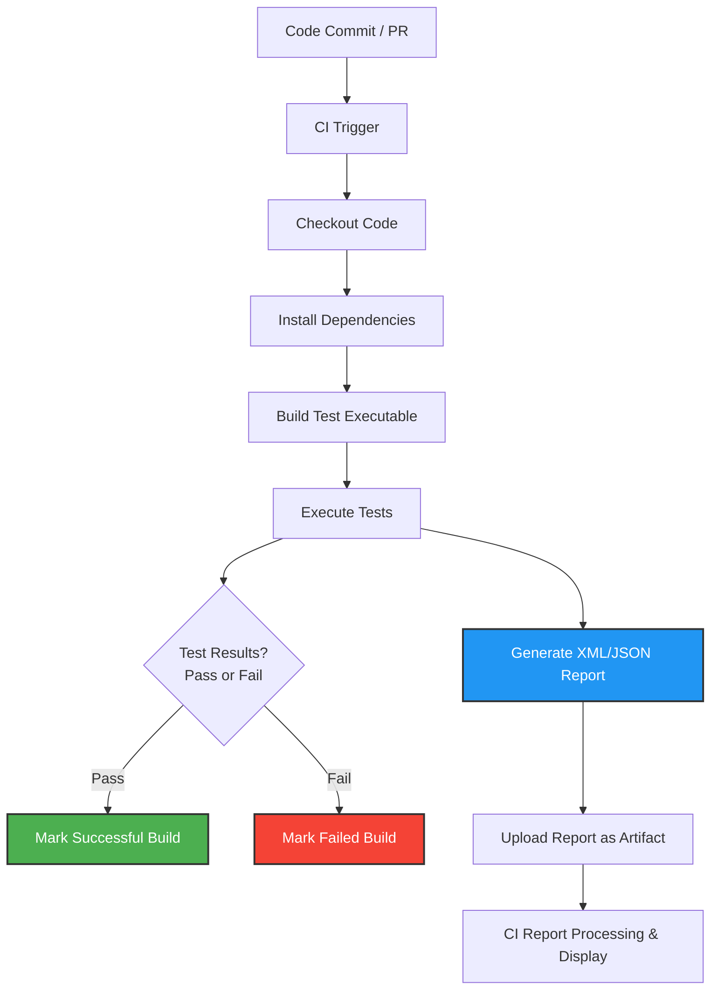

# Continuous Integration & Test Automation

## Overview
This guide equips you to seamlessly implement automated test runs using GoogleTest within your Continuous Integration (CI) pipelines. You'll learn how to set up essential automation scripts, enable detailed test result reporting, and troubleshoot common issues specifically when integrating with popular CI services like GitHub Actions or custom CI solutions.

By following these best practices, you'll ensure your C++ projects maintain code quality through reliable, repeatable test automation.

---

## 1. Workflow Overview

### What You Will Achieve
- Integrate GoogleTest-based tests into your CI pipelines.
- Automate test execution on code changes.
- Generate and manage test reports suitable for CI consumption.
- Handle common integration pitfalls to maintain pipeline stability.

### Prerequisites
- A working GoogleTest test suite and build setup (using your build system such as CMake or Bazel).
- Basic knowledge of your CI platform (e.g., GitHub Actions, Jenkins).
- Access to your CI environment's configuration files or pipeline scripts.

### Expected Outcome
- Automatic compilation and execution of tests triggered by CI events.
- Test results output in console and XML/JSON formats for CI reporting.
- Stable pipeline setup with clear diagnostics when tests fail.

### Time Estimate
Setting up a basic CI integration with test automation takes approximately 30-60 minutes depending on familiarity with your CI platform and build system.

### Difficulty Level
Intermediate

---

## 2. Setting up Automated Test Runs in CI

### Step 1: Build Your Test Executable
Ensure your CI pipeline contains a step to build your GoogleTest-based test binary. This typically involves invoking your build system (e.g., `cmake --build .` or `bazel build //:your_test_target`).

```bash
# Example: Building with CMake
cmake --build build --target hello_test
```

**Expected Result:** The test executable is compiled and available in the CI workspace.


### Step 2: Run Tests Automatically
Add a step in your CI pipeline to run the test executable. Running the binary will execute all discovered tests.

```bash
# Run the test executable
./build/hello_test
```

**Expected Result:** Tests run with detailed console output showing pass/failure per test.


### Step 3: Enable Test Output Reporting
Many CI platforms support parsing test reports, most commonly in XML or JSON format. GoogleTest supports generating reports suitable for CI integration.

- Use the `--gtest_output` flag to produce an XML or JSON report.

Example:

```bash
./build/hello_test --gtest_output=xml:test_results.xml
```

or for JSON:

```bash
./build/hello_test --gtest_output=json:test_results.json
```

**Expected Result:** Test results are saved to the specified file, which your CI tool can ingest.


### Step 4: Configure Your CI Platform to Parse Reports
Configure your CI service (e.g., Jenkins, GitHub Actions) to parse the test results report.

- For GitHub Actions, use the `actions/upload-artifact` action to store the report and configure annotations using the `JUnit` reporter or via integrations.
- For Jenkins, use the `JUnit` plugin to parse GoogleTest XML report.


### Step 5: Automate On Code Push or Pull Requests
Trigger your CI workflows on code pushes or pull requests to ensure tests run automatically on each update.

---

## 3. Practical Example: GitHub Actions Workflow

Create a `.github/workflows/ci.yml` file in your repo with content similar to:

```yaml
name: C++ Test Automation

on:
  push:
    branches: [ main ]
  pull_request:
    branches: [ main ]

jobs:
  build_and_test:
    runs-on: ubuntu-latest

    steps:
    - uses: actions/checkout@v3

    - name: Install dependencies
      run: sudo apt-get update && sudo apt-get install -y cmake build-essential

    - name: Configure Project
      run: cmake -S . -B build

    - name: Build Tests
      run: cmake --build build --target hello_test

    - name: Run Tests
      run: |
        ./build/hello_test --gtest_output=xml:test_results.xml

    - name: Upload Test Results
      uses: actions/upload-artifact@v3
      with:
        name: test-results
        path: test_results.xml

    - name: Display Test Results
      if: failure()
      run: cat test_results.xml
```

**Outcome:** On each push or PR to `main`, actions will build your test executable and run the tests, saving an XML report.

---

## 4. Best Practices and Tips

- **Build Reproducibility:** Ensure your build and test steps run successfully in a clean CI environment, matching local development.
- **Test Failures:** Use the console output and structured reports for diagnosing failed tests.
- **Resource Management:** In CI, consider test run duration and parallelize tests or split suites accordingly.
- **Test Output Directory:** Generate test reports to a known directory to facilitate artifact collection.
- **Fail Fast:** Enable `--gtest_fail_fast` in CI to stop test runs on the first failure when iterating quickly.

<Tip>
Use the `--gtest_brief=1` flag to suppress output of passing tests and reduce noise in CI logs.
</Tip>

<Tip>
Ensure your test reports do not contain reserved XML attribute names when using `RecordProperty()`, to avoid CI parsing issues.
</Tip>

---

## 5. Troubleshooting Common CI Integration Issues

### Issue: Tests Not Executing in CI
- Verify the test binary is built correctly without errors.
- Ensure the test binary is invoked with the correct relative or absolute path.
- Confirm that test discovery is not disabled and `RUN_ALL_TESTS()` is executed.

### Issue: Test Results Not Found by CI
- Make sure the test output file path matches the path your CI tool expects.
- Check file permissions and path correctness in CI environment.

### Issue: Build or Linker Errors in CI
- Confirm all build dependencies are installed in CI.
- Use identical compiler flags and environment as local builds.

### Issue: Tests Pass Locally but Fail in CI
- Identify differences in environment variables or dependencies.
- Confirm the same compiler and runtime versions.
- Check for implicit assumptions on environment or file system state.

<Tip>
Use verbose logging (`--gtest_verbose=info`) in CI when diagnosing test failures.
</Tip>

---

## 6. Next Steps & Related Documentation

- [Quickstart & Installation](/guides/getting-started/quickstart-installation) to set up GoogleTest.
- [Writing Your First Test](/guides/getting-started/writing-your-first-test) for test basics.
- [Compiling and Running Tests](/getting-started/first-test-validation/running-tests) for local execution.
- [Integrating with Build Systems](/guides/integration-and-best-practices/integrating-with-build-systems) to optimize build/test workflows.
- CI Platform Specific Docs (GitHub Actions, Jenkins, GitLab) for environment configuration.

---

## 7. Summary diagram of Integration Flow



---

## Appendix: GoogleTest Command Line Flags for CI

| Flag | Description |
|---|---|
| `--gtest_output=[xml|json]:path` | Generates test report in XML or JSON format at the specified path. |
| `--gtest_list_tests` | Lists all tests without running them. Useful for debugging test detection. |
| `--gtest_filter` | Runs only tests that match a pattern. Useful for targeted runs. |
| `--gtest_fail_fast` | Stops on the first test failure; speeds up debug cycles. |
| `--gtest_brief=1` | Suppresses output for passing tests; cleaner logs. |
| `--gtest_repeat=N` | Repeats tests N times; useful for flaky test diagnosis. |

Consider adding these flags to your CI test run command according to your needs.

---

For further assistance, consult the [Integration and Ecosystem](https://google.github.io/googletest/overview/architecture-features-integration/integration-ecosystem.html) and [Running Tests](https://google.github.io/googletest/getting-started/first-test-validation/running-tests.html) guides.


