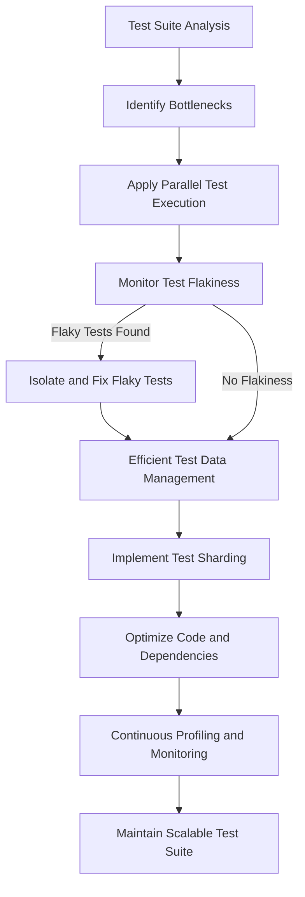

# Test Performance and Scaling Strategies

Optimize the efficiency and reliability of your test suite by applying proven strategies for performance scaling, parallelization, and flakiness minimization. This guide offers actionable insights and best practices aimed at managing large-scale test codebases, reducing test execution time, and maintaining test stability.

---

## Workflow Overview

### Purpose
This guide helps developers and testers improve the performance and scalability of their GoogleTest and GoogleMock test suites, especially when handling large or complex projects.

### Prerequisites
- A working GoogleTest and GoogleMock setup with existing tests.
- Familiarity with writing and running tests using GoogleTest.
- Basic understanding of test dependencies and environment setup.

### Expected Outcome
- Reduced test execution time through parallelization.
- Improved reliability of tests by addressing flaky behaviors.
- Streamlined management of test data and dependencies.

### Estimated Time
Optimizing and scaling test performance varies by project size but typically involves configuration and code improvements that can be implemented over hours to days.

### Difficulty Level
Intermediate to Advanced, depending on existing test suite complexity.

---

## Step-by-Step Instructions

### 1. Analyze Your Test Suite
- **Action:** Run a baseline test execution and measure time and resource usage.
- **Expected Result:** Identify slow tests or bottlenecks.

### 2. Apply Parallel Test Execution
- **Action:** Use GoogleTest’s `--jobs=N` or configure your build system (e.g., Bazel, CMake) to run tests in parallel.
- **Expected Result:** Tests run concurrently, reducing total execution time.
- **Tip:** Ensure tests are independent to avoid race conditions.

### 3. Minimize Test Flakiness
- **Action:**
  - Identify flaky tests by repeated runs.
  - Isolate causes like timing issues, shared state, or external dependencies.
  - Introduce synchronization primitives or mock external resources to stabilize tests.
- **Expected Result:** Tests have consistent pass/fail outcomes.
- **Best Practice:** Use GoogleMock to mock out unreliable or resource-intensive dependencies.

### 4. Manage Test Data Efficiently
- **Action:**
  - Use fixture setup and teardown to prepare and clean test data.
  - Where possible, use in-memory or ephemeral resources to speed up tests.
- **Expected Result:** Reduced overhead in preparing and cleaning state for tests.

### 5. Use Test Sharding
- **Action:** Partition tests into shards (groups) to distribute across multiple machines or CI nodes.
- **Expected Result:** Further scaling in distributed environments.
- **Note:** Configure test runners appropriately to run shards independently.

### 6. Optimize Code and Test Dependencies
- **Action:**
  - Reduce test dependencies on large external libraries.
  - Use GoogleMock’s capabilities to mock heavyweight collaborators.
- **Expected Result:** Tests compile and run faster with less overhead.

### 7. Regularly Monitor and Profile
- **Action:**
  - Periodically profile test runtime.
  - Adjust parallelism and resource usage based on profiling results.
- **Expected Result:** Sustained optimal performance.

---

## Practical Examples

### Parallel Execution Command
Run tests in parallel using GoogleTest’s built-in flag:

```bash
./my_test_binary --gtest_break_on_failure --gtest_shuffle --gtest_jobs=8
```

This will run up to 8 tests concurrently, speeding up test execution.

### Sample Bazel Configuration for Parallelism

```python
sharding_strategy = "parallel"
test_args = ["--test_env=GTEST_TOTAL_SHARDS=4", "--test_env=GTEST_SHARD_INDEX=0"]
```

Run with test shard indices 0 through 3 across nodes to distribute load.

### Mocking External Dependencies

```cpp
class MockDatabase : public DatabaseInterface {
 public:
   MOCK_METHOD(bool, Connect, (), (override));
   MOCK_METHOD(void, Query, (const std::string&), (override));
};

// Usage in test
MockDatabase mock_db;
EXPECT_CALL(mock_db, Connect()).WillOnce(Return(true));
```

Use mocks to replace real network or disk calls, speeding tests and reducing flakiness.

---

## Troubleshooting & Tips

### Common Issues

- **Race Conditions in Parallel Tests:** Ensure no shared global state or use mutexes.
- **Flaky Tests After Parallelization:** Investigate timing dependencies or unmocked external resources.
- **Excessive Resource Usage:** Tune the parallel job count to available CPU cores and memory.

### Tips for Success

- Use `NiceMock` to suppress warnings for less critical mocked methods.
- Isolate flaky tests and run them serially if necessary.
- Use `RetiresOnSaturation()` expectations to avoid 'sticky' expectations that cause failures.
- Regularly clear and verify mocks with `Mock::VerifyAndClear()` to avoid leaks and false positives.

### Performance Considerations

- Setting up and tearing down expensive fixtures can dominate runtime; batch related tests where possible.
- Profile test runs to pinpoint bottlenecks.
- Use `DefaultValue<T>::SetFactory()` to provide efficient default return_values, avoiding repetitive expensive constructions.

### Alternative Approaches

- Consider selective integration tests for slower, full-stack tests.
- Use test filters (`--gtest_filter`) to focus on critical paths during development.

---

## Next Steps & Related Content

- Explore [Parallel Test Execution](https://github.com/google/googletest/blob/main/docs/advanced.md#running-tests-in-parallel) for advanced strategies.
- Review [Mocking in Action Guides](../guides/mocking-in-action) for tips on reducing external dependencies.
- Refer to the [gMock Cookbook](gmock_cook_book.md) for advanced mocking techniques.
- Visit [Troubleshooting & Common Issues](getting-started/quickstart-and-troubleshooting/troubleshooting-validation) for diagnosing flaky tests.
- Understand GoogleTest’s [Command-Line Flags](core-testing-api/test-execution) for optimizing test runs.

---

**Summary Diagram**: Testing performance optimization flow


