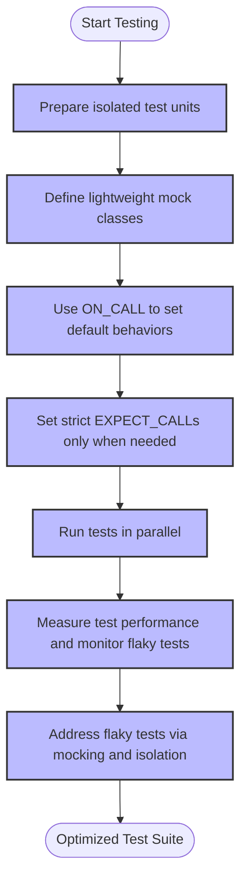

# Optimizing Test Performance and Scalability

## Overview
Efficient test suites are crucial for maintaining productivity and confidence in large-scale C++ projects. This guide provides best practices for writing fast, scalable, and reliable tests using GoogleTest and GoogleMock. By applying these strategies, you can reduce test execution time, avoid flaky tests, and leverage mocks effectively to minimize overhead.

---

## 1. Running Tests in Parallel

Parallel test execution maximizes use of available CPU cores, significantly reducing total runtime.

### How to Enable Parallel Test Execution

- Use GoogleTest's built-in support for running tests in parallel with the `--gtest_parallel` flag or external tools like `CTest` or Bazel's test runner.

- Divide your tests into smaller independent units that can safely run concurrently.

### Best Practices

- Ensure tests are independent and do not share mutable global state.
- Avoid writing tests that depend on external resources in ways that cause contention.
- Structure resource setup and teardown to prevent race conditions.

### Verifying Parallel Safety

- Run tests multiple times with parallelism enabled and monitor for flaky behavior.
- Use synchronization primitives in your test when accessing shared data.

<Tip>
Running tests in parallel reduces total test suite time but requires well-isolated tests to avoid flaky failures.
</Tip>

---

## 2. Avoiding Flaky Tests

Flaky tests undermine trust and cause wasted developer time.

### Common Causes of Flakiness

- Timing and concurrency issues
- Uninitialized or shared global state
- Reliance on external services or unstable resources
- Randomized inputs without control or logging

### Strategies to Prevent Flakiness

- Use mocks and fakes instead of real network, databases, or file systems when testing logic.
- Isolate each test case with fresh fixture setups.
- Favor deterministic inputs and explicit seeds when random values are necessary.
- Use GoogleMock's strictness controls to catch unexpected calls early.

### Diagnosing Flaky Tests

- Run tests repeatedly and under different environments.
- Use verbose logging (`--gtest_repeat`, `--gmock_verbose=info`) to trace unexpected behavior.

<Warning>
Avoid suppressing uninteresting call warnings in mocks unless you are confident no unexpected calls occur.
</Warning>

---

## 3. Reducing Overhead with Mocks

Mock objects help isolate tested units and reduce dependencies on costly or unstable components.

### Best Practices for Using Mocks Efficiently

- Define mocks only for interfaces your code depends on, minimizing scope.
- Prefer `ON_CALL()` to set default behaviors and only use `EXPECT_CALL()` when verifying invocation.
- Use `NiceMock<>` to suppress warnings related to uninteresting calls when appropriate.
- Keep mocks lightweight; avoid unnecessarily complex expectations and actions.
- Delegate to fakes or real objects if mocking complex functionalities is too burdensome.

### Example: Setting Default Actions with ON_CALL

```cpp
using ::testing::Return;
...
ON_CALL(mock_object, Method(_))
    .WillByDefault(Return(default_value));
```

### Example: Preventing Excessive Expectations

```cpp
EXPECT_CALL(mock_object, ProcessData(_))
    .Times(AtMost(5))
    .WillRepeatedly(Return(true));
```

### Avoiding Compilation and Runtime Costs

- Factor out mock constructors/destructors definitions into `.cc` files to reduce compile-time.
- Prefer light-weight mock actions instead of complex chained actions.

---

## 4. Measuring and Monitoring Test Performance

Understanding your test suite's performance is essential for optimization.

### Tools and Techniques

- Use built-in test timers or external profiling tools to identify slow tests.
- Enable GoogleTest's XML output and use CI dashboards for test duration tracking.
- Profile tests when running in parallel to detect contention or resource bottlenecks.

### Practical Steps

- Add timers in fixtures or test bodies to measure execution time of critical sections.
- Log or fail tests exceeding thresholds to prevent regressions.

---

## 5. Additional Tips and Best Practices

### Writing Tests for Large Projects

- Group tests logically by component or feature to enable selective execution.
- Use GoogleTest filters (`--gtest_filter`) to focus on subsets during development.
- Continuously refactor tests to keep them maintainable and performant.

### Using GoogleMock Strictness Controls

- Use `StrictMock<>` when you want to enforce strict call expectations.
- Use `NiceMock<>` for less noisy tests but still validating expectations.
- Avoid mixing strictness levels to reduce complexity.

### Managing Expectations and Default Actions

- Set expectations before exercising code to avoid undefined behavior.
- Use `.RetiresOnSaturation()` on `EXPECT_CALL()` to prevent unintended double matches.

### Common Pitfalls

- Expecting order without sequences or `InSequence` can cause confusing failures.
- Over-specifying arguments leads to brittle tests.
- Failing to mock virtual destructors can result in memory leaks detected as failures.

<Warning>
Always mock destructors virtual to ensure proper cleanup and prevent subtle runtime errors.
</Warning>

---

## Summary Diagram of Optimizations



---

## Troubleshooting

### Mock Methods Not Called as Expected

- Verify the method being mocked is `virtual`. Non-virtual methods are not intercepted unless using advanced techniques.
- Ensure expectations are set **before** the method calls.
- Use `--gmock_verbose=info` to get detailed traces of mock calls and matched expectations.

### Unwanted Warnings About Uninteresting Calls

- Confirm whether the mock should ignore calls (`NiceMock<>`) or fail on unexpected calls (`StrictMock<>`).
- If calls occur without `EXPECT_CALL`, define default actions with `ON_CALL` or catch-all `EXPECT_CALL` with `Times(AnyNumber())`.

### Slow Compilation of Mocks

- Move mock class constructors and destructors out of header files.
- Reduce the number of mocked methods in a single mock class.

### Heapcheck Failures

- Ensure base classes have virtual destructors to avoid incomplete destruction of derived objects.

---

## Next Steps & Related Content

- Explore [Using Mocks in Tests](https://google.github.io/googletest/guides/core-testing-workflows/using-mocks-in-tests.html) for deeper understanding of mocks.
- Review [Mock Strictness Controls](https://google.github.io/googletest/api/gmock_cook_book.html#NiceStrictNaggy) to master mock behavior control.
- Consult [Troubleshooting Common Issues](https://google.github.io/googletest/getting-started/first-steps/troubleshooting.html) for resolving build and execution problems.
- Integrate with your build system using instructions from [Build System Integration](https://google.github.io/googletest/guides/integration-and-best-practices/build-system-integration.html).

<Tip>
Regularly profile and monitor your test suite as it grows to maintain efficiency and reliability.
</Tip>
