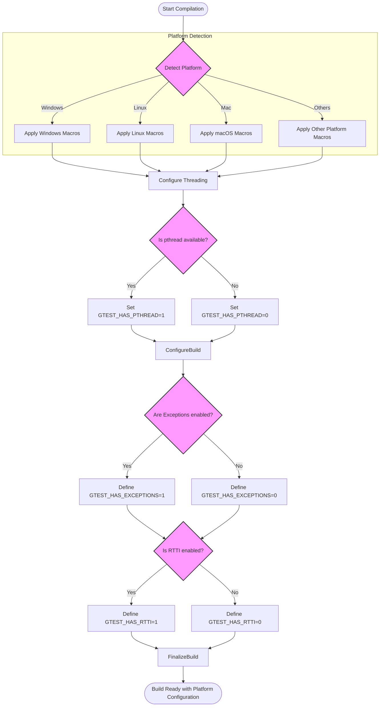

# Portability and Platform-Specific Tips

GoogleTest is designed to work seamlessly across a wide range of platforms and compiler environments. This guide helps you understand platform-specific nuances, macros that control behavior, common configuration pitfalls, and practical tips to ensure your test code remains portable and robust.

---

## 1. Understanding Platform Detection and Macros

GoogleTest automatically detects the platform it is being compiled on using preprocessor macros defined in the internal header `gtest-port-arch.h`. This detection informs behavior such as threading support, file system interaction, and exception handling.

### Key Platform Macros

- `GTEST_OS_WINDOWS`, `GTEST_OS_LINUX`, `GTEST_OS_MAC`, etc.: Identify the operating system.
- Sub-platforms like `GTEST_OS_WINDOWS_DESKTOP`, `GTEST_OS_WINDOWS_MINGW`, `GTEST_OS_LINUX_ANDROID`, or `GTEST_OS_IOS` refine the target environment.

You can rely on these macros for conditional compilation if you extend GoogleTest or write platform-specific test code.

<Tip>
Direct modification of these macros is not recommended. Instead, depend on their presence or absence to adapt to platforms.
</Tip>

---

## 2. Threading and Synchronization Support

GoogleTest is thread-safe on platforms where POSIX threads (`pthread`) or Windows threading primitives are available. It uses the `GTEST_HAS_PTHREAD` macro to determine pthread availability. On Windows, native synchronization is used instead.

### Controlling Threading Support

- You can force GoogleTest to enable or disable pthread support via compiler flags:

  ```sh
  -DGTEST_HAS_PTHREAD=1   # Enable pthread support
  -DGTEST_HAS_PTHREAD=0   # Disable pthread support
  ```

- When threading is supported, GoogleTest provides mutex and thread-local abstractions necessary for parallel test execution.

### Tips for Threaded Tests

- If your platform lacks pthread or threading support, GoogleTest compiles with dummy synchronization primitives. Tests relying on threads may not work reliably in such environments.

- On MinGW, GoogleTest disables pthread usage due to known conformance issues.

- Always confirm your build environment correctly detects threading capabilities to avoid subtle deadlocks or crashes.

<Warning>
Running multi-threaded tests on unsupported platforms can lead to undefined behaviors. Validate `GTEST_IS_THREADSAFE` macro if unsure.
</Warning>

---

## 3. Compiler and Build Environment Configuration

GoogleTest requires a C++17-compliant compiler environment. Managing compiler and linker flags is essential for compatibility and avoiding build issues.

### C++ Standard Requirement

- Ensure your build system enforces or requests the C++17 standard, e.g., with CMake:

  ```cmake
  set(CMAKE_CXX_STANDARD 17)
  set(CMAKE_CXX_STANDARD_REQUIRED ON)
  ```

- Some projects use compiler flags directly:

  ```shell
  -std=c++17
  ```

### Visual Studio Runtime Library Selection

- By default, Visual Studio projects link the C runtime dynamically, while GoogleTest links it statically. This mismatch causes linker errors like `LNK2038`.

- Resolve this by setting the CMake option `gtest_force_shared_crt` to `ON`:

  ```cmake
  cmake .. -Dgtest_force_shared_crt=ON
  ```

This ensures runtime library consistency between your code and GoogleTest.

### Building GoogleTest as a Shared or Static Library

- For most cases, static linking suffices.

- To build GoogleTest as a shared library (DLL on Windows):

  - Use the compiler flag `-DGTEST_CREATE_SHARED_LIBRARY=1`.

  - Link your tests with `-DGTEST_LINKED_AS_SHARED_LIBRARY=1`.

- This practice is recommended to avoid future compatibility issues, even if currently optional.

---

## 4. File System and Stream Redirection Considerations

GoogleTest uses file system features for death tests and some internal mechanisms.

### Supported Platforms and Limitations

- Most desktop and server platforms provide full file system support.

- Embedded and mobile platforms (e.g., Windows RT, Windows Phone, ESP8266, QuRT) often lack file system or stream redirection capabilities.

- The macro `GTEST_HAS_FILE_SYSTEM` is defined to 1 if the file system is available; otherwise 0.

- Stream redirection for capturing stdout/stderr is enabled if `GTEST_HAS_STREAM_REDIRECTION` equals 1.

### Impact on Tests

- Death tests require file system support. On unsupported platforms, death tests are disabled.

- Tests depending on reading/writing files will fail or behave incorrectly on platforms without these features.

<Note>
Check `GTEST_HAS_FILE_SYSTEM` and `GTEST_HAS_STREAM_REDIRECTION` macros if customizing GoogleTest behavior.
</Note>

---

## 5. Exception and RTTI Support

GoogleTest detects whether exceptions and RTTI (Run-Time Type Information) are enabled via:

- `GTEST_HAS_EXCEPTIONS`
- `GTEST_HAS_RTTI`

These influence certain test features and behavior.

### Customizing Exception Support

- If the compiler does not enable exceptions by default, or you need to override detection, define:

  ```shell
  -DGTEST_HAS_EXCEPTIONS=1
  -DGTEST_HAS_EXCEPTIONS=0
  ```

- GoogleTest disables exception-dependent features if exceptions are off.

### RTTI Handling

- Similarly, override RTTI detection with:

  ```shell
  -DGTEST_HAS_RTTI=1
  -DGTEST_HAS_RTTI=0
  ```

- This is important when you build with `-fno-rtti` or when using GoogleTest in environments without RTTI.

---

## 6. Naming Conflicts and Macro Renaming

GoogleTest's test and assertion macros are global symbols without namespace scoping, potentially clashing with other libraries.

### Avoiding Macro Clashes

- To prevent conflicts, you can instruct GoogleTest to rename its macros by disabling the default ones and using an alternative naming scheme.

- For example, to rename the `TEST()` macro, add to compiler flags:

  ```shell
  -DGTEST_DONT_DEFINE_TEST=1
  ```

- This requires you to write tests as:

  ```c++
  GTEST_TEST(SomeTestSuite, TestName) { ... }
  ```

- The same applies to all assertion macros, such as `ASSERT_EQ`, `EXPECT_TRUE`, etc., which get prefixed with `GTEST_`.

---

## 7. Practical Tips for Writing Portable Tests

- **Use GoogleTest APIs without platform-specific assumptions.** The framework abstracts OS-level details.

- **Check for macro definitions before platform-specific code:**
  ```c++
  #if defined(GTEST_OS_WINDOWS)
  // Windows-specific test logic
  #endif
  ```

- **Avoid relying on exceptions or RTTI unless confirmed supported and enabled.**

- **Be cautious with multi-threaded tests in embedded or limited environments.**

- **Use GoogleTest's built-in flags and features for platform adaptation instead of ad-hoc workarounds.**

- **On Windows, prefer using `gtest_force_shared_crt` option to prevent runtime conflicts.**

---

## 8. Troubleshooting Platform Issues

<AccordionGroup title="Common Platform Issues and Solutions">
<Accordion title="Linker Errors Due to Runtime Mismatches (Windows)">
If you encounter errors like `LNK2038` relating to runtime library mismatch, ensure that your project and GoogleTest use the same C runtime linkage:

- Set `gtest_force_shared_crt` to `ON` when using CMake.
- Ensure compiler flags `/MD` or `/MT` match between your code and the test framework.
</Accordion>
<Accordion title="Threading Problems on Unsupported Platforms">
GoogleTest will not function correctly with multi-threaded tests if pthreads or Windows threads are not supported.

- Confirm `GTEST_HAS_PTHREAD` macro is enabled if your platform supports pthreads.
- If your platform is not supported, avoid multi-threaded tests or run GoogleTest with threading disabled.
</Accordion>
<Accordion title="Death Tests Disabled on Embedded Platforms">
Death tests requires file system and process control features that embedded/mobile platforms may lack.

- Such tests are disabled automatically on platforms where `GTEST_HAS_DEATH_TEST` is zero.
- Avoid writing death tests targeting these platforms or use emulation during development.
</Accordion>
</AccordionGroup>

---

## 9. Summary

By understanding how GoogleTest interacts with platform-specific features and macros, you can write portable and reliable tests that work across operating systems and compilers. Use the provided macros and compiler flags to tailor GoogleTest’s behavior as needed for your environment.

Refer to related installation and integration guides to ensure your build system correctly sets up GoogleTest for your platform.

---

## 10. References and Further Reading

- [System Requirements & Prerequisites](../getting-started/prerequisites-installation/system-requirements.md)
- [Installing with CMake](../getting-started/prerequisites-installation/installation-cmake.md)
- [gtest/internal/gtest-port-arch.h](https://github.com/google/googletest/blob/main/googletest/include/gtest/internal/gtest-port-arch.h)
- [gtest/internal/gtest-port.h](https://github.com/google/googletest/blob/main/googletest/include/gtest/internal/gtest-port.h)
- [Quickstart & Installation Guide](../guides/getting-started/quickstart-installation.md)

<Callout>
Explore `gtest-port.h` and `gtest-port-arch.h` for detailed platform detection logic.
</Callout>

---

## 11. Diagram: GoogleTest Platform Adaptation Flow



---
