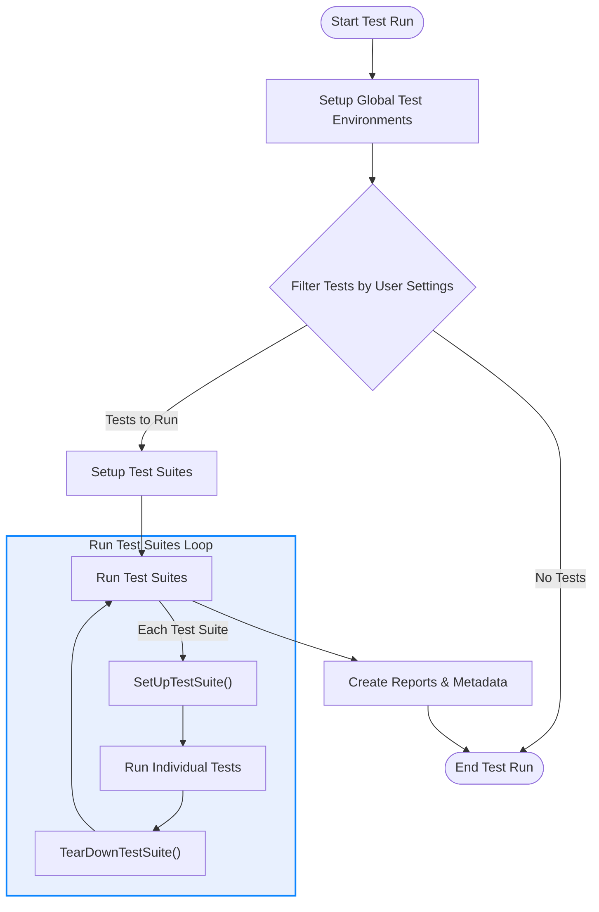

# Optimizing Test Performance and Parallel Runs

## Workflow Overview

To maximize productivity and reduce test suite execution time, this guide helps you optimize your GoogleTest test runs through smarter test structuring, resource sharing, and parallel execution techniques. By following these strategies, you will accelerate test feedback and improve iteration cycles in large C++ codebases.

### Prerequisites
- Basic familiarity with writing and managing tests in GoogleTest.
- Existing GoogleTest tests and test suites organized using standard macros like `TEST()`, `TEST_F()`, and `TEST_P()`.
- Development environment supporting concurrent execution, such as multi-core processors.

### Expected Outcome
- Learn how to structure tests and test suites to share resources efficiently.
- Understand methods to minimize redundant setup and teardown costs.
- Leverage parallelism and test sharding to run tests faster.
- Gain actionable insight into flags and environment variables that control test execution behavior.

### Estimated Time Commitment
Approximately 20–40 minutes depending on familiarity with GoogleTest and build environment.

### Difficulty Level
Intermediate

---

## Step-by-Step Instructions

### 1. Structure Tests for Efficient Setup and Teardown

Many tests share common expensive setup or teardown operations. To exploit this:

- Use test fixtures by deriving from `testing::Test` and grouping related tests via `TEST_F()` to reuse instance setup/teardown.
- Implement `static void SetUpTestSuite()` and `static void TearDownTestSuite()` in your fixture classes to perform per-suite setup/teardown that runs once per test suite. This reduces repeated expensive initialization:

```c++
class DatabaseTest : public testing::Test {
 protected:
  static void SetUpTestSuite() {
    // Initialize shared database connection once
  }

  static void TearDownTestSuite() {
    // Cleanup shared database connection once
  }

  void SetUp() override {
    // Quick per-test setup
  }

  void TearDown() override {
    // Cleanup per test
  }
};

TEST_F(DatabaseTest, QueryTest1) {
  // test body
}

TEST_F(DatabaseTest, QueryTest2) {
  // test body
}
```

**Success Criteria:** Suite-level setup and teardown reduce overall runtime compared to per-test equivalents.

---

### 2. Share Immutable Resources Across Tests

For costly immutable resources:

- Declare shared resources as static members in the test fixture class.
- Initialize them once in `SetUpTestSuite()`
- Clean them up in `TearDownTestSuite()`

**Tip:** Guard resource allocation in `SetUpTestSuite()` against multiple initializations, especially when test fixtures are inherited.

---

### 3. Use Value-Parameterized and Typed Tests to Avoid Code Duplication

Parameterized tests let you run the same logic with multiple inputs efficiently.

- Write a value-parameterized fixture inheriting from `TestWithParam<T>`, define `TEST_P()` tests.
- Instantiate tests with various parameter sets using `INSTANTIATE_TEST_SUITE_P()`.

This reduces duplicated code, focusing setup once per test logic rather than multiple distinct tests.

---

### 4. Run Tests in Parallel Using Sharding

GoogleTest supports sharding to distribute tests across multiple machines or CPU cores.

- Set the environment variables:
  - `GTEST_TOTAL_SHARDS` (total number of shards)
  - `GTEST_SHARD_INDEX` (the index of the current shard, zero based)

- Run the test binary simultaneously on multiple shards.

Example:

```bash
export GTEST_TOTAL_SHARDS=4
export GTEST_SHARD_INDEX=0  # for machine 1
./my_tests
```

Different shard indexes run disjoint subsets of tests, working in parallel to reduce total runtime.

**Note:** Tests must be written to avoid side effects that interfere when run concurrently.

---

### 5. Shuffle Test Execution Order

To uncover hidden dependencies between tests and improve test suite robustness:

- Use `--gtest_shuffle` flag to run tests in random order.
- Repeat tests with different seeds via `--gtest_random_seed=SEED`.

Shuffling exposes order-dependent failures that otherwise go unnoticed, improving test reliability.

---

### 6. Control Test Execution via Flags for Performance

Leverage these common flags:

- `--gtest_fail_fast` : Stops the test run on first failure, saving time during iterative development.
- `--gtest_repeat=N`  : Repeats tests N times to identify flaky tests; useful combined with shuffling.
- `--gtest_also_run_disabled_tests` : Run temporarily disabled tests for comprehensive checks.

Integrate these flags into your test runners or CI pipelines for improved control.

---

### 7. Minimize Setup Time with Custom Environments

For global setup/teardown that applies to all tests:

- Implement and register subclasses of `testing::Environment` via `AddGlobalTestEnvironment()`.
- Use `SetUp()` and `TearDown()` in the environment to prepare costly global resources.

This avoids redundant setup in each test suite, improving overall speed.

---

### Verification Steps

- Verify `SetUpTestSuite()` and `TearDownTestSuite()` run once per test suite.
- Confirm that shared static resources load correctly and tests access them without errors.
- Validate parallel shards execute disjoint test sets with no interference.
- Check output messages indicate sharding and shuffling took effect.
- Ensure runs with fail-fast stop early upon failure.

---

## Examples & Code Samples

### Example: Setting Up Per-Test-Suite Shared Resource

```c++
class NetworkTest : public testing::Test {
 protected:
  static void SetUpTestSuite() {
    server_ = new MockServer();
    server_->Start();
  }

  static void TearDownTestSuite() {
    server_->Stop();
    delete server_;
    server_ = nullptr;
  }

  // Each test can access the running server.
  static MockServer* server_;
};

MockServer* NetworkTest::server_ = nullptr;

TEST_F(NetworkTest, SendsData) {
  EXPECT_TRUE(server_->Receive(42));
}

TEST_F(NetworkTest, ErrorHandling) {
  EXPECT_FALSE(server_->Receive(-1));
}
```

### Example: Running Tests in a Sharded Environment

```bash
export GTEST_TOTAL_SHARDS=3

# On machine 1
export GTEST_SHARD_INDEX=0
./my_tests

# On machine 2
export GTEST_SHARD_INDEX=1
./my_tests

# On machine 3
export GTEST_SHARD_INDEX=2
./my_tests
```

Each machine runs only a fraction of the tests, parallelizing the workload.

### Example: Using `--gtest_shuffle` and `--gtest_repeat`

```bash
./my_tests --gtest_shuffle --gtest_repeat=100 \
  --gtest_random_seed=12345
```

This runs tests 100 times in random order, helping identify flakiness.

---

## Troubleshooting & Tips

### Common Issues

- **Tests interfering in parallel runs:**
  Check for shared state or resources not protected against concurrent access.
- **`SetUpTestSuite()` running multiple times unexpectedly:**
  Ensure no inheritance issues or multiple registrations causing re-invocation.
- **Flaky tests:**
  Use `--gtest_repeat` and `--gtest_shuffle` to isolate.
- **Test shards not running expected tests:**
  Verify `GTEST_TOTAL_SHARDS` and `GTEST_SHARD_INDEX` environment variables are correct.

### Best Practices

- Design tests to be independent and idempotent to safely support parallelization.
- Share expensive resources at the suite or global level when possible.
- Use sharding for large test suites to leverage multiple machines or cores.
- Shuffle tests regularly to catch hidden dependencies early.
- Use fail-fast in development for faster feedback; disable on CI for full coverage.

### Performance Considerations

- Avoid excessive global state that forces serial execution.
- Minimize operations in per-test `SetUp()` and `TearDown()`, push expensive operations to suite or global setup.
- Use lightweight value-parameterized tests to reduce code bloat and improve maintainability.

### Alternative Approaches

- Integrate GoogleTest with parallel test runners at build or CI level.
- Experiment with custom test environment objects to optimize resource reuse.

---

## Next Steps & Related Content

- Explore [Writing and Running Your First Test](../guides/getting-started/quickstart-testing) for basics of test creation.
- Read [Mocking Your First Class or Function](../guides/getting-started/first-mock) to add mocks reducing coupling.
- Learn about [Parameterized and Typed Tests](../guides/practical-testing-patterns/parameterized-testing) for scalable test coverage.
- Deep dive into [Death Tests](../guides/practical-testing-patterns/death-tests) to handle crash scenarios safely.
- Check [Continuous Integration: Running Tests Automatically](../guides/integration-and-best-practices/ci-integration) to embed optimized tests in pipelines.

---

## Summary Diagram of Optimized Test Execution Flow


