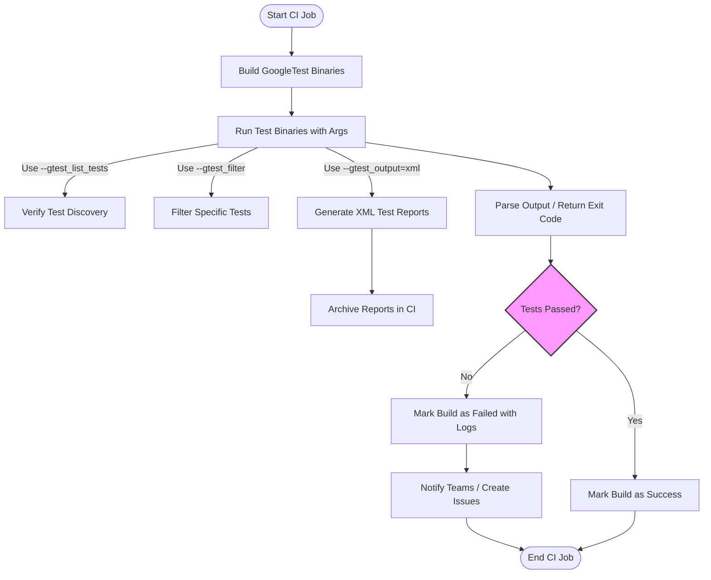

# Integrating with Continuous Integration Systems

## Workflow Overview

### Task Description
This guide provides practical, step-by-step workflows for integrating GoogleTest and GoogleMock into popular Continuous Integration (CI) environments. It focuses on how to configure test execution, interpret test output, generate meaningful reports, and troubleshoot common issues to achieve stable and actionable automated builds.

### Prerequisites
- GoogleTest and GoogleMock are installed and successfully built in your environment.
- Your test binaries compile and run locally with expected results.
- Familiarity with your CI system’s configuration and scripting environment.

### Expected Outcome
By following this guide, you will successfully integrate GoogleTest into your CI pipeline, enabling:
- Automated discovery and execution of tests.
- Detailed and parsable test reports for your CI dashboard.
- Robust handling of flaky or failing tests with actionable logs.
- Streamlined test execution scripts adaptable to different CI providers.

### Time Estimate
Moderate: Depending on your CI environment and existing setup, initial integration can take between 1 to 3 hours.

### Difficulty Level
Intermediate: Requires some knowledge of CI systems and command-line scripting.

---

## Step-by-Step Instructions

<Steps>
<Step title="Prepare Your Test Artifacts">
Ensure your GoogleTest binaries are built with debug symbols and all necessary runtime dependencies included. This allows your CI system to execute tests and collect comprehensive diagnostics.
- Build your test binaries using your project’s build system (e.g., CMake or Bazel).
- Verify the test binary runs locally and produces expected output.
</Step>

<Step title="Enable Test Discovery and Filtering">
Leverage GoogleTest’s built-in test discovery and filtering features to control test runs within your CI:
- Use `--gtest_list_tests` to confirm all tests recognized by your binaries.
- Configure your CI scripts to execute tests with appropriate filters via the `--gtest_filter` flag for targeted execution.
- Example: Run only tests matching `MyComponentTest.*`:

```bash
your_test_binary --gtest_filter=MyComponentTest.*
```

- Use `--gtest_repeat=N` to rerun flaky tests to enhance CI stability.
</Step>

<Step title="Enable Rich Test Output for CI Reporting">
GoogleTest supports multiple output formats:
- Use `--gtest_output=xml:<path>` to generate XML test result files compatible with many CI systems.
- Configure your CI job to archive these XML reports for display and analysis.

Example command:

```bash
your_test_binary --gtest_output=xml:$(pwd)/test-results/results.xml
```

- For parallel builds, generate unique XML paths to avoid collisions.
</Step>

<Step title="Integrate Test Execution into CI Pipelines">
Adapt your CI pipeline script to run GoogleTest binaries and collect results:
- Add explicit steps in your pipeline configuration (YAML, JSON, shell scripts, etc) to run tests.
- Capture and archive the XML output files for visualization.
- Configure your CI to fail builds on test failures by checking GoogleTest’s exit codes.

Example snippet for a shell script in CI:

```bash
set -e
./your_test_binary --gtest_output=xml:reports/test_results.xml
```

- Use environment variables if necessary for paths and filters.
</Step>

<Step title="Handle Test Failures and Flaky Tests">
Improve diagnosis and flakiness handling in CI:
- Use `--gtest_color=no` in CI to produce clean logs without escape characters.
- Run tests with `--gtest_verbose=info` to get detailed mock call logs if troubleshooting test failures.
- Implement test retries for flaky tests using `--gtest_repeat` or external retry logic.
- Collect and analyze failure logs, stack traces, and GoogleMock warnings for root cause analysis.
</Step>

<Step title="Implement Continuous Reporting and Notifications">
Configure your CI system to notify teams:
- Use your CI system’s native reporting to parse GoogleTest XML reports.
- Integrate with Slack, email, or issue trackers to send failures or flaky test alerts.
- Store historical test results for trend analysis.
</Step>
</Steps>

---

## Example: Simple Bash Script for CI Execution

```bash
#!/bin/bash
set -e  # Exit on first error

TEST_BINARY=./my_project_tests
REPORT_DIR=./test_reports

mkdir -p "$REPORT_DIR"

# Run all tests, output XML for CI consumption
$TEST_BINARY --gtest_output=xml:$REPORT_DIR/results.xml --gtest_color=no

EXIT_CODE=$?

if [ $EXIT_CODE -ne 0 ]; then
  echo "Tests failed. Review $REPORT_DIR/results.xml for details."
else
  echo "All tests passed successfully."
fi

exit $EXIT_CODE
```

This script can be invoked from your CI pipeline to automate test execution and reporting.

---

## Best Practices

- Always run tests with `--gtest_color=no` in CI to avoid ANSI escape sequences in logs.
- Use XML output to let CI systems parse and visualize test results.
- For flakiness, prefer retries over suppressing failures.
- Use `--gmock_verbose=info` judiciously for detailed mock behavior tracing, especially to debug unexpected or uninteresting calls.
- Keep tests hermetic and independent to reduce CI flakiness.
- Archive test artifacts and log output for post-mortem analysis.

---

## Troubleshooting Common Issues

### Tests Not Running or Being Detected
- Confirm your test binaries execute with no errors locally.
- Use `--gtest_list_tests` to verify discovery within the binary.
- Check that test binaries have executable permissions in the CI environment.

### XML Reports Not Found or Not Parsed
- Verify the output path is writable in the CI agent.
- Ensure unique XML files if running tests in parallel.
- Check CI system documentation for correct configuration of GoogleTest report import.

### Flaky Tests and Intermittent Failures
- Use test repetition flags like `--gtest_repeat` to identify flakes.
- Analyze failure logs with verbose mock output.
- Consider marking flaky tests with appropriate attributes or disable them temporarily.

### GoogleMock Warnings in CI Logs
- Adjust verbosity with `--gmock_verbose` flag:
  - `info` for detailed output
  - `warning` for typical warnings
  - `error` to hide warnings
- Use `NiceMock<>` wrapper classes to suppress uninteresting call warnings if intended.

---

## Next Steps & Related Content

- **Writing Your First Test**: Start with basics of writing and running tests.
- **Running and Interpreting Test Results**: Understand command-line options and analyzing output.
- **Using GoogleMock**: Learn to isolate dependencies with mock objects.
- **Configuring GoogleTest Basics**: Know setup and integration details.
- **Troubleshooting and Validation**: Solve common setup and runtime problems.

For more advanced CI integration scenarios, refer to dedicated CI documentation or advanced guides for your CI platform.

---

## References

- [GoogleTest: Getting Started](https://github.com/google/googletest/blob/main/docs/primer.md)
- [GoogleMock Cheat Sheet](https://google.github.io/googletest/gmock_cheat_sheet.html)
- [gMock FAQ](https://google.github.io/googletest/gmock_faq.html)
- [Running and Interpreting Test Results](../getting-started-workflows/running-interpreting-tests.md)
- [Writing Your First Test](../getting-started-workflows/writing-first-test.md)


---

## Diagram: GoogleTest Integration in CI Flow



This flowchart visualizes how GoogleTest fits into a typical CI pipeline.


<Tip>
When setting up your CI integration, start simple: run all tests once and produce XML reports. Once stable, refine by adding filters, retries, and notifications.
</Tip>

<Warning>
Do not suppress uninteresting or unexpected mock warnings blindly; instead, use mocks and expectations appropriately to maintain test integrity.
</Warning>
