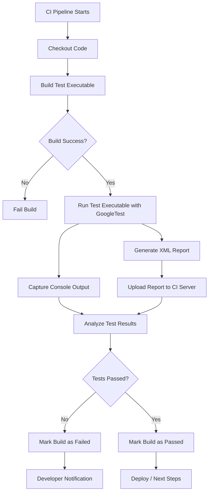

# Continuous Integration (CI) with GoogleTest

## Overview

This guide helps you seamlessly embed your GoogleTest-powered test runs into your Continuous Integration (CI) workflows. It covers example scripts and practical advice for running tests across Linux, macOS, and Windows platforms. You'll also learn how to collect test results and generate reports that CI systems can consume efficiently.

## Prerequisites

- A working GoogleTest test suite compiled into an executable.
- Basic familiarity with your CI environment (e.g., Jenkins, GitHub Actions, GitLab CI).
- Access to the command line on target CI systems.
- (Optional) CMake or build system integration for test execution.

## Expected Outcome

By completing this guide, you will be able to automate running your GoogleTest suites within CI pipelines, capture meaningful console output, and generate XML reports for test result visualization and failure tracking.

## Time Estimate

Configuring basic CI integration typically takes between 15 to 60 minutes depending on experience and CI system complexity.

## Difficulty Level

Intermediate: You should be comfortable with command line tools and basic CI pipeline configuration.

---

## 1. Running GoogleTest in CI Environments

GoogleTest executables are designed to run all tests automatically without additional registration. Your CI system needs only to invoke the test binary and interpret the results.

### Step 1: Build Your Tests in CI

Ensure your CI pipeline compiles your test binaries correctly:

- Use your existing CMake or build scripts.
- For CMake, a simple invocation might be:

```bash
mkdir -p build && cd build
cmake .. -DBUILD_GMOCK=OFF
make
```

- This step must succeed before test execution.

### Step 2: Execute Tests

Run your test executable as a command in your CI pipeline:

```bash
./path/to/your_test_binary
```

- By default, GoogleTest runs all registered tests and prints a summary.
- The exit code is `0` if all tests pass; non-zero otherwise.

### Step 3: Use GoogleTest Flags for CI-Friendly Output

Enhance output by generating XML reports, which most CI servers can parse:

```bash
./your_test_binary --gtest_output=xml:report.xml
```

- The `--gtest_output=xml:<file>` flag writes detailed, machine-readable results.
- Point your CI server’s test results parser to this XML file.

---

## 2. Platform-Specific Example Scripts

Below are example shell snippets you can adapt for your CI environment.

### Linux/macOS Example

```bash
#!/bin/bash
set -e

# Build tests
mkdir -p build && cd build
cmake ..
make

# Run tests with XML output
./your_test_binary --gtest_output=xml:report.xml

# Exit with test binary exit code
exit $?
```

### Windows Example (PowerShell)

```powershell
# Navigate to build directory
if (-Not (Test-Path build)) { New-Item -ItemType Directory -Path build }
cd build

# Configure and build with CMake
cmake ..
cmake --build .

# Run tests with XML output
.
\your_test_binary.exe --gtest_output=xml:report.xml

# Exit with test exit code
exit $LASTEXITCODE
```

---

## 3. Integrating Test Results into CI

Most CI platforms like Jenkins, GitHub Actions, and GitLab have built-in support or plugins for parsing GoogleTest XML reports.

### Jenkins

- Use the [Google Test Plugin](https://plugins.jenkins.io/google-test/) or the XUnit plugin.
- Configure the job to publish the test report from the XML generated.

### GitHub Actions

- Use community actions like `mikeal/google-test-reporter` or process the XML with your own scripts.

### GitLab CI

- Use the `junit` artifact option to upload the XML report:

```yaml
test:
  script:
    - ./your_test_binary --gtest_output=xml:report.xml
  artifacts:
    reports:
      junit: report.xml
```

---

## 4. Tips and Best Practices

- **Always return the exit code from `RUN_ALL_TESTS()`** in your test main. This exit code informs the CI system about test success or failure.

- **Generate XML reports** for richer integration with CI dashboards beyond console logs.

- **Filter tests if needed** with `--gtest_filter=` to speed up CI runs, especially for large test suites.

- Use `--gtest_repeat=N` to rerun tests multiple times for flaky test detection.

- Configure test sharding if your CI system supports parallelization.

- Capture and archive both console output and XML results for debugging.

- Leverage GoogleTest flags like `--gtest_brief` or `--gtest_color` to control verbosity and readability in CI logs.

---

## 5. Troubleshooting Common CI Issues

### Tests Fail to Run or Are Not Detected

- Verify tests are linked correctly and the test executable is up to date.
- Confirm tests are not disabled (check test names starting with `DISABLED_`).
- Use `--gtest_list_tests` to ensure tests are registered in the binary.

### Exit Code Not Propagating

- Ensure your `main()` function returns the result of `RUN_ALL_TESTS()`.
- Avoid swallowing exit codes in wrapper scripts.

### XML Report Not Generated or Invalid

- Verify file write permissions in your CI workspace.
- Check for correct usage of `--gtest_output=xml:<file>` flag.

### Flaky Tests or Random Failures

- Use `--gtest_repeat` combined with `--gtest_shuffle` to identify intermittent failures.
- Investigate shared resource contention or dependencies between tests.

---

## 6. Continuous Integration Workflow Diagram



---

## 7. Next Steps & Resources

- Review the [GoogleTest Primer](https://google.github.io/googletest/primer.html) for an in-depth understanding of writing tests.
- Explore the [Building and Running Tests in Real Projects](../build-and-run-integration) guide for detailed build system integration.
- Consult your specific CI provider's documentation for configuring test result parsing.
- Investigate [Scaling and Optimizing Test Suites](../scaling-and-optimizing-test-suites) to improve CI speed.

---

## 8. References

- [GoogleTest User Guide](https://google.github.io/googletest/)
- [GoogleTest Primer](https://google.github.io/googletest/primer.html)
- [GoogleTest Command Line Flags](https://google.github.io/googletest/reference/advanced.html#running-a-subset-of-the-tests)
- [GoogleTest XML Output](https://google.github.io/googletest/reference/advanced.html#generating-xml-output)
- [CI Integration Examples](https://github.com/google/googletest/tree/main/docs/examples)

---

<Check>
Remember: Automating tests and collecting results responsibly ensures your CI pipeline remains a reliable gatekeeper for quality and stability.
</Check>