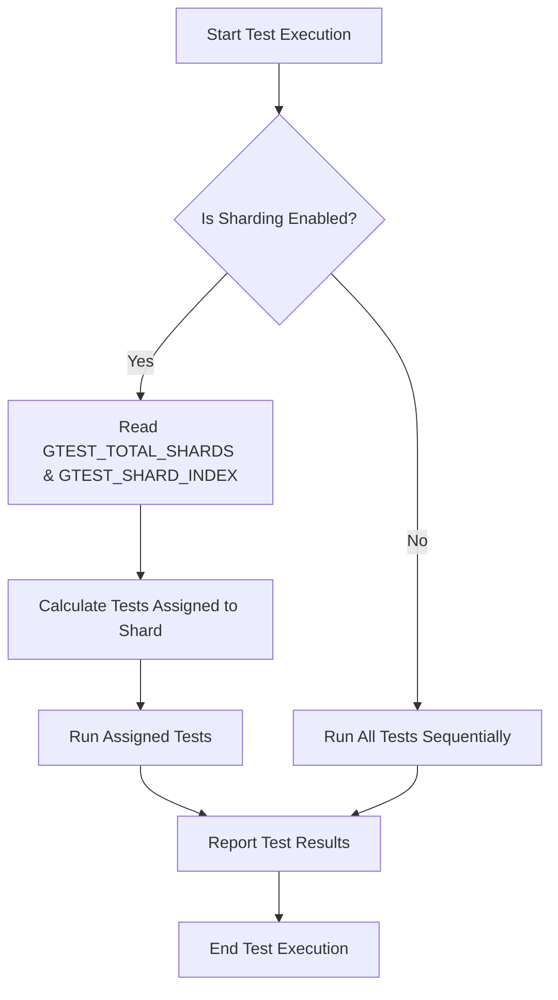

# Performance and Test Suite Optimization

GoogleTest provides several strategic features and best practices to optimize your test suite's build and execution times. This guide focuses solely on techniques available within GoogleTest for accelerating test runs through parallelism, test selection, and assertion efficiency. Implementing these strategies ensures rapid feedback cycles and enhanced productivity for your development team.

---

## 1. Workflow Overview

### Task Description
Learn how to efficiently reduce build and test execution times by leveraging GoogleTest features such as parallel test execution (sharding), selective test filtering, resource reuse, and optimized assertions.

### Prerequisites
- A working GoogleTest test suite with multiple test cases.
- Familiarity with running tests via `RUN_ALL_TESTS()` and command-line flags.
- Access to environment variable configuration or command-line test runners.

### Expected Outcome
By following this guide, you will:
- Implement test sharding to run tests concurrently across multiple environments.
- Use test filtering to focus on critical or changed tests.
- Apply assertion best practices to reduce unnecessary overhead.
- Employ available flags to further control test execution behavior.

### Time Estimate
10-30 minutes, depending on test suite size and existing setup.

### Difficulty Level
Intermediate — assumes basic understanding of GoogleTest test execution and command-line usage.

---

## 2. Step-by-Step Instructions

### Step 1: Use Test Sharding to Parallelize Execution

To distribute your test suite workload across multiple machines or processes, use GoogleTest’s built-in test sharding feature.

**How it works:**
- Each shard runs a subset of tests, ensuring all tests run exactly once overall.
- This is controlled via environment variables.

**Action:**
1. Set `GTEST_TOTAL_SHARDS` to the total number of shards.
2. Set `GTEST_SHARD_INDEX` to the zero-based index of the current shard.

For example, with 3 shards:

```bash
export GTEST_TOTAL_SHARDS=3
export GTEST_SHARD_INDEX=0
./foo_test  # Runs tests for shard 0

export GTEST_SHARD_INDEX=1
./foo_test  # Runs tests for shard 1

export GTEST_SHARD_INDEX=2
./foo_test  # Runs tests for shard 2
```

GoogleTest automatically filters tests assigned to each shard. 

**Verify sharding support:**
Set `GTEST_SHARD_STATUS_FILE` to a file path; if the file is created, the test program supports sharding.

<Check>
Using sharding effectively speeds up large suites by executing tests concurrently across multiple nodes or CPU cores.
</Check>

---

### Step 2: Filter Tests to Run Only Relevant Subsets

Avoid running all tests when you only want to validate changes or specific functionality.

**How to filter tests:**
Use the `--gtest_filter` flag or `GTEST_FILTER` environment variable with patterns.

**Examples:**

- Run all tests in suite `FooTest`:

  ```bash
  ./foo_test --gtest_filter=FooTest.*
  ```

- Run tests matching "Null" or "Constructor":

  ```bash
  ./foo_test --gtest_filter=*Null*:*Constructor*
  ```

- Exclude death tests:

  ```bash
  ./foo_test --gtest_filter=-*DeathTest.*
  ```

- Run everything except a single test `FooTest.Bar`:

  ```bash
  ./foo_test --gtest_filter=FooTest.*-FooTest.Bar
  ```

**Tips:**
- Test full names have the format `TestSuiteName.TestName`.
- Wildcards `*` (any string) and `?` (single character) are supported.

<Warning>
Ensure that filtering is aligned with your test coverage goals to avoid missing critical failures.
</Warning>

---

### Step 3: Reuse Resources and Optimize Test Fixtures

If some resource setup is expensive, share it across multiple tests in the same test suite.

**How to implement:**
- Use `SetUpTestSuite()` and `TearDownTestSuite()` static methods to allocate and release resources once per test suite.

Example:

```c++
class FooTest : public ::testing::Test {
 protected:
  static Resource* shared_resource_;

  static void SetUpTestSuite() {
    shared_resource_ = new Resource();
  }

  static void TearDownTestSuite() {
    delete shared_resource_;
    shared_resource_ = nullptr;
  }
};
Resource* FooTest::shared_resource_ = nullptr;
```

This prevents costly re-creation of shared data for each test.

---

### Step 4: Optimize Assertions for Speed

Assertions impact test execution speed; use efficient assertions thoughtfully:

- Prefer `EXPECT_*` over `ASSERT_*` unless a failure should stop the test.
- Avoid complex computation inside assertions.
- Use predicate assertions with informative messages to reduce debugging time.

Example of fine-tuned assertion:

```c++
EXPECT_EQ(x.size(), y.size()) << "Sizes don't match";
```

---

### Step 5: Use Test Repetition and Shuffling for Robustness

You can detect flaky tests by repeating tests multiple times:

```bash
./foo_test --gtest_repeat=1000
```

Combine with shuffling to expose order dependencies:

```bash
./foo_test --gtest_shuffle --gtest_repeat=10
```

Consider stabilizing random seeds with `--gtest_random_seed=12345` to reproduce failures.

---

### Step 6: Configure Flags for Faster Feedback

Use additional flags to tailor your test runs:

- `--gtest_fail_fast=1`: stops at first failure.
- `--gtest_also_run_disabled_tests=1`: include disabled tests if needed.
- `--gtest_brief=1`: only print failures to reduce output size.
- `--gtest_break_on_failure=1`: useful to drop into debugger upon failure in IDE environment.

---

## 3. Examples

### Example: Running Tests on Two Machines (Sharding)

Suppose you have 20 tests and two build agents.

```bash
# On Machine 1:
export GTEST_TOTAL_SHARDS=2
export GTEST_SHARD_INDEX=0
./my_tests

# On Machine 2:
export GTEST_TOTAL_SHARDS=2
export GTEST_SHARD_INDEX=1
./my_tests
```
Each shard runs about half the tests.

### Example: Selective Test Run

```bash
./my_tests --gtest_filter=LoginTest.*
```
Runs only all tests in the `LoginTest` test suite.

### Example: Repeating and Shuffling Tests

```bash
./my_tests --gtest_shuffle --gtest_repeat=50
```
Runs all tests in a random order 50 times, uncovering ordering issues.

### Example: Shared Setup in Test Suite

```c++
class DatabaseTest : public ::testing::Test {
 protected:
  static DatabaseConnection* connection_;

  static void SetUpTestSuite() {
    connection_ = DatabaseConnection::Create("test_db");
  }

  static void TearDownTestSuite() {
    delete connection_;
    connection_ = nullptr;
  }
};

DatabaseConnection* DatabaseTest::connection_ = nullptr;

TEST_F(DatabaseTest, Insert) {
  EXPECT_TRUE(connection_->Insert("some data"));
}
```
This avoids opening/closing the connection for each test.

---

## 4. Troubleshooting & Tips

### Common Issues

- **Shard Index Out of Range Errors:** Ensure `GTEST_SHARD_INDEX` < `GTEST_TOTAL_SHARDS`.
- **Tests Not Running with Filter:** Confirm the test full names match the filter patterns.
- **Longer Test Execution Despite Parallelism:** Evaluate fixture setup cost and dependencies that serialize tests.
- **Race Conditions in Parallel Tests:** Verify thread safety of resources and test code.

### Best Practices

- Balance shard count with hardware cores and expected test run length.
- Avoid shared mutable state between tests to maintain independence.
- Use `SCOPED_TRACE` to improve failure diagnostics when running parallel tests.
- Use `--gtest_break_on_failure` while debugging flaky or failing tests.

### Performance Considerations

- Use `SetUpTestSuite()` to amortize expensive setup.
- Filter tests aggressively during development.
- Disable tests not needed in quick feedback loops.

### Alternative Approaches

- For extremely large test suites, consider custom test runners that coordinate shards and aggregate reports.
- Use GoogleTest's streaming output feature to integrate with build dashboards.

---

## 5. Next Steps & Related Content

- Explore the [Value-Parameterized and Typed Tests guide](../advanced-testing-patterns/parameterized-and-typed-tests) to write flexible test scenarios.
- Read the [Writing Death Tests guide](../advanced-testing-patterns/death-tests) to handle critical failure testing safely.
- Apply [Custom Assertions and Matchers](../advanced-testing-patterns/custom-assertions-and-matchers) to write optimized and descriptive test checks.
- Check out the [Integration with Build Systems](build-system-integration) guide on testing automation.


---

## References

- [GoogleTest Primer](../primer.md)
- [Testing Reference](../reference/testing.md)
- [GoogleTest Flags Documentation](https://github.com/google/googletest/blob/main/docs/primer.md#running-test-programs-advanced-options)

---

For detailed test configuration flags, see the [Testing Reference - RUN_ALL_TESTS and Flags](../reference/testing.md#RUN_ALL_TESTS).

---

# Visualization of Test Sharding Workflow



---

This guide focuses on improving your test feedback loop by maximizing parallelism, targeted test execution, and efficient assertions within GoogleTest's ecosystem.

<Tip>
If your test suite is too slow, start by identifying and fixing the slowest tests, then apply sharding and filtering to optimize overall build time.
</Tip>

<Tip>
Use `--gtest_list_tests` to view all test suites and test names to help craft precise filters.
</Tip>

<Tip>
To reliably repeat flaky tests, specify `--gtest_repeat` combined with a fixed `--gtest_random_seed`.
</Tip>

<Note>
Remember that running tests in parallel or in shards does not guarantee thread safety — ensure your test code and tested code are thread-safe or independent.
</Note>

<Warning>
Avoid heavy side effects or non-idempotent code in constructors or `SetUpTestSuite()` methods that might cause inconsistent test behaviors in sharded environments.
</Warning>
