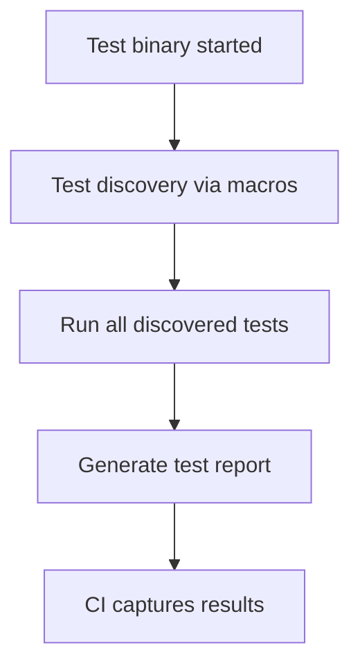

# Continuous Integration with GoogleTest

## Overview

This guide helps you set up fast and reliable continuous integration (CI) pipelines to run your GoogleTest-based C++ test suites automatically. You will learn how to integrate GoogleTest into popular CI environments, make the most of GoogleTest's automatic test discovery to run targeted tests, and generate detailed reports to track testing quality as your codebase evolves.

**Prerequisites:**
- You have a C++ project with GoogleTest integrated.
- Your test suites successfully build and run locally.
- Familiarity with basic CI concepts and your chosen CI platform.

**Expected Outcome:**
- A working CI pipeline that builds your project, runs tests, and reports results.
- Automated test filtering and reporting strategies optimized for CI.

**Time Estimate:** 30-60 minutes to configure and validate typical CI integration.

**Difficulty Level:** Intermediate

---

## 1. Setting Up GoogleTest in CI Environments

GoogleTest supports automated test discovery and flexible execution, making it ideal for CI pipelines. The first step is ensuring your project builds correctly in the CI environment with GoogleTest included.

### 1.1. Build Integration

- Use CMake to build GoogleTest and your tests in the CI system. Typical commands in your CI build script:

```bash
git clone https://github.com/google/googletest.git -b v1.17.0 googletest
mkdir build && cd build
cmake .. # Or cmake .. -DBUILD_GMOCK=OFF if not using GoogleMock
make -j$(nproc)
```

- Incorporate GoogleTest either as an installed dependency or as part of your project via CMake's `FetchContent` or `add_subdirectory()`. This ensures consistent compiler/linker flags across your project and tests.

### 1.2. Compiler Settings

- Ensure the CI environment uses a compiler with C++17 support.
- Set necessary compiler flags such as `-DGTEST_HAS_PTHREAD=1` if your environment requires explicit thread support.

### 1.3. Linking

- Link tests with `gtest_main` or `gmock_main` libraries to avoid writing your own main function. This provides a standard test runner entry.

---

## 2. Running Tests in CI

With the build working, configure the CI job to execute tests and capture their results.

### 2.1. Basic Test Execution

- Run your test binary in the CI job.
- Example:

```bash
./my_tests_binary
```

- GoogleTest's `RUN_ALL_TESTS()` command runs all discovered tests automatically.

### 2.2. Selective Test Running and Filtering

- Use GoogleTest command-line flags to run subsets of tests:
  - `--gtest_filter=` to specify which tests to run (e.g., `--gtest_filter=MySuite.*`)
  - `--gtest_repeat=` to run tests multiple times
  - `--gtest_shuffle` to randomize test order

- In CI, filtering can speed up runs or isolate flaky tests.

### 2.3. Generating Test Reports

- Produce XML or JSON reports for CI systems to consume:
  - Use the `--gtest_output=xml:<path>` flag to generate XML reports compatible with many CI interfaces such as Jenkins, GitLab CI, or GitHub Actions.

- Example:

```bash
./my_tests_binary --gtest_output=xml:test_results.xml
```

- Configure your CI system to collect and display these results.

---

## 3. Platform-Specific CI Integration Tips

### 3.1. Linux and macOS

- Use standard CMake build workflow with `make` or `ninja` in CI.
- Ensure `libpthread` or equivalent threading libraries are linked if not automatic.

### 3.2. Windows

- Use Visual Studio solution files generated by CMake (`.sln`).
- Pay attention to runtime library mismatches (dynamic vs static CRT)
  - Enable `gtest_force_shared_crt` option in CMake to prevent linker errors due to mismatched runtime linkage.

### 3.3. Embedded and Special Platforms

- GoogleTest supports platforms like Arduino or ESP32 where entry points differ (e.g., `setup()`/`loop()` instead of `main()`).
- Implement platform-specific initializations as required by your build and device environment.

---

## 4. Test Discovery in CI Context

GoogleTest automatically discovers all tests marked with `TEST()`, `TEST_F()`, and similar macros.

This automation:
- Eliminates manual test registration, reducing maintenance overhead.
- Works well with CI, as new tests are automatically included without CI script changes.

For example, when your test binary is run without filters, it discovers and runs:



In CI, make use of `--gtest_list_tests` to see which tests will be executed before running them fully.

---

## 5. Reporting Strategies

### 5.1. Use XML Report Output

- CI tools can parse GoogleTest XML reports to display test results with pass/fail status, errors, and failures.
- Example flag:

```bash
--gtest_output=xml:/path/to/results.xml
```

### 5.2. Continuous Feedback

- Combine test reports with CI notifications (email, Slack, etc.) to alert teams on failures.
- Set your CI to fail the build if any tests fail, enforcing quality.

### 5.3. Test Logs and Debugging

- Capture console output to aid diagnosing test failures.
- Use `--gtest_catch_exceptions=0` to let exceptions propagate for debuggers if your CI environment supports it.

---

## 6. Best Practices for CI

- **Parallel Builds and Tests:** Utilize CI parallelism to speed up both building and running tests.
- **Isolate Dependencies:** Use `FetchContent` or submodules to pin GoogleTest versions, ensuring reproducible builds.
- **Avoid Flaky Tests:** Use filtering and repeated runs (`--gtest_repeat`) to identify unstable tests.
- **Use Static Linking Carefully:** On Windows, mismatch in runtimes (static vs dynamic) can cause linker errors - enable the `gtest_force_shared_crt` flag.

---

## 7. Troubleshooting Common CI Issues

### Problem: Tests don’t run in CI or produce errors
- **Check build logs:** Verify GoogleTest is correctly built and linked.
- **Ensure C++17 support:** Confirm the compiler version in CI supports C++17.
- **Check thread libraries:** On Linux/macOS, ensure pthreads are linked.

### Problem: Link errors on Windows
- Use `-Dgtest_force_shared_crt=ON` in your CMake command.

### Problem: No test results are reported to CI
- Confirm `--gtest_output=xml:filename.xml` is specified.
- Check file permissions and paths in CI.

### Problem: CI build slow due to test time
- Use test filtering to run incremental or critical tests.
- Parallelize test runs using test runners like [gtest-parallel](https://github.com/google/gtest-parallel).

---

## 8. Example: CI Pipeline Snippet Using CMake and GoogleTest

```yaml
# Example GitHub Actions workflow snippet
name: C++ GoogleTest CI

on: [push, pull_request]

jobs:
  build_and_test:
    runs-on: ubuntu-latest

    steps:
    - uses: actions/checkout@v3

    - name: Install dependencies
      run: sudo apt-get install -y cmake build-essential

    - name: Build project with GoogleTest
      run: |
        mkdir build
        cd build
        cmake ..
        make -j$(nproc)

    - name: Run tests with GoogleTest
      run: |
        ./build/my_tests_binary --gtest_output=xml:test_results.xml

    - name: Upload test results
      uses: actions/upload-artifact@v3
      with:
        name: test-results
        path: test_results.xml
```

---

## 9. Next Steps & Related Documentation

- Explore [Building and Running Tests](https://google.github.io/googletest/guides/integration-and-practical-patterns/building-and-running-tests.html) for detailed CMake and Bazel integration.
- Consult [Test Discovery and Organization](https://google.github.io/googletest/guides/core-testing-workflows/test-discovery-and-organization.html) to optimize test suites and filtering.
- Review [Troubleshooting Common Installation Issues](https://google.github.io/googletest/getting-started/first-test-run-validation/troubleshooting-common-issues.html) for help resolving build or runtime errors.
- For advanced scenarios, see the [Continuous Integration & Automation](https://github.com/google/googletest) community tools like `gtest-parallel`.


<Tip>
Remember, linking GoogleTest properly and enabling test result output is key to effective CI integration. Start simple, verify your tests run and produce reports, and then enhance your pipeline with filtering, parallel execution, and platform-specific tweaks.
</Tip>

<Check>
Verify your CI system collects and parses the XML output to display test results in your dashboard.
</Check>

---

## References

- [GoogleTest README - Building and Integration](https://github.com/google/googletest/blob/main/googletest/README.md)
- [GoogleTest Primer](https://google.github.io/googletest/primer.html)
- [GoogleTest Command-Line Flags](https://google.github.io/googletest/advanced.html#running-the-tests)
- [gtest-parallel](https://github.com/google/gtest-parallel) test runner
