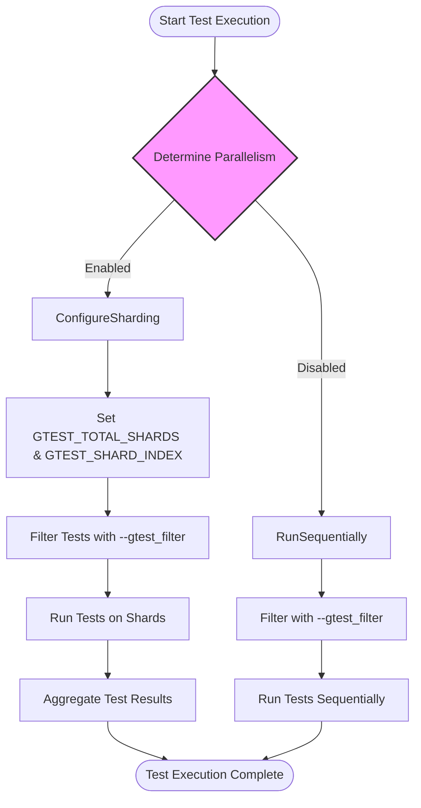

# Performance Optimization for Test Suites

## Overview

Effective test execution is vital for maintaining rapid feedback loops and ensuring confidence in software quality, especially in large-scale C++ projects using GoogleTest. This guide focuses exclusively on practical techniques available within GoogleTest to optimize test suite performance. We cover parallel test execution, test filtering strategies, and scalable test organization, enabling developers to minimize test runtime, reduce flakiness, and streamline development workflows.

---

## Prerequisites

Before applying these optimizations, ensure that:
- Your tests are properly structured using GoogleTest's macros and fixtures.
- You have a build system set up (CMake or Bazel) that can manage dependencies efficiently.
- You understand basic test discovery and organization concepts (see the [Test Discovery and Organization](../core-testing-workflows/test-discovery-and-organization.md) guide).
- Your system meets the minimum requirements for parallel execution as outlined in [System Requirements & Supported Platforms](../../getting-started/setup-prerequisites/system-requirements.md).

---

## Expected Outcomes

By following the recommendations in this guide, you will:
- Achieve faster test suite execution through concurrent test runs.
- Efficiently select and run only relevant tests using advanced filtering.
- Organize your tests for scalable growth and maintainability.
- Reduce intermittent test failures caused by resource conflicts or flakiness.

Estimated completion time: 30–60 minutes (including configuration and initial testing)

Difficulty level: Intermediate

---

## 1. Running Tests in Parallel

Parallelization drastically reduces total test runtime by leveraging multiple CPU cores or machines.

### Steps:

1. **Enable Parallel Test Execution Using `--jobs` or `--gtest_parallel`**
   - Use `gtest-parallel` (Google's Python-based test runner) to distribute test binaries or test cases across multiple CPU cores.
   - Alternatively, use your build system's parallel test capabilities combined with GoogleTest's sharding.

2. **Configure GoogleTest for Test Sharding**
   - Set the environment variables:
     - `GTEST_TOTAL_SHARDS`: Total number of shards (parallel nodes).
     - `GTEST_SHARD_INDEX`: The zero-based index of the current shard.
   - GoogleTest will then run a distinct subset of tests on each shard.

3. **Verify Requests Are Isolated**
   - Make sure tests do not share state unexpectedly (e.g., temporary files, databases).
   - Use `SetUp()` and `TearDown()` in test fixtures to create clean environments per test.

4. **Combine Results Appropriately**
   - Collect test output from all shards and aggregate pass/fail results.

### Example:

```bash
export GTEST_TOTAL_SHARDS=4
export GTEST_SHARD_INDEX=0  # Change to 1, 2, 3 for other shards
./my_test_binary --gtest_filter=*  
```

Repeat on separate machines or processes with different `GTEST_SHARD_INDEX` values.

### Tips:
- Use `gtest-parallel` available at https://github.com/google/gtest-parallel to manage parallel execution seamlessly.
- Ensure that each shard has sufficient resources.

---

## 2. Effective Test Filtering

Selective test execution avoids wasting time on irrelevant or unchanged test cases.

### Strategies:

1. **Use `--gtest_filter` Flag to Run a Subset of Tests**
   - Filter tests by test suite, test name, or pattern matching.
   - Example: `--gtest_filter=MySuite.*` runs all tests in `MySuite`.

2. **Exclude Tests Using Negative Patterns**
   - Use `-` to exclude patterns, e.g., `--gtest_filter=*:-*FlakyTest`.

3. **Combine Patterns**
   - Use colon-separated lists, e.g., `--gtest_filter=Suite1.*:Suite2.Test3`.

4. **Disable Tests Temporarily**
   - Prefix test or test suites with `DISABLED_` to exclude from runs without removing them.

### Example:

```bash
./my_test_binary --gtest_filter=*FastTests*:-*IntegrationTests
```

### Best Practices:
- Filter tests by recent code changes or components under development.
- Use test names that reflect their purpose clearly to enable precise filtering.
- Combine filters with sharding for parallel selective execution.

---

## 3. Organizing Tests for Scalability

Good organization improves performance indirectly by enabling more efficient test selection and concurrency.

### Guidelines:

1. **Group Related Tests into Test Suites and Fixtures**
   - Use logically cohesive test suites for better maintainability and easier filtering.

2. **Use Parameterized Tests for Variations**
   - Use `TEST_P` and `INSTANTIATE_TEST_SUITE_P` for covering multiple data sets without duplication.

3. **Limit External Dependencies Per Test**
   - Reduce shared or global test resources that cause serialization or contention.

4. **Avoid Long-Running Tests in General Runs**
   - Mark slow tests as disabled or with naming conventions and run them separately.

5. **Isolate Flaky Tests**
   - Use filters or separate test binaries for tests prone to intermittency.

6. **Use SetUp and TearDown Wisely**
   - Minimize expensive setup while preserving correct test isolation.

### Example Folder Structure:

```
tests/
  core/
    math_tests.cc
    string_tests.cc
  integration/
    network_tests.cc
    database_tests.cc
  fixtures/
    fixture_helpers.h
```

### Tips:
- Write concise and purpose-driven tests.
- Document test dependencies and categories.

---

## 4. Minimizing Flakiness and Resource Contention

Flaky tests harm productivity and slow down automated pipelines.

### Recommendations:

1. **Avoid Shared State**
   - Use isolated test environments or mocks to prevent interference.

2. **Use GoogleMock to Replace Expensive or Unreliable Dependencies**
   - Follow best practices for mocking from [Using Mocks Effectively](../advanced-and-mocking-guides/using-mocks-effectively.md).

3. **Control Test Execution Order When Necessary**
   - Use sequences in gMock (`InSequence`) to enforce call order.

4. **Retire Expectations When Saturated**
   - Prevent sticky expectations from causing unintended failures using `RetiresOnSaturation()`.

5. **Use `NiceMock` to Suppress Spurious Warnings**
   - Switch to `NiceMock` to reduce noise from uninteresting calls.

6. **Profile and Debug Flaky Tests**
   - Use `--gtest_repeat=N` to reproduce flaky failures reliably.

---

## 5. Configuration Tips and Best Practices

- **Batch Test Runs**: Execute suites in batches tuned for your hardware resources.
- **Cache Shared Resources**: Use `SetUpTestSuite()` to allocate expensive fixtures once per suite.
- **Monitor and Tune Thread Usage**: Avoid oversubscription of CPU resources causing contention.
- **Use `--gtest_brief=1` to Reduce Output Noise in Automation**
- **Leverage Continuous Integration**: Integrate with [CI Pipelines](../integration-and-practical-patterns/continuous-integration-with-googletest.md) to automate performance monitoring.

---

## Troubleshooting & Tips

### Common Issues

- **Tests Not Running in Parallel:**
  - Verify environment variables `GTEST_TOTAL_SHARDS` and `GTEST_SHARD_INDEX` are set.
  - Confirm no shared resources block parallel execution.

- **Unexpected Flakiness:**
  - Investigate side effects or shared global state.
  - Use `--gtest_repeat` to catch intermittent failures.

- **Incorrect Filtering of Tests:**
  - Confirm filter syntax and verify no typos.
  - Use `--gtest_list_tests` to list test names.

### Pro Tips

- Avoid over-specifying expectations in mocks; prefer using `ON_CALL` for default behaviors and sparingly use `EXPECT_CALL`.
- Use sequences and `RetiresOnSaturation` for ordered or limited calls in mocks.
- When tests involve asynchronous or multithreaded code, use synchronization primitives to avoid race conditions affecting test signals.

---

## Summary

Optimizing GoogleTest test suites for performance involves leveraging parallel execution, mastering test filtering, and enforcing scalable test organization to reduce runtime and improve reliability. Integrate these strategies to maximize developer productivity and ensure robust continuous testing.

---

## Next Steps & Related Documentation

- [Test Discovery and Organization](../core-testing-workflows/test-discovery-and-organization.md) — Learn to structure your tests for better filtering and grouping.
- [Building and Running Tests](../integration-and-practical-patterns/building-and-running-tests.md) — Deep dive into compiling and executing tests efficiently.
- [Continuous Integration with GoogleTest](../integration-and-practical-patterns/continuous-integration-with-googletest.md) — Automate and integrate test execution in your pipelines.
- [Using Mocks Effectively](../advanced-and-mocking-guides/using-mocks-effectively.md) — Best practices for mock usage to reduce flakiness.
- [System Requirements & Supported Platforms](../../getting-started/setup-prerequisites/system-requirements.md) — Verify your environment supports advanced execution options.

---

## Resources

- Official GoogleTest GitHub: [https://github.com/google/googletest](https://github.com/google/googletest)
- gtest-parallel tool: [https://github.com/google/gtest-parallel](https://github.com/google/gtest-parallel)

---

<AccordionGroup title="Command-line Flags for Performance Optimization">
<Accordion title="Sharding Tests">
Run tests split across multiple shards by setting environment variables:

```shell
export GTEST_TOTAL_SHARDS=4
export GTEST_SHARD_INDEX=0
./my_test_binary
```

Repeat on separate processes or machines with different `GTEST_SHARD_INDEX`.
</Accordion>
<Accordion title="Filtering Tests">
Select subsets of tests with `--gtest_filter`:

```shell
./my_test_binary --gtest_filter=MySuite.*:-*.Flaky
```
</Accordion>
<Accordion title="Repeating Tests to Catch Flakes">
Use `--gtest_repeat=N` to repeat tests and identify flaky tests:

```shell
./my_test_binary --gtest_repeat=100
```
</Accordion>
<Accordion title="Parallel Test Execution">
Use `gtest-parallel` tool to leverage multiple cores:

```shell
gtest-parallel ./my_test_binary
```
</Accordion>
</AccordionGroup>

---

## Diagram: Test Execution Optimization Workflow


