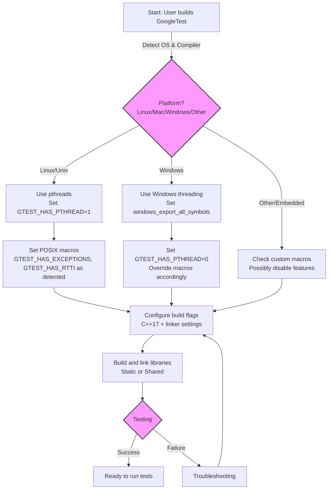

# Platform and Toolchain Support

Ensure your use of GoogleTest is seamless across your development environment by understanding the supported platforms, compilers, and configurations. This guide provides actionable insights to set up and configure GoogleTest optimally for your platform and toolchain.

---

## 1. Overview

### Purpose
This document helps you understand how GoogleTest behaves and integrates with various operating systems, compilers, and build tools. It guides you to configure your environment correctly for maximum compatibility, performance, and reliability.

### Prerequisites
- Basic familiarity with your platform's build environment (e.g., CMake or Bazel).
- Access to your compiler and build toolchain documentation.
- Installed GoogleTest source or prebuilt binaries.

### What You Will Achieve
- Clarity on officially supported platforms and compiler requirements.
- Understanding of platform-specific considerations.
- Steps to configure platform-specific macros and build flags.
- Best practices to avoid common pitfalls related to platform support.

### Time Estimate
This guide can be reviewed in approximately 10-15 minutes and referenced ongoing during setup and troubleshooting.

### Difficulty Level
Intermediate — requires familiarity with build systems and compiler environments.

---

## 2. Platform Support Details

GoogleTest supports a wide range of platforms adhering to [Google's Foundational C++ Support Policy](https://opensource.google/documentation/policies/cplusplus-support). This ensures GoogleTest leverages modern C++ standards and platform features efficiently.

### Supported Operating Systems
- Linux & Linux-based systems (including Android)
- Windows Desktop (including MSVC, MinGW)
- macOS and iOS
- BSD Variants (FreeBSD, OpenBSD, NetBSD, DragonFlyBSD)
- Solaris, AIX, HP-UX, and others

<Callout>
Note: Fuchsia and some embedded platforms like QNX are recognized but not officially supported, so use them with caution.
</Callout>

### Compiler & Toolchain Requirements
- GoogleTest requires **C++17** support. Ensure your compiler and toolchain support this standard.
- Supported compilers include:
  - GCC (versions supporting C++17 and above)
  - Clang
  - MSVC 2017 Update 3 or later
  - IntelLLVM and other common compilers with C++17 support

### Threading and Platform Features
GoogleTest automatically detects platform capabilities such as:
- pthreads support
- Thread-safety features
- Exception and RTTI availability
- Wide string support

These are exposed through macros such as `GTEST_HAS_PTHREAD`, `GTEST_HAS_EXCEPTIONS`, and `GTEST_HAS_RTTI`.

---

## 3. Platform-Specific Macros and Configuration

GoogleTest defines platform-indicative macros to help adapt its internal implementations:

### Key Platform Macros
- `GTEST_OS_LINUX`
- `GTEST_OS_WINDOWS`
- `GTEST_OS_MAC`
- `GTEST_OS_FREEBSD`
- `GTEST_OS_QNX`, `GTEST_OS_FUCHSIA` (experimental)

These macros enable conditional compilation where platform-specific code is required.

### Feature Macros
- `GTEST_HAS_PTHREAD`: Indicates pthread availability.
- `GTEST_HAS_EXCEPTIONS`: Indicates if exceptions are enabled.
- `GTEST_HAS_RTTI`: Indicates Runtime Type Information availability.
- `GTEST_WIDE_STRING_USES_UTF16_`: Indicates if wide strings use UTF-16 (mostly Windows).
- `GTEST_HAS_STREAM_REDIRECTION`: Enables stream redirection needed for death tests.

### Build System Integration
- While using CMake, these macros are detected or set automatically.
- Bazel BUILD files include `config_setting` entries and compiler flag settings for platform detection.

---

## 4. Configuring Your Build

### CMake
- GoogleTest requires `CMAKE_CXX_STANDARD` to be 17 or higher.
- Use the provided CMake scripts in the GoogleTest repository.
- The internal CMake macro `config_compiler_and_linker` adjusts compiler flags per platform.
- For Windows, the build flags ensure compatibility with MSVC.

Example snippet to specify C++17 explicitly:

```cmake
set(CMAKE_CXX_STANDARD 17)
set(CMAKE_CXX_STANDARD_REQUIRED ON)
```

- To enable pthread support, ensure CMake finds pthread libraries:

```cmake
find_package(Threads REQUIRED)
```

### Bazel
- Use platform-specific `config_setting` entries defined in `BUILD.bazel` to target platforms like Windows, QNX, FreeBSD.
- Proper linking against platform threading libraries is done automatically via select statements.

---

## 5. Practical Tips for Platform Compatibility

- Always verify that your compiler supports C++17. If your compiler is outdated, upgrade before building GoogleTest.
- For Windows users:
  - Use MSVC 2017 Update 3 or newer.
  - Consider `gtest_force_shared_crt` option in CMake to avoid runtime library mismatches.
- Linux and UNIX-like platforms benefit from pthread support, which GoogleTest detects and utilizes automatically.
- Embedded or less common platforms may require custom overrides using macros in the `custom/` directories.
- Check `gtest-port.h` and `gmock-port.h` headers to understand platform-specific feature toggles.

---

## 6. Best Practices & Common Pitfalls

<Tip>
Avoid mixing incompatible runtime libraries, especially on Windows. Consistent runtime selection across GoogleTest, GoogleMock, and your tests prevents subtle runtime errors.
</Tip>

- If you encounter test execution issues on certain platforms, verify feature macro values like `GTEST_HAS_PTHREAD` and `GTEST_HAS_EXCEPTIONS`.
- Use the environment macro overrides to disable unexpected features if your platform's autodetection is incorrect. For example:

```cpp
-DGTEST_HAS_PTHREAD=0
```

- When building shared libraries (DLLs), set `-DGTEST_CREATE_SHARED_LIBRARY=1` during GoogleTest compilation and `-DGTEST_LINKED_AS_SHARED_LIBRARY=1` during test compilation.
- Remember that death tests require file system access and stream redirection support — check `GTEST_HAS_DEATH_TEST` macro if tests fail unexpectedly.

---

## 7. Verifying Your Configuration

After build and installation, confirm:

- GoogleTest compiles and links without errors for your platform.
- Platform macros are correctly set (check `GTEST_OS_*` and `GTEST_HAS_*` via preprocessor outputs).
- Multi-threaded tests run safely if your platform supports threading.
- Death tests and stream redirection behave as expected.

Use a simple sanity test (like the `sample1_unittest.cc`) to validate.

---

## 8. Troubleshooting

<AccordionGroup title="Common Platform & Toolchain Issues">
<Accordion title="Build Fails Due to Missing pthreads">
Make sure pthreads is installed on your system. On Linux, install development packages (e.g., `libpthread-devel`). In CMake, verify that `find_package(Threads)` succeeds.
</Accordion>
<Accordion title="Runtime Library Mismatch on Windows">
Ensure `gtest_force_shared_crt` is set consistently in your build to match your project's runtime linkage (static or dynamic).
</Accordion>
<Accordion title="Death Tests Fail or Hang">
Confirm that your platform supports stream redirection (`GTEST_HAS_STREAM_REDIRECTION`) and file system access (`GTEST_HAS_FILE_SYSTEM`).
</Accordion>
<Accordion title="Compilation Errors Related to Exceptions or RTTI">
If your compiler disables exceptions or RTTI, explicitly define `-DGTEST_HAS_EXCEPTIONS` or `-DGTEST_HAS_RTTI` to match your environment.
</Accordion>
</AccordionGroup>

---

## 9. Next Steps & Additional Resources

- Review [System Requirements & Supported Platforms](/getting-started/setup-foundations/system-requirements) to ensure environment readiness.
- Consult the [CMake Installation Guide](/getting-started/installation-quickstart/install-cmake) or [Bazel Installation Guide](/getting-started/installation-quickstart/install-bazel) for detailed build instructions.
- Explore [Configure Your Project](/getting-started/installation-quickstart/configure-project) to integrate GoogleTest into your application.
- Use [Troubleshooting Common Issues](/getting-started/validation-troubleshooting/common-issues) to resolve typical build and runtime problems.
- For deeper understanding, inspect internal platform detection logic in `gtest-port.h` and `gmock-port.h` headers within the source code.

---

## 10. References

- Official GoogleTest GitHub Repository: [https://github.com/google/googletest](https://github.com/google/googletest)
- Foundational C++ Support Policy: [https://opensource.google/documentation/policies/cplusplus-support](https://opensource.google/documentation/policies/cplusplus-support)
- Platform Matrix and Policies: [https://github.com/google/oss-policies-info/blob/main/foundational-cxx-support-matrix.md](https://github.com/google/oss-policies-info/blob/main/foundational-cxx-support-matrix.md)
- GoogleTest Platform Support Header: `googletest/include/gtest/internal/gtest-port.h`
- Build Integration Guide: [Build System Integration](/guides/integration-and-troubleshooting/build-system-integration)

---


---

###### Source Files for Reference
- `googletest/include/gtest/internal/gtest-port.h`
- `googletest/include/gtest/internal/gtest-port-arch.h`
- `BUILD.bazel`
- `googletest/cmake/internal_utils.cmake`


---


