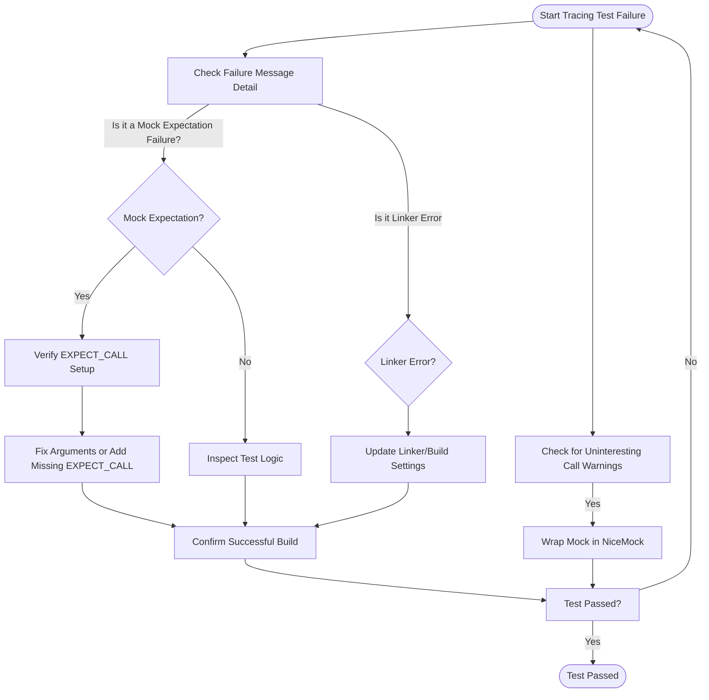

# Troubleshooting Common Test Issues

A pragmatic troubleshooting guide designed to help you quickly diagnose and fix frequent problems encountered during C++ testing workflows with GoogleTest and GoogleMock. This includes guidance on resolving failing tests, flaky behavior, environment setup issues, and linker errors.

---

## 1. Identifying Common Test Failures

### Understanding Failure Outputs
When a test fails, GoogleTest provides assertion failure messages that detail the nature and location of the failure. Successful diagnosis starts with interpreting these messages.

**Key steps:**
- Read the failure message carefully — it often explains whether an expectation was unmet, a mock call was unexpected, or an assertion failed.
- Note the file and line number — this points to where in your test or mock setup the issue arose.

### Example
```text
my_test.cc:45: Failure
Expected equality of these values:
  foo.Bar(5)
    Which is: 3
  5
```
This tells that the function `Bar(5)` returned `3`, but the test expected `5`.

<Check>
Always ensure your mock expectations align with your test input and output.
</Check>

---

## 2. Troubleshooting Flaky Tests

### Common Causes
- **Timing Dependencies:** Tests depending on asynchronous events.
- **Uninitialized Data:** Global or static variables affecting test results.
- **Order of Execution:** Non-deterministic mocks or sequences.

### Solutions
- Use GoogleMock's **`InSequence`** to enforce call order.
- For asynchronous tests, synchronize test and system threads or use mechanisms like notifications to control timing.
- Initialize all test data explicitly; avoid relying on prior test runs.

### Practical Tip
Wrap calls expected to occur in a strict order within an `InSequence` block:
```cpp
{
  InSequence seq;
  EXPECT_CALL(mock, FirstCall());
  EXPECT_CALL(mock, SecondCall());
}
```

This fails fast if `SecondCall` occurs before `FirstCall`.

---

## 3. Handling Environment Setup Issues

### Common Problems
- **Compiler Incompatibility:** GoogleTest requires C++17 compliant compilers.
- **Missing Headers or Libraries:** Incorrect include paths or link settings.
- **Threading Support:** Platform mismatch causing threading or synchronization failures.

### Diagnostics and Fixes
- Verify your compiler supports C++17 or later.
- Check that GoogleTest and GoogleMock headers are properly included.
- Ensure your build system links against the correct GoogleTest libraries.
- Consult [System Requirements & Supported Platforms](../../getting-started/setup-foundations/system-requirements) for detailed platform compatibility guidance.

<Warning>
Incorrect build setup can cause mysterious failures. Always validate environment prerequisites first.
</Warning>

---

## 4. Resolving Linker Errors

### Symptoms
- Undefined reference errors during linking.
- Duplicate symbol errors.

### Causes
- GoogleMock/GoogleTest libraries not linked.
- Mixing different GoogleTest versions or incompatible object files.
- Multiple definitions of mocks or test fixtures.

### Actionable Steps
- Ensure your build system links both GoogleTest and GoogleMock libraries.
- Use consistent versions of GoogleTest across all dependencies.
- Avoid including mock class definitions in multiple source files; use header guards and proper compilation units.

For CMake integration, verify your `CMakeLists.txt` includes directives such as:
```cmake
find_package(GTest REQUIRED)
target_link_libraries(your_test_target GTest::gtest GTest::gmock)
```

Refer to [Build System Integration](../../guides/integration-and-troubleshooting/build-system-integration) for platform-specific advice.

---

## 5. Common GoogleMock-Specific Issues

### Uninteresting Calls Warning
When your test triggers mock method calls without corresponding expectations:

```text
GMOCK WARNING: Uninteresting mock function call - returning directly....
```

**How to handle:**
- If you do expect these calls, add an `EXPECT_CALL` with `.Times(AnyNumber())`.
- Use `NiceMock` wrapper around your mock to suppress warnings for uninteresting calls globally.

Example:
```cpp
NiceMock<MockFoo> nice_mock;
EXPECT_CALL(nice_mock, SomeMethod(_));
```

### Unexpected Calls Failure
Error due to mock calls not matching any `EXPECT_CALL`.

```cpp
EXPECT_CALL(mock, Foo(5));
// Calling mock.Foo(10) causes test failure
```

To resolve:
- Verify that the argument matchers are correct.
- Add an expectation to cover the unexpected call if it is expected sometimes.

### Excessive Call Failures
More calls to a mocked method than expected.

```cpp
EXPECT_CALL(mock, Foo(5)).Times(1);
mock.Foo(5);
mock.Foo(5);  // Fails
```

Use `.RetiresOnSaturation()` to retire expectations after their cardinality is met, or adjust `.Times()` accordingly.

---

## 6. Best Practices for Preventing Test Issues

- **Set all expectations before exercising code under test.** GoogleMock expects this for deterministic behavior.
- **Use matcher wildcards (`_`) liberally** to avoid over-specifying expectations.
- **Leverage `ON_CALL` for default mock behaviors** and use `EXPECT_CALL` only to declare mandatory calls.
- **Prefer `NiceMock` during test development** to reduce noise; enforce `StrictMock` where exact call behavior matters.
- **Isolate tests to avoid interference** from globals, static states, or order dependencies.

---

## 7. Quick Checklist for Troubleshooting

| Symptom                | Likely Cause                                          | Action                                                      |
|------------------------|------------------------------------------------------|-------------------------------------------------------------|
| Test fails with error  | Expectation mismatch                                 | Verify `EXPECT_CALL` arguments, times and order              |
| Flaky tests            | Timing or state interference                          | Add synchronization, clean test state, check sequences       |
| Warnings for calls     | Uninteresting calls without expectations             | Add `EXPECT_CALL` with `.Times(AnyNumber())` or use `NiceMock`|
| Linker errors          | Missing GoogleTest/GoogleMock libs or duplicates     | Check build system linking and source organization           |
| Unexpected mock calls  | Calls not matching any `EXPECT_CALL`                  | Add missing expectations or loosen matchers                  |

---

## 8. Additional Resources

- [gMock Cheat Sheet](https://google.github.io/googletest/gmock_cheat_sheet.html) — Quick reference for mocking syntax.
- [gMock Cookbook](https://google.github.io/googletest/gmock_cook_book.html) — Recipes for complex mocking scenarios.
- [Understanding Uninteresting vs Unexpected Calls](https://google.github.io/googletest/gmock_cook_book.html#uninteresting-vs-unexpected) — Clarify nuances in mock behavior.
- [Build System Integration](../../guides/integration-and-troubleshooting/build-system-integration) — Set up and troubleshooting linking.
- [System Requirements & Supported Platforms](../../getting-started/setup-foundations/system-requirements) — Verify your environment compatibility.

---

## 9. Troubleshooting Flow Diagram

