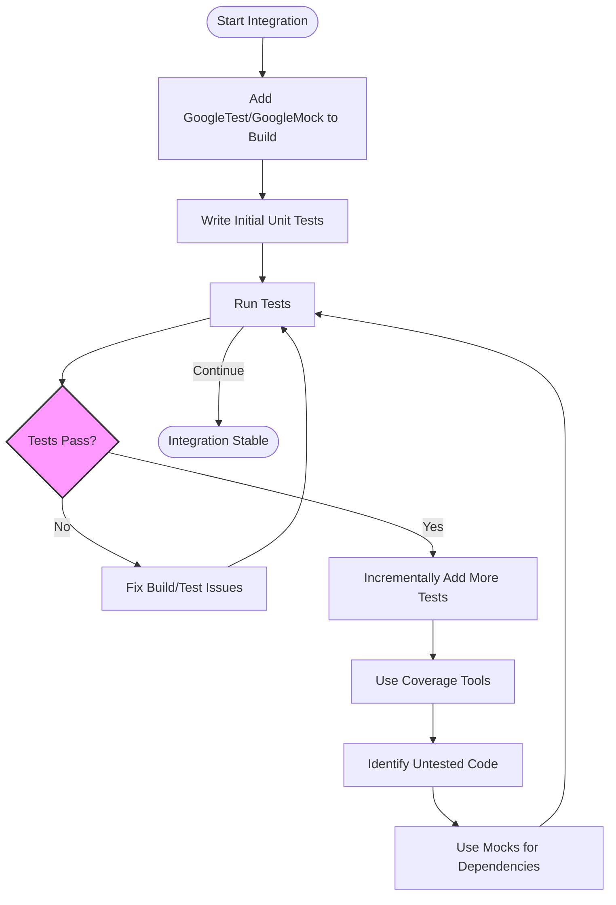

# Integrating into Real-World Projects

## Overview

This guide provides clear, step-by-step instructions for embedding GoogleTest and GoogleMock into your existing C++ codebases. It focuses on practical strategies to adopt these testing tools incrementally without disrupting your development flow. You will learn how to integrate testing incrementally, measure test coverage, and avoid common pitfalls, enabling you to grow your test suite confidently and efficiently.

---

## 1. Preparing Your Project for Integration

### Prerequisites
- Your project should be a C++ codebase compatible with C++17 or later.
- Build system configured to link GoogleTest and optionally GoogleMock.
- Basic familiarity with GoogleTest and GoogleMock usage (refer to guides like [Writing Your First Test](/guides/getting-started/writing-first-test)).

### Expected Outcome
- GoogleTest and GoogleMock embedded in your project build and test processes.
- Ability to write and run tests alongside production code.

### Time Estimate
30-60 minutes, depending on project size and build system complexity.

### Difficulty Level
Intermediate (requires build system knowledge and familiarity with basic testing concepts).

---

## 2. Integration Strategies

### Step 1: Add GoogleTest and GoogleMock to Your Build System

- Prefer using CMake with the [GoogleTest CMake integration](../../getting_started/installation_integration/install_cmake).
- For manual setups, incorporate source files or pre-built libraries according to [Source Inclusion & Manual Integration](/getting_started/installation_integration/source_integration).
- Link with `gtest_main` and `gmock_main` libraries whenever possible to avoid writing your own `main()` function.

> _Tip:_ Using `gmock_main` initializes both GoogleMock and GoogleTest, as demonstrated in [googlemock/src/gmock_main.cc](https://github.com/google/googletest/blob/main/googlemock/src/gmock_main.cc).

### Step 2: Enable Incremental Testing

Instead of converting your entire codebase at once, adopt tests incrementally:

- Start by writing tests for new or recently modified modules.
- Gradually add fixture-based and parameterized tests as needed.
- Employ mocks selectively to isolate dependencies only in areas under active development.

### Step 3: Organize Tests Within Your Codebase

- Follow established naming conventions using `TEST()` and `TEST_F()` macros.
- Group related tests logically in source directories mirroring your production code structure.
- Reference the [Core Concepts & Terminology](/overview/core-concepts-architecture/core-terminology) guide to standardize your testing vocabulary and structure.

### Step 4: Setup Continuous Integration (CI) Hooks

- Integrate your test suite execution into CI pipelines increasing test coverage over time.
- Capture test results using the built-in GoogleTest XML output for compatibility with common CI systems.

---

## 3. Measuring and Expanding Test Coverage

### Using Coverage Tools

- Use compiler or external coverage analyzers (like `gcov`, `llvm-cov`) integrated with your build system.
- Measure coverage early and continuously to identify untested code paths.

### Writing Tests for Untested Code

- Leverage GoogleMock to write focused unit tests, mock dependencies, and test in isolation as outlined in the [Mocking Workflows with GoogleMock](/guides/advanced-testing-patterns/mocking-workflows) guide.

- Example of defining a mock class:

```cpp
#include <gmock/gmock.h>

class MockFoo : public FooInterface {
 public:
  MOCK_METHOD(int, GetSize, (), (const, override));
  MOCK_METHOD(void, SetName, (const std::string&), (override));
};
```

- Use `EXPECT_CALL` and `ON_CALL` to specify behavior and expectations before exercising the code under test.

---

## 4. Common Pitfalls and How to Avoid Them

### Linking Problems

*Problem*: Missing symbols for GoogleTest or GoogleMock.

*Solution*:
- Ensure you link with both `gtest` and `gtest_main` or `gmock` and `gmock_main`.
- Verify your build setup matches the compiler and C++ version requirements (consult [Prerequisites & Supported Platforms](/getting_started/setup_requirements/prerequisites_platforms)).

### Macro Misuse

*Problem*: Compilation errors with `MOCK_METHOD` when method signatures have commas.

*Solution*: Wrap argument types containing commas in parentheses as described in the [Mocking Reference](../reference/mocking.md#MOCK_METHOD) or use type aliases.

### Test Discovery Failure

*Problem*: Tests are not discovered or run.

*Solution*: Confirm tests are properly registered using `TEST()` or `TEST_F()` macros. Initialize GoogleTest properly with `InitGoogleTest()` before running `RUN_ALL_TESTS()` (see [Writing Your First Test](/guides/getting-started/writing-first-test)).

### Over-mocking or Over-testing

*Tip*: Start with simple tests and add mocks only when external dependencies complicate direct testing. Avoid extensive mocks unless they provide clear test value.

---

## 5. Practical Example: Incremental GoogleMock Integration

```cpp
#include <gmock/gmock.h>
#include <gtest/gtest.h>

// Interface to mock
class DataFetcher {
 public:
  virtual ~DataFetcher() = default;
  virtual std::string FetchData(int id) = 0;
};

// Mock class
class MockDataFetcher : public DataFetcher {
 public:
  MOCK_METHOD(std::string, FetchData, (int id), (override));
};

// Production class that uses DataFetcher
class DataProcessor {
 public:
  DataProcessor(DataFetcher* fetcher) : fetcher_(fetcher) {}

  std::string Process(int id) {
    std::string data = fetcher_->FetchData(id);
    return "Processed: " + data;
  }

 private:
  DataFetcher* fetcher_;
};

// Test demonstrating GoogleMock usage
TEST(DataProcessorTest, ProcessesDataCorrectly) {
  MockDataFetcher mock_fetcher;

  // Expect FetchData to be called once with id = 42 and return "abc"
  EXPECT_CALL(mock_fetcher, FetchData(42))
      .Times(1)
      .WillOnce(::testing::Return("abc"));

  DataProcessor processor(&mock_fetcher);
  std::string result = processor.Process(42);

  EXPECT_EQ(result, "Processed: abc");
}
```

---

## 6. Verifying Integration Success

- Run your tests regularly using `RUN_ALL_TESTS()`.
- Verify GoogleMock expectations are met automatically upon mock object destruction.
- Use command-line flags for verbosity and test filtering:

```bash
./my_test_binary --gtest_filter=DataProcessorTest.* --gmock_verbose=info
```

- Refer to [Test Runner Initialization and Main](/api-reference/configuration-runtime/initialization-main) for detailed flag usage and `main()` function guidance.

---

## 7. Next Steps & Further Resources

- Expand test coverage incrementally and refactor code for testability.
- Explore advanced assertions and failure handling ([Essential Assertions](/guides/getting-started/essential-assertions)).
- Deepen mocking expertise with [Mocking Workflows](/guides/advanced-testing-patterns/mocking-workflows).
- Automate test execution and integrate with CI/CD pipelines.

---

# Diagram: Incremental Integration Workflow



---

<Tip>
For smoother integration, always initialize GoogleMock using `testing::InitGoogleMock(&argc, argv);` in your `main()`, or link with `gmock_main` for default setup.
</Tip>

<Note>
Incremental adoption prevents overwhelming your team and allows discovery and resolution of integration issues early.
</Note>

<Warning>
Avoid mocking non-virtual methods or classes without virtual destructors as it can cause undefined behavior.
</Warning>

---

## References & Related Documentation

- [Writing Your First Test](/guides/getting-started/writing-first-test)
- [Mocking Workflows with GoogleMock](/guides/advanced-testing-patterns/mocking-workflows)
- [Source Inclusion & Manual Integration](/getting_started/installation_integration/source_integration)
- [Setup Environment](/guides/getting-started/setup-environment)
- [Test Runner Initialization and Main](/api-reference/configuration-runtime/initialization-main)
- [Mocking Reference](../reference/mocking.md)
- [Essential Assertions and Failure Handling](/guides/getting-started/essential-assertions)

Explore the [Integration and Ecosystem Overview](/overview/integration-and-ecosystem/integrations-and-tools) for further details on tooling and extension.

---