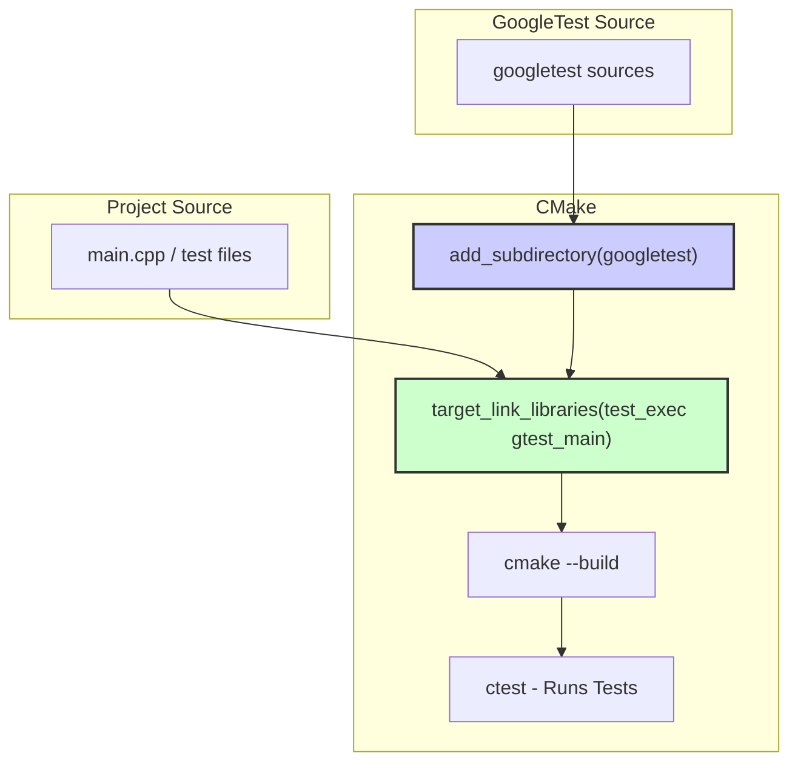

# Integrating with CMake and Bazel

Seamlessly integrate GoogleTest into your C++ build pipeline using **CMake** or **Bazel** to enable reliable, automated testing. This guide provides clear, actionable steps to add GoogleTest support, configure your project, and enable test discovery and execution within your build system.

---

## Overview

Integration with modern build systems is essential for maintaining scalable and maintainable test workflows. GoogleTest offers built-in support for popular systems like CMake and Bazel, making it straightforward to build, link, and run your tests alongside your application code.

This guide focuses solely on how to incorporate GoogleTest into your project with CMake and Bazel, including linking the libraries, enabling automatic test registration, and setting up test execution targets.


---

## Prerequisites

Before proceeding, ensure you have:

- A working GoogleTest source code checkout or installed package.
- C++17 compatible compiler and standard library.
- Installed CMake (version 3.14 or higher) for CMake integration.
- Bazel (latest stable version) installed if using Bazel.
- A C++ project organized to build with either CMake or Bazel.


---

## Integrating GoogleTest with CMake

### Step 1: Obtain GoogleTest

You can either:

- Clone the [GoogleTest repository](https://github.com/google/googletest) directly into your project or
- Use `FetchContent` in CMake to download GoogleTest during the configure step.


### Step 2: Add GoogleTest to Your Build

Use CMake's `add_subdirectory()` to include GoogleTest sources and targets in your build:

```cmake
# Assuming GoogleTest sources are in external/googletest/
add_subdirectory(external/googletest)
```

Or use the FetchContent module to obtain GoogleTest during configuration:

```cmake
include(FetchContent)
FetchContent_Declare(
  googletest
  URL https://github.com/google/googletest/archive/refs/tags/release-1.17.0.zip
)
FetchContent_MakeAvailable(googletest)
```


### Step 3: Link Your Tests with GoogleTest

Link your test executable target with the GoogleTest libraries:

```cmake
add_executable(my_tests test_main.cpp my_tests.cpp)
target_link_libraries(my_tests PRIVATE gtest_main)
```

- `gtest_main` includes `main()` function so you don't need to provide your own unless custom setup is required.

- Use `gtest` instead if you want to provide your own `main()`.


### Step 4: Enable Testing and Define Test Targets

Enable CTest and register your test executable for automated test runs:

```cmake
enable_testing()
add_test(NAME MyTests COMMAND my_tests)
```


### Step 5: Build and Run Tests

Run CMake configuration and build your tests:

```bash
mkdir build && cd build
cmake ..
cmake --build . --target my_tests
ctest
```

`ctest` runs all registered tests and reports the results.


---

## Common CMake Integration Tips

- **Use consistent C++ standards**: Set `CMAKE_CXX_STANDARD` to `17` or higher in your root CMakeLists.txt.
- **Shared vs Static Libraries**: GoogleTest defaults to static libraries; you can toggle shared builds with `BUILD_SHARED_LIBS`.
- **Compiler Flags**: GoogleTest has strict warnings enabled by default; adjust your compiler flags accordingly if needed.
- **Platform considerations**: On Windows, ensure matching runtime libraries between your project and GoogleTest to avoid linker errors.


---

## Integrating GoogleTest with Bazel

### Step 1: Add GoogleTest to WORKSPACE

Include GoogleTest as an external repository in your `WORKSPACE` file:

```python
# WORKSPACE
load("@bazel_tools//tools/build_defs/repo:http.bzl", "http_archive")

http_archive(
    name = "com_google_googletest",
    urls = ["https://github.com/google/googletest/archive/release-1.17.0.zip"],
    strip_prefix = "googletest-release-1.17.0",
    sha256 = "some_sha256_checksum_here",
)
```

Update the URL and checksum as per the version you want.


### Step 2: Load GoogleTest Rules

Use the `rules_cc` Bazel extension to load GoogleTest build rules or use the provided Bazel integration if available.


### Step 3: Define Your Test in BUILD File

Create a BUILD file for your test sources and link them against GoogleTest:

```python
cc_test(
    name = "my_test",
    srcs = ["my_test.cc"],
    deps = ["@com_google_googletest//:gtest_main"],
)
```

- `cc_test` automatically creates the test executable and integrates it into Bazel's test runner.


### Step 4: Build and Run Tests with Bazel

Use Bazel commands to build and test:

```shell
bazel build //path/to:my_test
bazel test //path/to:my_test
```


---

## Best Practices for Integration

- **Keep GoogleTest version consistent** across your development team by pinning repository versions.
- **Use CMake FetchContent or Bazel http_archive** to automate dependency management.
- **Integrate test execution** into your CI/CD pipelines by invoking `ctest` or `bazel test` accordingly.
- **Leverage GoogleTest flags** by passing command-line options via CTest or Bazel test runner to filter or configure tests.


---

## Troubleshooting Common Issues

- **Linker errors on Windows**: Check runtime library settings; prefer consistent static or dynamic CRT across your project and GoogleTest.
- **C++ standard mismatch**: Ensure both your project and GoogleTest are compiled with the same standard (minimum C++17).
- **Test discovery failure**: Confirm tests are linked with `gtest_main` or provide your own `main()` calling `RUN_ALL_TESTS()`.
- **Duplicated symbols**: Avoid linking GoogleTest static libraries multiple times in the same target.
- **Bazel sandbox errors**: Check external repository URL and SHA256 hash correctness.


---

## Next Steps

- Explore [Writing Your First Test](../guides/getting-started/writing-first-test) to start creating tests.
- Learn about [Test Discovery & Execution](../guides/getting-started/test-discovery-execution) for running tests effectively.
- Consult [Continuous Integration Setup](../guides/integration-optimization/continuous-integration-setup) for automating your tests.
- For advanced CMake integration, consult [CMake build script details](googlemock/CMakeLists.txt) and optimize build configurations.


---

## Resources

- [GoogleTest GitHub Repository](https://github.com/google/googletest)
- [GoogleTest Primer](../overview/intro-concepts/what-is-googletest)
- [GoogleTest Integration & Ecosystem](../overview/architecture-features/integration-and-dependencies)
- [GoogleTest Installation Guide](../getting-started/setup-requirements/installation-guide)
- [CMake Official Documentation](https://cmake.org/documentation/)
- [Bazel Official Documentation](https://docs.bazel.build/)


---

## Diagram: Simplified Build Flow with CMake



---

This clear, step-by-step guide empowers you to quickly integrate GoogleTest into your C++ project builds using either CMake or Bazel, enabling automated testing and continuous integration readiness.