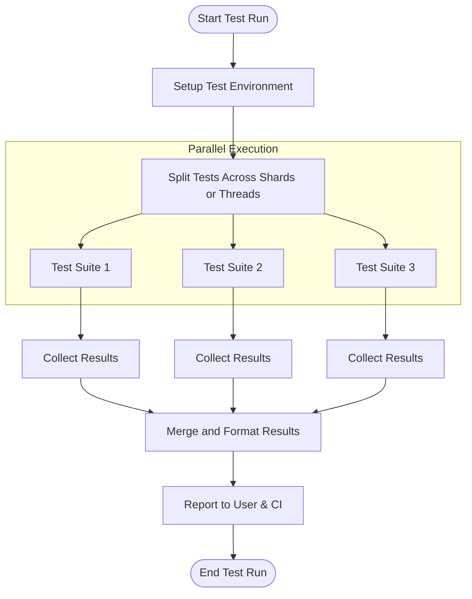

# Performance Optimization & Scalability

Optimize your GoogleTest suite to get faster feedback and scale testing as your project grows. This guide shares proven techniques to minimize test execution time, parallelize test runs, and harness custom event listeners and output formats for large codebases and complex workflows.

---

## 1. Understanding Test Execution Performance

### Why Optimize?

As test suites grow, long execution times can impede rapid iteration, delay CI feedback, and reduce developer productivity. Optimizing your test suite ensures tests remain fast and maintainable while scaling with your project's size.

### Key Performance Factors

- **Test count and size:** More tests mean longer runs.
- **Setup/TearDown overhead:** Expensive fixture initialization or cleanup slows every test.
- **I/O operations:** Disk or network access in tests can dominate run time.
- **Test dependencies:** Interlinked tests cause bottlenecks.

---

## 2. Minimizing Test Execution Time

### a. Write Efficient Tests

- Focus tests on *one behavior*; avoid bloated tests.
- Use lightweight data setups; avoid expensive initialization in every test.
- Prefer **non-fatal assertions** (`EXPECT_`) over fatal (`ASSERT_`) when possible to reveal multiple failures per run.

### b. Reuse Test Fixtures

- Utilize shared fixtures with `SetUpTestSuite()` and `TearDownTestSuite()` to perform setup once per test suite rather than for every test:

```cpp
class MyTest : public ::testing::Test {
 public:
  static void SetUpTestSuite() {
    // expensive resource initialization
  }

  static void TearDownTestSuite() {
    // shared cleanup
  }

  void SetUp() override {
    // per-test setup, lighter weight
  }
};
```

### c. Avoid Unnecessary Resource Use

- Mock external dependencies (database, filesystem, network) to reduce test runtime.
- Use in-memory or stub implementations.
- Cache expensive computations or results if reuse is valid.

### d. Run Tests with Filters and Flags

- Run only affected tests using `--gtest_filter=MySuite.MyTest`.
- Skip disabled tests (`DISABLED_` prefix).
- Use `--gtest_brief=1` to reduce output and speed up CI logs parsing.

---

## 3. Parallelizing Test Execution

Scaling tests beyond a single thread or process speeds up feedback significantly.

### a. Use Test Sharding

GoogleTest supports sharding, where the test execution is split across multiple processes or machines.

- Set environment variables on each shard:
  - `GTEST_TOTAL_SHARDS`: total number of shards.
  - `GTEST_SHARD_INDEX`: zero-based index of the shard.

Example:

```bash
# On 3 machines or processes
GTEST_TOTAL_SHARDS=3 GTEST_SHARD_INDEX=0 ./my_test
GTEST_TOTAL_SHARDS=3 GTEST_SHARD_INDEX=1 ./my_test
GTEST_TOTAL_SHARDS=3 GTEST_SHARD_INDEX=2 ./my_test
```

Each shard runs a subset of tests, collectively covering all tests exactly once.

### b. Parallel Builds and Test Runs

- Integrate GoogleTest with build systems (e.g., Bazel, CMake with CTest) to run tests in parallel.
- Configure your CI to launch multiple test executors targeting different test binaries or test shards.

### c. Parallelizing Within Tests

- Prefer isolating tests for single-threaded execution.
- When necessary, GoogleTest mocks and assertions are thread-safe but avoid changing expectations concurrently.

---

## 4. Custom Event Listeners and Output Formats

### a. Leverage Event Listeners for Scalable Reporting

GoogleTest allows you to write [custom test event listeners](reference/testing.md#TestEventListener). You can:

- Generate tailored test reports in real-time.
- Filter or categorize test output.
- Track test execution phases and failures efficiently.

Example minimal custom listener:

```cpp
class SimpleProgressListener : public testing::EmptyTestEventListener {
 public:
  void OnTestStart(const testing::TestInfo& test_info) override {
    std::cout << "Running: " << test_info.test_suite_name() << "." << test_info.name() << std::endl;
  }

  void OnTestEnd(const testing::TestInfo& test_info) override {
    std::cout << (test_info.result()->Passed() ? "PASS" : "FAIL")
              << ": " << test_info.test_suite_name() << "." << test_info.name() << std::endl;
  }
};

int main(int argc, char** argv) {
  testing::InitGoogleTest(&argc, argv);
  auto& listeners = testing::UnitTest::GetInstance()->listeners();
  delete listeners.Release(listeners.default_result_printer());
  listeners.Append(new SimpleProgressListener);
  return RUN_ALL_TESTS();
}
```

### b. Output in Machine-readable Formats

- Use built-in XML or JSON output (`--gtest_output=xml:filename.xml` or `--gtest_output=json:filename.json`) for CI consumption.
- Combine with tools that parse these outputs for dashboards, flaky test detection, or analytics.

---

## 5. Practical Tips & Best Practices

| Tip | Description |
|-|-|
| Cache Shared Resources | Use static members or `SetUpTestSuite` to minimize repeated expensive setups. |
| Mock External I/O | Replace slow or flaky external resources with mocks during tests. |
| Filter Tests for Development | Use `--gtest_filter` to run only relevant tests locally. |
| Run Tests in Parallel | Split tests across multiple cores or machines using shards. |
| Use Custom Listeners | Simplify output or integrate with custom tooling using event listeners. |

---

## 6. Troubleshooting Common Performance Issues

### Slow Test Setup

- Verify expensive code runs only once using suite-level setup.
- Profile test setup to find bottlenecks.

### Long Test Runs in CI

- Increase parallelization; shard tests across machines.
- Disable unnecessary tests or split monolithic tests.

### Flaky Tests Take Excessive Time

- Identify and fix tests dependent on timing, threading, or external resources.

---

## 7. Next Steps & Related Guides

- [Integrating with CMake and Bazel](guides/integration-optimization/build-system-integration) for build-based test scaling.
- [Automating Tests in CI/CD](guides/integration-optimization/continuous-integration-setup) for workflow automation.
- [Writing Efficient Tests](guides/core-test-design/assertions-macros) to improve test speed.
- [Using Mocks Effectively](guides/mocking-advanced-techniques/mocking-best-practices) for fast and maintainable tests.

---

<Callout>
**Pro Tip:** Combining these techniques (efficient tests, sharding, parallel builds, and custom listeners) yields the best scaling and fastest feedback in large projects.
</Callout>

---

## 8. Reference Diagram: Parallel Test Execution Flow


