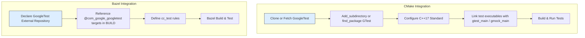

# Integrating with Build Systems (CMake and Bazel)

GoogleTest and GoogleMock offer powerful, cross-platform C++ testing and mocking capabilities. This guide focuses specifically on how to integrate GoogleTest/GoogleMock into your projects managed with popular build systems, namely CMake and Bazel. It provides actionable, practical instructions and tips to seamlessly add GoogleTest/GoogleMock as dependencies, enabling you to build, run, and manage tests efficiently within your development workflow.

---

## Workflow Overview

- **Task Description:** Learn how to incorporate GoogleTest and GoogleMock into C++ projects that use CMake or Bazel build systems.
- **Prerequisites:**
  - Basic familiarity with C++ development and your build system (CMake or Bazel).
  - Installed CMake (version 3.13 or later) or Bazel corresponding to your platform.
  - GoogleTest/GoogleMock source code or installed packages.
- **Expected Outcome:** Successfully configure and run GoogleTest/GoogleMock-based tests within your existing build workflow.
- **Time Estimate:** 20 to 40 minutes
- **Difficulty Level:** Intermediate

---

## 1. Integrating GoogleTest/GoogleMock with CMake

CMake is widely used for cross-platform builds and supports managing dependencies robustly. GoogleTest comes with official support and a CMake build script.

### Step 1: Getting GoogleTest Source

1. Clone the GoogleTest repository or download a release archive:

```bash
git clone https://github.com/google/googletest.git -b main
```

2. Navigate to the GoogleTest root directory:

```bash
cd googletest
```

### Step 2: Adding GoogleTest to Your CMake Project

There are two main approaches:

#### Option A: Standalone Build and Install (Recommended for System-Wide Use)

- Build GoogleTest independently:

```bash
mkdir build && cd build
cmake ..
make
sudo make install
```

- This installs GoogleTest to a system directory (usually `/usr/local`), making it discoverable by your project via `find_package(GTest REQUIRED)`.

#### Option B: Add GoogleTest as a Subdirectory in Your Project

- In your project CMakeLists.txt, add:

```cmake
add_subdirectory(path/to/googletest)

add_executable(your_test_executable your_test.cpp)
target_link_libraries(your_test_executable gtest_main gmock_main)

enable_testing()
add_test(NAME your_test COMMAND your_test_executable)
```

This approach ensures consistent compiler and linker flags across your project and GoogleTest.

### Step 3: Configure Compiler and Linker Options

- GoogleTest requires C++17 support. Set this explicitly:

```cmake
set(CMAKE_CXX_STANDARD 17)
set(CMAKE_CXX_STANDARD_REQUIRED ON)
```

- If your build uses pthreads, CMake handles this automatically via GoogleTest's CMake scripts.

### Step 4: Writing Tests and Linking

- Link your test executables against `gtest_main` or `gmock_main` depending on whether you use mocks.
- The `gtest_main` target provides a main() function that initializes and runs tests.

### Step 5: Running Tests

- Tests can be run via `ctest` or directly running the test executable.

```bash
ctest -V
./your_test_executable
```

### Tips and Best Practices for CMake

- Prefer `target_link_libraries()` and `target_compile_options()` using GoogleTest's imported targets rather than hardcoding include paths.
- Use `FetchContent` module to automatically download GoogleTest in the configure phase:

```cmake
include(FetchContent)
FetchContent_Declare(
  googletest
  URL https://github.com/google/googletest/archive/refs/tags/release-1.17.0.zip
)
FetchContent_MakeAvailable(googletest)
```

- This avoids manual cloning and makes your build more reproducible.

---

## 2. Incorporating GoogleTest/GoogleMock with Bazel

Bazel is a popular build system with native support for dependency management and hermetic builds.

### Step 1: Adding GoogleTest as a Bazel Dependency

- In your `WORKSPACE` file, declare GoogleTest repository:

```python
http_archive(
    name = "com_google_googletest",
    url = "https://github.com/google/googletest/archive/release-1.17.0.zip",
    strip_prefix = "googletest-release-1.17.0",
)
```

### Step 2: Linking GoogleTest Targets

- In your Bazel `BUILD` files, use `cc_test` rule and link dependencies:

```bazel
cc_test(
    name = "my_test",
    srcs = ["my_test.cc"],
    deps = ["@com_google_googletest//googletest:main"],
)
```

- Use the `main` target from GoogleTest to avoid writing your own main; it automatically initializes and runs all tests.

### Step 3: Building and Running Tests

- Build and run the test using Bazel:

```bash
bazel test //path/to:my_test
```

- Bazel manages dependencies, compilation flags, and links everything.

### Tips for Bazel Integration

- Ensure your Bazel version supports `http_archive` rule.
- Use the same Bazel workspace and manage all third-party dependencies via external repositories for consistency.
- Keep GoogleTest version synchronized via the `url` in `http_archive` to track updates easily.

---

## 3. Dependency Management and Versioning

- Always check GoogleTest GitHub releases for stable versions.
- If pinned to a commit/branch (like `main`), regularly update to catch bug fixes.
- For CMake, prefer `FetchContent` with specific versions for reproducible builds.
- For Bazel, update the `url` and `strip_prefix` accordingly.

---

## 4. Troubleshooting Common Integration Issues

### CMake Issues

- **Error: Could not find GTest:** Ensure `gtest` is installed or your `CMAKE_PREFIX_PATH` includes GoogleTest install location.
- **Runtime issues due to missing pthreads:** Confirm your compiler flags include `-pthread`. CMake's GoogleTest support generally handles this.
- **Linker errors for main():** If you use your own main(), link with `gtest` instead of `gtest_main`. Otherwise, link with `gtest_main` to provide a default main.

### Bazel Issues

- **Build failure due to missing dependencies:** Ensure `@com_google_googletest` is correctly declared in workspace and referenced in BUILD files.
- **Version mismatches:** Pin to stable releases to reduce breakage.

### General Tips

- Verify that your compiler supports C++17 as GoogleTest requires it.
- Keep GoogleMock and GoogleTest at compatible versions to avoid linker conflicts.
- Use verbose build outputs (`cmake --build . --verbose` or `bazel build --verbose_failures`) to diagnose build problems.

---

## 5. Summary Workflow Diagram



---

## Next Steps & Related Content

- After integrating, explore writing tests using GoogleTest Primer [/guides/getting-started/primer-basics].
- For advanced mocking techniques, consult the Mocking Primer [/guides/getting-started/mocking-primer].
- Check out Continuous Integration Best Practices [/guides/integration-scenarios/ci-best-practices] for automated testing in pipelines.
- Review Troubleshooting Common Issues [/guides/integration-scenarios/troubleshooting] if you encounter persistent problems.

---

## Additional Resources

- [GoogleTest Primer](primer.md) - Basic usage and test writing.
- [GoogleMock README](googlemock/README.md) - Overview of mocking framework.
- [CMakeLists.txt for GoogleMock](googlemock/CMakeLists.txt) - Detailed example of CMake build files.
- [docs/pkgconfig.md](/docs/pkgconfig.md) - Using pkg-config with build systems.
- Official CMake documentation: <https://cmake.org/documentation/>
- Bazel official docs: <https://bazel.build/>

<Tip>
Remember: The smoothest integration comes from managing GoogleTest dependencies as part of your build system rather than manual include/link setups. Use official CMake scripts or Bazel external repositories to ensure consistent builds and ease of maintenance.
</Tip>

<Warning>
Avoid mixing different versions of GoogleTest and GoogleMock in your build to prevent mysterious linker errors and test failures.
</Warning>

<Check>
Verify successful test integration by running your test executables and confirming output similar to:

```
[==========] Running 3 tests from 1 test suite.
[----------] Global test environment set-up.
[ RUN      ] FooTest.DoesBar
[       OK ] FooTest.DoesBar (0 ms)
[----------] Global test environment tear-down
[==========] 3 tests from 1 test suite ran. (1 ms total)
[  PASSED  ] 3 tests.
```
</Check>
