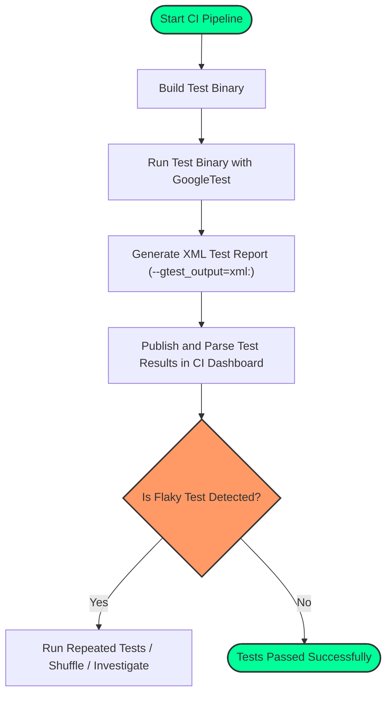

# Continuous Integration with GoogleTest

GoogleTest integrates seamlessly with popular Continuous Integration (CI) and Continuous Delivery (CD) systems to help you run your test suites automatically, ensuring code quality throughout your development lifecycle. This guide provides a straightforward walkthrough to set up your test binaries for CI, report results effectively, and address common issues such as flaky test behavior.

---

## 1. Workflow Overview

### What This Guide Helps You Achieve
You will learn how to configure and run GoogleTest-based test binaries within your CI/CD pipelines, including setting up your test executables, enabling automated result reporting compatible with common CI tools, and troubleshooting flaky or unstable tests.

### Prerequisites
- Your test suite is built using GoogleTest and compiled into test binaries.
- Familiarity with basic CI/CD concepts and access to a CI system like Jenkins, GitLab CI, Travis CI, or GitHub Actions.
- Your build environment supports running executable test binaries built with GoogleTest.

### Expected Outcome
- Test binaries that automatically execute within your CI pipeline.
- Test results output in a structured format consumable by CI dashboards.
- Strategies to identify and mitigate intermittently failing (flaky) tests.

### Time Estimate
Setting up automated tests in your CI system initially should take between 30 minutes to a few hours depending on your CI platform and existing pipeline complexity.

### Difficulty Level
Intermediate — requires basic CI knowledge and understanding of your build system.

---

## 2. Step-by-Step Instructions

### Step 1: Build Your Test Binaries for CI
1. Use your standard procedure to build GoogleTest test binaries, ensuring they are executable in your CI environment.
2. Prefer linking with `gtest_main` or `gmock_main` for automatic `main()` function support, simplifying test execution.

> Example: Linking your test executable with `gtest_main` automatically integrates the test runner:
> 
> ```cmake
> add_executable(my_tests test1.cpp test2.cpp)
> target_link_libraries(my_tests gtest_main)
> add_test(NAME MyTests COMMAND my_tests)
> ```

3. Ensure that your CI environment uses the same compiler and runtime flags as during development to avoid runtime mismatches.

### Step 2: Configure Test Execution in Your CI Pipeline
1. Define a test execution step in your CI configuration that runs the test binary.
2. Add flags to control test filtering or output formats as needed.

> Common GoogleTest flags useful for CI:
> - `--gtest_filter=...` — Run a subset of tests.
> - `--gtest_output=xml:<file_path>` — Generates an XML test report compatible with many CI dashboards.

3. Example command to run tests and produce an XML report:

```bash
./my_tests --gtest_output=xml:report.xml
```

4. Configure your CI tool to detect and display the generated XML results.

### Step 3: Integrate Test Result Reporting

Most CI systems support parsing GoogleTest XML reports to present test results comprehensively.

- **Jenkins:** Use the JUnit plugin to consume the GoogleTest XML results.
- **GitLab CI:** Use the `artifacts:reports:junit` feature pointing to the XML file.
- **Travis CI/GitHub Actions:** Use built-in or marketplace actions to parse and display test results.

### Step 4: Handle Flaky Tests

Flaky tests can cause intermittent failures and disrupt CI reliability. To diagnose and mitigate:

- Enable verbose test output:

  ```bash
  ./my_tests --gtest_repeat=10 --gtest_break_on_failure
  ```
  This runs tests multiple times and stops on the first failure for debugging.

- Use `--gtest_shuffle` to randomize test order, helping uncover order dependencies.

- Isolate flaky tests by filtering them out with `--gtest_filter` while investigating.

- Document flaky tests and address root causes: shared state, timing issues, resource conflicts.

---

## 3. Examples & Configuration

### Example: Basic GitHub Actions Workflow for GoogleTest

```yaml
name: C++ CI

on: [push, pull_request]

jobs:
  build-and-test:
    runs-on: ubuntu-latest

    steps:
    - uses: actions/checkout@v3

    - name: Setup CMake
      uses: jwlawson/actions-setup-cmake@v1

    - name: Build Tests
      run: |
        mkdir build
        cd build
        cmake ..
        cmake --build .

    - name: Run Tests
      run: |
        cd build
        ./my_tests --gtest_output=xml:results.xml

    - name: Upload Test Results
      uses: actions/upload-artifact@v3
      with:
        name: test-results
        path: build/results.xml
```

This workflow builds your test binaries, runs tests while generating a GoogleTest XML report, and archives the report for inspection or further processing.

### Example: Filtering Tests

Run only tests tagged `Fast`:

```bash
./my_tests --gtest_filter=*Fast*
```

### Example: Repeating to Detect Flakes

Run tests 100 times to check flakiness:

```bash
./my_tests --gtest_repeat=100 --gtest_break_on_failure
```

---

## 4. Troubleshooting & Tips

<AccordionGroup title="Troubleshooting Common CI Issues">
<Accordion title="Test Binary Does Not Execute in CI">
- Verify executable permissions in the CI environment.
- Confirm that test dependencies (shared libraries, environment variables) are present.
- Check CI logs for permission or execution errors.
</Accordion>

<Accordion title="No Test Results Shown in CI Dashboard">
- Ensure tests generate XML output using `--gtest_output=xml:<file>`.
- Confirm CI system configuration points to the correct XML file path.
- Validate the XML output file is not empty and conforms to GoogleTest schema.
</Accordion>

<Accordion title="Flaky or Intermittent Test Failures">
- Use `--gtest_repeat` and `--gtest_shuffle` to expose race conditions and dependencies.
- Run tests in isolation to rule out cross-test interference.
- Investigate test setup/teardown for shared resource misuse.
</Accordion>

<Accordion title="CI Environment Issues with Multithreaded Tests">
- Confirm the environment supports required threading features.
- Use `-DGTEST_HAS_PTHREAD=1` if needed to enable pthread usage.
- Adjust resource limits if tests fail due to thread exhaustion.
</Accordion>
</AccordionGroup>

<Tip>
For highly reliable CI outcomes, aim to keep your tests deterministic and independent. Invest time in fixing flaky tests rather than bypassing them.
</Tip>

---

## 5. Next Steps & Related Content

- Explore [Writing Effective Assertions](https://example.com/guides/core-testing-workflows/writing-assertions) to enhance test accuracy.
- Learn about [Performance and Test Suite Optimization](https://example.com/guides/advanced-patterns/performance-and-parallel) to speed up CI cycles.
- Refer to the [Integration Story](https://example.com/overview/getting-started-and-integration/integration-story) for deeper insights on build system and CI integration.
- Check out [Where to Go Next](https://example.com/getting-started/troubleshooting-support/where-to-go-next) for extended learning and community resources.

---

## Additional Resources

- GoogleTest GitHub Repository: [https://github.com/google/googletest](https://github.com/google/googletest)
- gMock for Dummies (Mocking with GoogleMock): [https://google.github.io/googletest/gmock_for_dummies.html](https://google.github.io/googletest/gmock_for_dummies.html)
- GoogleTest XML Output Format details: [https://github.com/google/googletest/blob/main/googletest/docs/advanced.md#generating-xml-reports](https://github.com/google/googletest/blob/main/googletest/docs/advanced.md#generating-xml-reports)


---

## Summary Diagram: Typical CI Execution Workflow for GoogleTest


