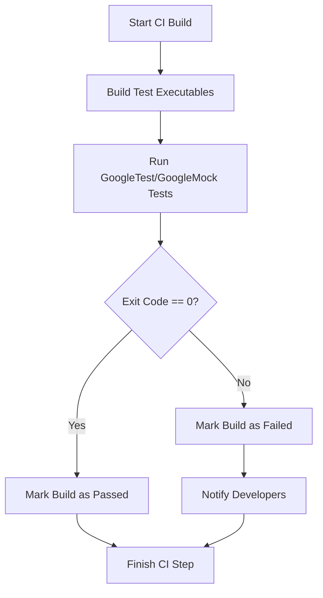

# Continuous Integration: Running Tests Automatically

## Workflow Overview

This guide enables you to seamlessly integrate GoogleTest and GoogleMock test suites into your automated continuous integration (CI) pipelines, ensuring your code quality is validated automatically across supported platforms (Linux, macOS, Windows). You will learn how to run tests via scriptable test runners, interpret automated test results, and leverage best practices to maintain reliable build pipelines.

### Prerequisites

- A working build environment with GoogleTest and GoogleMock compiled and linked.
- Familiarity with CMake or your project's build system.
- Access to a CI environment capable of running command-line scripts on Linux, macOS, or Windows.
- Tests written with GoogleTest or GoogleMock linked either with `gtest_main` or `gmock_main` (libraries providing the `main()` test entry point).

### Expected Outcome

By following this guide, you will have:

- Automated test execution in your CI pipelines on all major platforms.
- A consistent, scriptable approach to running and filtering tests.
- Clear understanding of interpreting test results and troubleshooting failures.

### Time Estimate

Initial setup and validation: approximately 30-60 minutes, depending on familiarity with your CI system.

### Difficulty Level

Intermediate: Requires basic knowledge of CI pipelines and command-line test execution.

---

## Running GoogleTest and GoogleMock Tests Automatically

### 1. Understanding the Test Runners

GoogleTest and GoogleMock provide test runners that integrate the test execution entrypoint:

- **gtest_main**: GoogleTest library providing a default `main()` function for running tests.
- **gmock_main**: GoogleMock library that depends on GoogleTest and provides a `main()` function for running tests that include mocks.

Both initialize the GoogleTest framework and invoke `RUN_ALL_TESTS()`, executing all registered tests and returning a status code usable by CI systems to determine pass/fail.

**Important:** You should link your test executables against either `gtest_main` or `gmock_main` unless you have a specific need to write a customized `main()` function.


### 2. Invoking Tests from Command Line

Once built, your test executables (e.g., `my_tests`, `my_mock_tests`) can be run directly as part of a CI build step.

#### Basic Invocation
```bash
./my_tests
```
This runs all tests and outputs results to stdout, with a clear pass/fail status.

On Windows, use `my_tests.exe` similarly.


#### Filtering Tests
You can select specific tests to run with `--gtest_filter`:

```bash
./my_tests --gtest_filter=FactorialTest.*
```
runs all tests in the `FactorialTest` suite.

Or run specific tests using wildcards:

```bash
./my_tests --gtest_filter=QueueTest.DequeueWorks
```

#### Output Formats
GoogleTest supports outputting test results in XML format, useful for CI servers to parse:

```bash
./my_tests --gtest_output=xml:report.xml
```

This generates an XML report file with detailed test results for integration with dashboards (e.g., Jenkins, GitLab CI).


### 3. CMake and Continuous Testing

If your tests are built with CMake, you can integrate the test executables using CTest, which provides convenient commands to run and filter tests.

#### Run All Tests
From the build directory, simply:

```bash
ctest
```

#### Run Specific Tests by Regex
```bash
ctest -R Factorial
```

This runs all tests whose names match the regex 'Factorial'.

#### Integration with Build Pipelines
Add `ctest` commands as steps in your CI scripts to automatically run tests after building.


### 4. Interpreting the Test Results

- The test process exit code:
  - `0`: All tests passed.
  - Non-zero: One or more tests failed or an error occurred.

- Test output includes:
  - Test suite and test names
  - Detailed failure messages with file and line number
  - Summary of passed/failed tests

- XML reports provide per-test pass/fail status and can be aggregated by CI systems for detailed analytics.


### 5. Example CI Test Step Script

```bash
# Build (example for CMake)
cmake -S . -B build
cmake --build build --config Release

# Run tests
cd build
ctest --output-on-failure

# Or run executable directly
./my_tests --gtest_output=xml:results.xml
```


### 6. Best Practices

- **Use the provided `gtest_main` or `gmock_main` libraries** to simplify test runner setup.
- **Use `--gtest_output=xml:`** to generate machine-readable test reports.
- **Filter tests with `--gtest_filter` in CI builds** to speed up incremental workflows.
- **Integrate test running steps into your CI pipeline immediately after build** to catch regressions early.
- **Fail the build on any test failure by checking the exit code**.
- **Regularly review failed test logs** to identify flaky or broken tests.


### 7. Common Pitfalls and Troubleshooting

<Accordion title="Tests do not run or executable fails to start">Ensure your test binary is linked with `gtest_main` or `gmock_main` which provide the `main()` function. Without this, your test executable has no entrypoint and will fail to run.</Accordion>

<Accordion title="Tests are missing from output">Confirm that tests are properly registered via `TEST()`, `TEST_F()`, or registered suites. Also verify that the `RUN_ALL_TESTS()` call is executed in your `main()`.</Accordion>

<Accordion title="CI fails but tests pass locally">Check for environment differences such as missing dependencies, differing OS/version, or threading support. Enable verbose output with `--gtest_print_time=1` to diagnose slow or hanging tests.</Accordion>

<Accordion title="Link errors related to runtime libraries on Windows">Use the `gtest_force_shared_crt` CMake option when building GoogleTest to match your project's runtime linkage. Mismatched static vs dynamic CRT linkage causes linker errors.</Accordion>


### 8. Advanced: Custom `main()` Function Example

If you need custom setup before tests run, write your own `main()` as below:

```c++
#include <gmock/gmock.h>

int main(int argc, char** argv) {
  testing::InitGoogleMock(&argc, argv);  // Initializes GoogleMock and GoogleTest
  // Custom setup here
  return RUN_ALL_TESTS();               // Runs all tests and returns exit code
}
```

Using `InitGoogleMock` is recommended when using GoogleMock, and `InitGoogleTest` when using GoogleTest only.


---

## Summary Diagram: Automated Test Execution Flow




---

## Troubleshooting & Tips

- **Always verify the test executable's exit code** to ensure CI picks up failures accurately.
- **Use `--gtest_list_tests`** to list all available tests, confirming your tests are registered.
- When filtering tests, verify your regex carefully; incorrect filters may run no tests unexpectedly.
- For complex projects, consider using CTest with CMake for easier integration and parallel test execution.
- On Windows, if you encounter runtime issues, try rebuilding GoogleTest with `-Dgtest_force_shared_crt=ON`.


---

## Next Steps & Related Documentation

- [Creating Your First Test](../getting-started/first-test-validation/create-your-first-test.md) to write tests that your CI can run.
- [Troubleshooting Setup Issues](../getting-started/first-test-validation/troubleshooting-setup.md) to resolve common build or environment problems.
- [Mocking Basics](../guides/get-started/mocking-basics.md) to extend tests with mock objects.
- [Integration and Compatibility](../../overview/audience-use-cases-and-integration/integration-and-compatibility.md) for aligning GoogleTest with different build systems and CI tools.

---

For official references:
- [GoogleTest Official README](https://github.com/google/googletest/blob/main/README.md)
- [GoogleMock README](https://github.com/google/googletest/blob/main/googlemock/README.md)

Ensure your CI pipelines regularly update and run tests using these instructions to maintain code quality reliably across all development stages.
