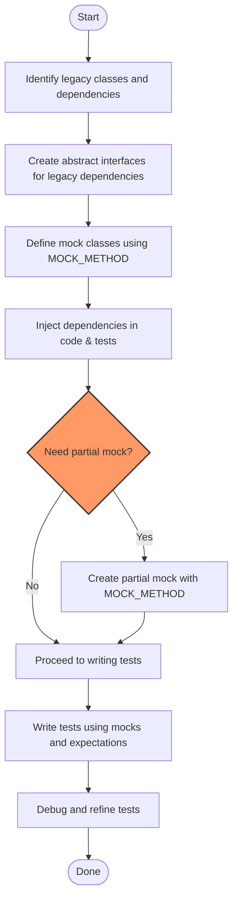

# Testing and Mocking Legacy Code

## Unlocking Testability in Legacy C++ Codebases

Legacy C++ codebases often lack the interfaces and designs that facilitate easy testing and mocking. This guide equips you with practical, incremental strategies to introduce GoogleTest and GoogleMock effectively into existing, non-testable systems. By following these approaches, you can improve code quality, enable safe refactoring, and minimize disruption to ongoing development.

---

## 1. Understanding the Challenge

Legacy code often features tightly coupled modules, concrete classes without virtual methods, and few interfaces — conditions that make direct testing or mocking difficult. Your goal is to incrementally retrofit testability without rewriting the entire system.

### What You Will Achieve
- Enable partial mocking of complex classes to isolate dependencies.
- Create testable abstractions over legacy functionality.
- Safely refactor critical components with confidence.

### Prerequisites
- Basic familiarity with C++ and virtual functions.
- GoogleTest and GoogleMock set up in your development environment.
- Access to the legacy code for incremental modification.

---

## 2. Step-by-Step Strategy

### Step 1: Identify Test Boundaries and Dependencies

Start by pinpointing the parts of the legacy code you want to test but cannot easily control due to dependencies on concrete or non-virtual classes.

- Focus on classes with side effects, complex state, or external resource usage (file I/O, network, etc).
- Determine which collaborators or dependencies you want to mock out.

### Step 2: Introduce Interfaces and Abstract Base Classes

To enable mocking, define abstract interfaces that represent the dependencies. Replace direct usage of concrete classes with pointers or references to these interfaces.

- Example:
```cpp
// Original concrete class:
class FileReader {
 public:
  std::string ReadFile(const std::string& path);
};

// New interface:
class IFileReader {
 public:
  virtual ~IFileReader() = default;
  virtual std::string ReadFile(const std::string& path) = 0;
};

// Concrete implementation adapts to interface:
class FileReaderAdaptor : public IFileReader {
  FileReader reader_;
 public:
  std::string ReadFile(const std::string& path) override {
    return reader_.ReadFile(path);
  }
};
```

This separation allows your production code to use the adaptor, and your tests to mock the interface.

---

### Step 3: Write Mock Classes for New Interfaces

Use GoogleMock to define mock classes for each interface, which you can customize per test.

- Use the `MOCK_METHOD` macro directly inside the mock class.

Example:
```cpp
#include <gmock/gmock.h>

class MockFileReader : public IFileReader {
 public:
  MOCK_METHOD(std::string, ReadFile, (const std::string& path), (override));
};
```

---

### Step 4: Refactor Legacy Code Incrementally

Gradually replace concrete instances with abstractions and inject mock objects in tests.

- Use dependency injection where possible.
- Wrap complex legacy calls behind interfaces.
- Avoid extensive rewrites upfront.

---

### Step 5: Employ Partial Mocks to Refactor Complex Classes

Partial mocking helps when you want to keep existing code but mock specific methods.

- Make methods virtual.
- Derive a mock subclass overriding only methods you need to control.

Example:
```cpp
class LegacyProcessor {
 public:
  virtual ~LegacyProcessor() = default;
  virtual int Calculate(int x) {
    // complex logic
    return x * 2;
  }
  virtual void Process(int data) {
    // real implementation
    int result = Calculate(data);
    // use result
  }
};

class MockLegacyProcessor : public LegacyProcessor {
 public:
  MOCK_METHOD(int, Calculate, (int x), (override));
  using LegacyProcessor::Process;  // Use base class for Process
};
```

This enables tests to mock `Calculate` while calling the real `Process`.

---

## 3. Best Practices for Successful Incremental Adoption

- **Avoid mocking code you don't own**: Create adaptors or interfaces for third-party classes.
- **Enable virtual destructors**: All interfaces and base classes should declare virtual destructors to avoid leaks.
- **Inject dependencies explicitly**: Constructor injection is preferred for clarity and control.
- **Use `ON_CALL` for default mock behavior** and `EXPECT_CALL` to set verified expectations.
- **Control strictness of mocks**:
  - Use `NiceMock` to suppress warnings on uninteresting calls.
  - Use `StrictMock` to treat uninteresting calls as failures.
- **Retire expectations when saturated** to avoid upper-bound violations if multiple similar calls occur.
- **Use sequences or `InSequence` for ordered call verification** when call order matters.

---

## 4. Applied Examples

### Example: Refactoring a Legacy Service to Use Mocks

Suppose you have a legacy `PaymentService` that uses `PaymentGateway` directly:

```cpp
class PaymentGateway {
 public:
  bool ChargeCard(const std::string& card_number, double amount);
};

class PaymentService {
  PaymentGateway gateway_;
 public:
  bool ProcessPayment(const std::string& card, double amount) {
    return gateway_.ChargeCard(card, amount);
  }
};
```

Refactor to use an interface:

```cpp
class IPaymentGateway {
 public:
  virtual ~IPaymentGateway() = default;
  virtual bool ChargeCard(const std::string& card_number, double amount) = 0;
};

class PaymentGatewayAdaptor : public IPaymentGateway {
  PaymentGateway real_gateway_;
 public:
  bool ChargeCard(const std::string& card_number, double amount) override {
    return real_gateway_.ChargeCard(card_number, amount);
  }
};

class PaymentService {
  IPaymentGateway* gateway_;
 public:
  explicit PaymentService(IPaymentGateway* gateway) : gateway_(gateway) {}
  bool ProcessPayment(const std::string& card, double amount) {
    return gateway_->ChargeCard(card, amount);
  }
};
```

Create a mock for tests:

```cpp
class MockPaymentGateway : public IPaymentGateway {
 public:
  MOCK_METHOD(bool, ChargeCard, (const std::string& card_number, double amount), (override));
};
```

Test example:

```cpp
TEST(PaymentServiceTest, SuccessfulCharge) {
  MockPaymentGateway mock_gateway;
  EXPECT_CALL(mock_gateway, ChargeCard("4111-1111-1111-1111", 100.0))
      .WillOnce(Return(true));

  PaymentService service(&mock_gateway);

  EXPECT_TRUE(service.ProcessPayment("4111-1111-1111-1111", 100.0));
}
```

---

### Example: Using Partial Mock to Test Complex Behavior

```cpp
class NetworkClient {
 public:
  virtual ~NetworkClient() = default;
  virtual bool Connect(const std::string& url) {
    // Real connection code
    return true;
  }
  bool SendData(const std::string& data) {
    if (!Connect("http://example.com")) {
      return false;
    }
    // Send data...
    return true;
  }
};

class MockNetworkClient : public NetworkClient {
 public:
  MOCK_METHOD(bool, Connect, (const std::string& url), (override));
};

TEST(NetworkClientTest, SendDataRetriesOnConnectFail) {
  MockNetworkClient mock_client;
  EXPECT_CALL(mock_client, Connect(_))
      .WillOnce(Return(false))
      .WillOnce(Return(true));

  EXPECT_TRUE(mock_client.SendData("payload"));
}
```

This pattern allows testing how `SendData` behaves based on `Connect` outcome.

---

## 5. Troubleshooting & Tips

### Common Issues
- **Mock methods not called as expected:** Use the `--gmock_verbose=info` flag to trace mock calls and see why expectations are missed.
- **Uninteresting calls warnings:** Adding catch-all expectations or using `NiceMock` can suppress these warnings.
- **Destructor warnings:** Always ensure destructors in base classes/interfaces are virtual.
- **Overloaded methods confusion:** Explicitly mock all overloads or use `using` declarations to avoid hiding.

### Tips for Smooth Migration
- Start testing the most critical or highest impact components first.
- Use mock adaptors to shield tests from unstable interfaces.
- Gradually replace legacy dependencies with interfaces—avoid big-bang refactoring.
- Maintain tests frequently to catch breaking changes in legacy code.

---

## 6. Additional Resources

- [gMock for Dummies](https://google.github.io/googletest/gmock_for_dummies.html): Introductory guide to using GoogleMock.
- [gMock Cheat Sheet](https://google.github.io/googletest/gmock_cheat_sheet.html): Quick reference.
- [Mocking Best Practices & Advanced Patterns](../real-world-use-cases/mocking-patterns.md): To master complex mocking strategies.
- [Supported Platforms & Requirements](../getting-started/prerequisites-installation/supported-platforms-requirements.md): Confirm environment readiness.

---

## Visual Workflow Overview



---

By following this guide, you'll incrementally transform your legacy C++ code to be testable and mockable with GoogleTest and GoogleMock — unlocking maintainability and quality improvements.
