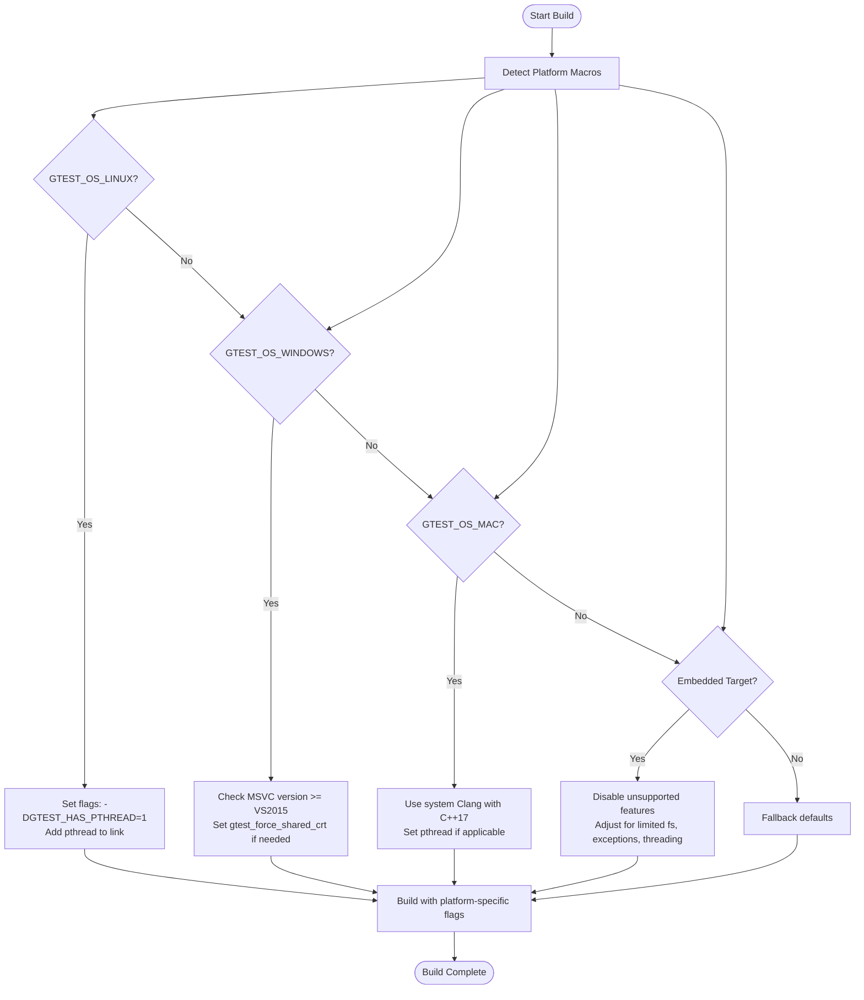

# Cross-Platform Testing Strategies

## Workflow Overview

### Task Description
This guide equips you with practical strategies to integrate and run GoogleTest effectively across diverse platforms including Linux, Windows, macOS, and embedded systems. It focuses specifically on navigating platform-specific configurations, adapting your build setup, and handling quirks unique to each environment, ensuring consistent, reliable test execution.

### Prerequisites
- A working GoogleTest setup or source code checkout.
- Basic familiarity with building C++ projects on your target platforms.
- Access to platform-specific build tools (e.g., CMake, MSVC, GCC, Clang).

### Expected Outcome
After following this guide, you will reliably build and run GoogleTest-based tests on your target platforms with an optimized and maintainable build setup that smoothly handles platform peculiarities.

### Time Estimate
Approximately 30-60 minutes, depending on your familiarity with cross-platform toolchains and existing environment.

### Difficulty Level
Intermediate

---

## Step-by-Step Instructions

### 1. Understand Platform Detection and Feature Macros
GoogleTest and GoogleMock use macros to detect the build environment features and platform. These macros are critical for conditional compilation and adapting to platform capabilities.

- Platforms are identified by macros such as:
  - `GTEST_OS_LINUX` for Linux
  - `GTEST_OS_WINDOWS` (and subtypes like `GTEST_OS_WINDOWS_DESKTOP`)
  - `GTEST_OS_MAC` and `GTEST_OS_IOS`
  - Embedded targets like `GTEST_OS_ESP8266`, etc.

- Feature availability macros include:
  - `GTEST_HAS_PTHREAD` (indicates pthreads availability)
  - `GTEST_HAS_EXCEPTIONS` (whether exception handling is enabled)
  - `GTEST_HAS_RTTI` (run-time type info availability)
  - `GTEST_HAS_STREAM_REDIRECTION` (ability to redirect stdio)

Ensure your build system respects and exposes these macros, so GoogleTest can adjust accordingly.

### 2. Prepare Your Build Environment
For best integration across platforms, use CMake as your build system. It automatically adapts many compiler and linker settings relevant to your detected platform.

- For Linux/macOS:
  - Ensure a C++17 capable compiler (GCC 7+, Clang 5+, or newer).
  - Validate pthreads support; GoogleTest relies on this for thread safety.
  - CMake generally handles this, but you can force pthread detection with:
    ```cmake
    add_definitions(-DGTEST_HAS_PTHREAD=1)
    ```

- For Windows (MSVC):
  - Use at least Visual Studio 2017 (VS 15.0) or newer.
  - Pay attention to runtime library linkage to avoid conflicts (static vs dynamic CRT). Use the `gtest_force_shared_crt` CMake option if linking is inconsistent.
  - Avoid mixing debug and release builds between your tests and GoogleTest.

- For Embedded Platforms:
  - GoogleTest disables some features like stream redirection and death tests.
  - Confirm availability of file system and exception support.

### 3. Configure Compiler and Linker Flags
GoogleTest’s CMake build scripts adapt compiler flags for your platform automatically, but if you customize builds, ensure you:

- Enable exceptions if your platform supports them (`GTEST_HAS_EXCEPTIONS=1`).
- Enable RTTI if using polymorphic tests or mocks requiring `dynamic_cast` (`GTEST_HAS_RTTI=1`).
- Link against pthreads where available.
- Define platform macros explicitly if detection fails.

Example CMake snippet for Linux with pthreads:

```cmake
add_definitions(-DGTEST_HAS_PTHREAD=1)
find_package(Threads REQUIRED)
target_link_libraries(your_test_target Threads::Threads)
```

### 4. Handle Platform-Specific Quirks and Best Practices

| Platform       | Quirks                                                         | Recommended Actions                                                |
| -------------- | -------------------------------------------------------------- | ----------------------------------------------------------------- |
| Linux          | Robust pthread support; exceptions and RTTI typically available. | Use `-pthread` compiler and linker flags.                         |
| Windows (MSVC) | Static vs dynamic CRT linkage clashes may cause linker errors.  | Use `gtest_force_shared_crt` option and consistent runtime linkage. |
| macOS          | Similar to Linux but confirm system Clang version supports C++17.| Prefer system Clang or install recent Xcode toolchain.            |
| Embedded       | Limited or no exception support, file system, or threading.     | Disable unsupported features; use lightweight test subsets.       |

<Tip>
Always verify compiler, linker, and environment features explicitly when working on less common platforms or custom embedded toolchains.
</Tip>

### 5. Build GoogleTest and Your Tests

- Standalone GoogleTest build:
  ```bash
  git clone https://github.com/google/googletest.git
  cd googletest
  mkdir build && cd build
  cmake ..                 # Add flags like -DBUILD_GMOCK=OFF if needed
  cmake --build .
  sudo cmake --install .   # Optional
  ```

- Incorporate in your project’s CMake:
  ```cmake
  include(FetchContent)
  FetchContent_Declare(
    googletest
    URL https://github.com/google/googletest/archive/refs/tags/release-1.17.0.zip
  )
  FetchContent_MakeAvailable(googletest)

  add_executable(tests test_main.cpp ...)
  target_link_libraries(tests GTest::gtest_main GTest::gmock_main)
  enable_testing()
  add_test(NAME all_tests COMMAND tests)
  ```

- On Windows, ensure you build matching runtimes to avoid linker errors (see Step 3).

### 6. Validate Cross-Platform Test Execution

Run your tests on each target platform to confirm:
- Tests compile and link without errors.
- Tests run successfully and produce expected outputs.
- Threading-dependent tests execute correctly where pthreads are available.
- Features like death tests are enabled only where supported.

### 7. Troubleshooting Common Issues

<AccordionGroup title="Common Platform Issues">
<Accordion title="Linker errors on Windows related to CRT mismatch">
These usually stem from inconsistent use of static and dynamic CRT linkage between your project and GoogleTest. Ensure you use the CMake variable `gtest_force_shared_crt` to align runtimes.
</Accordion>
<Accordion title="Tests fail to compile on embedded platforms">
Check if your platform supports exceptions, RTTI, and file system APIs. You might need to disable certain test features or adapt the GoogleTest configuration for limited embedded environments.
</Accordion>
<Accordion title="Pthreads not detected on Unix-like platforms">
Verify pthread development libraries are installed. With CMake, find_package(Threads) should locate them. If detection fails, explicitly define `-DGTEST_HAS_PTHREAD=1` and link pthread explicitly.
</Accordion>
<Accordion title="Death tests or stream redirection fail on Windows or embedded targets">
Death tests require system support for fork or similar and a file system. On platforms lacking these, death tests are disabled. This is expected behavior.
</Accordion>
</AccordionGroup>

---

## Examples & Configuration Snippets

### Example: Minimal CMake for Cross-Platform Project
```cmake
cmake_minimum_required(VERSION 3.14)
project(MyCrossPlatformTests LANGUAGES CXX)

set(CMAKE_CXX_STANDARD 17)
set(CMAKE_CXX_STANDARD_REQUIRED ON)

include(FetchContent)
FetchContent_Declare(
  googletest
  URL https://github.com/google/googletest/archive/refs/tags/release-1.17.0.zip
)
FetchContent_MakeAvailable(googletest)

# For Linux/macOS, ensure pthread linking
if(UNIX AND NOT APPLE)
  add_definitions(-DGTEST_HAS_PTHREAD=1)
endif()

add_executable(tests test_main.cpp my_test.cpp)

# Link GoogleTest libs and pthread where needed
if(UNIX)
  target_link_libraries(tests GTest::gtest_main pthread)
else()
  target_link_libraries(tests GTest::gtest_main)
endif()

enable_testing()
add_test(NAME all_tests COMMAND tests)
```

---

## Troubleshooting & Tips

### Common Pitfalls
- **Mismatched compiler flags and runtimes:** Ensure your test binaries and GoogleTest libraries are built with consistent compiler options — especially RTTI, exceptions, and CRT linkage.
- **Missing dependencies on embedded platforms:** Some embedded environments lack `fstream`, exceptions, or threading support, which GoogleTest expects by default. Consider minimal test builds.
- **Version incompatibilities:** Use GoogleTest releases that support the minimum required C++17 standard and platform SDK versions.

### Performance Considerations
- Parallelize tests using test filtering or sharding external to GoogleTest.
- Disable expensive features on constrained platforms to speed up builds and runs.

### Alternative Approaches
- Use GoogleTest as a header-only framework with minimal linkage on embedded systems.
- Combine GoogleTest with platform-specific mocking or diagnostic tools for deeper integration.

---

## Next Steps & Related Content

- **Integration Story:** Learn how GoogleTest fits into your build and CI workflows: [/overview/getting-started-and-integration/integration-story](https://github.com/google/googletest/tree/main/docs).
- **Installation Overview:** Details the complete setup: [/getting-started/prerequisites-installation/installation-overview](https://github.com/google/googletest/tree/main/docs).
- **Supported Platforms & Ecosystem:** Understand platform support in depth: [/overview/introduction-and-value/supported-platforms-and-ecosystem](https://github.com/google/googletest/tree/main/docs).
- **Troubleshooting Installation and Configuration:** Resolve common platform issues: [/getting-started/troubleshooting-support/common-troubleshooting](https://github.com/google/googletest/tree/main/docs).

<Tip>
Begin with your primary target platform’s documentation and build settings, then incrementally adapt the project for others using these platform macros and guidelines.
</Tip>

---

## Diagram: Platform Detection and Feature Adaptation Flow


---