# Integrating with Bazel and CMake

## Workflow Overview

This guide provides you with step-by-step instructions to build and link GoogleTest and GoogleMock in your C++ projects using **Bazel** or **CMake**. It covers configuration, linking options, important build flags, and recommended project structure to ensure your tests run smoothly and integrate seamlessly with your build systems.

### Prerequisites
- A working C++17 development environment with an appropriate compiler.
- Bazel or CMake installed and configured on your system.
- GoogleTest and GoogleMock source code downloaded or available (for example, from the official [GoogleTest GitHub repository](https://github.com/google/googletest)).
- Basic familiarity with Bazel or CMake build files.

### Expected Outcome
By following this guide, you will be able to:
- Correctly build GoogleTest and GoogleMock libraries using Bazel or CMake.
- Link these libraries into your test executables.
- Understand quickstart sample files for easy project startup.
- Troubleshoot common build and linking issues.

### Time Estimate
Setting up integration typically takes 15–30 minutes once prerequisites are met.

### Difficulty Level
Intermediate: Requires basic knowledge of C++ build systems and linking concepts.

---

## Step-by-Step Instructions

### Using Bazel

1. **Add GoogleTest and GoogleMock to Your Workspace**
   - Add the following to your `WORKSPACE` file to import GoogleTest as an external dependency:

   ```python
   http_archive(
       name = "com_google_googletest",
       urls = ["https://github.com/google/googletest/archive/refs/tags/release-1.12.1.tar.gz"],
       strip_prefix = "googletest-release-1.12.1",
   )
   ```

2. **Load GoogleTest in Your BUILD Files**
   - In your Bazel `BUILD` files, use `cc_test`, `cc_binary`, or `cc_library` rules.
   - Reference GoogleTest and GoogleMock targets. For example:

   ```python
   cc_test(
       name = "my_test",
       srcs = ["my_test.cc"],
       deps = [
           "@com_google_googletest//googletest",
           "@com_google_googletest//googlemock",
       ],
   )
   ```

3. **Build and Run Tests**
   - Build test targets:
     ```bash
     bazel build //path/to:my_test
     ```
   - Run tests:
     ```bash
     bazel test //path/to:my_test
     ```

4. **Use `gmock_main` if You Need GoogleMock's Main()**
   - Instead of linking `googlemock` and writing your own `main()`, link the `gmock_main` library:

   ```python
   deps = ["@com_google_googletest//googlemock_main"]
   ```

---

### Using CMake

1. **Fetch GoogleTest During Configuration (Recommended)**
   - Use the `FetchContent` module in your `CMakeLists.txt`:

   ```cmake
   include(FetchContent)

   FetchContent_Declare(
     googletest
     URL https://github.com/google/googletest/archive/refs/tags/release-1.12.1.zip
   )

   # For Windows: Prevent overriding the parent project's compiler/linker settings
   set(gtest_force_shared_crt ON CACHE BOOL "" FORCE)

   FetchContent_MakeAvailable(googletest)
   ```

2. **Linking GoogleTest and GoogleMock**
   - Add your test executable and link with GoogleTest and GoogleMock libraries as:

   ```cmake
   enable_testing()

   add_executable(my_test my_test.cc)

   target_link_libraries(
     my_test
     gtest
     gmock
     gtest_main
     gmock_main
     pthread    # On Linux, link pthread for threading support
   )

   add_test(NAME my_test COMMAND my_test)
   ```

3. **Quickstart Example Files**
   - The GoogleTest repository provides sample CMake configurations in `/googlemock` and `/googletest` directories.
   - You can start by copying `googlemock/CMakeLists.txt` as reference.

4. **Build and Run Tests**
   - Configure and generate your build:
     ```bash
     mkdir build && cd build
     cmake ..
     make
     ```
   - Run your tests:
     ```bash
     ctest
     ```

---

## Best Practices & Tips

- Prefer **`gmock_main`** or **`gtest_main`** libraries to avoid writing your own `main()` function — they provide ready-to-use entry points.
- Always include **pthread** linkage on POSIX systems to enable proper threading support for parallel tests.
- Include GoogleMock headers via `#include <gmock/gmock.h>` and GoogleTest headers via `#include <gtest/gtest.h>`.
- Use **C++17** standards to ensure compatibility.
- When using Bazel, let it handle dependencies rather than manually compiling GoogleTest.
- For CMake, manage GoogleTest version through `FetchContent` to ease updates.

<Note>
Linking order matters—libraries such as `gmock_main` should come *after* your test target linkage to ensure proper symbol resolution.
</Note>

<Warning>
Avoid mixing debug and release builds between your project and GoogleTest builds; ensure consistent build configurations to prevent linking issues.
</Warning>

---

## Troubleshooting Common Issues

### Linking Errors
- **Undefined references to GoogleTest / GoogleMock symbols:**
  - Ensure you link against appropriate libraries: `gtest`, `gmock`, `gtest_main`, or `gmock_main`.
  - Confirm that all dependencies including `pthread` (Linux/macOS) are linked.
- **Multiple definition errors:**
  - Avoid linking both `gmock_main` and writing your own `main()` function.
  - Use one or the other.

### Bazel Specific
- If your `WORKSPACE` file improperly declares GoogleTest dependency, run:
  ```bash
  bazel clean --expunge
  ```
  and re-import the dependency.

### CMake Specific
- If GoogleTest is not found or wrong version:
  - Delete your build directory and re-run `cmake` to refresh configurations.
  - Use `FetchContent` or set the `GTEST_ROOT` variable appropriately.

<Check>
Confirm your test executables build and run with `bazel test` or `ctest` and report any failures immediately.
</Check>

---

## Examples & References

### Bazel BUILD File Example
```python
cc_test(
    name = "sample_test",
    srcs = ["sample_test.cc"],
    deps = [
        "@com_google_googletest//googletest",
        "@com_google_googletest//googlemock",
    ],
)
```

### CMakeLists.txt Quickstart Example
```cmake
cmake_minimum_required(VERSION 3.14)
project(SampleTest LANGUAGES CXX)

set(CMAKE_CXX_STANDARD 17)

include(FetchContent)
FetchContent_Declare(
  googletest
  URL https://github.com/google/googletest/archive/refs/tags/release-1.12.1.zip
)
set(gtest_force_shared_crt ON CACHE BOOL "" FORCE)
FetchContent_MakeAvailable(googletest)

enable_testing()
add_executable(sample_test sample_test.cc)
target_link_libraries(sample_test gtest gmock gtest_main gmock_main pthread)
add_test(NAME sample_test COMMAND sample_test)
```

---

## Next Steps & Related Content

- After integrating GoogleTest and GoogleMock, proceed to [Writing and Running Unit Tests](../core-workflows/writing-tests) for writing your first tests.
- For dependency isolation techniques, explore [Using Mocks for Dependency Isolation](../core-workflows/using-mocks).
- If you encounter setup issues, consult [Troubleshooting Common Setup Issues](../../getting-started/troubleshooting-validation/common-setup-issues).
- To optimize build and test suite performance, see [Best Practices for Large and Scalable Test Suites](../advanced-patterns/scaling-best-practices).

---

## References

- [GoogleTest GitHub Repository](https://github.com/google/googletest)
- [GoogleMock README](https://github.com/google/googletest/tree/main/googlemock)
- [Bazel External Dependencies](https://docs.bazel.build/versions/master/external.html)
- [CMake FetchContent Documentation](https://cmake.org/cmake/help/latest/module/FetchContent.html)

---

## Visual Overview

```mermaid
graph TD
    Workspace["Bazel Workspace (WORKSPACE)"] --> BazelBuild["Bazel BUILD File"]
    BazelBuild --> BuildTest["cc_test with googletest/googlemock deps"]
    BuildTest --> BazelBuildExec["Bazel Build & Test Execution"]

    CMakeLists[CMakeLists.txt] --> FetchContent["FetchContent googletest & googlemock"]
    FetchContent --> CMakeBuild["add_executable + target_link_libraries"]
    CMakeBuild --> CMakeBuildExec["cmake & make & ctest"]

    subgraph BazelFlow
    Workspace
    BazelBuild
    BuildTest
    BazelBuildExec
    end

    subgraph CMakeFlow
    CMakeLists
    FetchContent
    CMakeBuild
    CMakeBuildExec
    end

    style Workspace fill:#f9f,stroke:#333,stroke-width:2px
    style CMakeLists fill:#9f9,stroke:#333,stroke-width:2px
```



This diagram illustrates the two main integration flows: Bazel uses `WORKSPACE` and `BUILD` files to include GoogleTest and GoogleMock, while CMake fetches the dependencies with FetchContent and links accordingly.
