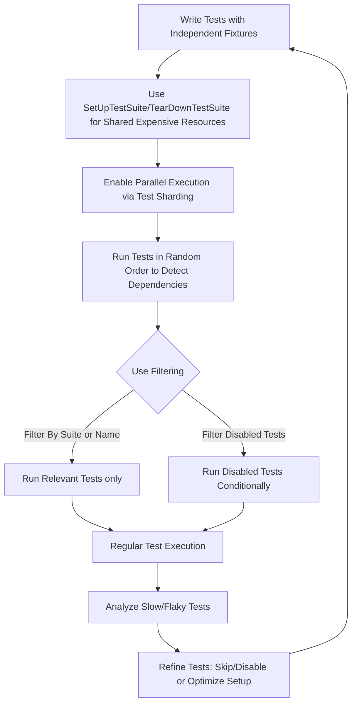

# Performance Optimization for Tests

## Overview

This guide provides actionable tips and techniques for writing fast and reliable tests using GoogleTest and GoogleMock. It focuses specifically on strategies to reduce test suite runtime, enable parallel test execution, manage shared resources efficiently, and utilize test filtering to maintain testing efficiency as your codebase and test count grow.

Optimizing test performance means not only faster feedback cycles but also more confidence in reliable test outcomes across complex, large-scale C++ projects.

---

## 1. Reducing Test Suite Runtime

### Use Test Fixtures Wisely

Reusing expensive setups across multiple tests saves time. GoogleTest allows fixtures to share resources with per-suite setup:

- Declare shared resources as `static` members of your fixture class.
- Initialize these resources once in `SetUpTestSuite()`.
- Clean up in `TearDownTestSuite()` after all tests complete.

```cpp
class FooTest : public testing::Test {
 protected:
  static void SetUpTestSuite() {
    shared_resource_ = new ExpensiveResource();
  }
  static void TearDownTestSuite() {
    delete shared_resource_;
    shared_resource_ = nullptr;
  }

  static ExpensiveResource* shared_resource_;
};

ExpensiveResource* FooTest::shared_resource_ = nullptr;
```

_Tip_: Ensure tests do not mutate shared resources or restore state to prevent hidden dependencies.

### Disable Tests Temporarily With `DISABLED_` Prefix

If some tests are slow or flaky and block your CI, temporarily disable them by prefixing their names with `DISABLED_`.

```cpp
TEST(FooTest, DISABLED_SlowTest) {
  // heavy workload
}
```

Run disabled tests selectively later using the `--gtest_also_run_disabled_tests` flag.

### Filter Which Tests Run

Use `--gtest_filter` to run only relevant tests, speeding up cycles.

**Example:**

```bash
./foo_test --gtest_filter=FooTest.*  # Runs all tests in FooTest suite
./foo_test --gtest_filter=-*DeathTest.*  # Runs everything except death tests
```

Filtering reduces execution time and focuses feedback.

---

## 2. Parallel Test Execution

### Shard Tests Across Multiple Machines

GoogleTest supports *test sharding* to distribute tests across multiple machines:

- Define total number of shards using `GTEST_TOTAL_SHARDS` environment variable.
- Assign unique shard index to each via `GTEST_SHARD_INDEX`.
- Run the same test binary on all shards; each shard runs a subset of tests without overlap.

This can dramatically reduce overall test time for large suites.

### Use Test Repeat and Shuffle

Flags to detect flaky tests and avoid order-dependent bugs:

- `--gtest_repeat=N` repeats tests N times (or endlessly if negative). Helps catch intermittent failures.
- `--gtest_shuffle` runs tests in random order. Helps reveal hidden dependencies between tests.

Store the seed from the test output for reproducibility with `--gtest_random_seed`.

---

## 3. Effective Resource Management

### Global Setup and Tear-Down

Use the `::testing::Environment` class for initialization and cleanup needed once for all tests.

```cpp
class MyGlobalEnv : public ::testing::Environment {
 public:
  void SetUp() override {
    // expensive initialization
  }
  void TearDown() override {
    // cleanup
  }
};

int main(int argc, char** argv) {
  testing::InitGoogleTest(&argc, argv);
  ::testing::AddGlobalTestEnvironment(new MyGlobalEnv);
  return RUN_ALL_TESTS();
}
```

This reduces duplicate setup costs.

### Reuse Fixtures For Expensive Objects

Favor static members in test fixtures for frequently used objects rather than reconstructing repeatedly.

### Avoid Shared State Mutations

Design tests to avoid shared mutable state or reset it between tests to prevent flaky or order-dependent failures.

Tip: Use `SetUpTestSuite()` / `TearDownTestSuite()` judiciously when shared resource setups are safe.

---

## 4. Leverage Test Filtering and Execution Control

### Use GTEST_SKIP() to Skip Tests At Runtime

Tests can be skipped dynamically if preconditions fail, avoiding wasted run time.

```cpp
TEST(MyTestSuite, ConditionalTest) {
  if (!preconditionMet()) {
    GTEST_SKIP() << "Skipping due to unmet precondition.";
  }
  // test logic...
}
```

Skipping tests helps when features are not available on certain platforms or configurations.

### Control Test Execution Order

Although tests by default run in defined order, consider combining randomization with ordering if needed to optimize. Be cautious relying on order-dependent setups.

---

## 5. Additional Tips and Best Practices

- **Avoid packing too much logic in a single test**: smaller, focused tests run faster and help isolate failures.
- **Use `EXPECT_*` over `ASSERT_*` where possible** to continue with other tests after failures.
- **Use value-parameterized tests** to combine multiple input variants efficiently instead of writing separate tests.
- **Use global flags and environment variables**:
  - `GTEST_FAIL_FAST` to stop testing upon first failure — useful for rapid debugging.
  - `GTEST_COLOR` to ensure colored output for easier diagnosis in consoles.
- **Profile slow tests**: measure test time with `--gtest_print_time` and optimize or disable long-running ones.

---

## 6. Troubleshooting Common Performance Pitfalls

### Tests Take Too Long to Run

- Review tests with complex setup or teardown.
- Identify global shared resource use that forces serial execution.
- Disable unnecessary or flaky tests temporarily.

### Flaky Tests in Parallel Runs

- Look for dependencies on shared global state not properly reset.
- Check for concurrency issues in resource management.

### Excessive Memory Use in Large Suites

- Release shared resources after `TearDownTestSuite()`.
- Use lightweight test fixtures and clean them carefully.

---

## 7. Summary

### What You Achieve With These Techniques

- Faster, more reliable test suites that scale with project size.
- Efficient use of resources and parallelism.
- Targeted test execution with filtering and runtime skipping.
- Improved developer productivity via quicker feedback loops.

By continuously monitoring, profiling, and refining your test suite with these strategies, you maintain an effective balance of thoroughness and speed.

---

## 8. Additional Resources

- [GoogleTest Primer](../primer.md)
- [Advanced GoogleTest Usage](../advanced.md)
- [GoogleMock for Dummies](../gmock_for_dummies.md)
- [Writing Mock Tests](../guides/core-workflow/writing-mocks.mdx)
- [Parameterized and Typed Tests](../guides/advanced-usage/parameterized-tests.mdx)
- [Test Fixtures Best Practices](../guides/advanced-usage/test-fixtures-best-practices.mdx)

---

For platform-specific setup and build configuration, consult the [System Requirements](../getting-started/setup-requirements/system-prerequisites.mdx) and [Installation and Integration Guides](../getting-started/installation-initialization/integration-other-methods.mdx).

Use the flags documented in the [Advanced Usage Guide](../advanced.md#running-test-programs-advanced-options) to control test execution and output formatting for tuning performance.

---

## Diagram: Performance Optimization Strategy Overview



---