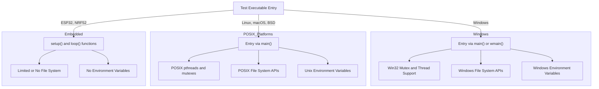

# Platform-Specific Test Guidance

## Overview
This guide provides practical advice and tested patterns for successfully using GoogleTest and GoogleMock across supported platforms including Windows, Linux, and macOS. It addresses platform nuances, common pitfalls, and recommended workflows for integrating testing into your CI/CD environments and scaling reliably.

By following this guide, developers will gain confidence running tests seamlessly on different operating systems, understanding platform-dependent behaviors, and adapting their test suites for stable automated execution.

---

## 1. Platform Support and Differences

### Supported Platforms
GoogleTest and GoogleMock officially support major platforms:
- **Windows** (Desktop, MinGW, Mobile variants)
- **Linux** including various BSDs and Android
- **macOS** and iOS

These platforms have stable, mature support and are recommended for production test suites. Lesser-known or embedded platforms may have limited functionality.

### Key Platform Nuances

| Platform | Notes |
| --- | --- |
| Windows (Desktop) | Use `gtest_main` or `gmock_main` libraries for main(). Native support for structured exception handling (SEH). Command-line flag parsing compatible with Unicode and wide strings. |
| Windows Mobile / Phone / RT | Limited I/O and file system support. Stream redirection often unsupported; death tests disabled. |
| Linux & macOS | Full POSIX support including pthreads, process control, and stream redirection. Supports death tests and advanced threading features.
| Android | POSIX regex support depends on API level; clone(2) syscall availability varies. Use NDK 9+ for full feature compatibility.  |
| Embedded (ESP32, ESP8266, NRF52) | Limited or no environment variables. Custom `setup` and `loop` functions for test harness integration. Stream redirection and death tests typically unavailable.


### Threading and Synchronization

GoogleTest implements platform-specific synchronization primitives:
- Uses pthreads on most POSIX-compliant systems
- Uses Win32 synchronization on Windows desktop
- Provides dummy implementations on unsupported platforms

Thread safety is guaranteed on supported platforms enabling parallel test execution and death test reliability.

---

## 2. Building and Running Tests on Different Platforms

### Windows Specific Guidance

- **Main Function**
  Link with `gtest_main` or `gmock_main` for a ready-to-use entry point. If writing a custom `main`, call `testing::InitGoogleTest(&argc, argv)` or `testing::InitGoogleMock(&argc, argv)` before `RUN_ALL_TESTS()`.

- **Unicode Arguments**
  Windows wide-character argv is supported natively by GoogleTest init functions. Passing UTF-16 command-line arguments works seamlessly.

- **Linking Concerns**
  Use the prebuilt `gtest.lib`/`gmock.lib` or build from source with MSVC 2017 or later. Avoid mixing runtime libraries between GoogleTest and your code.

- **File System and Paths**
  Use standard Windows-style paths or `std::filesystem` when available. GoogleTest internally handles Windows API calls with appropriate path conversions for file I/O and test artifacts.

- **Common Issues**
  - Stream redirection should function properly except on Windows Mobile/Phone.
  - Death tests are supported if built as console applications, but may fail in GUI mode.

### Linux and macOS Guidance

- **Compilers**
  GNU GCC >= 7, Clang >= 5 supported; C++17 minimum required.

- **POSIX Features**
  Stream redirection, fork/exec, and clone(2) calls are supported for full death-test and multi-threaded test suite capabilities.

- **File System**
  Standard POSIX file APIs used internally; tests involving file I/O perform consistently.

- **Android Notes**
  On Android, death tests are enabled only on API >= 9. Some pthread features may be limited depending on NDK and platform version.

### Embedded Systems

- Tests on resource-constrained boards like ESP32 and NRF52 require building a custom harness.
- GoogleMock’s `InitGoogleMock()` also initializes GoogleTest.
- Users define `setup()` and `loop()` functions that GoogleMock calls to run tests; see embedded-specific examples.

---

## 3. Continuous Integration (CI) and Automation Considerations

### Environment Consistency

- Ensure the CI system targets supported platforms with proper compiler toolchains.
- Match platform-specific dependencies and threading configurations.

### Test Isolation and Repeatability

- GoogleTest runs each test in a fresh fixture instance ensuring no test state leakage across runs.
- On platforms supporting fork-based death tests, leverage them to isolate tests crashing or exiting unexpectedly.

### Logging and Output Capture

- Stream capturing is supported on all desktop platforms enabling log verification.
- Redirect output in CI scripts to detect test failures accurately.

### Timeout and Resource Control

- CI systems should impose timeouts on test runs.
- Utilize test sharding and filtering flags (`--gtest_filter`) to manage large test suites per platform.

---

## 4. Practical Usage Tips

### Command-Line Flag Usage

- Use `testing::InitGoogleTest(&argc, argv)` or `testing::InitGoogleMock(&argc, argv)` at test program start.
- Flags like `--gtest_filter`, `--gtest_repeat`, and `--gmock_verbose` customize test execution and output.
- On Windows, wide-string argv is natively supported.

### Debugging Platform Issues

- Enable verbose logs via `--gmock_verbose=info` to trace mock setup.
- Use `EXPECT_*` vs `ASSERT_*` properly to avoid premature aborting tests.
- Use `RUN_ALL_TESTS()` only once per executable to avoid thread-safety and resource cleanup issues.

### Known Limitations

- On embedded and some mobile platforms, full feature set (e.g., death tests, stream redirection) is limited or disabled.
- Concurrent assertions from multiple threads may not be fully supported on non-pthread platforms.

---

## 5. Example Workflow: Running GoogleMock Tests on Windows Desktop

```cpp
#include <gmock/gmock.h>
#include <gtest/gtest.h>

int main(int argc, char** argv) {
  testing::InitGoogleMock(&argc, argv);  // Initializes both GoogleMock and GoogleTest
  return RUN_ALL_TESTS();
}
```

- Build linking against `gmock_main.lib` and `gtest.lib`.
- Run executable from console.
- Use `--gtest_filter=MyTestSuite.*` to run a subset of tests.
- Capture logs using `--gmock_verbose=info` for debug.


---

## 6. Troubleshooting Common Platform Issues

<AccordionGroup title="Common Platform-Specific Issues">  
<Accordion title="Stream Redirection Not Working on Windows Mobile">  
Stream redirection (capturing stdout/stderr) on Windows Mobile, Phone, and RT platforms is typically unsupported due to OS limitations. Avoid tests relying on output capture on these platforms.

**Workaround:** Rely on return values and explicit mock expectations instead of output strings.
</Accordion>  
<Accordion title="Death Tests Failing on GUI Mode Windows Apps">  
Death tests rely on forking or spawning subprocesses. Windows GUI mode apps may block or show dialogs unexpectedly.

**Resolution:**
- Build tests as console applications.
- Use `--gtest_death_test_style=threadsafe`.
- Consider disabling death tests on incompatible platforms.
</Accordion>  
<Accordion title="Mock Initialization Fails on Android API <9">  
POSIX regex support and clone syscall used internally by GoogleMock may be unavailable on older Android versions affecting death tests and matchers.

**Recommendation:** Target Android API 9 or higher. For earlier versions, limit tests to fundamental features.
</Accordion>  
<Accordion title="Multiple Runs of RUN_ALL_TESTS() Causes Errors">  
Calling `RUN_ALL_TESTS()` more than once leads to undefined behavior and test failures.

**Best Practice:** Invoke `RUN_ALL_TESTS()` only once per test executable.
</Accordion>  
</AccordionGroup>

---

## 7. Related Resources and Next Steps

- **Supported Platforms & Integrations**: Explore details on supported compilers and platforms to choose the best setup.
- **Installation and Build Integration**: Refer to guides on integrating GoogleTest/GoogleMock with CMake and Bazel for seamless builds.
- **Writing Your First Test**: Learn to author GoogleTest unit tests and mocks leveraging platform-specific best practices.
- **Troubleshooting Common Setup Issues**: Diagnose and fix platform-related build and runtime problems.
- **Continuous Integration & Automation**: Adopt patterns for stable automated test execution on supported platforms.

---

## References

- GoogleTest Official Site: [https://github.com/google/googletest](https://github.com/google/googletest)
- gMock Documentation: [https://google.github.io/googletest/gmock_for_dummies.html](https://google.github.io/googletest/gmock_for_dummies.html)
- Platform Support Overview: /overview/architecture-features-integration/supported-platforms-integration
- Installation Methods: /getting-started/installation-prerequisites/installation-methods
- Troubleshooting Setup Issues: /getting-started/troubleshooting-validation/common-setup-issues
- Writing Your First Test: /getting-started/first-test-workflow/writing-your-first-test

---

## Diagram: Platform Abstraction Overview



---

<Tip>
Ensure your test development targets supported platform environments to maximize functionality and stability. Use platform-specific flags and build configurations thoughtfully to accommodate OS nuances.
</Tip>

<Note>
For embedded or limited platforms, consider writing minimal tests and custom harnesses. Consult platform-specific SDK guides alongside GoogleTest documentation.
</Note>

<Warning>
Avoid calling RUN_ALL_TESTS() multiple times in the same process to prevent unexpected failures.
</Warning>

---

This completes the practical guidance for platform-specific usage of GoogleTest and GoogleMock. Follow these patterns to produce reliable tests tailored to your target OS environment.
