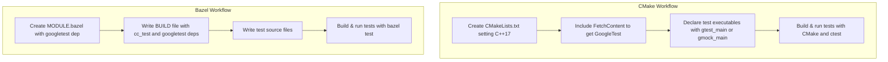

# CMake and Bazel Integration

## Overview
This guide provides detailed, actionable steps to integrate GoogleTest and GoogleMock with the two most popular C++ build systems: **CMake** and **Bazel**. Whether you’re setting up for a small project or managing tests in a large codebase, this document walks you through configuring builds, properly linking test libraries, running tests, and efficient workflows for both build systems.

---

## Prerequisites
Before proceeding, ensure you have:

- A supported operating system (Linux, macOS, Windows).
- A C++ compiler supporting at least C++17.
- Installed CMake (3.14 or newer recommended) and/or Bazel (7.0 or newer).
- Basic familiarity with running commands in your terminal or command prompt.


---

## Expected Outcomes
By following this guide, you will be able to:

- Download or reference GoogleTest/GoogleMock sources.
- Configure your CMake or Bazel project to include GoogleTest and GoogleMock correctly.
- Build and run C++ tests linked against GoogleTest and GoogleMock libraries.
- Understand how to manage dependencies and troubleshoot common build issues.

---

## Time Estimate
- Initial integration: 15–30 minutes
- Running first tests: 5–10 minutes


## Difficulty Level
Intermediate—requires basic build system knowledge but includes step-by-step instructions.

---

# Integrating GoogleTest and GoogleMock with CMake

### 1. Setting Up GoogleTest

There are two main ways to use GoogleTest in CMake projects:

- **Standalone GoogleTest build**
- **Include GoogleTest as a subproject or downloaded dependency**

#### Standalone Build (Recommended for testing GoogleTest itself)

```bash
git clone https://github.com/google/googletest.git -b main
mkdir build
cd build
cmake ..
make
sudo make install
```

> This will build and install GoogleTest and GoogleMock libraries on your system.


#### Embedding GoogleTest in Your Existing CMake Project

Use CMake's FetchContent module to automatically download GoogleTest during your build:

```cmake
cmake_minimum_required(VERSION 3.14)
project(MyProject)

set(CMAKE_CXX_STANDARD 17)
set(CMAKE_CXX_STANDARD_REQUIRED ON)

include(FetchContent)
FetchContent_Declare(
  googletest
  URL https://github.com/google/googletest/archive/refs/heads/main.zip
)
# For Windows: prevent compiler/linker setting conflicts
set(gtest_force_shared_crt ON CACHE BOOL "" FORCE)
FetchContent_MakeAvailable(googletest)
```

---

### 2. Writing Your CMake `CMakeLists.txt`
Add test source, link with GoogleTest or GoogleMock libraries, enable testing and test discovery:

```cmake
add_executable(
  my_test
  test/my_test.cc
)

# Link either gtest_main or gmock_main depending on your needs.
target_link_libraries(my_test PRIVATE GTest::gtest_main) # or GTest::gmock_main

enable_testing()
include(GoogleTest)
gtest_discover_tests(my_test)
```

Your `my_test.cc` should include GoogleTest headers and define test cases.


---

### 3. Using pkg-config with CMake (Alternative Advanced Method)

GoogleTest installs pkg-config files describing needed compile and link flags.

Example CMake snippet:

```cmake
find_package(PkgConfig REQUIRED)
pkg_search_module(GTEST REQUIRED gtest_main)

add_executable(testapp samples/sample3_unittest.cc)
target_compile_options(testapp PRIVATE ${GTEST_CFLAGS})
target_link_libraries(testapp PRIVATE ${GTEST_LDFLAGS})

enable_testing()
add_test(NAME first_test COMMAND testapp)
```

If pkg-config cannot find GoogleTest, ensure `PKG_CONFIG_PATH` includes the directory where `.pc` files were installed (e.g., `/usr/local/lib64/pkgconfig`).


---

### 4. Common CMake Pitfalls and Tips

- **Visual Studio Runtime Mismatch:** Use `-Dgtest_force_shared_crt=ON` to force dynamic runtime linking and avoid linker errors.
- **Multithreading support:** Ensure `-pthread` flag is included (handled automatically by the provided CMake scripts).
- **C++17 Standard:** Set `CMAKE_CXX_STANDARD` to at least 17.
- **Build Shared Libraries:** Use `-DBUILD_SHARED_LIBS=ON` if you want shared libraries.


---

# Integrating GoogleTest and GoogleMock with Bazel

### 1. Set Up Your Bazel Workspace

Create a new Bazel workspace directory and define dependencies in your `MODULE.bazel`:

```python
# MODULE.bazel
bazel_dep(name = "googletest", version = "1.17.0")
```

Update the version number to the latest stable release you intend to use.


---

### 2. Write Your Bazel BUILD File

Create a `BUILD` file alongside your test sources declaring a `cc_test` rule:

```python
cc_test(
    name = "hello_test",
    srcs = ["hello_test.cc"],
    deps = [
        "@googletest//:gtest",
        "@googletest//:gtest_main",
    ],
    size = "small",
)
```

This defines a test named `hello_test` that links against GoogleTest libraries.


---

### 3. Example Test Source (`hello_test.cc`)

```cpp
#include <gtest/gtest.h>

TEST(HelloTest, BasicAssertions) {
  EXPECT_STRNE("hello", "world");
  EXPECT_EQ(7 * 6, 42);
}
```


---

### 4. Build and Run the Test

Run the following Bazel command to build and execute your tests:

```bash
bazel test --cxxopt=-std=c++17 --test_output=all //:hello_test
```

This sets the C++ standard to C++17 and forces the test output to be displayed in the console.


---

# Additional Best Practices

- **Use `gtest_main` or `gmock_main` to provide `main()` automatically**, avoiding boilerplate code.
- **Enable parallel test execution** where supported by your build system for faster CI workflows.
- **Keep GoogleTest versions consistent** between your project and CI/CD pipelines.
- **Consider embedding GoogleTest as a subproject for better compiler/linker consistency**, especially on Windows.

---

# Troubleshooting Common Issues

<AccordionGroup title="Troubleshooting Common Integration Issues">
<Accordion title="CMake can’t find GoogleTest">
Ensure your `CMAKE_PREFIX_PATH` or `PKG_CONFIG_PATH` includes the installation directory where `gtestConfig.cmake` or `.pc` files reside. If you built GoogleTest manually, set these paths accordingly.
</Accordion>
<Accordion title="Linker errors related to pthread">
Make sure CMake sets threading flags automatically. If building manually, add `-pthread` for both compiler and linker.
</Accordion>
<Accordion title="Runtime Library Mismatch on Windows">
Set `gtest_force_shared_crt=ON` in CMake to align runtimes between GoogleTest and your project.
</Accordion>
<Accordion title="Bazel test build fails with missing dependencies">
Verify that dependencies in `MODULE.bazel` and `BUILD` files match correctly, and the Bazel workspace is configured properly. Run `bazel sync` if needed.
</Accordion>
</AccordionGroup>

---

# Diagram: Integration Workflow Overview



---

# Next Steps & Related Content

- Explore the [Getting Started Configuration](../getting-started/configuration-first-run/configure-project.md) page for project setup guidance.
- Learn how to [Write and Run Your First Test](../getting-started/configuration-first-run/write-first-test.md) after integration.
- Visit [Troubleshooting Common Setup Issues](../getting-started/troubleshooting-validation/common-setup-issues.md) for help resolving typical build and linkage problems.
- Dive deeper into [Using Assertions Effectively](../guides/core_workflows/using_assertions_effectively.md) to write robust tests.

---

For detailed source examples and the CMake build script, see [GoogleTest CMakeLists.txt on GitHub](https://github.com/google/googletest/blob/main/CMakeLists.txt).

---

<Tip>
Using either CMake or Bazel integration enables you to build and run tests seamlessly and scale your testing strategy from small samples to large production projects. Choose the build system that best fits your existing development environment.
</Tip>

<Note>
Ensure you keep the GoogleTest and GoogleMock versions in sync to avoid compatibility issues especially when using Bazel's centralized dependency declaration.
</Note>

<Warning>
Building without threading support or missing pthread flags can lead to runtime failures or linker errors—verify your build configuration includes appropriate flags.
</Warning>

<Check>
Successful integration is confirmed when your test binary compiles, links without errors, and running tests shows expected results with tests passing.
</Check>
