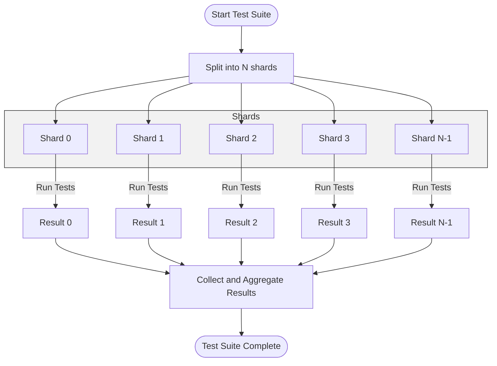

# Performance and Scalability Tips

Optimize your test suite for speed and maintainability—cover test sharding, parallel execution, and best practices for minimizing test overhead at scale. Includes troubleshooting slow tests and tips for enterprise-grade test runs.

---

## Workflow Overview

### Task Description
This page helps you optimize the performance and scalability of your GoogleTest and GoogleMock test suites. It covers how to accelerate tests with sharding and parallel execution, reduce test overhead at scale, and troubleshoot common slow test issues. Whether working on small projects or enterprise-grade systems, these guidelines ensure your testing remains fast, reliable, and maintainable.

### Prerequisites
- You should have an existing GoogleTest/GoogleMock test suite
- Basic familiarity with running tests and interpreting test results
- Access to the build system and test runner configuration (e.g., CMake or Bazel)

### Expected Outcome
Following this guide, you will:
- Understand how to shard and parallelize your tests for speed
- Apply best practices to minimize test resource consumption
- Identify and troubleshoot slow tests and flaky runs
- Scale your testing effectively across machines or CI environments

### Time Estimate
15–30 minutes for initial optimization understanding and basic setup; ongoing time for fine-tuning and troubleshooting.

### Difficulty Level
Intermediate – requires test suite familiarity and build/test environment control.

---

## Step-by-Step Instructions

### 1. Evaluate Your Current Test Suite Speed
- Measure baseline test run times using your current setup.
- Identify tests with unusually long execution or startup times.

**Outcome:** Clear understanding of areas to optimize.

### 2. Enable Test Sharding for Large Test Suites
Sharding splits the test suite into multiple subsets (shards), each running independently to reduce overall wall-clock time.

- **Configure your test runner** to accept shard parameters, typically:
  - `--gtest_total_shards=N` (total number of shards)
  - `--gtest_shard_index=M` (current shard index, zero-based)

- **Example:**
```bash
bazel test //my/tests --test_arg=--gtest_total_shards=4 --test_arg=--gtest_shard_index=0
```
- Run shards concurrently across machines or threads.

**Outcome:** Faster total test suite execution through parallel shards.

### 3. Use Parallel Test Execution
- Run multiple test binaries or shards in parallel on multiple CPU cores.
- For CMake:
  - Use `ctest` with the `-j` flag, e.g. `ctest -j8` to run 8 tests concurrently.
- For Bazel:
  - Use `bazel test --jobs=8` to run tests concurrently.

**Outcome:** Better CPU utilization and reduced test duration.

### 4. Avoid and Minimize Test Overhead
- **Limit expensive setup/teardown:**
  - Use test fixtures and suite-level setup (`SetUpTestSuite`) instead of per-test setup.
- **Avoid global mutable state:** prevent tests from interfering and causing retries or slow failures.
- **Mock external dependencies:** reduce reliance on slow or flaky components.
- **Keep tests small and focused:** smaller tests run faster.

**Outcome:** Reduced per-test overhead and more reliable runs.

### 5. Profile and Troubleshoot Slow Tests
- Use GoogleTest’s `--gtest_print_time` flag to show individual test durations.
- Look for tests that consistently take disproportionate time.
- Investigate and refactor or isolate these slow tests.

**Example:**
```bash
test_binary --gtest_print_time
```

- For flaky tests:
  - Run with `--gtest_repeat=N` to isolate flakiness.
  - Analyze logs for intermittent failures.

**Outcome:** Identification and remediation of the true bottlenecks.

### 6. Use Caching and Incremental Test Runs Where Possible
- Configure your CI/build system to run only tests affected by recent changes.
- Share build/test caches between runs if supported.

**Outcome:** Shorter incremental build and test cycles.

### 7. Resource Management in Large-Scale Environments
- Use resource limits to prevent overloading shared build or CI machines.
- Disable tests that are known to be slow or flaky temporarily, and fix incrementally.

**Outcome:** Improved team productivity and CI stability.

---

## Examples & Scenario

### Sharding a Test Suite
Suppose you have 1000 tests taking 1 hour to run sequentially.

- Use test sharding with 10 shards:

```bash
./my_tests --gtest_total_shards=10 --gtest_shard_index=0 &
./my_tests --gtest_total_shards=10 --gtest_shard_index=1 &
...
./my_tests --gtest_total_shards=10 --gtest_shard_index=9 &
wait
```

- If run simultaneously on 10 machines, total time reduces roughly to 6 minutes.

### Profiling Slow Tests
Run:

```bash
./my_tests --gtest_print_time
```

Output shows:

```
[ RUN      ] SlowTestCase.LongRunningTest
Time: 1.020 s
...
[ RUN      ] FastTestCase.QuickTest
Time: 0.005 s
```

Focus on `SlowTestCase.LongRunningTest` for improvement.

---

## Troubleshooting & Tips

### Common Issues
<AccordionGroup title="Common Performance Issues and Solutions">
<Accordion title="Tests Are Slow Due to Setup Overhead">
Minimize repeated setup by moving heavy initialization to suite-level setup using `SetUpTestSuite()`.
</Accordion>
<Accordion title="Tests Are Flaky and Restart Often">
Isolate flaky tests using repeated runs, stabilize external dependencies, or mock unreliable components.
</Accordion>
<Accordion title="Sharding Not Working as Expected">
Ensure all shards receive unique indices and that the total number of shards is correctly configured with `--gtest_total_shards` and `--gtest_shard_index`.
</Accordion>
<Accordion title="Parallel Jobs Fail Due to Resource Contention">
Limit parallel jobs in CI/build and use appropriate resource allocation.
</Accordion>
</AccordionGroup>

### Best Practices
- Keep mocks lightweight and only mock what’s necessary.
- Use sequences and expectations order carefully to avoid overly rigid tests.
- Periodically profile tests to catch performance regressions early.
- Use test labels or categories to run subsets of tests quickly.

### Performance Considerations
- Avoid global state that slows down test isolation.
- Cache reusable data between tests if possible.
- For huge mock classes, consider moving constructor/destructor out-of-line to reduce compile times (see gMock Cookbook on compilation speed).

---

## Next Steps & Related Content

- Explore [Using Mocks in Tests](https://google.github.io/googletest/gmock_for_dummies.html#using-mocks-in-tests) for best practices on mock usage.
- See [CMake and Bazel Integration](../integration_and_best_practices/cmake_and_bazel_integration) for build-configured parallel test execution setup.
- Review [Troubleshooting Common Setup Issues](../../getting-started/troubleshooting-validation/common-setup-issues) if you face environment-specific failures.
- Consider [Parameterized and Typed Tests](../integration_and_best_practices/parameterized_and_typed_tests) to organize large tests efficiently.

---

## Additional Resources

- [GoogleTest Primer](../overview) for broad usage.
- [gMock Cookbook](../docs/gmock_cook_book.md) for advanced mocking and actions.
- [Mocking Reference](../api-reference/mocking-and-matchers/mock-object-apis) for detailed mock APIs.

---

<Info>
Remember: The test execution flags `--gtest_total_shards` and `--gtest_shard_index` are key to scaling your test runs horizontally.
</Info>

---

## Illustrative Mermaid Diagram: Parallel Test Execution with Sharding



---