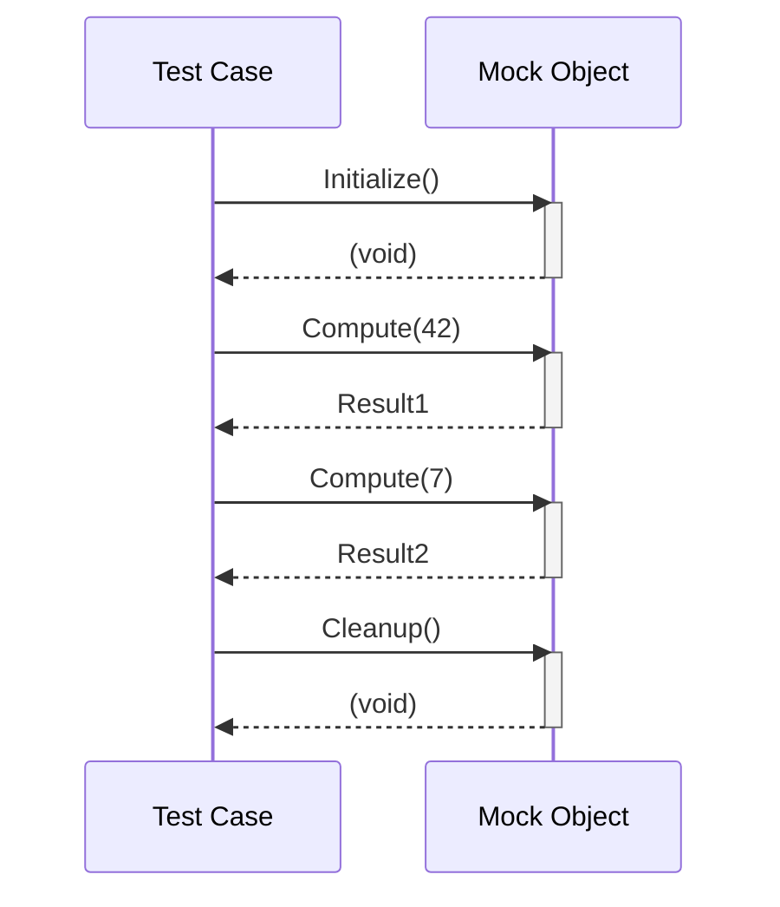

# Real-World Examples and Case Studies

A curated set of end-to-end example tests showcasing effective use of the GoogleTest and GoogleMock frameworks in typical C++ projects. This guide illustrates guiding principles and advanced features of the framework in context, helping you master practical testing approaches.

---

## 1. Workflow Overview

### Purpose
This page provides practical, real-world example tests demonstrating how to leverage GoogleTest and GoogleMock for effective, maintainable, and robust unit testing in C++ projects. Building on foundational knowledge, it takes you through scenarios that reflect everyday testing challenges.

### Prerequisites
- Familiarity with basic GoogleTest syntax and test writing.
- Understanding how to create mock classes using GoogleMock's `MOCK_METHOD` macro.
- Basic knowledge of expectations, matchers, and actions.
- Access to a C++ development environment with GoogleTest and GoogleMock installed.

### Outcome
By following the examples and explanations here, you will be able to:
- Write expressive, well-structured test cases covering complex interaction patterns.
- Use mock objects to verify behavior and state changes.
- Effectively apply sequences, cardinalities, and action clauses.
- Handle edge cases and common pitfalls expert developers face.

### Time Estimate
30-60 minutes to read through examples and understand the flow; longer to implement and adapt in your own codebase.

### Difficulty Level
Intermediate to Advanced

---

## 2. Real-World Testing Scenarios

Each example illustrates a core aspect of effective GoogleTest/GoogleMock usage.

### a. Verifying Sequence of Calls with Dependencies

Imagine testing a class that interacts with multiple collaborators, where some calls must occur in a specified order but others can be unordered.

```cpp
using ::testing::InSequence;
using ::testing::Sequence;
using ::testing::Return;
using ::testing::_;

class MockCollaborator {
 public:
  MOCK_METHOD(void, Initialize, (), ());
  MOCK_METHOD(int, Compute, (int), ());
  MOCK_METHOD(void, Cleanup, (), ());
};

TEST(ComplexInteractionTest, TestCallOrder) {
  MockCollaborator mock;

  Sequence seq1, seq2;

  EXPECT_CALL(mock, Initialize())
      .InSequence(seq1, seq2);
  EXPECT_CALL(mock, Compute(42))
      .InSequence(seq1);
  EXPECT_CALL(mock, Compute(7))
      .InSequence(seq2);
  EXPECT_CALL(mock, Cleanup())
      .InSequence(seq2);

  // Exercise the system under test...
  mock.Initialize();
  mock.Compute(42);
  mock.Compute(7);
  mock.Cleanup();
}
```

This test ensures `Initialize()` happens before the two `Compute()` calls, with `Compute(42)` before `Compute(7)`, and `Cleanup()` last — reflecting partial ordering constraints.

### b. Using Cardinalities and Actions with Return Values

Tests often require precise control of call counts and the values returned by mocks.

```cpp
using ::testing::Return;
using ::testing::AtLeast;

class MockDatabase {
 public:
  MOCK_METHOD(bool, Connect, (), ());
  MOCK_METHOD(int, Query, (const std::string&), ());
};

TEST(DatabaseClientTest, HandlesQuery) {
  MockDatabase db;

  ON_CALL(db, Connect()).WillByDefault(Return(true));

  EXPECT_CALL(db, Query(_))
      .Times(AtLeast(1))
      .WillOnce(Return(10))
      .WillRepeatedly(Return(20));

  EXPECT_TRUE(db.Connect());
  int first_result = db.Query("SELECT id");
  int second_result = db.Query("SELECT name");

  EXPECT_EQ(first_result, 10);
  EXPECT_EQ(second_result, 20);
}
```

This pattern handles a realistic use case where different return values are needed across calls.

### c. Delegating to a Real Object to Preserve Behavior

Sometimes you want to check interactions but not override the real object's behavior.

```cpp
class RealProcessor {
 public:
  virtual int Process(int value) { return value * 2; }
  virtual ~RealProcessor() = default;
};

class MockProcessor : public RealProcessor {
 public:
  MOCK_METHOD(int, Process, (int value), (override));

  MockProcessor() {
    ON_CALL(*this, Process(_)).WillByDefault([this](int v) {
      return this->RealProcessor::Process(v);
    });
  }
};

TEST(ProcessorTest, UsesRealImplementationWhileCheckingCalls) {
  MockProcessor mock;
  EXPECT_CALL(mock, Process(21)).Times(1);

  int output = mock.Process(21);
  EXPECT_EQ(output, 42);  // Leveraged real method
}
```

This approach verifies interaction but retains real behavior.

### d. Simplifying Tests with NiceMock and StrictMock

GoogleMock supports controlling how uninteresting calls are treated.

```cpp
using ::testing::NiceMock;
using ::testing::StrictMock;

class MockService {
 public:
  MOCK_METHOD(void, Start, ());
  MOCK_METHOD(void, Stop, ());
  MOCK_METHOD(int, Status, (), ());
};

TEST(ServiceTest, HandlesStartWithNiceMock) {
  NiceMock<MockService> mock;
  EXPECT_CALL(mock, Start()).Times(1);

  mock.Start();
  mock.Stop();  // No warning or failure
}

TEST(ServiceTest, EnforceStrictMockBehavior) {
  StrictMock<MockService> mock;
  EXPECT_CALL(mock, Start()).Times(1);

  mock.Start();

  // This will cause a test failure because Stop() was not expected.
  // mock.Stop();
}
```

### e. Handling Multiple Expectations on Overloaded Methods

You can mock overloaded functions and set expectations selectively.

```cpp
class Interface {
 public:
  virtual int GetValue() = 0;
  virtual int GetValue(int index) = 0;
  virtual ~Interface() = default;
};

class MockInterface : public Interface {
 public:
  MOCK_METHOD(int, GetValue, (), (override));
  MOCK_METHOD(int, GetValue, (int index), (override));
};

TEST(OverloadTest, SpecificAndGeneralGetValue) {
  MockInterface mock;

  ON_CALL(mock, GetValue()).WillByDefault(Return(0));
  EXPECT_CALL(mock, GetValue(5)).WillOnce(Return(42));

  EXPECT_EQ(mock.GetValue(), 0);
  EXPECT_EQ(mock.GetValue(5), 42);
  EXPECT_EQ(mock.GetValue(3), 0);
}
```

This example clarifies typical usage of mocking overloads.

---

## 3. Best Practices & Tips

- **Set expectations before exercising mocks.** `EXPECT_CALL` must precede actual calls.
- **Use `ON_CALL` for default behavior** without enforcing call count or order.
- **Organize multiple expectations carefully.** More specific expectations should come after generic ones.
- **Avoid over-specifying matchers and cardinalities** to prevent brittle tests.
- Use **`RetiresOnSaturation` when sequencing multiple `WillOnce` actions** for the same method.
- **Use sequences to enforce call order exactly, or use partial order (`After` and multiple sequences) for complex dependencies.**
- Prefer **`NiceMock` during initial test development** to avoid clutter from uninteresting calls.
- Switch to **`StrictMock` only when you want to validate no unexpected calls** are made.
- When mocking methods with move-only types (e.g., `std::unique_ptr`), use lambdas or callable objects in actions to generate fresh instances.

---

## 4. Troubleshooting Common Issues

### Uninteresting Call Warnings

If GoogleMock prints warnings about uninteresting calls (calls to mock methods not covered by `EXPECT_CALL`), you can:
- Suppress them by switching to `NiceMock`.
- Add an `EXPECT_CALL(...).Times(AnyNumber())` for methods that are called but not explicitly verified.

### Failing to Match Call Arguments

- Validate that matchers in `EXPECT_CALL` reflect the actual call arguments.
- Run tests with `--gmock_verbose=info` to see detailed call traces and understand which expectations are matched.

### Excess Calls to Methods

This happens if a method is called more times than allowed by its `Times()` clause.
- Use `RetiresOnSaturation()` to retire expectations after being saturated.
- Adjust cardinalities as needed for calls expected multiple times.

### Mock Methods Not Called

Check if the methods being mocked are `virtual` and `override` qualifiers are correct. Non-virtual methods will not be intercepted by mocks.

### Compilation Issues with Commas in Types

Wrap complex types with commas (e.g., `std::pair`) in extra parentheses or define type aliases to prevent macro parsing errors.

---

## 5. Additional Resources & Next Steps

- [Mocking Reference](https://google.github.io/googletest/reference/mocking.html): Comprehensive details on `MOCK_METHOD`, `EXPECT_CALL`, `ON_CALL`, and advanced usage.
- [gMock Cookbook](https://google.github.io/googletest/gmock_cook_book.html): Recipes for common mocking challenges.
- [gMock for Dummies](https://google.github.io/googletest/gmock_for_dummies.html): Beginner-friendly introduction.
- [Parameterized Tests Guide](https://google.github.io/googletest/guides/common_patterns_scenarios/test_parameterization.html): For more advanced test design.
- [Basic Test Workflow Guide](https://google.github.io/googletest/guides/getting_started_workflows/basic_test_workflow.html): For core GoogleTest test writing.

Once comfortable with these examples, explore:
- Advanced assertion customization for richer diagnostics.
- Integration with build systems to automate testing.
- Scaling test suites with parallel execution and sharding.

---

### Diagram: Example Call Sequence in a Partial Order



---

## Summary
This page illustrated practical, real-world examples of writing unit tests using GoogleTest and GoogleMock, demonstrating advanced techniques like call sequencing, managing expectations, actions, and handling intricate mocking scenarios.

---