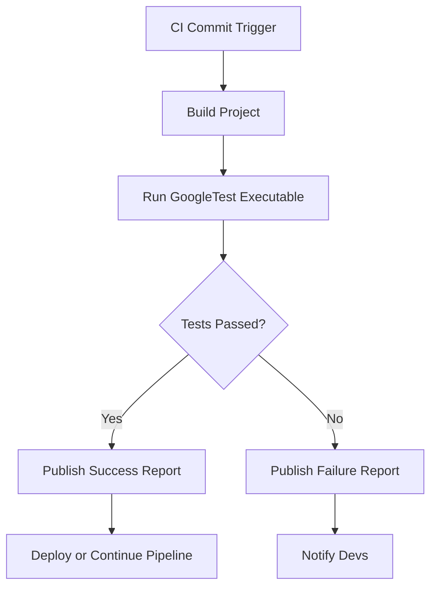

# Continuous Integration Best Practices

## Overview

This guide helps you integrate your GoogleTest-based tests seamlessly into continuous integration (CI) and continuous delivery (CD) pipelines. It covers best practices for running tests automatically, generating reports, handling failures, and troubleshooting within automated environments.

**Prerequisites:**
- You have a working GoogleTest test suite.
- Basic familiarity with running GoogleTest executables.
- Access to your CI/CD environment or pipeline configuration.

**Expected Outcome:**
- Tests run automatically in your CI pipeline.
- Detailed test reports (XML or JSON) are generated.
- Failures are captured and clearly reported.
- You understand how to configure test runs for efficiency and reliability.

**Time Estimate:** 30-45 minutes for initial setup, ongoing integration as part of CI/CD pipeline deployments.

**Difficulty Level:** Intermediate

---

## 1. Preparing Your GoogleTest Suites for CI

**Step 1: Ensure your tests are self-contained and repeatable**

- Each test should run independently without external dependencies.
- Use test fixtures and SetUp/TearDown to initialize state.

**Step 2: Build your tests with all necessary dependencies**

- Integrate GoogleTest into your build system (CMake, Bazel, or manually).
- Confirm building your test executable works consistently.
  
**Step 3: Add flags and environment variables for CI usage**

- Use `--gtest_output=xml:path` or `--gtest_output=json:path` to produce machine-readable test reports.
- Consider enabling: 
  - `--gtest_color=no` to disable colored output for CI logs.
  - `--gtest_brief=1` to suppress passing test output and reduce verbosity.
  
### Outcome

Your test binary is ready to be invoked by your CI system, producing clear output and reports.

---

## 2. Executing Tests in CI Pipelines

**Step 1: Invoke tests in your CI build script or YAML config**

Example command for running all tests and generating an XML report:

```bash
./your_test_binary --gtest_output=xml:reports/test_results.xml --gtest_color=no
```

- Save reports in a path accessible to the CI system.

**Step 2: Use test filtering if needed**

- For large suites or to isolate tests:

```bash
./your_test_binary --gtest_filter=SuiteName.TestName
```

- Combine with other flags, e.g., repeat tests or stop on first failure:

```bash
./your_test_binary --gtest_repeat=10 --gtest_fail_fast
```

**Step 3: Parallel test execution**

- Use tools like [gtest-parallel](https://github.com/google/gtest-parallel) or CI native parallelization to speed up test runs.

**Step 4: Capture test exit codes**

- The return code of `RUN_ALL_TESTS()` reflects success (0) or failure (non-zero).
- Your CI pipeline should fail or mark the build unstable based on this exit code.

---

## 3. Reporting and Analyzing Test Results

**Step 1: Generate XML or JSON test reports**

- Use:
  - `--gtest_output=xml:output_file.xml`
  - or `--gtest_output=json:output_file.json`
- Example:

```bash
./your_test_binary --gtest_output=xml:reports/results.xml
```

**Step 2: Configure CI to read and visualize test reports**

- Most CI systems (Jenkins, GitHub Actions, GitLab CI, CircleCI, etc.) support JUnit-style XML reports.
- Upload or archive the report as a test artifact.
- Enable built-in report viewers or plugins to see test results, failure details, and trends.

**Step 3: Use recorded properties to enrich reports**

- Within tests, call `RecordProperty()` to attach custom keys and values to test cases for more detailed reporting.
- Example:

```cpp
TEST(FooTest, PropertiesExample) {
  ::testing::Test::RecordProperty("Feature", "Login");
  EXPECT_TRUE(IsLoggedIn());
}
```

---

## 4. Handling Failures and Flaky Tests in CI

**Step 1: Fail fast on critical tests**

- Configure your pipeline to stop builds on test failures if needed using `--gtest_fail_fast`.

**Step 2: Repeat flaky tests to expose intermittent failures**

- Use the flag `--gtest_repeat=N` to run tests multiple times.

**Step 3: Use test sharding for large test suites**

- Distribute tests across machines or containers using sharding environment variables:

```bash
GTEST_TOTAL_SHARDS=3
GTEST_SHARD_INDEX=0
./your_test_binary
```

Each shard runs a subset of tests to reduce overall execution time.

**Step 4: Skip flaky or broken tests temporarily**

- Prefix test or suite names with `DISABLED_` to exclude from runs but keep in source.

**Step 5: Capture and review test logs**

- Collect stdout/stderr logs from test runs for deeper failure analysis.

---

## 5. Troubleshooting Common CI Issues

<AccordionGroup title="Common CI Issues and Solutions">
<Accordion title="Test Executable Fails to Run or Is Not Found">
- Verify build artifact paths.
- Ensure the executable has execution permissions.
- Check for dependency misses or missing runtime libraries.
</Accordion>
<Accordion title="Test Output or Report Files Are Not Generated">
- Confirm correct use of `--gtest_output` flag with valid paths.
- Ensure write permissions for output directories.
- Validate that tests are actually running (use `--gtest_list_tests`).
</Accordion>
<Accordion title="Cached or Stale Test Results in CI Dashboard">
- Clear workspace or caches.
- Rename output files per build or use unique paths.
</Accordion>
<Accordion title="Test Fails Intermittently in CI but Passes Locally">
- Run with `--gtest_repeat` to catch flaky behavior.
- Examine resource limits, race conditions, or test order dependencies.
- Use `--gtest_shuffle` to randomize test run order.
</Accordion>
</AccordionGroup>

---

## 6. Example: Integrating with Jenkins

```groovy
pipeline {
    agent any

    stages {
        stage('Build') {
            steps {
                sh 'mkdir -p build && cd build && cmake .. && make'
            }
        }
        stage('Test') {
            steps {
                sh './build/your_test_binary --gtest_output=xml:reports/results.xml --gtest_color=no'
                junit 'reports/results.xml'
            }
            post {
                failure {
                    echo 'Test failed. Check the report for details.'
                }
            }
        }
    }
}
```

- Jenkins `junit` plugin parses the XML and displays results in the UI.

---

## 7. Tips and Best Practices

- **Minimize test dependencies:** Keep tests fast and isolated to encourage frequent CI runs.
- **Use XML/JSON reporting consistently:** This enables CI dashboards to summarize builds effectively.
- **Utilize test filters for focused runs:** During development or PR checks, run a subset with `--gtest_filter`.
- **Leverage parallelization:** Split tests across shards or use parallel CI agents for speed.
- **Regularly clean CI workspace:** To avoid false failures from stale files.

---

## 8. Next Steps & Related Content

- [Writing Your First Test](https://google.github.io/googletest/guides/core_testing_workflows/writing_first_test.html) — Learn how to create your initial tests.
- [Integration and Dependencies](https://google.github.io/googletest/overview/architecture-integration-usecases/integration-and-dependencies.html) — Understand integrating with build systems.
- [Build System Integration](https://google.github.io/googletest/guides/integration_real_world_use/build_system_integration.html) — Instructions for CMake/Bazel setups.
- [Test Discovery and Execution](https://google.github.io/googletest/guides/core_testing_workflows/test_discovery_execution.html) — Explore test run and filtering techniques.
- [Troubleshooting Common Issues](https://google.github.io/googletest/getting-started/troubleshooting-validation/common-issues.html) — Resolve setup and build errors.

For community support and tips, see the [Community-Created Documentation](https://github.com/google/googletest/blob/main/docs/community_created_documentation.md).

---

# Callouts

<Tip>
To maximize the value of CI integration, automate the collection and parsing of GoogleTest XML reports within your CI system's test results section for immediate feedback.
</Tip>

<Warning>
Always verify correct paths and permissions for generated reports in your CI environment to avoid silent failures.
</Warning>

<Info>
The `DISABLED_` prefix is a practical temporary measure to exclude unreliable tests,but should be followed up with fixes to maintain test health.
</Info>

---

# Summary Diagram: Typical CI Pipeline with GoogleTest


---

# Conclusion

By following these best practices, you can ensure your GoogleTest tests are robustly integrated in CI/CD systems, providing fast, clear, and actionable test feedback to developers. This underpins a healthy software delivery workflow with reliable automated verification at every step.

---

# Useful Commands Summary

| Command | Purpose |
| ------- | ------- |
| `./your_test_binary --gtest_output=xml:results.xml` | Generate XML report |
| `./your_test_binary --gtest_filter=TestSuite.TestName` | Run specific test |
| `./your_test_binary --gtest_fail_fast` | Stop on first failure |
| `./your_test_binary --gtest_repeat=5` | Repeat tests 5 times |
| `GTEST_TOTAL_SHARDS=3 GTEST_SHARD_INDEX=1 ./your_test_binary` | Run shard 1 of 3 |

---

# Additional Resources

- [GoogleTest User Guide](https://google.github.io/googletest/)
- [GoogleTest Primer](https://google.github.io/googletest/primer.html)
- [GoogleTest Advanced Topics](https://google.github.io/googletest/advanced.html)
- [GoogleTest API Reference](https://google.github.io/googletest/reference/)

---

# Source of this Documentation

This guide is based on official GoogleTest documentation, repository examples, and CI integration best practices documented in the guides and advanced sections.