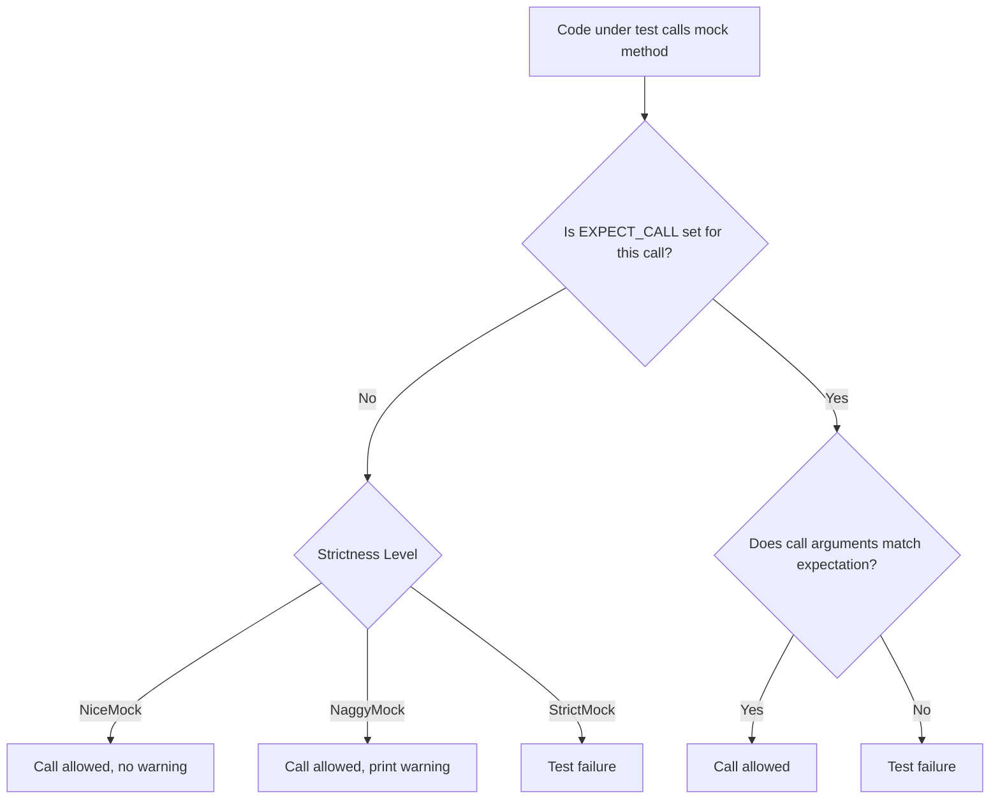

# Nice, Naggy, and Strict Mocks

Learn the behavioral differences between **NiceMock**, **NaggyMock**, and **StrictMock** to enforce contract adherence, reduce test noise, and achieve better diagnostics in large codebases.

---

## Overview

When working with mock objects in GoogleMock, you have multiple options to control how your mocks respond to method calls that do not have explicit expectations set. These options let you **fine-tune the strictness of mock behavior** and the feedback you get during test runs.

The three primary mock behavior modifiers are:

- **NiceMock**: Ignores uninteresting calls silently—calls for which no expectation was set.
- **NaggyMock**: Prints warnings on uninteresting calls (default behavior).
- **StrictMock**: Treats uninteresting calls as test failures.

Choosing the right mock strictness level can help you balance between getting valuable feedback on your tests and avoiding noise that may obscure true issues.

---

## What Are Uninteresting Calls?

An **uninteresting call** is a call made to a mock method that has no explicit `EXPECT_CALL` specification in your test. It means your test neither expects nor forbids this call. 

- Such calls will invoke the mock method's **default behavior** (as defined by default actions or `ON_CALL`).
- GoogleMock differentiates these from **unexpected calls**, which are calls that do not match any specified expectation and are always errors.

---

## Behavior of NiceMock, NaggyMock, and StrictMock

| Modifier       | Uninteresting Calls Behavior                       | When to Use                                                 |
|----------------|---------------------------------------------------|-------------------------------------------------------------|
| **NiceMock**   | Silences warnings; uninteresting calls are ignored | Most tests where you want to avoid clutter or focus only on specified expectations |
| **NaggyMock**  | Prints warnings on uninteresting calls (default) | Developing or debugging tests, especially to detect missing expectations |
| **StrictMock** | Treats uninteresting calls as outright failures   | Enforce strict contract adherence; catch unexpected interactions precisely |

### Summary of Effects

- **Unexpected calls** remain errors under all three modifiers.
- Only uninteresting calls' treatment differs.
- `NiceMock` promotes cleaner tests by suppressing warning noise.
- `StrictMock` is best for catching unintended method calls and enforcing very strict interfaces.

---

## How to Use NiceMock, NaggyMock, and StrictMock

Suppose you have a mock class named `MockFoo`. You can apply these behaviors as follows:

```cpp
using ::testing::NiceMock;
using ::testing::NaggyMock;
using ::testing::StrictMock;

// Default (Naggy) mock - prints warnings on uninteresting calls
NaggyMock<MockFoo> naggy_foo;

// Nice mock - suppresses warnings on uninteresting calls
NiceMock<MockFoo> nice_foo;

// Strict mock - fails on uninteresting calls
StrictMock<MockFoo> strict_foo;
```

Each of these is a subclass of your mock class and inherits its constructors, so you can pass constructor parameters as needed.


### Example Usage:

```cpp
class MockFoo {
 public:
  MOCK_METHOD(void, DoThis, (), ());
  MOCK_METHOD(int, Calculate, (int x), ());
};

TEST(MyTest, Example) {
  NiceMock<MockFoo> nice_mock;
  EXPECT_CALL(nice_mock, DoThis());

  // DoThis() call is expected; allowed.
  nice_mock.DoThis();

  // Calculate() is called without expectation.
  // In NiceMock, this call will be ignored silently.
  int result = nice_mock.Calculate(5);
}
```


---

## When to Choose Each Mock Type

### 1. Use **NiceMock** to:
- Reduce test output noise from unimportant method calls.
- Write maintainable tests that focus only on expected interactions.
- Prevent brittle tests from breaking when unrelated code changes trigger extra calls.

### 2. Use **NaggyMock** (default) to:
- Get warnings about untracked calls but let tests pass.
- Help identify missing expectations during test development.

### 3. Use **StrictMock** to:
- Enforce exact adherence to the interaction contract.
- Detect any accidental or unauthorized method invocations.
- Write tests for critical components where unexpected calls must fail immediately.

<Tip>
**Tip:** Changing a mock from NaggyMock to NiceMock or StrictMock can affect test results and maintenance. Use NiceMock to clean noisy test output and StrictMock to tighten controls over interactions.
</Tip>

---

## Practical Guidance

### Transitioning from Default (Naggy) to Nice or Strict

- If your tests emit many warnings like "Uninteresting mock function call", consider switching to
  `NiceMock` to suppress harmless warnings.
- If you want to detect and fix such unexpected calls thoroughly, switch to `StrictMock`.

### Combining with `EXPECT_CALL`

- Mock strictness applies only to uninteresting calls.
- Calls that violate `EXPECT_CALL` specifications still cause failures regardless of mock type.

### Important Considerations

- `NiceMock`, `NaggyMock`, and `StrictMock` affect only methods mocked directly in the mock class using `MOCK_METHOD`.
- They may *not* affect mock methods inherited from base classes on some compilers.
- Do *not* nest these wrappers, e.g., `NiceMock<StrictMock<MockFoo>>` is unsupported and will cause issues.
- Virtual destructors in your mock classes ensure proper behavior when mocks are deleted.

---

## Common Pitfalls

### 1. Ignoring Warnings without Proper Understanding

Blindly silencing warnings by wrapping every mock in `NiceMock` risks missing real unplanned calls.

### 2. Failing to Set Expectations

If you expect certain function calls, always use `EXPECT_CALL`. The mock's behavior for calls without expectations depends on the mock type.

### 3. Unexpected Calls with No Default Action

If a method is called unexpectedly and returns a type without a default constructor, the test may crash. Define a default action with `ON_CALL` or explicitly use `EXPECT_CALL`.

### 4. Non-Virtual Destructors

Mocks without virtual destructors may cause memory leaks or failed checks upon deletion.

---

## Verifying Mock Strictness at Runtime

GoogleMock provides utilities to check if a mock object is nice, naggy, or strict:

```cpp
using testing::Mock;

Mock* mock_ptr = /* pointer to your mock */;

if (Mock::IsNice(mock_ptr)) {
  // Handle nice mock
} else if (Mock::IsNaggy(mock_ptr)) {
  // Handle naggy mock
} else if (Mock::IsStrict(mock_ptr)) {
  // Handle strict mock
}
```

---

## Example: Effect on Test Output

Consider the following example test scenario:

```cpp
class MockFoo {
 public:
  MOCK_METHOD(void, Bar, (), ());
};

TEST(ExampleTest, StrictVsNice) {
  StrictMock<MockFoo> strict_foo;
  NiceMock<MockFoo>   nice_foo;

  // No expectations are set on either mock.
  // Calling Bar() on strict_foo will cause a test failure.
  EXPECT_NONFATAL_FAILURE(strict_foo.Bar(), "Uninteresting mock function call");

  // Calling Bar() on nice_foo will be silently ignored.
  nice_foo.Bar(); // No failure or warning
}
```

This demonstrates how strict mocks enforce stronger contracts than nice mocks.

---

## Extensions & Related Topics

- **Setting Default Actions**: Use `ON_CALL` to define default behaviors for mocked methods.
- **Handling Unexpected Calls**: Use `EXPECT_CALL(...).Times(0)` to forbid calls.
- **Sequencing Calls**: Use `InSequence` and `Sequence` to enforce call order.
- **Advanced Mocking**: See [Actions and Matchers in Practice](https://google.github.io/googletest/gmock_cook_book.html#actions) for powerful mocking patterns.

---

## Troubleshooting

### Warning: "Uninteresting mock function call encountered"
- Occurs with `NaggyMock` or default mock when a method without expectation is called.
- Solution: Add an `EXPECT_CALL` or switch to `NiceMock` if the call is acceptable.

### Test Failure: Unexpected call to a mock method
- Means a call was made that does not match any expectation.
- Solution: Add an `EXPECT_CALL` to specify expected calls, or forbid calls with `.Times(0)`.

### Mocks Not Respecting Strictness
- Confirm that mock methods are declared with `MOCK_METHOD` directly in the class.
- Check that the mock's destructor is virtual.
- Avoid nesting strictness wrappers.

---

## Summary

Choosing between NiceMock, NaggyMock, and StrictMock lets you control how GoogleMock treats uninteresting calls, enabling you to write tests that are either lenient and noise-free or strict and precise. Start with Naggy mocks to catch missing expectations during development, switch to Nice mocks for general maintenance without excessive warnings, and apply Strict mocks when you want to enforce exact contract adherence and catch accidental or unplanned calls.

---

## Additional Resources

- [gMock Cookbook: The Nice, the Strict, and the Naggy](https://google.github.io/googletest/gmock_cook_book.html#NiceStrictNaggy)
- [gMock Cheat Sheet: Defining NiceMock, NaggyMock, StrictMock](https://google.github.io/googletest/gmock_cheat_sheet.html#mock-classes)
- [GoogleMock Reference: NiceMock, NaggyMock, StrictMock](https://google.github.io/googletest/reference/mocking.html#NiceMock)

---

## Navigation & Related Guides

- [Intro to Mocking with GoogleMock](https://google.github.io/googletest/guides/mocking-advanced-techniques/intro-mocking.html)
- [Actions and Matchers in Practice](https://google.github.io/googletest/guides/mocking-advanced-techniques/actions-and-matchers.html)
- [Mocking Best Practices & Patterns](https://google.github.io/googletest/guides/mocking-advanced-techniques/mocking-best-practices.html)

---

## FAQ Snippet

**Q:** What is the difference between uninteresting and unexpected calls?

**A:** An uninteresting call occurs when a mock method is called but no `EXPECT_CALL` was set. An unexpected call happens when a mock method is called that does not match any existing expectation. Uninteresting calls generate warnings or errors depending on mock strictness, while unexpected calls always cause test failures.

---

## Illustrative Diagram


